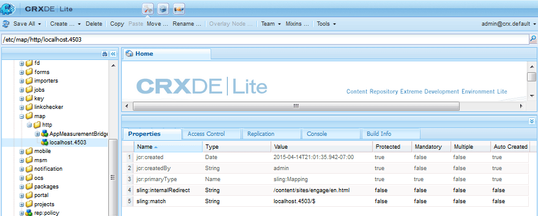

# Erstellen einer neuen Community-Site {#author-a-new-community-site}

>[!CAUTION]
>
>AEM 6.4 hat das Ende der erweiterten Unterstützung erreicht und diese Dokumentation wird nicht mehr aktualisiert. Weitere Informationen finden Sie in unserer [technische Unterstützung](https://helpx.adobe.com/de/support/programs/eol-matrix.html). Unterstützte Versionen suchen [here](https://experienceleague.adobe.com/docs/?lang=de).

## Neue Community-Site erstellen {#create-a-new-community-site}

Verwenden Sie die Autoreninstanz, um eine neue Community-Site zu erstellen.

* Anmelden mit Administratorrechten
* Über die globale Navigation: **[!UICONTROL Navigation > Communities > Sites]**

Die Communities Sites-Konsole bietet einen Assistenten, der Sie durch die Schritte zum Erstellen einer Community-Site führt. Es ist möglich, `Next`Schritt oder `Back`in den vorherigen Schritt, bevor die Site im letzten Schritt übergeben wird.

Erste Schritte mit der Erstellung einer neuen Community-Site:

* Wählen Sie die `Create` button

### Schritt 1: Site-Vorlage {#step-site-template}

Im [Schritt &quot;Site-Vorlage&quot;](sites-console.md#step2013asitetemplate), geben Sie einen Titel, eine Beschreibung und den Namen für die URL ein und wählen Sie eine Community-Site-Vorlage aus, z. B.:

* **[!UICONTROL Community-Site-Titel]**: `Getting Started Tutorial`

* **[!UICONTROL Community-Site-Beschreibung]**: `A site for engaging with the community.`

* **[!UICONTROL Community-Site-Stammordner]**: (Leer lassen für Standardstamm `/content/sites`)

* **[!UICONTROL Cloud-Konfigurationen]**: (Lassen Sie das Feld leer, wenn keine Cloud-Konfigurationen angegeben sind) geben Sie den Pfad zu den angegebenen Cloud-Konfigurationen an.
* **[!UICONTROL Community-Site-Basissprache]**: (lassen Sie für eine einzelne Sprache unberührt: Englisch) verwenden Sie das Pulldown-Menü, um eine Auswahl zu treffen *oder mehr* Basissprachen aus den verfügbaren Sprachen: Deutsch, Italienisch, Französisch, Japanisch, Spanisch, Portugiesisch (Brasilien), Chinesisch (Traditionell) und Chinesisch (vereinfacht). Für jede hinzugefügte Sprache wird eine Community-Site erstellt, die gemäß den Best Practices unter [Übersetzen von Inhalten für mehrsprachige Sites](../../help/sites-administering/translation.md). Die Stammseite jeder Site enthält eine untergeordnete Seite mit dem Namen des Sprachcodes einer der ausgewählten Sprachen, z. B. &quot;en&quot;für Englisch oder &quot;fr&quot;für Französisch.

* **[!UICONTROL Community-Site-Name]**: interagieren

   * Überprüfen Sie den Namen, da er nach der Erstellung der Site nicht einfach geändert werden kann.
   * Die ursprüngliche URL wird unter dem Community-Site-Namen angezeigt
   * Hängen Sie für eine gültige URL einen Basissprachcode an + &quot;.html&quot;.
   * *Beispiel*, http://localhost:4502/content/sites/ `engage/en.html`

* **[!UICONTROL Vorlage]**: nach unten ziehen, um `Reference Site`

Wählen Sie **[!UICONTROL Weiter]** aus

### Schritt 2: Design {#step-design}

Der Schritt &quot;Design&quot;wird in zwei Abschnitten zur Auswahl des Designs und des Branding-Banners vorgestellt:

#### SITE-THEMA DER GEMEINSCHAFT {#community-site-theme}

Wählen Sie den gewünschten Stil aus, der auf die Vorlage angewendet werden soll. Wenn diese Option aktiviert ist, wird das Design mit einem Häkchen überlagert.

#### GEMEINSCHAFTLICHE SITE-BRANCHE {#community-site-branding}

(Optional) Laden Sie ein Bannerbild hoch, das auf den Seiten der Site angezeigt werden soll. Das Banner wird zwischen der Community-Site-Kopfzeile und dem Menü (Navigationslinks) am linken Rand des Browsers fixiert. Die Bannerhöhe wird auf 120 Pixel zugeschnitten. Die Größe des Banners kann nicht an die Breite des Browsers und die Höhe von 120 Pixel angepasst werden.

 

Wählen Sie **[!UICONTROL Weiter]** aus.

### Schritt 3: Einstellungen {#step-settings}

Im Schritt Einstellungen vor Auswahl von `Next`Beachten Sie, dass es sieben Abschnitte gibt, die Zugriff auf Konfigurationen bieten, die die Benutzerverwaltung, Tagging, Moderation, Gruppenverwaltung, Analyse, Übersetzung und Aktivierung betreffen.

Besuchen Sie die [Erste Schritte mit AEM Communities zur Aktivierung](getting-started-enablement.md) Tutorial zur Erfahrung mit der Arbeit mit den Aktivierungsfunktionen.

#### BENUTZERVERWALTUNG {#user-management}

Aktivieren Sie alle Kontrollkästchen für [Benutzerverwaltung](sites-console.md#user-management)

* So lassen Sie die Selbstregistrierung von Site-Besuchern zu
* So können Besucher der Site die Site anzeigen, ohne sich anzumelden
* So können Mitglieder Nachrichten von anderen Community-Mitgliedern senden und empfangen
* So lassen Sie die Anmeldung mit Facebook zu, anstatt ein Profil zu registrieren und zu erstellen
* So lassen Sie die Anmeldung mit Twitter zu, anstatt ein Profil zu registrieren und zu erstellen

>[!NOTE]
>
>Für eine Produktionsumgebung ist es erforderlich, benutzerdefinierte Facebook- und Twitter-Anwendungen zu erstellen. Siehe [Anmeldung über Social Media mit Facebook und Twitter](social-login.md).

#### TAGGING {#tagging}

Die Tags, die auf Community-Inhalte angewendet werden können, werden durch die Auswahl AEM Namespaces gesteuert, die zuvor durch die [Tagging-Konsole](../../help/sites-administering/tags.md#tagging-console) (z. B. [Tutorial-Namespace](setup.md#create-tutorial-tags)).

Die Suche nach Namespaces ist mit der Typvorsuche einfach. Beispiel:

* Typ &#39;tut&#39;
* Klicken Sie auf `Tutorial`

#### ROLLEN {#roles}

[Community-Mitgliederrollen](users.md) werden über die Einstellungen im Abschnitt Rollen zugewiesen.

Damit ein Community-Mitglied (oder eine Gruppe von Mitgliedern) die Site als Community-Manager erleben kann, verwenden Sie die Typvorsuche und wählen Sie den Mitglied- oder Gruppennamen aus den Optionen in der Dropdown-Liste aus.

Beispiel:

* Typ &quot;q&quot;
* Auswählen [Quinn Harper](enablement-setup.md#publishcreateenablementmembers)

>[!NOTE]
>
>[Tunneldienst](https://helpx.adobe.com/experience-manager/6-3/communities/using/deploy-communities.html#tunnel-service-on-author) ermöglicht die Auswahl von Mitgliedern und Gruppen, die nur in der Veröffentlichungsumgebung vorhanden sind.

#### MODERATION {#moderation}

Globale Standardeinstellungen akzeptieren für [moderieren](sites-console.md#moderation) benutzergenerierte Inhalte (UGC).

#### ANALYTICS {#analytics}

Wenn Adobe Analytics lizenziert ist und ein Analytics-Cloud-Service und -Framework konfiguriert wurden, können Sie Analytics aktivieren und das Framework auswählen.

Siehe [Analytics-Konfiguration für Communities-Funktionen](analytics.md).

#### ÜBERSETZUNG {#translation}

Die [Übersetzungsparameter](sites-console.md#translation) Geben Sie die Basissprache für die Site an, ob UGC übersetzt werden darf oder nicht und in welche Sprache, falls dies der Fall ist.

* Überprüfen **[!UICONTROL Maschinelle Übersetzung zulassen]**
* Behalten Sie die für die Übersetzung ausgewählten Standardsprachen beim standardmäßigen Dienst für maschinelle Übersetzung bei.
* Behalten Sie den Standard-Übersetzungsanbieter bei und konfigurieren Sie ihn.
* Ein globaler Store ist nicht erforderlich, da es keine Sprachkopien gibt
* Auswählen **[!UICONTROL Gesamte Seite übersetzen]**
* Behalten Sie die Standardpersistenzoption bei

#### AKTIVIERUNG {#enablement}

Lassen Sie beim Erstellen einer Interaktionsgemeinschaft leer.

Für ein ähnliches Tutorial zum schnellen Erstellen einer [Aktivierungs-Community](overview.md#enablement-community), siehe [Erste Schritte mit AEM Communities zur Aktivierung](getting-started-enablement.md).

Wählen Sie **[!UICONTROL Weiter]** aus.

### Schritt 4: Community-Site erstellen {#step-create-communities-site}

Wählen Sie **[!UICONTROL Erstellen]** aus.

Nach Abschluss des Vorgangs wird der Ordner für die neue Site in der Konsole Communities - Sites angezeigt.

## Veröffentlichen der neuen Community-Site {#publish-the-new-community-site}

Die erstellte Site sollte über die Konsole Communities - Sites verwaltet werden. Dieselbe Konsole, von der aus neue Sites erstellt werden können.

Nachdem Sie den Ordner der Community-Site ausgewählt haben, um ihn zu öffnen, halten Sie den Mauszeiger über das Site-Symbol, sodass vier Aktionssymbole angezeigt werden:

Bei Auswahl des vierten Ellipsensymbols (Weitere Aktionen) werden die Optionen &quot;Site exportieren&quot;und &quot;Site löschen&quot;angezeigt.

Von links nach rechts sind sie:

* **Seite öffnen**
Wählen Sie das Stiftsymbol aus, um die Community-Site im Bearbeitungsmodus für Autoren zu öffnen, um Seitenkomponenten hinzuzufügen und/oder zu konfigurieren

* **Site bearbeiten**
Wählen Sie das Eigenschaftensymbol aus, um die Community-Site zur Änderung von Eigenschaften wie dem Titel oder zum Ändern des Designs zu öffnen.

* **Website veröffentlichen**
Wählen Sie das Weltsymbol aus, um die Community-Site zu veröffentlichen (z. B. wenn Ihr Veröffentlichungsserver auf Ihrem lokalen Computer ausgeführt wird, und klicken Sie dann standardmäßig auf localhost:4503 ).

* **Export-Site**
Wählen Sie das Exportsymbol aus, um ein Paket der Community-Site zu erstellen, das beide in gespeichert ist. [Package Manager](../../help/sites-administering/package-manager.md) und heruntergeladen.

   Beachten Sie, dass UGC nicht im Site-Paket enthalten ist.

* **Site löschen**

   Wählen Sie das Löschsymbol aus, um die Community-Site aus **[!UICONTROL Communities > Sites-Konsole]**. Mit dieser Aktion werden alle mit der Site verknüpften Elemente entfernt, z. B. benutzergenerierte Inhalte, Benutzergruppen, Assets und Datenbankdatensätze.

>[!NOTE]
>
>Wenn Sie nicht den standardmäßigen Port 4503 für die Veröffentlichungsinstanz verwenden, bearbeiten Sie den standardmäßigen Replikationsagenten, um die Anschlussnummer auf den richtigen Wert festzulegen.
>
>Auf der Autoreninstanz im Hauptmenü
>
>1. Navigieren Sie zu **[!UICONTROL Tools > Vorgänge > Replikation]** Menü
>1. Auswählen **[!UICONTROL Agenten für Autor]**
>1. Auswählen **[!UICONTROL Standardagent (publish)]**
>1. Weiter zu **[!UICONTROL Einstellungen]** select **[!UICONTROL Bearbeiten]**
>1. Wählen Sie im Popup-Dialogfeld für Agenteneinstellungen die Registerkarte Transport .
>1. Ändern Sie in URI die Portnummer 4503 in die gewünschte Portnummer.

>
>So verwenden Sie beispielsweise Port 6103: `http://localhost:6103/bin/receive?sling:authRequestLogin=1`
>
>1. Wählen Sie **[!UICONTROL OK]** aus
>1. (Optional) Wählen Sie `Clear` oder `Force Retry` Zurücksetzen der Replikationswarteschlange

### Veröffentlichung auswählen {#select-publish}

Nachdem Sie sichergestellt haben, dass der Veröffentlichungsserver ausgeführt wird, wählen Sie das Weltsymbol aus, um die Community-Site zu veröffentlichen.

Wenn die Community-Site erfolgreich veröffentlicht wurde, wird kurz eine Meldung angezeigt:

### Neue Community-Benutzergruppen {#notice-new-community-user-groups}

Zusammen mit der neuen Community-Site werden neue Benutzergruppen erstellt, die über die entsprechenden Berechtigungen für verschiedene Verwaltungsfunktionen verfügen. Weitere Informationen finden Sie unter [Benutzergruppen für Community-Sites](users.md#usergroupsforcommunitysites).

Für diese neue Community-Site können die vier neuen Benutzergruppen unter Berücksichtigung des Site-Namens &quot;interagieren&quot;in Schritt 1 aus dem [Gruppenkonsole](members.md) (globale Navigation: Communities, Gruppen):

* Communitymanager einbinden
* Community Engage Groupadministrators
* Community-Engage-Mitglieder
* Community-Moderatoren einbinden
* Community-Interaktion mit berechtigten Mitgliedern
* Community Interagieren SiteContent Manager

Beachten Sie Folgendes: [Aaron McDonald](tutorials.md#demo-users) ist Mitglied von

* Communitymanager einbinden
* Community-Moderatoren einbinden
* Community-Engage-Mitglieder (indirekt als Mitglied der Gruppe Moderatoren )

#### http://localhost:4503/content/sites/engage/en.html {#http-localhost-content-sites-engage-en-html}

## Authentifizierungsfehler konfigurieren {#configure-for-authentication-error}

Sobald eine Site konfiguriert und zur Veröffentlichung gepusht wurde, [Anmeldezuordnung konfigurieren](sites-console.md#configure-for-authentication-error) ( `Adobe Granite Login Selector Authentication Handler`) in der Veröffentlichungsinstanz. Der Vorteil besteht darin, dass bei nicht korrekter Eingabe der Anmeldedaten der Authentifizierungsfehler die Anmeldeseite der Community-Site mit einer Fehlermeldung erneut anzeigt.

Hinzufügen einer `Login Page Mapping` as

* /content/sites/engage/en/signin:/content/sites/engage/en

## Optionale Schritte {#optional-steps}

### Standardstartseite ändern {#change-the-default-home-page}

Wenn Sie zur Veranschaulichung mit der Veröffentlichungs-Site arbeiten, kann es nützlich sein, die standardmäßige Startseite auf die neue Site zu ändern.

Dazu müssen Sie Folgendes verwenden: [CRXDE](http://localhost:4503/crx/de) Lite zum Bearbeiten [Ressourcenzuordnung](../../help/sites-deploying/resource-mapping.md) -Tabelle auf der Veröffentlichungsinstanz.

Erste Schritte:

1. Beim Veröffentlichen melden Sie sich mit Administratorrechten an
1. Navigieren Sie zu [http://localhost:4503/crx/de](http://localhost:4503/crx/de)
1. Erweitern Sie im Projektbrowser die `/etc/map`
1. Wählen Sie den `http`-Knoten aus

   * Auswählen **[!UICONTROL Knoten erstellen]**

      * **Name** localhost.4503

         (do *not* use `:`)

      * **Typ** [sling:Mapping](https://sling.apache.org/documentation/the-sling-engine/mappings-for-resource-resolution.html)

1. Mit neu erstellt `localhost.4503` Knoten ausgewählt

   * Eigenschaft hinzufügen

      * **Name** sling:match
      * **Typ** Zeichenfolge
      * **Wert** localhost.4503/\$

         (muss mit &#39;$&#39; char enden)
   * Eigenschaft hinzufügen

      * **Name** sling:internalRedirect
      * **Typ** Zeichenfolge
      * **Wert** /content/sites/engage/en.html

1. Klicken Sie auf **[!UICONTROL Alle speichern]**
1. (optional) Löschen des Browser-Verlaufs
1. Navigieren Sie zu http://localhost:4503/

   * Ankunft unter http://localhost:4503/content/sites/engage/en.html

>[!NOTE]
>
>Um zu deaktivieren, fügen Sie einfach der `sling:match` Eigenschaftswert mit einem &quot;x&quot;- `xlocalhost.4503/$` - und **[!UICONTROL Alle speichern]**.

#### Fehlerbehebung: Fehler beim Speichern der Karte {#troubleshooting-error-saving-map}

Wenn Änderungen nicht gespeichert werden können, stellen Sie sicher, dass der Knotenname `localhost.4503`, mit einem &quot;Punkt&quot;-Trennzeichen und nicht `localhost:4503` mit einem &quot;Doppelpunkt&quot;-Trennzeichen `localhost`ist kein gültiges Namespace-Präfix.

#### Fehlerbehebung: Fehler bei Umleitung {#troubleshooting-fail-to-redirect}

Der **$**&quot; am Ende des regulären Ausdrucks `sling:match`Zeichenfolge ist von entscheidender Bedeutung, sodass nur genau `http://localhost:4503/` zugeordnet ist, wird der Umleitungswert ansonsten jedem Pfad vorangestellt, der nach der Datei server:port in der URL vorhanden sein könnte. Wenn AEM also versucht, zur Anmeldeseite umzuleiten, schlägt dies fehl.

### Ändern der Site {#modify-the-site}

Nachdem die Site ursprünglich erstellt wurde, können Autoren die [Symbol &quot;Site öffnen&quot;](sites-console.md#authoring-site-content) , um standardmäßige AEM zu erstellen.

Administratoren können außerdem die [Symbol &quot;Site bearbeiten&quot;](sites-console.md#modifying-site-properties) , um Eigenschaften der Site zu ändern, z. B. den Titel.

Denken Sie nach jeder Änderung daran, **save** und **Neu veröffentlichen** die Site.

>[!NOTE]
>
>Wenn Sie nicht mit AEM vertraut sind, lesen Sie die Dokumentation unter [grundlegende Handhabung](../../help/sites-authoring/basic-handling.md) und [Kurzanleitung zum Erstellen von Seiten](../../help/sites-authoring/qg-page-authoring.md).
