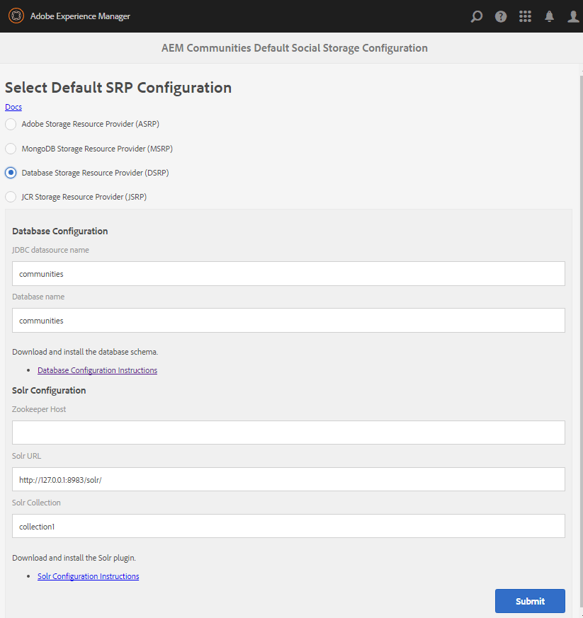

# DSRP - Ressourcenanbieter für den relationalen Datenbankspeicher {#dsrp-relational-database-storage-resource-provider}

## Über DSRP {#about-dsrp}

Wenn AEM Communities so konfiguriert ist, dass eine relationale Datenbank als gemeinsamer Speicher verwendet wird, können vom Benutzer generierte Inhalte (UGC) von allen Autor- und Veröffentlichungsinstanzen aus aufgerufen werden, ohne dass Synchronisierung oder Replikation erforderlich ist.

Siehe auch [Eigenschaften der SRP-Optionen](working-with-srp.md#characteristics-of-srp-options) und der [empfohlenen Topologien](topologies.md).

## Voraussetzungen {#requirements}

* [MySQL](#mysql-configuration), eine relationale Datenbank
* [Apache Solr](#solr-configuration), eine Suchplattform

>[!NOTE]
>
>Die standardmäßige Speicherkonfiguration wird jetzt in conf path(`/conf/global/settings/community/srpc/defaultconfiguration`) statt etc path (`/etc/socialconfig/srpc/defaultconfiguration`) gespeichert. Es wird empfohlen, die [Migrationsschritte](#migration-steps-0dt) durchzuführen, damit die Standardeinstellung wie erwartet funktioniert.


## Relative Datenbankkonfiguration {#relational-database-configuration}

### MySQL-Konfiguration {#mysql-configuration}

Eine MySQL-Installation kann unter Verwendung verschiedener Datenbanknamen (Schema) und verschiedener Verbindungen (server:port) zwischen Aktivierungsfunktionen und einem gemeinsamen Speicher (DSRP) innerhalb desselben Verbindungspools freigegeben werden.

Einzelheiten zur Installation und Konfiguration finden Sie unter [MySQL-Konfiguration für DSRP](dsrp-mysql.md).

### Solr-Konfiguration {#solr-configuration}

Eine Solr-Installation kann mithilfe verschiedener Sammlungen zwischen dem Node Store (Oak) und dem Common Store (SRP) freigegeben werden.

Wenn sowohl die Oak- als auch die SRP-Kollektionen intensiv verwendet werden, kann aus Leistungsgründen ein zweiter Solr installiert werden.

Für Produktionsumgebungen bietet der SolrCloud-Modus eine verbesserte Leistung im Standalone-Modus (ein einzelnes, lokales Solr-Setup).

Weitere Informationen zur Installation und Konfiguration finden Sie unter [Solr-Konfiguration für SRP](solr.md).

### DSRP auswählen {#select-dsrp}

Die [Speicherkonfigurationskonsole](srp-config.md) ermöglicht die Auswahl der standardmäßigen Speicherkonfiguration, die festlegt, welche SRP-Implementierung verwendet werden soll.

Auf Autor zugreifen, um auf die Speicherkonfigurationskonsole zuzugreifen

* Anmelden mit Administratorrechten
* Über das **Hauptmenü**

   * Wählen Sie **[!UICONTROL Werkzeuge]** aus (aus dem linken Bereich)
   * **[!UICONTROL Communities auswählen]**
   * Wählen Sie **[!UICONTROL Speicherkonfiguration]**

      * Der resultierende Speicherort lautet beispielsweise: [http://localhost:4502/communities/admin/defaultsrp](http://localhost:4502/communities/admin/defaultsrp)
      >[!NOTE]
      >
      >Die standardmäßige Speicherkonfiguration wird jetzt in conf path(`/conf/global/settings/community/srpc/defaultconfiguration`) statt etc path (`/etc/socialconfig/srpc/defaultconfiguration`) gespeichert. Es wird empfohlen, die [Migrationsschritte](#migration-steps-0dt) durchzuführen, damit die Standardeinstellung wie erwartet funktioniert.

      

* Select **[!UICONTROL Database Storage Resource Provider (DSRP)]**
* **Datenbankkonfiguration**

   * **[!UICONTROL JDBC-Datenquellenname]**

      Der Name der MySQL-Verbindung muss mit dem in der [JDBC OSGi-Konfiguration angegebenen Namen identisch sein.](dsrp-mysql.md#configurejdbcconnections)

      *Standard*: Communities

   * **[!UICONTROL Datenbankname]**

      Name des Schemas im [Skript init_schema.sql](dsrp-mysql.md#obtain-the-sql-script)

      *Standard*: Communities

* **SolrConfiguration**

   * **[](https://cwiki.apache.org/confluence/display/solr/Using+ZooKeeper+to+Manage+Configuration+Files)Zookeeper-Host **

      Lassen Sie diesen Wert leer, wenn Solr mit dem internen ZooKeeper ausgeführt wird. Andernfalls legen Sie bei Ausführung im [SolrCloud-Modus](solr.md#solrcloud-mode) mit einem externen ZooKeeper diesen Wert auf den URI für den ZooKeeper fest, z. B. *my.server.com:80*

      *Standard*: *&lt;blank>*

   * **[!UICONTROL Solr-URL]**

      *Standard*: https://127.0.0.1:8983/solr/

      * **[!UICONTROL Solr-Sammlung]**

         *Standard*: collection1

* Klicken Sie auf **[!UICONTROL Übermitteln]**

### Null Schritte zur Migration von Ausfallzeiten für Standard {#migration-steps-0dt}

Führen Sie die folgenden Schritte aus, um sicherzustellen, dass die Standardseite [http://localhost:4502/communities/admin/defaultsrp](http://localhost:4502/communities/admin/defaultsrp) erwartungsgemäß funktioniert:

1. Benennen Sie den Pfad `/etc/socialconfig` in um, `/etc/socialconfig_old`sodass die Systemkonfiguration auf &quot;jsrp&quot;(Standard) zurückfällt.
1. Gehen Sie zur Standardseite [http://localhost:4502/communities/admin/defaultsrp](http://localhost:4502/communities/admin/defaultsrp), auf der jsrp konfiguriert ist. Klicken Sie auf die **[!UICONTROL Senden]** -Schaltfläche, damit der neue Standardkonfigurationsknoten am `/conf/global/settings/community/srpc`.
1. Löschen Sie die erstellte Standardkonfiguration `/conf/global/settings/community/srpc/defaultconfiguration`.
1. Kopieren Sie die alte Konfiguration `/etc/socialconfig_old/srpc/defaultconfiguration` anstelle des gelöschten Knotens (`/conf/global/settings/community/srpc/defaultconfiguration`) im vorherigen Schritt.
1. Löschen Sie den alten Knoten etc `/etc/socialconfig_old`.

## Veröffentlichen der Konfiguration {#publishing-the-configuration}

DSRP muss in allen Autoren- und Veröffentlichungsinstanzen als gemeinsamer Speicher identifiziert werden.

So stellen Sie die identische Konfiguration in der Veröffentlichungsumgebung zur Verfügung:

Beim Autor:

* Navigieren Sie vom Hauptmenü zu **[!UICONTROL Tools > Vorgänge > Replikation]**
* Doppelklicken Sie auf **[!UICONTROL Tree aktivieren]**
* **Startpfad:**

   * Navigieren zu `/conf/global/settings/community/srpc/`

* Vergewissern Sie sich, dass nicht ausgewählt `Only Modified` ist.
* Aktivieren **[!UICONTROL auswählen]**

## Verwalten von Benutzerdaten {#managing-user-data}

Informationen zu *Benutzern*, *Benutzerprofilen* und *Benutzergruppen*, die häufig in der Veröffentlichungsumgebung eingegeben werden, finden Sie unter

* [Benutzersynchronisierung](sync.md)
* [Verwalten von Benutzern und Benutzergruppen](users.md)

## Solr für DSRP neu deklarieren {#reindexing-solr-for-dsrp}

Um DSRP Solr neu zu indizieren, befolgen Sie die Dokumentation für die [Neudezierung von MSRP](msrp.md#msrp-reindex-tool). Verwenden Sie jedoch bei der Neudezierung für DSRP die folgende URL: **/services/social/datastore/rdb/reindex**

Beispielsweise würde ein Befehl zum erneuten Indexieren von DSRP wie folgt aussehen:

```shell
curl -u admin:password -X POST -F path=/ https://host:port/services/social/datastore/rdb/reindex
```
