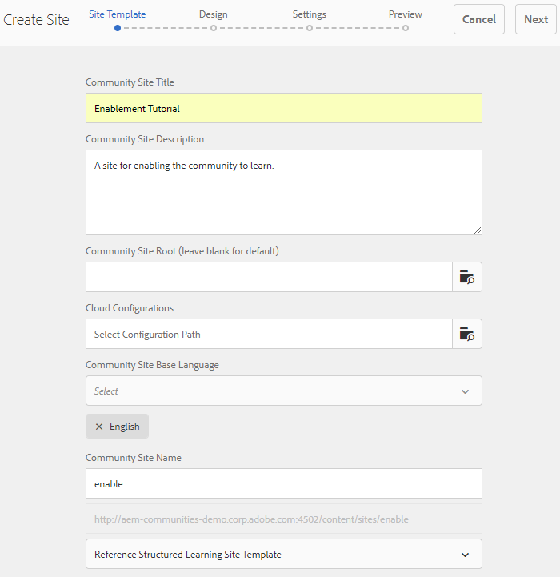

# Erstellen einer neuen Community-Site für Aktivierung {#author-a-new-community-site-for-enablement}

## Community-Site erstellen {#create-community-site}

[Die ](sites-console.md) Erstellung von Community-Sites erfolgt mithilfe eines Assistenten, der Sie durch die Schritte zur Erstellung einer Community-Site führt. Es ist möglich, zum Schritt `Next`oder `Back`zum vorherigen Schritt vorzugehen, bevor Sie die Site im letzten Schritt verpflichten.

So erstellen Sie eine neue Community-Site:

Verwenden der Autoreninstanz [a1/>](http://localhost:4502/)

* Anmelden mit Administratorberechtigungen
* Navigieren Sie zu **[!UICONTROL Communities > Sites]**

* Wählen Sie **[!UICONTROL Erstellen]**

### Schritt 1: Site-Vorlage {#step-site-template}

Geben Sie im Schritt **Site-Vorlage** einen Titel, eine Beschreibung und den Namen der URL ein und wählen Sie eine Community-Site-Vorlage, z. B.:

* **Community-Site-Titel**: `Enablement Tutorial`

* **Community-Site-Beschreibung**: `A site for enabling the community to learn.`

* **Community-Site-Stammordner**: (Leer lassen für Standard-Stammordner  `/content/sites`)

* **Cloud-Konfigurationen**: (leer lassen, wenn keine Cloud-Konfigurationen angegeben wurden) Geben Sie den Pfad zu den angegebenen Cloud-Konfigurationen an.
* **Community-Site-Basissprache**: (Für eine Sprache unberührt lassen: Englisch) verwenden Sie das Pulldown-Menü, um eine  *oder* mehr Basissprachen aus den verfügbaren Sprachen Deutsch, Italienisch, Französisch, Japanisch, Spanisch, Portugiesisch (Brasilien), Chinesisch (Traditionell) und Chinesisch (vereinfacht) auszuwählen. Eine Community-Site wird für jede hinzugefügte Sprache erstellt und befindet sich im selben Site-Ordner, wie unter [Übersetzung von Inhalten für mehrsprachige Sites](../../help/sites-administering/translation.md) beschrieben. Die Stammseite jeder Site enthält eine untergeordnete Seite, die nach dem Sprachcode einer der ausgewählten Sprachen benannt ist, wie z.B. &quot;en&quot; für Englisch oder &quot;fr&quot; für Französisch.

* **[!UICONTROL Community-Site-Name]**: `enable`

   * die ursprüngliche URL wird unter dem Community-Site-Namen angezeigt
   * für eine gültige URL einen Basissprachcode + &quot;.html&quot;

      *Beispiel*: http://localhost:4502/content/sites/  `enable/en.html`

* **[!UICONTROL Referenz-Site-Vorlage]**: nach unten ziehen  `Reference Structured Learning Site Template`

Wählen Sie **[!UICONTROL Weiter]** aus

### Schritt 2: Design {#step-design}

Der Schritt &quot;Design&quot;wird in zwei Abschnitten zur Auswahl des Designs und des Branding-Banners angezeigt:

#### COMMUNITY SITE-THEMA {#community-site-theme}

Wählen Sie den gewünschten Stil aus, der auf die Vorlage angewendet werden soll. Wenn diese Option aktiviert ist, wird das Design mit einem Häkchen überlagert.

#### COMMUNITY SITE BRANDING {#community-site-branding}

(Optional) Laden Sie ein Bannerbild hoch, das auf den Seiten der Site angezeigt wird. Das Banner wird am linken Rand des Browsers zwischen dem Community-Site-Header und dem Menü (Navigationslinks) fixiert. Die Bannerhöhe wird auf 120 Pixel zugeschnitten. Die Größe des Banners wird nicht an die Breite des Browsers und die Höhe von 120 Pixel angepasst.

 

Wählen Sie **[!UICONTROL Weiter]** aus.

### Schritt 3: Einstellungen {#step-settings}

Beachten Sie, dass im Schritt &quot;Einstellungen&quot;vor der Auswahl von `Next` sieben Abschnitte den Zugriff auf Konfigurationen bieten, die Benutzerverwaltung, Tagging, Rollen, Moderation, Analyse, Übersetzung und Aktivierung umfassen.

#### BENUTZERVERWALTUNG {#user-management}

Es wird empfohlen, dass [Aktivierungs-Communities](overview.md#enablement-community) privat sein sollten.

Eine Community-Site ist privat, wenn anonymen Site-Besuchern der Zugriff verweigert wird, sie sich nicht selbst registrieren können und sie möglicherweise keine Social-Anmeldung verwenden.

Stellen Sie sicher, dass die meisten Kontrollkästchen für [Benutzerverwaltung](sites-console.md#user-management) deaktiviert sind:

* Site-Besucher NICHT zur Selbstregistrierung zulassen
* Anonyme Site-Besucher NICHT zur Ansicht der Site zulassen
* Optional, ob Messaging unter Community-Mitgliedern zulässig ist
* Anmeldung bei Facebook NICHT zulassen
* Anmeldung mit Twitter NICHT zulassen

#### TAGGGING {#tagging}

Die Tags, die auf Community-Inhalte angewendet werden können, werden gesteuert, indem Sie AEM Namensraum auswählen, die zuvor über die [Tagging-Konsole](../../help/sites-administering/tags.md#tagging-console) definiert wurden (z. B. den [Tutorial-Namensraum](enablement-setup.md#create-tutorial-tags)).

Darüber hinaus wird bei der Auswahl von Tag-Namensräumen für die Community-Site die Auswahl beim Definieren von Katalogen und Aktivierungsressourcen eingeschränkt. Wichtige Informationen finden Sie unter [Tagging-Aktivierungsressourcen](tag-resources.md).

Die Suche nach Namensräumen ist mit der Typenvorschau einfach. Beispiel:

* Typ &#39;tut&#39;
* Wählen Sie nun eine der folgenden Optionen aus `Tutorial`

### ROLLEN {#roles}

[Community-Mitglieder ](users.md) Rollen werden über die Einstellungen im Abschnitt Rollen zugewiesen.

Damit ein Community-Mitglied (oder eine Gruppe von Mitgliedern) die Site als Community-Manager erleben kann, verwenden Sie die &quot;Type-ahead&quot;-Suche und wählen Sie den Mitglieds- oder Gruppennamen aus den Optionen in der Dropdown-Liste aus.

Beispiel:

* Typ &quot;q&quot;
* Wählen Sie [Quinn Harper](enablement-setup.md#publishcreateenablementmembers)

>[!NOTE]
>
>[Der Tunnel-](deploy-communities.md#tunnel-service-on-author) Dienst ermöglicht die Auswahl von Mitgliedern und Gruppen, die nur in der Umgebung &quot;Veröffentlichen&quot;vorhanden sind.

#### MODERATION {#moderation}

Übernehmen Sie die globalen Standardeinstellungen für [Moderation](sites-console.md#moderation) Benutzergenerierte Inhalte (UGC).

#### ANALYTICS {#analytics}

Wählen Sie im Pulldown-Menü das für diese Community-Site konfigurierte Analytics Cloud-Service-Framework aus.

Die im Screenshot angezeigte Auswahl ist das Framework-Beispiel aus der [Konfigurationsdokumentation.](analytics.md#aem-analytics-framework-configuration)`Communities`

#### TRANSLATION {#translation}

Die [Übersetzungseinstellungen](sites-console.md#translation) geben an, ob und in welche Sprache UGC übersetzt werden darf.

* **[!UICONTROL Maschinelle Übersetzung zulassen]**
* Standardeinstellungen verwenden

#### AKTIVIERUNG {#enablement}

Für eine Aktivierungsgemeinschaft ist es erforderlich, einen oder mehrere Community-Aktivierungsmanager zu identifizieren.

* **[!UICONTROL Aktivierungsmanager]**
 (erforderlich) Mitglieder der 
`Community Enablement Managers` zur Verwaltung dieser Community-Site ausgewählt werden.

   * Typ &quot;s&quot;
   * Wählen Sie nun eine der folgenden Optionen aus `Sirius Nilson`

* **[!UICONTROL Marketing Cloud-Organisations-ID]**
(optional) Die ID für ein Adobe Analytics-Konto, die erforderlich ist, wenn  [Video Heartbeat ](analytics.md#video-heartbeat-analytics) Analytics in den Berichte für die Aktivierung aufgenommen wird.

Wählen Sie **[!UICONTROL Weiter]** aus.

### Schritt 4: Community-Site {#step-create-community-site} erstellen

Wählen Sie **[!UICONTROL Erstellen]**.

Nach Abschluss des Prozesses wird der Ordner für die neue Site in der Konsole Communities - Sites angezeigt.

### Veröffentlichen der neuen Community-Site {#publish-the-new-community-site}

Die erstellte Site sollte über die Communities - Sites-Konsole verwaltet werden, in der auch neue Sites erstellt werden können.

Wenn Sie den Ordner der Community-Site ausgewählt haben, halten Sie den Mauszeiger über das Site-Symbol, sodass vier Aktionssymbole angezeigt werden:

Wenn Sie das Symbol &quot;Auslassungszeichen&quot;auswählen (Symbol &quot;Weitere Aktionen&quot;), werden die Optionen &quot;Site exportieren&quot;und &quot;Site löschen&quot;angezeigt.

Von links nach rechts:

* **Öffnen Sie**
SiteWählen Sie das Stiftsymbol, um die Community-Site im Autorenbearbeitungsmodus zu öffnen, um Seitenkomponenten hinzuzufügen und/oder zu konfigurieren

* **Bearbeiten**
von SiteWählen Sie das Symbol Eigenschaften, um die Community-Site zum Ändern von Eigenschaften wie dem Titel oder zum Ändern des Designs zu öffnen

* **Veröffentlichen**
von SiteWählen Sie das Symbol Welt, um die Community-Site zu veröffentlichen (standardmäßig auf localhost:4503)

* **Exportieren**
von SiteWählen Sie das Exportsymbol, um ein Paket der Community-Site zu erstellen, das sowohl im  [Paket-Management gespeichert als auch ](../../help/sites-administering/package-manager.md) heruntergeladen wird.

   Beachten Sie, dass UGC nicht im Site-Paket enthalten ist.

* **Löschen Sie**
SiteUm die Community-Site zu löschen, wählen Sie das Symbol &quot;Site löschen&quot;, das angezeigt wird, wenn Sie den Mauszeiger über die Site in der Communities Site-Konsole bewegen. Durch diese Aktion werden alle mit der Site verknüpften Elemente entfernt, z. B. UGC, Benutzergruppen, Assets und Datenbankdatensätze.

#### Wählen Sie Veröffentlichen {#select-publish}

Wählen Sie das Symbol Welt, um die Community-Site zu veröffentlichen.

Es wird ein Hinweis geben, dass die Site veröffentlicht wurde.

## Community-Benutzer und -Benutzergruppen {#community-users-user-groups}

### Neue Community-Benutzergruppen {#notice-new-community-user-groups}

Neben der neuen Community-Site werden neue Benutzergruppen erstellt, die über die entsprechenden Berechtigungen für verschiedene Verwaltungsfunktionen verfügen. Weitere Informationen finden Sie unter [Benutzergruppen für Community-Sites](users.md#usergroupsforcommunitysites).

Für diese neue Community-Site können unter dem Site-Namen &quot;Aktivieren&quot;in Schritt 1 die neuen Benutzergruppen, die in der Veröffentlichungs-Umgebung vorhanden sind, in der [Communities Members &amp; Groups-Konsole](members.md#groups-console) angezeigt werden:

### Mitglieder der Gruppe Community-Aktivierungsmitglieder zuweisen {#assign-members-to-community-enable-members-group}

Bei aktiviertem Tunneldienst ist es möglich, die [Benutzer, die während des ersten Setups ](enablement-setup.md#publishcreateenablementmembers) erstellt wurden, der Community-Mitgliedergruppe für die neu erstellte Community-Site zuzuweisen.

Mithilfe der Community-Gruppenkonsole können Mitglieder einzeln hinzugefügt oder über die Mitgliedschaft in einer Gruppe hinzugefügt werden.

In diesem Beispiel wird die Gruppe `Community Ski Class` als Mitglied der Gruppe `Community Enable Members` sowie als Mitglied `Quinn Harper` hinzugefügt.

* Navigieren Sie zur Konsole **[!UICONTROL Communities > Groups]**
* Gruppe **[!UICONTROL Community-Aktivierungsmitglieder]** auswählen
* Geben Sie `ski` in das Suchfeld **[!UICONTROL Hinzufügen Mitglieder zur Gruppe]** ein.
* Wählen Sie **[!UICONTROL Community Ski Class]** (Gruppe der Lernenden)
* `quinn` in das Suchfeld eingeben
* Wählen Sie **[!UICONTROL Quinn Harper]** (Ansprechpartner für die Aktivierungsressource)

* Wählen Sie **[!UICONTROL Speichern]** aus

## Konfigurationen bei Veröffentlichung {#configurations-on-publish}

### http://localhost:4503/content/sites/enable/en.html {#http-localhost-content-sites-enable-en-html}

### Konfigurieren für Authentifizierungsfehler {#configure-for-authentication-error}

Nachdem eine Site konfiguriert und zur Veröffentlichung gesendet wurde, konfigurieren Sie die Anmeldezuordnung [für die Veröffentlichungsinstanz ](sites-console.md#configure-for-authentication-error) ( `Adobe Granite Login Selector Authentication Handler`). Der Vorteil besteht darin, dass bei nicht korrekter Eingabe der Anmeldedaten der Authentifizierungsfehler die Anmeldeseite der Community-Site mit einer Fehlermeldung erneut anzeigt.

hinzufügen ein `Login Page Mapping` als

* /content/sites/enable/de/signin:/content/sites/enable/de

### (Optional) Ändern Sie die Standardeinstellung für die Startseite {#optional-change-the-default-home-page}

Wenn Sie zu Demonstrationszwecken mit der Veröffentlichungs-Site arbeiten, ist es ggf. sinnvoll, die standardmäßige Startseite auf die neue Site zu ändern.

Hierzu müssen Sie [CRX|DE](http://localhost:4503/crx/de) Lite verwenden, um die [Ressourcenzuordnung](../../help/sites-deploying/resource-mapping.md)-Tabelle beim Veröffentlichen zu bearbeiten.

Erste Schritte

1. Greifen Sie beim Veröffentlichen auf CRXDE zu und melden Sie sich mit Administratorberechtigungen an

   * Gehen Sie beispielsweise zu [http://localhost:4503/crx/de](http://localhost:4503/crx/de) und melden Sie sich mit `admin/admin` an

1. Erweitern Sie im Projektbrowser `/etc/map`
1. Wählen Sie den Knoten `http`

   * Wählen Sie **[!UICONTROL Knoten erstellen]**

      * **** Namelocalhost.4503

         (Verwenden Sie *not* `:`)

      * **** [Typisierung:Zuordnung](https://sling.apache.org/documentation/the-sling-engine/mappings-for-resource-resolution.html)

1. Mit neu erstelltem `localhost.4503`-Knoten ausgewählt

   * hinzufügen

      * **Name** sling:match
      * **** TypeString
      * **Wert** localhost.4503/\$

         (Muss mit &#39;$&#39; Zeichen enden)
   * hinzufügen

      * **Name** sling:internalRedirect
      * **** TypeString
      * **Wert** /content/sites/enable/en.html

1. Wählen Sie **[!UICONTROL Alle speichern]**
1. (Optional) Löschen des Browserverlaufs
1. Navigieren Sie zu http://localhost:4503/

   * Ankunft unter http://localhost:4503/content/sites/enable/en.html

>[!NOTE]
>
>Um diese Option zu deaktivieren, setzen Sie einfach den Wert der Eigenschaft `sling:match` mit einem Wert &#39;x&#39; - `xlocalhost.4503/$` - und **[!UICONTROL Alle speichern]** voran.

#### Fehlerbehebung: Fehler beim Speichern der Map {#troubleshooting-error-saving-map}

Wenn Änderungen nicht gespeichert werden können, stellen Sie sicher, dass der Knotenname `localhost.4503` mit einem Punkt-Trennzeichen und nicht `localhost:4503` mit einem Doppelpunkt-Trennzeichen ist, da `localhost`kein gültiges Namensraum-Präfix ist.

#### Fehlerbehebung: Fehler bei Umleitung {#troubleshooting-fail-to-redirect}

Die Zeichenfolge &quot;**$**&quot;am Ende des regulären Ausdrucks `sling:match`ist ausschlaggebend, sodass nur genau `http://localhost:4503/` zugeordnet wird. Andernfalls wird der Umleitungswert jedem Pfad vorangestellt, der nach dem server:port in der URL existieren könnte. Wenn AEM also versucht, zur Anmeldeseite umzuleiten, schlägt sie fehl.

## Ändern der Community-Site {#modifying-the-community-site}

Nachdem die Site zum ersten Mal erstellt wurde, können Autoren das [Symbol &quot;Site öffnen](sites-console.md#authoring-site-content)&quot;verwenden, um standardmäßige AEM Authoring-Aktivitäten durchzuführen.

Administratoren können außerdem das Symbol [Site bearbeiten](sites-console.md#modifying-site-properties) verwenden, um Eigenschaften der Site wie den Titel zu ändern.

Denken Sie nach jeder Änderung daran, **Save** und re-**Publish** auf der Site zu speichern.

>[!NOTE]
>
>Wenn Sie mit AEM nicht vertraut sind, Ansicht der Dokumentation unter [basic handling](../../help/sites-authoring/basic-handling.md) und [quick guide to authoring pages](../../help/sites-authoring/qg-page-authoring.md).

### hinzufügen eines Katalogs {#add-a-catalog}

Die für diese Community-Site ausgewählte Community-Site-Vorlage sollte die Katalogfunktion enthalten.

Ist dies nicht der Fall, kann die Katalogfunktion einfach hinzugefügt werden. Dadurch können andere Mitglieder der Community, die nicht für Aktivierungsressourcen oder Lernpfade vorgesehen sind, die Ressourcen für die Aktivierung aus einem Katalog auswählen.

Wenn die Site-Struktur bereits die Katalogfunktion enthält, kann deren Titel geändert werden.

Um die Struktur der Site zu ändern, navigieren Sie zur Konsole **[!UICONTROL Communities, Sites]**, öffnen Sie den Ordner `enable` und klicken Sie auf das Symbol **Site bearbeiten**, um auf die Eigenschaften von `Enablement Tutorial` zuzugreifen.

Wählen Sie das STRUKTURbedienfeld aus, um einen Katalog hinzuzufügen oder einen vorhandenen Katalog zu ändern:

* **Titel**: `Ski Catalog`

* **URL**: `catalog`

* **Alle Namensraum** auswählen: als Standard beibehalten.
* Wählen Sie **[!UICONTROL Speichern]** aus

Verwenden Sie das Positionssymbol, um die Katalogfunktion nach den Zuweisungen an die zweite Position zu verschieben.

Wählen Sie **[!UICONTROL Speichern]** in der oberen rechten Ecke, um die Änderungen an der Community-Site zu speichern.

Dann die Site erneut-**Veröffentlichen**.