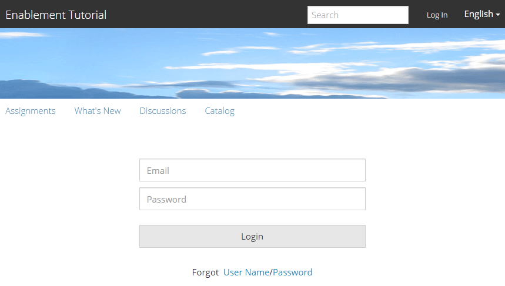

# Erstellen einer neuen Community-Site für Aktivierung {#author-a-new-community-site-for-enablement}

## Community-Site erstellen {#create-community-site}

[Die ](sites-console.md) Erstellung von Community-Sites erfolgt mithilfe eines Assistenten, der Sie durch die Schritte zur Erstellung einer Community-Site führt. Es ist möglich, zum Schritt `Next`oder `Back`zum vorherigen Schritt zu gelangen, bevor die Site im letzten Schritt übergeben wird.

Erste Schritte mit der Erstellung einer neuen Community-Site:

Verwenden der [Autoreninstanz](http://localhost:4502/)

* Anmelden mit Administratorrechten
* Navigieren Sie zu **[!UICONTROL Communities > Sites]**

* Wählen Sie **[!UICONTROL Erstellen]**

### Schritt 1: Site-Vorlage {#step-site-template}

Geben Sie im Schritt **Site-Vorlage** einen Titel, eine Beschreibung und den Namen für die URL ein und wählen Sie eine Community-Site-Vorlage aus, z. B.:

* **Community-Site-Titel**: `Enablement Tutorial`

* **Community-Site-Beschreibung**: `A site for enabling the community to learn.`

* **Community-Site-Stammordner**: (Leer lassen für Standardstamm  `/content/sites`)

* **Cloud-Konfigurationen**: (Lassen Sie das Feld leer, wenn keine Cloud-Konfigurationen angegeben sind) geben Sie den Pfad zu den angegebenen Cloud-Konfigurationen an.
* **Community-Site-Basissprache**: (lassen Sie für eine einzelne Sprache unberührt: Englisch) verwenden Sie das Pulldown-Menü, um eine  *oder* mehr Sprachen aus den verfügbaren Sprachen auszuwählen: Deutsch, Italienisch, Französisch, Japanisch, Spanisch, Portugiesisch (Brasilien), Chinesisch (Traditionell) und Chinesisch (vereinfacht). Für jede hinzugefügte Sprache wird eine Community-Site erstellt, die im selben Site-Ordner vorhanden ist. Befolgen Sie dabei die Best Practices, die unter [Übersetzen von Inhalten für mehrsprachige Sites](../../help/sites-administering/translation.md) beschrieben werden. Die Stammseite jeder Site enthält eine untergeordnete Seite mit dem Namen des Sprachcodes einer der ausgewählten Sprachen, z. B. &quot;en&quot;für Englisch oder &quot;fr&quot;für Französisch.

* **[!UICONTROL Community-Site-Name]**: `enable`

   * Die ursprüngliche URL wird unter dem Community-Site-Namen angezeigt.
   * für eine gültige URL einen Basissprachcode + &quot;.html&quot; anhängen.

      *Beispiel:* http://localhost:4502/content/sites/  `enable/en.html`

* **[!UICONTROL Referenz-Site-Vorlage]**: nach unten ziehen, um  `Reference Structured Learning Site Template`

Wählen Sie **[!UICONTROL Weiter]** aus

### Schritt 2: Design {#step-design}

Der Schritt &quot;Design&quot;wird in zwei Abschnitten zur Auswahl des Designs und des Branding-Banners vorgestellt:

#### COMMUNITY SITE-THEMA {#community-site-theme}

Wählen Sie den gewünschten Stil aus, der auf die Vorlage angewendet werden soll. Wenn diese Option aktiviert ist, wird das Design mit einem Häkchen überlagert.

#### COMMUNITY SITE BRANDING {#community-site-branding}

(Optional) Laden Sie ein Bannerbild hoch, das auf den Seiten der Site angezeigt werden soll. Das Banner wird zwischen der Community-Site-Kopfzeile und dem Menü (Navigationslinks) am linken Rand des Browsers fixiert. Die Bannerhöhe wird auf 120 Pixel zugeschnitten. Die Größe des Banners kann nicht an die Breite des Browsers und die Höhe von 120 Pixel angepasst werden.

 

Wählen Sie **[!UICONTROL Weiter]** aus.

### Schritt 3: Einstellungen {#step-settings}

Beachten Sie, dass im Schritt Einstellungen vor der Auswahl von `Next` sieben Abschnitte für den Zugriff auf Konfigurationen mit Benutzerverwaltung, Tagging, Rollen, Moderation, Analyse, Übersetzung und Aktivierung verfügbar sind.

#### BENUTZERVERWALTUNG {#user-management}

Es wird empfohlen, [Aktivierungscommunities](overview.md#enablement-community) privat zu sein.

Eine Community-Site ist privat, wenn anonymen Site-Besuchern der Zugriff verweigert wird, sie sich möglicherweise nicht selbst registrieren und keine Anmeldung über soziale Netzwerke verwenden.

Stellen Sie sicher, dass die meisten Kontrollkästchen für [Benutzerverwaltung](sites-console.md#user-management) deaktiviert sind:

* Website-Besuchern NICHT erlauben, sich selbst zu registrieren
* Anonyme Site-Besucher NICHT zum Anzeigen der Site zulassen
* Optional, ob Nachrichten unter Community-Mitgliedern zugelassen werden sollen oder nicht
* Anmeldung mit Facebook NICHT zulassen
* Anmeldung mit Twitter NICHT zulassen

#### TAGGING {#tagging}

Die Tags, die auf Community-Inhalte angewendet werden können, werden durch die Auswahl AEM Namespaces gesteuert, die zuvor über die [Tagging Console](../../help/sites-administering/tags.md#tagging-console) definiert wurden (z. B. den [Tutorial-Namespace](enablement-setup.md#create-tutorial-tags)).

Durch die Auswahl von Tag-Namespaces für die Community-Site wird außerdem die Auswahl eingeschränkt, die beim Definieren von Katalogen und Aktivierungsressourcen angezeigt wird. Wichtige Informationen finden Sie unter [Tagging von Aktivierungsressourcen](tag-resources.md) .

Die Suche nach Namespaces ist mit der Typvorsuche einfach. Beispiel:

* Typ &#39;tut&#39;
* Wählen Sie nun eine der folgenden Optionen aus `Tutorial`

### ROLLEN {#roles}

[Die ](users.md) Rollen von Community-Mitgliedern werden über die Einstellungen im Abschnitt Rollen zugewiesen.

Damit ein Community-Mitglied (oder eine Gruppe von Mitgliedern) die Site als Community-Manager erleben kann, verwenden Sie die Typvorsuche und wählen Sie den Mitglied- oder Gruppennamen aus den Optionen in der Dropdown-Liste aus.

Beispiel:

* Typ &quot;q&quot;
* Wählen Sie [Quinn Harper](enablement-setup.md#publishcreateenablementmembers)

>[!NOTE]
>
>[Der Tunnel-](deploy-communities.md#tunnel-service-on-author) Service ermöglicht die Auswahl von Mitgliedern und Gruppen, die nur in der Veröffentlichungsumgebung existieren.

#### MODERATION {#moderation}

Akzeptieren Sie die globalen Standardeinstellungen für [Moderation](sites-console.md#moderation) benutzergenerierte Inhalte (UGC).

#### ANALYTICS {#analytics}

Wählen Sie aus dem Pulldown-Menü das für diese Community-Site konfigurierte Analytics Cloud Service-Framework aus.

Die im Screenshot angezeigte Auswahl `Communities` ist das Framework-Beispiel aus der [Konfigurationsdokumentation.](analytics.md#aem-analytics-framework-configuration)

#### ÜBERSETZUNG {#translation}

Die [Übersetzungsparameter](sites-console.md#translation) geben an, ob UGC übersetzt werden darf und in welche Sprache, falls dies der Fall ist.

* Überprüfen Sie **[!UICONTROL Maschinelle Übersetzung zulassen]**
* Standardeinstellungen verwenden

#### AKTIVIERUNG {#enablement}

Für eine Aktivierungs-Community ist es erforderlich, einen oder mehrere Community-Aktivierungsmanager zu identifizieren.

* **[!UICONTROL Aktivierungsmanager]**
 (erforderlich) Mitglieder der 
`Community Enablement Managers` zur Verwaltung dieser Community-Site ausgewählt werden.

   * Typ &quot;s&quot;
   * Wählen Sie nun eine der folgenden Optionen aus `Sirius Nilson`

* **[!UICONTROL Marketing Cloud-Organisations-ID]**
 (optional) Die ID für ein Adobe Analytics-Konto, die erforderlich ist, wenn die  [Video Heartbeat-](analytics.md#video-heartbeat-analytics) Analyse in die Aktivierungsberichte aufgenommen wird.

Wählen Sie **[!UICONTROL Weiter]** aus.

### Schritt 4: Community-Site erstellen {#step-create-community-site}

Wählen Sie **[!UICONTROL Erstellen]**.

Nach Abschluss des Vorgangs wird der Ordner für die neue Site in der Konsole Communities - Sites angezeigt.

### Veröffentlichen der neuen Community-Site {#publish-the-new-community-site}

Die erstellte Site sollte über die Konsole Communities - Sites verwaltet werden. Dieselbe Konsole, von der aus neue Sites erstellt werden können.

Nachdem Sie den Ordner der Community-Site ausgewählt haben, halten Sie den Mauszeiger über das Site-Symbol, sodass vier Aktionssymbole angezeigt werden:

Bei Auswahl des Ellipsensymbols (Symbol &quot;Mehr Aktionen&quot;) werden die Optionen &quot;Site exportieren&quot;und &quot;Site löschen&quot;angezeigt.

Von links nach rechts sind sie:

* **Öffnen Sie**
SiteWählen Sie das Stiftsymbol aus, um die Community-Site im Bearbeitungsmodus für Autoren zu öffnen, Seitenkomponenten hinzuzufügen und/oder zu konfigurieren

* **Bearbeiten von**
SiteWählen Sie das Eigenschaftensymbol aus, um die Community-Site zur Änderung von Eigenschaften wie dem Titel oder zum Ändern des Designs zu öffnen.

* ****
Site veröffentlichenWählen Sie das Weltsymbol aus, um die Community-Site zu veröffentlichen (standardmäßig auf localhost:4503 ).

* **Export**
SiteWählen Sie das Exportsymbol aus, um ein Paket der Community-Site zu erstellen, das sowohl im  [Package Manager gespeichert als auch heruntergeladen ](../../help/sites-administering/package-manager.md) wird.

   Beachten Sie, dass UGC nicht im Site-Paket enthalten ist.

* **Löschen Sie**
SiteUm die Community-Site zu löschen, wählen Sie das Symbol Site löschen aus, das angezeigt wird, wenn Sie den Mauszeiger über die Site in der Communities Site-Konsole bewegen. Mit dieser Aktion werden alle mit der Site verknüpften Elemente entfernt, z. B. benutzergenerierte Inhalte, Benutzergruppen, Assets und Datenbankdatensätze.

#### Wählen Sie Veröffentlichen {#select-publish}

Wählen Sie das Weltsymbol aus, um die Community-Site zu veröffentlichen.

Es wird ein Hinweis geben, dass die Website veröffentlicht wurde.

## Community-Benutzer und Benutzergruppen {#community-users-user-groups}

### Beachten Sie die neuen Community-Benutzergruppen {#notice-new-community-user-groups}

Zusammen mit der neuen Community-Site werden neue Benutzergruppen erstellt, die über die entsprechenden Berechtigungen für verschiedene Verwaltungsfunktionen verfügen. Weitere Informationen finden Sie unter [Benutzergruppen für Community-Sites](users.md#usergroupsforcommunitysites).

Für diese neue Community-Site können die neuen Benutzergruppen, die in der Veröffentlichungsumgebung vorhanden sind, unter dem Site-Namen &quot;enable&quot;in Schritt 1 in der [Communities-Mitglieder- und Gruppenkonsole](members.md#groups-console) angezeigt werden:

### Zuweisen von Mitgliedern zur Community Enable Members Group {#assign-members-to-community-enable-members-group}

Wenn der Tunnel-Dienst auf der Autoreninstanz aktiviert ist, können die [Benutzer, die während der Ersteinrichtung](enablement-setup.md#publishcreateenablementmembers) erstellt wurden, der Community-Mitgliedergruppe für die neu erstellte Community-Site zugewiesen werden.

Über die Community-Gruppenkonsole können Mitglieder einzeln hinzugefügt oder über die Mitgliedschaft in einer Gruppe hinzugefügt werden.

In diesem Beispiel wird die Gruppe `Community Ski Class` als Mitglied der Gruppe `Community Enable Members` sowie als Mitglied `Quinn Harper` hinzugefügt.

* Navigieren Sie zur Konsole **[!UICONTROL Communities > Gruppen]** .
* Gruppe **[!UICONTROL Community-Aktivierungsmitglieder]** auswählen
* Geben Sie `ski` in das Suchfeld **[!UICONTROL Mitglieder zur Gruppe hinzufügen]** ein.
* Wählen Sie **[!UICONTROL Community-Ski-Klasse]** (Gruppe der Lernenden)
* Geben Sie `quinn` in das Suchfeld ein.
* Wählen Sie **[!UICONTROL Quinn Harper]** (Kontakt für Aktivierungsressource) aus.

* Wählen Sie **[!UICONTROL Speichern]** aus

## Veröffentlichungskonfigurationen {#configurations-on-publish}

### http://localhost:4503/content/sites/enable/en.html {#http-localhost-content-sites-enable-en-html}

### Konfigurieren für Authentifizierungsfehler {#configure-for-authentication-error}

Nachdem eine Site konfiguriert und zur Veröffentlichung gepusht wurde, [Konfigurieren Sie die Anmelde-Zuordnung](sites-console.md#configure-for-authentication-error) ( `Adobe Granite Login Selector Authentication Handler`) in der Veröffentlichungsinstanz. Der Vorteil besteht darin, dass bei nicht korrekter Eingabe der Anmeldedaten der Authentifizierungsfehler die Anmeldeseite der Community-Site mit einer Fehlermeldung erneut anzeigt.

Fügen Sie `Login Page Mapping` als

* /content/sites/enable/en/signin:/content/sites/enable/en

### (Optional) Ändern Sie die Standard-Startseite {#optional-change-the-default-home-page}

Wenn Sie zur Veranschaulichung mit der Veröffentlichungs-Site arbeiten, kann es nützlich sein, die standardmäßige Startseite auf die neue Site zu ändern.

Dazu müssen Sie [CRX|DE](http://localhost:4503/crx/de) Lite verwenden, um die [Ressourcenzuordnung](../../help/sites-deploying/resource-mapping.md)-Tabelle in der Veröffentlichungsumgebung zu bearbeiten.

Erste Schritte

1. Greifen Sie beim Veröffentlichen auf CRXDE zu und melden Sie sich mit Administratorrechten an

   * Navigieren Sie beispielsweise zu [http://localhost:4503/crx/de](http://localhost:4503/crx/de) und melden Sie sich mit `admin/admin` an.

1. Erweitern Sie im Projektbrowser `/etc/map` .
1. Wählen Sie den Knoten `http` aus.

   * Wählen Sie **[!UICONTROL Knoten erstellen]**

      * **** Namelocalhost.4503

         (Verwenden Sie *not* `:`)

      * **** [Typesling:Mapping](https://sling.apache.org/documentation/the-sling-engine/mappings-for-resource-resolution.html)

1. Neu erstellter `localhost.4503`-Knoten ausgewählt

   * Eigenschaft hinzufügen

      * **Name** sling:match
      * **** TypeString
      * **Wert** localhost.4503/\$

         (Muss mit &#39;$&#39; char enden)
   * Eigenschaft hinzufügen

      * **Name** sling:internalRedirect
      * **** TypeString
      * **Wert** /content/sites/enable/en.html

1. Wählen Sie **[!UICONTROL Alle speichern]**
1. (optional) Löschen des Browser-Verlaufs
1. Navigieren Sie zu http://localhost:4503/

   * Ankunft unter http://localhost:4503/content/sites/enable/en.html

>[!NOTE]
>
>Um zu deaktivieren, setzen Sie einfach den Wert der `sling:match`-Eigenschaft mit &quot;x&quot;- `xlocalhost.4503/$` - und **[!UICONTROL Alle speichern]** voran.

#### Fehlerbehebung: Fehler beim Speichern der Karte {#troubleshooting-error-saving-map}

Wenn die Änderungen nicht gespeichert werden können, stellen Sie sicher, dass der Knotenname `localhost.4503` mit einem Punkt-Trennzeichen und nicht `localhost:4503` mit einem Doppelpunkt-Trennzeichen ist, da `localhost`kein gültiges Namespace-Präfix ist.

#### Fehlerbehebung: Fehler bei Umleitung {#troubleshooting-fail-to-redirect}

Die Zeichenfolge &quot;**$**&quot;am Ende des regulären Ausdrucks `sling:match`ist von entscheidender Bedeutung, sodass nur genau `http://localhost:4503/` zugeordnet wird. Andernfalls wird der Umleitungswert jedem Pfad vorangestellt, der möglicherweise nach der server:port in der URL existiert. Wenn AEM also versucht, zur Anmeldeseite umzuleiten, schlägt dies fehl.

## Ändern der Community-Site {#modifying-the-community-site}

Nachdem die Site zum ersten Mal erstellt wurde, können Autoren das [Symbol &quot;Site öffnen](sites-console.md#authoring-site-content) verwenden, um standardmäßige AEM zu erstellen.

Darüber hinaus können Administratoren das [Symbol &quot;Site bearbeiten](sites-console.md#modifying-site-properties)&quot;verwenden, um Eigenschaften der Site zu ändern, z. B. den Titel.

Denken Sie nach jeder Änderung an **Save** und re-**Publish** die Site.

>[!NOTE]
>
>Wenn Sie nicht mit AEM vertraut sind, lesen Sie die Dokumentation zu [Grundlegender Umgang](../../help/sites-authoring/basic-handling.md) und eine [Kurzanleitung zum Erstellen von Seiten](../../help/sites-authoring/qg-page-authoring.md).

### Hinzufügen eines Katalogs {#add-a-catalog}

Die für diese Community-Site ausgewählte Community-Site-Vorlage sollte die Katalogfunktion enthalten.

Ist dies nicht der Fall, kann die Katalogfunktion einfach hinzugefügt werden. Dadurch können andere Mitglieder der Community, die nicht Aktivierungsressourcen oder Lernpfaden zugewiesen sind, Aktivierungsressourcen aus einem Katalog auswählen.

Wenn die Site-Struktur bereits die Katalogfunktion enthält, kann deren Titel geändert werden.

Um die Struktur der Site zu ändern, navigieren Sie zur Konsole **[!UICONTROL Communities, Sites]**, öffnen Sie den Ordner `enable` und wählen Sie das Symbol **Site bearbeiten** aus, um auf die Eigenschaften von `Enablement Tutorial` zuzugreifen.

Wählen Sie das Bedienfeld STRUKTUR aus, um einen Katalog hinzuzufügen oder einen vorhandenen Katalog zu ändern:

* **Titel**: `Ski Catalog`

* **URL**: `catalog`

* **Alle Namespaces auswählen**: Behalten Sie die Standardeinstellung bei.
* Wählen Sie **[!UICONTROL Speichern]** aus

Verwenden Sie das Symbol Position , um die Katalogfunktion nach den Zuweisungen an die zweite Position zu verschieben.

Wählen Sie **[!UICONTROL Save]** in der oberen rechten Ecke aus, um die Änderungen an der Community-Site zu speichern.

Dann erneut-**Veröffentlichen Sie** die Site.
