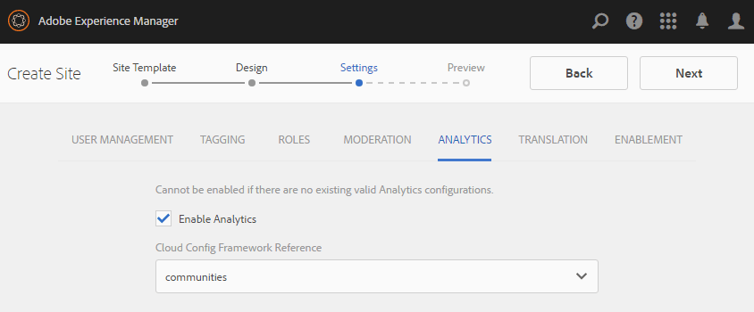

# Erstellen einer neuen Community-Site für die Aktivierung {#author-a-new-community-site-for-enablement}

## Community-Site erstellen {#create-community-site}

[Die Erstellung](sites-console.md) von Community-Sites erfolgt mithilfe eines Assistenten, der Sie durch die Schritte zur Erstellung einer Community-Site führt. Es ist möglich, den `Next`Schritt oder `Back`den vorherigen Schritt vor der Verpflichtung der Site im letzten Schritt weiter zu gehen.

So erstellen Sie eine neue Community-Site:

Verwenden der [Autoreninstanz](http://localhost:4502/)

* Anmelden mit Administratorrechten
* Navigieren Sie zu **[!UICONTROL Communities > Sites]**

* Wählen Sie **[!UICONTROL Erstellen]**

### Schritt 1: Site-Vorlage {#step-site-template}

Geben Sie im Schritt **Site-Vorlage** einen Titel, eine Beschreibung und den Namen der URL ein und wählen Sie eine Community-Site-Vorlage aus, z. B.:

* **Community-Site-Titel**: `Enablement Tutorial`

* **Community-Site-Beschreibung**: `A site for enabling the community to learn.`

* **Community-Site-Stammordner**: (Leer lassen für Standard-Stammordner `/content/sites`)

* **Cloud-Konfigurationen**: (leer lassen, wenn keine Cloud-Konfigurationen angegeben wurden) Geben Sie den Pfad zu den angegebenen Cloud-Konfigurationen an.
* **Community-Site-Basissprache**: (Für eine Sprache unberührt lassen: Englisch) verwenden Sie das Pulldown-Menü, um eine *oder mehrere* Basissprachen aus den verfügbaren Sprachen (Deutsch, Italienisch, Französisch, Japanisch, Spanisch, Portugiesisch (Brasilien), Chinesisch (Traditionell) und Chinesisch (vereinfacht) auszuwählen. Eine Community-Site wird für jede hinzugefügte Sprache erstellt und befindet sich im selben Site-Ordner, wie unter [Übersetzung von Inhalten für mehrsprachige Sites](../../help/sites-administering/translation.md)beschrieben. Die Stammseite jeder Site enthält eine untergeordnete Seite, die nach dem Sprachcode einer der ausgewählten Sprachen benannt ist, wie z.B. &quot;en&quot; für Englisch oder &quot;fr&quot; für Französisch.

* **[!UICONTROL Community-Site-Name]**: `enable`

   * die ursprüngliche URL wird unter dem Community-Site-Namen angezeigt
   * für eine gültige URL einen Basissprachcode + &quot;.html&quot;

      *Beispiel*: http://localhost:4502/content/sites/ `enable/en.html`

* **[!UICONTROL Referenz-Site-Vorlage]**: nach unten ziehen `Reference Structured Learning Site Template`

Wählen Sie **[!UICONTROL Weiter]**

### Schritt 2: Design {#step-design}

Der Schritt &quot;Design&quot;wird in zwei Abschnitten zur Auswahl des Designs und des Branding-Banners angezeigt:

#### COMMUNITY SITE THEME {#community-site-theme}

Wählen Sie den gewünschten Stil aus, der auf die Vorlage angewendet werden soll. Wenn diese Option aktiviert ist, wird das Design mit einem Häkchen überlagert.

#### COMMUNITY SITE BRANDING {#community-site-branding}

(Optional) Laden Sie ein Bannerbild hoch, das auf den Seiten der Site angezeigt wird. Das Banner wird am linken Rand des Browsers zwischen dem Community-Site-Header und dem Menü (Navigationslinks) fixiert. Die Bannerhöhe wird auf 120 Pixel zugeschnitten. Die Größe des Banners wird nicht an die Breite des Browsers und die Höhe von 120 Pixel angepasst.

 

Wählen Sie **[!UICONTROL Weiter]**.

### Schritt 3: Einstellungen {#step-settings}

Im Schritt &quot;Einstellungen&quot; `Next`werden vor der Auswahl sieben Abschnitte angezeigt, in denen Sie auf Konfigurationen zugreifen können, die mit Benutzerverwaltung, Tagging, Rollen, Moderation, Analyse, Übersetzung und Aktivierung verbunden sind.

#### USER MANAGEMENT {#user-management}

Es wird empfohlen, dass [Aktivierungsgemeinschaften](overview.md#enablement-community) privat sind.

Eine Community-Site ist privat, wenn anonymen Site-Besuchern der Zugriff verweigert wird, sie sich nicht selbst registrieren können und sie möglicherweise keine Social-Anmeldung verwenden.

Stellen Sie sicher, dass die meisten Kontrollkästchen für [Benutzerverwaltung](sites-console.md#user-management)deaktiviert sind:

* Site-Besucher NICHT zur Selbstregistrierung zulassen
* Anonyme Site-Besucher NICHT zum Anzeigen der Site zulassen
* Optional, ob Messaging unter Community-Mitgliedern zulässig ist
* Anmeldung bei Facebook NICHT zulassen
* Anmeldung mit Twitter NICHT zulassen

#### TAGGING {#tagging}

Die Tags, die auf Community-Inhalte angewendet werden können, werden durch Auswahl von AEM-Namespaces gesteuert, die zuvor über die [Tagging-Konsole](../../help/sites-administering/tags.md#tagging-console) definiert wurden (z. B. der [Tutorial-Namespace](enablement-setup.md#create-tutorial-tags)).

Darüber hinaus wird bei der Auswahl von Tag-Namespaces für die Community-Site die Auswahl eingeschränkt, die beim Definieren von Katalogen und Aktivierungsressourcen angezeigt wird. Wichtige Informationen finden Sie unter [Tagging-Aktivierungsressourcen](tag-resources.md) .

Die Suche nach Namespaces ist mit der Typenvorschau einfach. Beispiel:

* Typ &#39;tut&#39;
* Wählen Sie nun eine der folgenden Optionen aus `Tutorial`

### ROLES {#roles}

[Community-Mitgliedsrollen](users.md) werden über die Einstellungen im Abschnitt Rollen zugewiesen.

Damit ein Community-Mitglied (oder eine Gruppe von Mitgliedern) die Site als Community-Manager erleben kann, verwenden Sie die &quot;Type-ahead&quot;-Suche und wählen Sie den Mitglieds- oder Gruppennamen aus den Optionen in der Dropdown-Liste aus.

Beispiel:

* Typ &quot;q&quot;
* Quinn [Harper auswählen](enablement-setup.md#publishcreateenablementmembers)

>[!NOTE]
>
>[Der Tunnel-Dienst](deploy-communities.md#tunnel-service-on-author) ermöglicht die Auswahl von Mitgliedern und Gruppen, die nur in der Veröffentlichungsumgebung vorhanden sind.

#### MODERATION {#moderation}

Übernehmen Sie die globalen Standardeinstellungen für die [Moderation](sites-console.md#moderation) benutzergenerierter Inhalte (UGC).

#### ANALYTICS {#analytics}

Wählen Sie im Pulldown-Menü das für diese Community-Site konfigurierte Analytics Cloud-Service-Framework aus.

Die Auswahl im Screenshot ist `Communities`das Framework-Beispiel aus der [Konfigurationsdokumentation.](analytics.md#aem-analytics-framework-configuration)

#### TRANSLATION {#translation}

Die [Übersetzungseinstellungen](sites-console.md#translation) geben an, ob und in welche Sprache UGC übersetzt werden darf.

* Maschinelle Übersetzung **[!UICONTROL zulassen]**
* Standardeinstellungen verwenden

#### ENABLEMENT {#enablement}

Für eine Aktivierungsgemeinschaft ist es erforderlich, einen oder mehrere Community-Aktivierungsmanager zu identifizieren.

* **[!UICONTROL Aktivierungsmanager]**(erforderlich) Mitglieder der `Community Enablement Managers` Gruppe können ausgewählt werden, um diese Community-Site zu verwalten.

   * Typ &quot;s&quot;
   * Wählen Sie nun eine der folgenden Optionen aus `Sirius Nilson`

* **[!UICONTROL Marketing Cloud-Organisations-ID]**(optional) Die ID für ein Adobe Analytics-Konto, die erforderlich ist, wenn [Video Heartbeat Analytics](analytics.md#video-heartbeat-analytics) in die Aktivierungsberichte aufgenommen wird.

Wählen Sie **[!UICONTROL Weiter]**.

### Schritt 4: Community-Site erstellen {#step-create-community-site}

Wählen Sie **[!UICONTROL Erstellen]**.

Nach Abschluss des Prozesses wird der Ordner für die neue Site in der Konsole Communities - Sites angezeigt.

### Neue Community-Site veröffentlichen {#publish-the-new-community-site}

Die erstellte Site sollte über die Communities - Sites-Konsole verwaltet werden, in der auch neue Sites erstellt werden können.

Wenn Sie den Ordner der Community-Site ausgewählt haben, halten Sie den Mauszeiger über das Site-Symbol, sodass vier Aktionssymbole angezeigt werden:

Wenn Sie das Symbol &quot;Auslassungszeichen&quot;auswählen (Symbol &quot;Weitere Aktionen&quot;), werden die Optionen &quot;Site exportieren&quot;und &quot;Site löschen&quot;angezeigt.

Von links nach rechts:

* **Site**&#x200B;öffnen Wählen Sie das Stiftsymbol aus, um die Community-Site im Autorenbearbeitungsmodus zu öffnen, um Seitenkomponenten hinzuzufügen und/oder zu konfigurieren

* **Site** bearbeiten Wählen Sie das Symbol Eigenschaften aus, um die Community-Site zum Ändern von Eigenschaften wie dem Titel oder zum Ändern des Designs zu öffnen

* **Website** veröffentlichen Wählen Sie das Symbol Welt, um die Community-Site zu veröffentlichen (standardmäßig auf localhost:4503)

* **Site** exportieren Wählen Sie das Exportsymbol, um ein Paket der Community-Site zu erstellen, das sowohl im [Paketmanager](../../help/sites-administering/package-manager.md) gespeichert als auch heruntergeladen wird.

   Beachten Sie, dass UGC nicht im Site-Paket enthalten ist.

* **Site** löschen Um die Community-Site zu löschen, wählen Sie das Symbol &quot;Site löschen&quot;, das angezeigt wird, wenn Sie den Mauszeiger über die Site in der Communities Site-Konsole bewegen. Durch diese Aktion werden alle mit der Site verknüpften Elemente entfernt, z. B. UGC, Benutzergruppen, Assets und Datenbankdatensätze.

#### Wählen Sie Veröffentlichen {#select-publish}

Wählen Sie das Symbol Welt, um die Community-Site zu veröffentlichen.

Es wird ein Hinweis geben, dass die Site veröffentlicht wurde.

## Community-Benutzer und -Benutzergruppen {#community-users-user-groups}

### Neue Community-Benutzergruppen {#notice-new-community-user-groups}

Neben der neuen Community-Site werden neue Benutzergruppen erstellt, die über die entsprechenden Berechtigungen für verschiedene Verwaltungsfunktionen verfügen. Weitere Informationen finden Sie unter [Benutzergruppen für Community-Sites](users.md#usergroupsforcommunitysites).

Für diese neue Community-Site werden die neuen Benutzergruppen, die in der Veröffentlichungsumgebung vorhanden sind, unter dem Site-Namen &quot;Aktivieren&quot;in Schritt 1 in der Konsole &quot; [Communities Mitglieder und Gruppen&quot;angezeigt](members.md#groups-console):

### Mitglieder zur Community-Gruppe &quot;Mitglieder aktivieren&quot;zuweisen {#assign-members-to-community-enable-members-group}

Bei aktiviertem Tunneldienst ist es möglich, die während der Einrichtung[ erstellten ](enablement-setup.md#publishcreateenablementmembers)Benutzer der Community-Mitglieder-Gruppe für die neu erstellte Community-Site zuzuweisen.

Mithilfe der Community-Gruppenkonsole können Mitglieder einzeln hinzugefügt oder über die Mitgliedschaft in einer Gruppe hinzugefügt werden.

In diesem Beispiel `Community Ski Class` wird die Gruppe als Mitglied der Gruppe `Community Enable Members` sowie als Mitglied hinzugefügt `Quinn Harper`.

* Navigieren Sie zu **[!UICONTROL Communities > Gruppen]** -Konsole
* Gruppe **[!UICONTROL Community-Mitglieder]** aktivieren
* Geben Sie `ski` in das Suchfeld &quot;Mitglieder zu Gruppe **** hinzufügen&quot;ein
* Wählen Sie **[!UICONTROL Community Ski Class]** (Gruppe der Lernenden)
* In `quinn` das Suchfeld eingeben
* Wählen Sie **[!UICONTROL Quinn Harper]** (Ansprechpartner für die Aktivierungsressource)

* Wählen Sie **[!UICONTROL Speichern]**

## Konfigurationen bei der Veröffentlichung {#configurations-on-publish}

### http://localhost:4503/content/sites/enable/en.html {#http-localhost-content-sites-enable-en-html}

### Authentifizierungsfehler konfigurieren {#configure-for-authentication-error}

Nachdem eine Site konfiguriert und zur Veröffentlichung gesendet wurde, [konfigurieren Sie die Anmeldezuordnung](sites-console.md#configure-for-authentication-error) ( `Adobe Granite Login Selector Authentication Handler`) in der Veröffentlichungsinstanz. Der Vorteil besteht darin, dass bei nicht korrekter Eingabe der Anmeldedaten der Authentifizierungsfehler die Anmeldeseite der Community-Site mit einer Fehlermeldung erneut anzeigt.

Hinzufügen eines `Login Page Mapping` Formulars

* /content/sites/enable/de/signin:/content/sites/enable/de

### (Optional) Ändern der Standard-Homepage {#optional-change-the-default-home-page}

Wenn Sie zu Demonstrationszwecken mit der Veröffentlichungs-Site arbeiten, kann es nützlich sein, die Standard-Homepage in die neue Site zu ändern.

Hierzu müssen Sie [CRX|DE](http://localhost:4503/crx/de) Lite verwenden, um die Tabelle für die [Ressourcenzuordnung](../../help/sites-deploying/resource-mapping.md) bei der Veröffentlichung zu bearbeiten.

Erste Schritte

1. Greifen Sie beim Veröffentlichen auf CRXDE zu und melden Sie sich mit Administratorberechtigungen an

   * Navigieren Sie beispielsweise zu [http://localhost:4503/crx/de](http://localhost:4503/crx/de) und melden Sie sich mit `admin/admin`

1. Erweitern Sie im Projektbrowser `/etc/map`
1. Wählen Sie den `http` Knoten

   * Knoten **[!UICONTROL erstellen auswählen]**

      * **Name** localhost.4503

         (Do *not* use `:`)

      * **Typ** [sling:Zuordnung](https://sling.apache.org/documentation/the-sling-engine/mappings-for-resource-resolution.html)

1. Mit neu erstelltem `localhost.4503` Knoten ausgewählt

   * Eigenschaft hinzufügen

      * **Name** sling:match
      * **Typzeichenfolge**
      * **Wert** localhost.4503/\$

         (Muss mit &#39;$&#39; Zeichen enden)
   * Eigenschaft hinzufügen

      * **Name** sling:internalRedirect
      * **Typzeichenfolge**
      * **Wert** /content/sites/enable/en.html

1. Select **[!UICONTROL Save All]**
1. (Optional) Löschen des Browserverlaufs
1. Navigieren Sie zu http://localhost:4503/

   * Ankunft unter http://localhost:4503/content/sites/enable/en.html

>[!NOTE]
>
>Zur Deaktivierung stellen Sie dem `sling:match` Eigenschaftswert einfach ein &quot;x&quot;- `xlocalhost.4503/$` - und **[!UICONTROL Save All]** voran.

#### Fehlerbehebung: Fehler beim Speichern der Map {#troubleshooting-error-saving-map}

Wenn die Änderungen nicht gespeichert werden können, stellen Sie sicher, dass der Knotenname `localhost.4503`mit einem Punkt-Trennzeichen und nicht `localhost:4503` mit einem Doppelpunkt-Trennzeichen versehen ist, da es sich nicht um ein gültiges Namespace-Präfix `localhost`handelt.

#### Fehlerbehebung: Fehler bei Umleitung {#troubleshooting-fail-to-redirect}

Die Zeichenfolge &#39;**$**&#39; am Ende der `sling:match`Zeichenfolge für reguläre Ausdrücke ist von entscheidender Bedeutung, sodass nur exakt `http://localhost:4503/` zugeordnet wird. Andernfalls wird der Umleitungswert jedem Pfad vorangestellt, der nach der URL server:port existieren könnte. Wenn AEM also versucht, zur Anmeldeseite umzuleiten, schlägt es fehl.

## Ändern der Community-Site {#modifying-the-community-site}

Nachdem die Site zum ersten Mal erstellt wurde, können Autoren mit dem Symbol [Offene Site](sites-console.md#authoring-site-content) standardmäßige AEM-Authoring-Aktivitäten durchführen.

Darüber hinaus können Administratoren die Eigenschaften der Site, z. B. den Titel, über das Symbol[ &quot;Site ](sites-console.md#modifying-site-properties)bearbeiten&quot;ändern.

Denken Sie nach jeder Änderung daran, die Site zu **speichern** und erneut zu **veröffentlichen** .

>[!NOTE]
>
>If not familiar with AEM, view the documentation on [basic handling](../../help/sites-authoring/basic-handling.md) and a [quick guide to authoring pages](../../help/sites-authoring/qg-page-authoring.md).

### Hinzufügen eines Katalogs {#add-a-catalog}

Die für diese Community-Site ausgewählte Community-Site-Vorlage sollte die Katalogfunktion enthalten.

Ist dies nicht der Fall, kann die Katalogfunktion einfach hinzugefügt werden. Dadurch können andere Mitglieder der Community, die nicht für Aktivierungsressourcen oder Lernpfade vorgesehen sind, die Ressourcen für die Aktivierung aus einem Katalog auswählen.

Wenn die Site-Struktur bereits die Katalogfunktion enthält, kann deren Titel geändert werden.

Um die Struktur der Site zu ändern, navigieren Sie zur Konsole &quot; **[!UICONTROL Communities&quot;, &quot;Sites]** &quot;, öffnen Sie den `enable` Ordner und klicken Sie auf das Symbol &quot;Site **bearbeiten&quot;** , um auf die Eigenschaften von `Enablement Tutorial`zuzugreifen.

Wählen Sie das STRUKTURbedienfeld aus, um einen Katalog hinzuzufügen oder einen vorhandenen Katalog zu ändern:

* **Titel**: `Ski Catalog`

* **URL**: `catalog`

* **Alle Namespaces** auswählen: als Standard beibehalten.
* Wählen Sie **[!UICONTROL Speichern]**

Verwenden Sie das Positionssymbol, um die Katalogfunktion nach den Zuweisungen an die zweite Position zu verschieben.

Wählen Sie in der oberen rechten Ecke die Option **[!UICONTROL Speichern]** , um die Änderungen an der Community-Site zu speichern.

Veröffentlichen Sie dann die Site erneut **und dann erneut** .