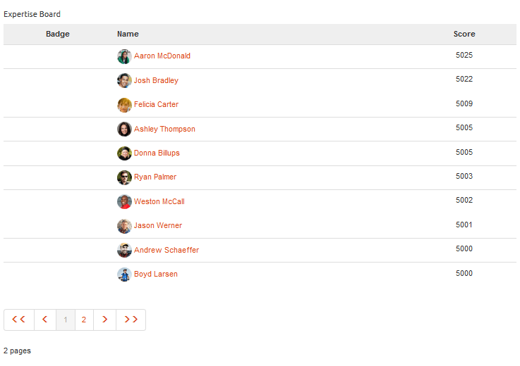

# Leaderboard-Funktion {#leaderboard-feature}

>[!CAUTION]
>
>AEM 6.4 hat das Ende der erweiterten Unterstützung erreicht und diese Dokumentation wird nicht mehr aktualisiert. Weitere Informationen finden Sie in unserer [technische Unterstützung](https://helpx.adobe.com/de/support/programs/eol-matrix.html). Unterstützte Versionen suchen [here](https://experienceleague.adobe.com/docs/?lang=de).

## Einführung {#introduction}

Die `Leaderboard` -Komponente bietet die Möglichkeit, ein Gefühl dafür zu erhalten, wie Mitglieder innerhalb der Community interagieren, indem sie Mitglieder nach erworbenen Punkten (Basis-Scoring) oder ihrem Fachwissen (fortgeschrittenes Scoring) einstuft.

Bevor Sie die Leaderboard-Komponente auf einer Seite einfügen, müssen Sie [Communities-Scoring und -Abzeichen](implementing-scoring.md).

In diesem Abschnitt der Dokumentation wird

* Hinzufügen der `Leaderboard` -Komponente [Community-Site](overview.md#community-sites)

* Konfigurationseinstellungen für `Leaderboard` component

## Hinzufügen eines Leaderboards zu einer Seite {#adding-a-leaderboard-to-a-page}

So fügen Sie eine `Leaderboard` Komponente auf einer Seite im Autorenmodus zu finden, die Komponente

* `Communities / Leaderboard`

und ziehen Sie sie an die gewünschte Stelle auf einer Seite.

Die erforderlichen Informationen finden Sie unter [Grundlagen zu Communities-Komponenten](basics.md).

Wenn die Komponente zum ersten Mal auf einer Seite einer Community-Site platziert wird, wird sie wie folgt angezeigt:

## Leaderboard konfigurieren {#configuring-leaderboard}

Wählen Sie die platzierte `Leaderboard` -Komponente, die aufgerufen und ausgewählt werden soll `Configure` -Symbol, über das das Dialogfeld &quot;Bearbeiten&quot;geöffnet wird.

 

### Registerkarte Einstellungen {#settings-tab}

Unter dem **[!UICONTROL Einstellungen]** angeben, welche Informationen zum Mitglied angezeigt werden sollen:

* **[!UICONTROL Anzeigename]**
Ein beschreibender Name, der für die Pinnwand angezeigt wird und die für die Anzeige von Abzeichen und Bewertungen ausgewählten Regeln widerspiegelt.

   Der Standardwert ist `Leaderboard`, wenn nichts eingegeben wurde.

* **[!UICONTROL Badge]**
Wenn diese Option aktiviert ist, wird eine Spalte für Badge-Symbole in die Leaderboard eingefügt.

   Die Option Standard ist deaktiviert.

* **[!UICONTROL Badge Name]**
Wenn diese Option aktiviert ist, wird eine Spalte für den Badge-Namen in die Leaderboard aufgenommen.

   Die Option Standard ist deaktiviert.

* **[!UICONTROL Avatar verwenden]**
Wenn diese Option aktiviert ist, wird das Avatarbild des Mitglieds in das Leaderboard eingefügt, neben dem Namen, der mit seinem Mitgliederprofil verknüpft ist.

   Die Option Standard ist deaktiviert.

### Registerkarte Regeln {#rules-tab}

Unter dem **[!UICONTROL Regeln]** Registerkarte, der Community-Site und den zugehörigen Scoring- und Badging-Regeln

* **[!UICONTROL Regelstandort]**
(erforderlich) Der Speicherort, an dem die Scoring-/Badging-Regel konfiguriert ist.

* **[!UICONTROL Scoring-Regel]**
(erforderlich) Bestimmte Regel, die die anzuzeigenden Werte generiert.

* **[!UICONTROL Badging-Regel]**
(erforderlich) Bestimmte Regel, die das anzuzeigende Badge generiert.

* **[!UICONTROL Anzeigebeschränkung]**
Anzahl der Mitglieder, die pro Seite angezeigt werden sollen

   Der Standardwert ist 10.

## Beispiel: Teilnehmer-Leaderboard {#example-participants-leaderboard}

Diese Leaderboard-Berichte resultieren aus der Anwendung grundlegender Scoring-Regeln.

Leaderboard-Komponentenkonfiguration:

* **[!UICONTROL Einstellungen]** tab:

   * Anzeigename = `Participation Board`
   * `checked`:

      * Abzeichen
      * Abzeichenname
      * Avatar verwenden

* **[!UICONTROL Regeln]** tab:

   * Speicherort für Regel = `/content/sites/communities/jcr:content`
   * Bewertungsregel = `/etc/community/scoring/rules/forums-scoring`
   * Abzeichenregel = `/etc/community/badging/rules/reference-badging`
   * Anzeigelimit = `10`

## Beispiel: Expertenvorstand {#example-experts-leaderboard}

Diese Leaderboard-Berichte resultieren aus der Anwendung erweiterter Scoring-Regeln.

Leaderboard-Komponentenkonfiguration:

* **[!UICONTROL Einstellungen]** tab:

   * Anzeigename = `Expertise Board`
   * `checked`:

      * Abzeichen
      * Avatar verwenden

* **[!UICONTROL Regeln]** tab:

   * Speicherort für Regel = `/content/sites/communities/jcr:content`
   * Bewertungsregel = `/etc/community/scoring/rules/adv-forums-scoring`
   * Abzeichenregel = `/etc/community/badging/rules/adv-forums-badging`
   * Anzeigelimit = `10`

## Zusätzliche Informationen {#additional-information}

Weitere Informationen finden Sie unter [Leaderboard-Grundlagen](leaderboard.md) für Entwickler.

Anweisungen zum Erstellen von Regeln finden Sie im Abschnitt [Communities-Scoring und -Abzeichen](implementing-scoring.md) für Administratoren.
