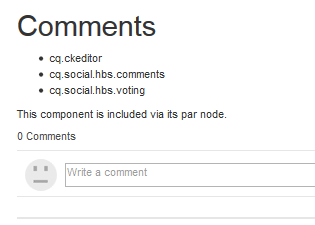

# Hinzufügen von Kommentaren zur Beispielseite {#add-comment-to-sample-page}

>[!CAUTION]
>
>AEM 6.4 hat das Ende der erweiterten Unterstützung erreicht und diese Dokumentation wird nicht mehr aktualisiert. Weitere Informationen finden Sie in unserer [technische Unterstützung](https://helpx.adobe.com/de/support/programs/eol-matrix.html). Unterstützte Versionen suchen [here](https://experienceleague.adobe.com/docs/?lang=de).

Nachdem die Komponenten für das benutzerdefinierte Kommentarsystem im Anwendungsverzeichnis (/apps) vorhanden sind, können Sie die erweiterte Komponente verwenden. Die Instanz des Kommentarsystems auf einer Website, auf die sich die Auswirkungen auswirken sollen, muss ihren resourceType als benutzerdefiniertes Kommentarsystem festlegen und alle erforderlichen Client-Bibliotheken einschließen.

## Erforderliche Clientlibs identifizieren {#identify-required-clientlibs}

Die Client-Bibliotheken, die für den Stil und die Funktionsweise der Standardkommentare erforderlich sind, sind auch für erweiterte Kommentare erforderlich.

Die [Handbuch zu Community-Komponenten](components-guide.md) identifiziert die erforderlichen Client-Bibliotheken. Navigieren Sie zum Komponentenleitfaden und zeigen Sie die Komponente Kommentare an, z. B.:

[http://localhost:4502/content/community-components/en/comments.html](http://localhost:4502/content/community-components/en/comments.html)

Beachten Sie die drei Client-Bibliotheken, die erforderlich sind, damit Kommentare gerendert und ordnungsgemäß funktioniert. Diese müssen enthalten sein, wenn auf die erweiterten Kommentare verwiesen wird, sowie die [Client-Bibliothek erweiterter Kommentare](extend-create-components.md#create-a-client-library-folder) ( `apps.custom.comments`).

## Hinzufügen benutzerdefinierter Kommentare zu einer Seite {#add-custom-comments-to-a-page}

Da pro Seite nur ein Kommentarsystem erstellt werden kann, ist es einfacher, eine Beispielseite zu erstellen, wie in der kurzen [Erstellen einer Beispielseite](create-sample-page.md) Tutorial.

Sobald die Erstellung abgeschlossen ist, wechseln Sie in den Designmodus und stellen Sie die benutzerdefinierte Komponentengruppe zur Verfügung, damit die `Alt Comments` -Komponente, die der Seite hinzugefügt werden soll.

Damit der Kommentar angezeigt wird und ordnungsgemäß funktioniert, müssen die Client-Bibliotheken für Kommentare zur Clientlibsliste für die Seite hinzugefügt werden (siehe [Clientlibs für Communities-Komponenten](clientlibs.md)).

### Kommentare zu Clientlibs auf Beispielseite {#comments-clientlibs-on-sample-page}

### Autor: Alt-Kommentar auf Beispielseite {#author-alt-comment-on-sample-page}

### Autor: Beispiel-Knoten für Seitenkommentare {#author-sample-page-comments-node}

Sie können den resourceType in CRXDE überprüfen, indem Sie die Eigenschaften des Kommentarknotens für die Beispielseite unter `/content/sites/sample/en/jcr:content/content/primary/comments`.

### Beispielseite für Veröffentlichung {#publish-sample-page}

Nachdem die benutzerdefinierte Komponente zur Seite hinzugefügt wurde, müssen Sie auch (erneut) [Seite veröffentlichen](sites-console.md#publishing-the-site).

### Veröffentlichen: Alt-Kommentar auf Beispielseite {#publish-alt-comment-on-sample-page}

Nach der Veröffentlichung des benutzerdefinierten Programms und der Beispielseite sollte es möglich sein, einen Kommentar einzugeben. Wenn angemeldet, entweder mit einer [Demobenutzer](tutorials.md#demo-users) oder Administrator, sollte es möglich sein, einen Kommentar zu posten.

Hier aaron.mcdonald@mailinator.com posten Sie einen Kommentar:

 

Nachdem sich herausstellt, dass die erweiterte Komponente ordnungsgemäß mit dem standardmäßigen Erscheinungsbild funktioniert, ist es an der Zeit, das Erscheinungsbild zu ändern.
