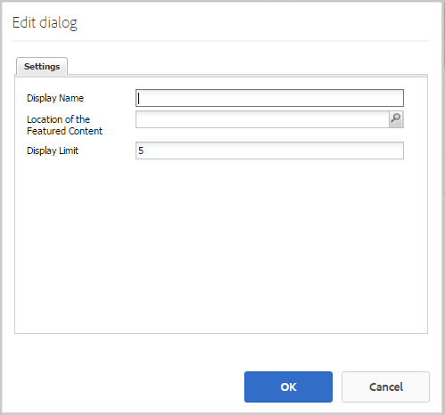

# Funktionen für spezielle Inhalte {#featured-content-feature}

>[!CAUTION]
>
>AEM 6.4 hat das Ende der erweiterten Unterstützung erreicht und diese Dokumentation wird nicht mehr aktualisiert. Weitere Informationen finden Sie in unserer [technische Unterstützung](https://helpx.adobe.com/de/support/programs/eol-matrix.html). Unterstützte Versionen suchen [here](https://experienceleague.adobe.com/docs/?lang=de).

## Einführung {#introduction}

Die Funktion für spezielle Inhalte bietet einen Bereich für angemeldete Site-Besucher (Community-Mitglieder) in der Veröffentlichungsumgebung, in dem Inhalte hervorgehoben werden können für

* [Blogs](blog-feature.md)
* [Kalender](calendar.md)
* [Foren](forum.md)
* [Ideen](ideation-feature.md)
* [Fragen und Antworten](working-with-qna.md)

Sobald Inhalte als vorgestellt gekennzeichnet sind, werden sie in dieser Komponente aufgelistet, die auf bestimmten Landingpages oder in Bereichen platziert werden kann, die die Aufmerksamkeit der Community-Mitglieder leicht erfassen.

Die Funktion zum Feature von Inhalten kann pro Komponente erlaubt oder deaktiviert sein.

In diesem Abschnitt der Dokumentation wird

* Hinzufügen spezieller Inhalte zu einer Community-Site
* Konfigurationseinstellungen für `Featured Content`component

## Hinzufügen von speziellen Inhalten zu einer Seite {#adding-featured-content-to-a-page}

So fügen Sie eine `Featured Content` -Komponente auf einer Seite im Autorenmodus verwenden Sie den Komponenten-Browser, um

* `Communities / Featured Content`

und ziehen Sie sie an die gewünschte Stelle auf der Seite, auf der der gewünschte Inhalt erscheinen soll.

Die erforderlichen Informationen finden Sie unter [Grundlagen zu Communities-Komponenten](basics.md).

Wenn die [erforderliche clientseitige Bibliotheken](essentials-featured.md#essentials-for-client-side) eingeschlossen sind, wird die `Featured Content`wird angezeigt:

## Konfiguration von speziellen Inhalten {#configuring-featured-content}

Wählen Sie die platzierte `Featured Content` -Komponente, die aufgerufen und ausgewählt werden soll `Configure` -Symbol, über das das Dialogfeld &quot;Bearbeiten&quot;geöffnet wird.

 

### Registerkarte Einstellungen {#settings-tab}

Unter dem **[!UICONTROL Einstellungen]** -Tab, um den Inhalt für die Funktion zu identifizieren:

* **[!UICONTROL Anzeigename]**
Der Titel für die Liste der vorgestellten Inhalte. Beispiel 
`Featured Questions` oder `Featured Ideas`. Der Standardwert ist `Featured Content` wenn leer gelassen.

* **[!UICONTROL Position des präsentierten Inhalts]**

   *(Erforderlich)* Navigieren Sie zu der Seite, die den Inhalt enthält, der möglicherweise eine Funktion aufweist (die Komponenten dieser Seite müssen so konfiguriert sein, dass &quot;Vorgestellter Inhalt zulassen&quot;konfiguriert werden). Beispiel: `/content/sites/engage/en/forum`

* **[!UICONTROL Anzeigebeschränkung]**
Die maximale Anzahl der anzuzeigenden speziellen Inhalte. Der Standardwert ist 5.

## Site-Besuchererlebnis {#site-visitor-experience}

Die Fähigkeit, Inhalte als speziellen Inhalt zu kennzeichnen, erfordert Moderatorberechtigungen.

Wenn ein Moderator veröffentlichte Inhalte anzeigt, hat er Zugriff auf die kontextbezogenen Moderationsflags, die die neuen `Feature` Markierung.

Sobald das Modeartions-Flag als Funktion gekennzeichnet ist, wird `Unfeature`.

Die Seite, die die `Featured Content` -Komponente, wird diesen Beitrag jetzt einschließen.

`Read More` ist ein Link zum eigentlichen Beitrag.

## Zusätzliche Informationen {#additional-information}

Weitere Informationen finden Sie unter [Vorgestellte Inhalte](essentials-featured.md) für Entwickler.

Informationen zum Kennzeichnen von Inhalten als vorgestellt finden Sie unter [Moderieren benutzergenerierter Inhalte](moderate-ugc.md).
