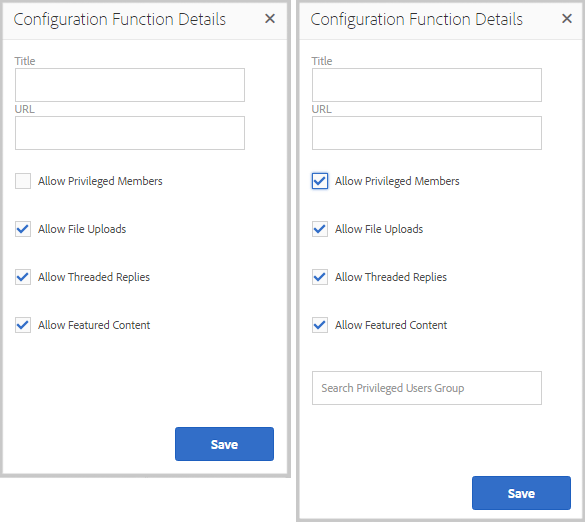

# Community-Funktionen {#community-functions}

Die Art der Funktionen, die von einem Community-Erlebnis erwartet werden, ist bekannt. Community-Funktionen sind als Community-Funktionen verfügbar. Im Grunde sind es eine oder mehrere Seiten, die vorab mit dem Netzwerk verbunden sind, um eine Community-Funktion zu implementieren, die mehr erfordert, als einfach eine Komponente zu einer Seite im Autorenmodus hinzuzufügen. Sie sind die Bausteine, mit denen die Struktur eines [Community-Site-Vorlage](sites.md) von welchen Community-Sites [created](sites-console.md).

Nachdem eine Community-Site erstellt wurde, kann den resultierenden Seiten mithilfe der standardmäßigen [AEM Authoring-Modus](../../help/sites-authoring/editing-content.md).

Eine Reihe von Community-Funktionen ist sofort verfügbar, wie in der Konsole Community-Funktionen zu sehen ist. In zukünftigen Versionen werden mehr Community-Funktionen bereitgestellt und es können auch benutzerdefinierte Funktionen erstellt werden.

>[!NOTE]
>
>Die Konsolen für die Erstellung von [Community-Sites](sites-console.md), [Community-Site-Vorlagen](sites.md), [Community-Gruppenvorlagen](tools-groups.md) und [Community-Funktionen](functions.md) sind nur zur Verwendung in der Autorenumgebung vorgesehen.

## Community-Funktionskonsole {#community-functions-console}

In der Autorenumgebung, um die Konsole für Community-Funktionen zu erreichen

* Über die globale Navigation: **[!UICONTROL Tools > Communities > Community-Funktionen]**

## Vordefinierte Funktionen {#pre-built-functions}

Im Folgenden finden Sie eine kurze Beschreibung der Funktionen, die mit AEM Communities bereitgestellt werden. Jede Funktion besteht aus einer oder mehreren AEM Seiten, die Communities-Komponenten enthalten, die mit einer Funktion verbunden sind, die einfach in ein [Community-Site-Vorlage](sites.md).

Eine Community-Site-Vorlage bietet die Struktur für eine Community-Site, einschließlich Anmeldung, Benutzerprofile, Benachrichtigungen, Messaging, Site-Menü, Suche, Themen und Branding-Funktionen.

### Titel und URL-Einstellungen {#title-and-url-settings}

**Titel** und **URL** sind Eigenschaften, die allen Community-Funktionen gemeinsam sind.

Wenn eine Community-Funktion zu einer Community-Site-Vorlage hinzugefügt oder hinzugefügt wird, wenn [Ändern](sites-console.md#modifying-site-properties) Wenn die Struktur einer Community-Site festgelegt ist, wird das Dialogfeld der Funktion geöffnet, sodass Titel und URL konfiguriert werden können.

#### Konfiguration der Funktionsdetails {#configuration-function-details}

* **[!UICONTROL Titel]**
(
*erforderlich*) Der Text, der im Menü der Funktionen für die Site angezeigt wird

* **[!UICONTROL URL]**
(*erforderlich*) Der zum Generieren des URI verwendete Name. Der Name muss mit dem [Benennungskonventionen](../../help/sites-developing/naming-conventions.md) von AEM und JCR auferlegt.

Beispielsweise können Sie die aus dem folgenden Beispiel erstellte Site verwenden: [Erste Schritte](getting-started.md) Tutorial, falls

* Titel = Webseite
* URL = Seite

Dann lautet die URL zur Seite http://local_host:4503/content/sites/engage/en/page.html und der Menülink für die Seite wird wie folgt angezeigt:

### Aktivitäts-Stream-Funktion {#activity-stream-function}

Die Aktivitäts-Stream-Funktion ist eine Seite mit einer [Aktivitäts-Streams-Komponente](activities.md) mit allen ausgewählten Ansichten (alle Aktivitäten, Benutzeraktivitäten und Folgeaktivitäten). Siehe auch [Grundlagen zum Aktivitäts-Stream](essentials-activities.md) für Entwickler.

Wenn eine Vorlage hinzugefügt wird, wird das folgende Dialogfeld geöffnet:

#### Konfiguration der Funktionsdetails {#configuration-function-details-1}

* Siehe [Titel und URL-Einstellungen](#title-and-url-settings)
* **[!UICONTROL Ansicht &quot;Meine Aktivitäten&quot;]**
Wenn diese Option aktiviert ist, enthält die Seite Aktivitäten eine Registerkarte, auf der Aktivitäten basierend auf denen gefiltert werden, die innerhalb der Community vom aktuellen Mitglied generiert wurden. Diese Option ist standardmäßig aktiviert.

* **[!UICONTROL Ansicht &quot;Alle Aktivitäten&quot;anzeigen]**
Wenn diese Option aktiviert ist, enthält die Seite Aktivitäten einen Tab, der alle in der Community generierten Aktivitäten enthält, auf die das aktuelle Mitglied Zugriff hat. Diese Option ist standardmäßig aktiviert.

* **[!UICONTROL Ansicht &quot;News Feed&quot;anzeigen]**
Wenn diese Option aktiviert ist, enthält die Seite Aktivitäten eine Registerkarte, auf der Aktivitäten nach denen gefiltert werden, denen das aktuelle Mitglied folgt. Diese Option ist standardmäßig aktiviert.

### Zuweisungsfunktion {#assignments-function}

Die Zuweisungsfunktion ist die grundlegende Funktion, die eine [Community-Site zur Aktivierung](overview.md#enablement-community). Sie ermöglicht die Zuweisung von Aktivierungsressourcen an Community-Mitglieder. Siehe auch [Zuweisungsgrundlagen](essentials-assignments.md) für Entwickler.

Diese Funktion ist als Funktion der [Aktivierungs-Add-on](enablement.md). Das Aktivierungs-Add-on erfordert zusätzliche Lizenzierung für die Verwendung in einer Produktionsumgebung.

Wenn sie einer Vorlage hinzugefügt wird, ist die einzige Konfiguration für die [Titel und URL-Einstellungen](#title-and-url-settings).

### Blogfunktion {#blog-function}

Die Blogfunktion ist eine Seite mit einer [Blog-Komponente](blog-feature.md) konfiguriert für Tagging, Datei-Uploads, Follower, Mitglieder zur Selbstbearbeitung, Abstimmung und Moderation. Siehe auch [Blog-Grundlagen](blog-developer-basics.md) für Entwickler.

Wenn eine Vorlage hinzugefügt wird, wird das folgende Dialogfeld geöffnet:

* Siehe [Titel und URL-Einstellungen](#title-and-url-settings)
* **[!UICONTROL Zulassen von berechtigten Mitgliedern]**
Wenn diese Option aktiviert ist, erlaubt der Blog nur privilegierten Mitgliedern, Artikel zu erstellen, indem er die Auswahl eines [Gruppe privilegierter Mitglieder](users.md#privileged-members-group). Wenn diese Option nicht aktiviert ist, dürfen alle Community-Mitglieder erstellen. Diese Option ist standardmäßig deaktiviert.

* **[!UICONTROL Datei-Uploads zulassen]**
Wenn diese Option aktiviert ist, bietet der Blog Mitgliedern die Möglichkeit, Dateien hochzuladen. Diese Option ist standardmäßig aktiviert.

* **[!UICONTROL Threaded-Antworten zulassen]**
Wenn nicht aktiviert, erlaubt der Blog Antworten (Kommentare) auf einen Artikel, aber Antworten auf Kommentare sind nicht erlaubt. Diese Option ist standardmäßig aktiviert.

* **[!UICONTROL Zulassen von speziellen Inhalten]**
Wenn diese Option aktiviert ist, kann die Idee als [präsentierte Inhalte](featured.md). Diese Option ist standardmäßig aktiviert.

### Kalenderfunktion {#calendar-function}

Die Kalenderfunktion ist eine Seite mit einer [Kalenderkomponente](calendar.md) konfiguriert, um Tagging zuzulassen. Siehe auch [Kalendergrundlagen](calendar-basics-for-developers.md) für Entwickler.

Wenn eine Vorlage hinzugefügt wird, wird das folgende Dialogfeld geöffnet:

* Siehe [Titel und URL-Einstellungen](#title-and-url-settings)
* **[!UICONTROL Zulassen von Pinnwänden]**
Wenn diese Option aktiviert ist, können Themenantworten an den Anfang der Liste der Kommentare eingefügt werden. Diese Option ist standardmäßig aktiviert.

* **[!UICONTROL Zulassen von berechtigten Mitgliedern]**
Wenn diese Option aktiviert ist, erlaubt der Blog nur privilegierten Mitgliedern, Artikel zu erstellen, indem er die Auswahl eines [Gruppe privilegierter Mitglieder](users.md#privileged-members-group). Wenn diese Option nicht aktiviert ist, dürfen alle Community-Mitglieder erstellen. Diese Option ist standardmäßig deaktiviert.

* **[!UICONTROL Datei-Uploads zulassen]**
Wenn diese Option aktiviert ist, bietet der Blog Mitgliedern die Möglichkeit, Dateien hochzuladen. Diese Option ist standardmäßig aktiviert.

* **[!UICONTROL Threaded-Antworten zulassen]**
Wenn nicht aktiviert, erlaubt der Blog Antworten (Kommentare) auf einen Artikel, aber Antworten auf Kommentare sind nicht erlaubt. Diese Option ist standardmäßig aktiviert.

* **[!UICONTROL Zulassen von speziellen Inhalten]**
Wenn diese Option aktiviert ist, kann die Idee als [präsentierte Inhalte](featured.md). Diese Option ist standardmäßig aktiviert.

### Katalogfunktion {#catalog-function}

Die Katalogfunktion bietet die Möglichkeit, [Aktivierungs-Community](overview.md#enablement-community) Mitglieder, um Aktivierungsressourcen zu durchsuchen, die ihnen nicht zugewiesen sind. Siehe [Tagging von Aktivierungsressourcen](tag-resources.md) und [Kataloggrundlagen](catalog-developer-essentials.md) für Entwickler.

Alle Aktivierungsressourcen und Lernpfade für die Community-Site werden in allen Katalogen angezeigt, sofern ihre Eigenschaft, ` [Show in Catalog](resources.md)`festgelegt ist, auf &quot;true&quot;gesetzt ist. Um Ressourcen und Lernpfade explizit einzubeziehen, muss ein [Vorfilter](catalog-developer-essentials.md#pre-filters) in den Katalog.

Wenn sie einer Vorlage hinzugefügt wird, ermöglicht die Konfiguration die Angabe von Tag-Namespaces, die zum Konfigurieren des Tag-Filters verwendet werden, der den Besuchern der Site angezeigt wird:

* Siehe [Titel und URL-Einstellungen](#title-and-url-settings)
* **[!UICONTROL Alle Namespaces auswählen]**

   * Die ausgewählten Tag-Namespaces definieren, welche Tags von Besuchern zum Filtern der Liste der im Katalog aufgelisteten Aktivierungsressourcen ausgewählt werden können.
   * Wenn diese Option aktiviert ist, sind alle für die Community-Site zulässigen Tag-Namespaces verfügbar.
   * Wenn diese Option deaktiviert ist, können Sie einen oder mehrere Namespaces auswählen, die für die Community-Site zulässig sind.
   * Diese Option ist standardmäßig aktiviert.

### Funktion für spezielle Inhalte {#featured-content-function}

Die Funktion für speziellen Inhalt ist eine Seite mit einer [Komponente für spezielle Inhalte](featured.md) konfiguriert, damit Kommentare hinzugefügt und gelöscht werden können.

Die Möglichkeit, Inhalte pro Komponente zu verwenden, kann zulässig oder unzulässig sein (siehe [Blogfunktion](#blog-function), [Kalenderfunktion](#calendar-function), [Forumsfunktion](#forum-function), [Ideenfunktion](#ideation-function)und [QnA-Funktion](#qna-function)).

Wenn sie einer Vorlage hinzugefügt wird, ist die einzige Konfiguration für die [Titel und URL-Einstellungen](#title-and-url-settings).

### Dateibibliotheksfunktion {#file-library-function}

Die Dateibibliotheksfunktion ist eine Seite mit einer [Dateibibliothek-Komponente](file-library.md) konfiguriert, damit Kommentare hinzugefügt und gelöscht werden können.

Wenn sie einer Vorlage hinzugefügt wird, ist die einzige Konfiguration für die [Titel und URL-Einstellungen](#title-and-url-settings).

### Forumsfunktion {#forum-function}

Die Forumsfunktion ist eine Seite mit einer [Forumkomponente](forum.md) konfiguriert für Tagging, Datei-Uploads, Follower, Mitglieder zur Selbstbearbeitung, Abstimmung und Moderation.

Wenn eine Vorlage hinzugefügt wird, wird das folgende Dialogfeld geöffnet:

#### Konfiguration der Funktionsdetails {#configuration-function-details-2}

* Siehe [Titel und URL-Einstellungen](#title-and-url-settings)
* **[!UICONTROL Zulassen von Pinnwänden]**
Wenn diese Option aktiviert ist, können Themenantworten an den Anfang der Liste der Kommentare eingefügt werden. Diese Option ist standardmäßig aktiviert.

* **[!UICONTROL Zulassen von berechtigten Mitgliedern]**
Wenn diese Option aktiviert ist, können nur privilegierte Mitglieder Themen posten, indem sie die Auswahl eines [Gruppe privilegierter Mitglieder](users.md#privileged-members-group). Wenn diese Option nicht aktiviert ist, dürfen alle Community-Mitglieder Beiträge posten. Diese Option ist standardmäßig deaktiviert.

* **[!UICONTROL Datei-Uploads zulassen]**
Wenn diese Option aktiviert ist, können Mitglieder Dateien hochladen. Diese Option ist standardmäßig aktiviert.

* **[!UICONTROL Threaded-Antworten zulassen]**
Wenn diese Option nicht aktiviert ist, werden im Forum Kommentare zu einem Thema zugelassen, Antworten auf diese Kommentare sind jedoch nicht zulässig. Diese Option ist standardmäßig aktiviert.

* **[!UICONTROL Zulassen von speziellen Inhalten]**
Wenn diese Option aktiviert ist, kann die Idee als [präsentierte Inhalte](featured.md). Diese Option ist standardmäßig aktiviert.

### Gruppenfunktion {#groups-function}

>[!CAUTION]
>
>Die Funktion &quot;Gruppen&quot;muss *not* die *first noch die einzige* in der Struktur einer Site oder in einer Community-Site-Vorlage verwendet werden.
>
>Jede andere Funktion, z. B. die [Seitenfunktion](#page-function), muss zuerst eingeschlossen und aufgelistet werden.

Die Funktion &quot;Gruppen&quot;bietet Community-Mitgliedern die Möglichkeit, Untergruppen innerhalb der Community-Site in der Veröffentlichungsumgebung zu erstellen.

Abhängig von [settings](sites-console.md#groupmanagement) wenn die Funktion Gruppen in einer [Community-Site-Vorlage](sites.md), können die Gruppen öffentlich oder privat sein und eine oder mehrere Community-Gruppenvorlagen können so konfiguriert werden, dass sie eine Auswahl von Vorlagen bereitstellen, wenn die Community-Gruppe tatsächlich erstellt wird (z. B. aus der Veröffentlichungsumgebung). A [Community-Gruppenvorlage](tools-groups.md) gibt an, welche Communities-Funktionen für die Gruppenseiten erstellt werden, z. B. Foren und Kalender.

Wenn eine Community-Gruppe erstellt wird, wird eine Mitgliedergruppe für die neue Gruppe dynamisch erstellt, der Mitglieder zugewiesen oder hinzugefügt werden können. Weitere Informationen finden Sie unter [Verwalten von Benutzern und Benutzergruppen](users.md).

Als Communitys [Feature Pack 1](deploy-communities.md#latestfeaturepack), werden Community-Gruppen in der Autorenumgebung mit der [Communities Sites-Gruppenkonsole](groups.md), und kann in der Veröffentlichungsumgebung erstellt werden, wenn sie aktiviert ist.

Wenn eine Vorlage hinzugefügt wird, wird das folgende Dialogfeld geöffnet:

* Siehe [Titel und URL-Einstellungen](#title-and-url-settings)
* **[!UICONTROL Gruppenvorlagen auswählen]**
Ein Pulldown-Menü, das die Auswahl einer oder mehrerer aktivierter Gruppenvorlagen ermöglicht, aus denen der künftige Ersteller einer neuen Community-Gruppe (in der Veröffentlichungsumgebung) wählen kann.

* **[!UICONTROL Zulassen von berechtigten Mitgliedern]**
Wenn diese Option aktiviert ist, können nur privilegierte Mitglieder Themen posten, indem sie die Auswahl eines [Sicherheitsgruppe privilegierter Mitglieder](users.md#privileged-members-group). Wenn diese Option nicht aktiviert ist, dürfen alle Community-Mitglieder Beiträge posten. Diese Option ist standardmäßig deaktiviert.

* **[!UICONTROL Erstellung von Veröffentlichungen zulassen]**
Wenn diese Option aktiviert ist, können autorisierte Community-Mitglieder eine Gruppe in der Veröffentlichungsumgebung erstellen. Wenn diese Option deaktiviert ist, können neue Gruppen (Untergruppen) nur in der Autorenumgebung über die Gruppenkonsole der Communities-Sites erstellt werden.

   Der Standardwert ist `checked`.

### Ideen-Funktion {#ideation-function}

Die Ideenfunktion ist eine Seite mit einer [Ideenkomponente](ideation-feature.md).

Wenn eine Vorlage hinzugefügt wird, wird das folgende Dialogfeld geöffnet, in dem der Standardtitel und die URL-Namen sowie die standardmäßigen Anzeigeeinstellungen für die Vorlage festgelegt sind:

* Siehe [Titel und URL-Einstellungen](#title-and-url-settings)
* **[!UICONTROL Zulassen von berechtigten Mitgliedern]**
Wenn diese Option aktiviert ist, können nur privilegierte Mitglieder Themen posten, indem sie die Auswahl eines [Sicherheitsgruppe privilegierter Mitglieder](users.md#privileged-members-group). Wenn diese Option nicht aktiviert ist, dürfen alle Community-Mitglieder Beiträge posten. Diese Option ist standardmäßig deaktiviert.

* **[!UICONTROL Datei-Uploads zulassen]**
Wenn diese Option aktiviert ist, können Mitglieder Dateien hochladen. Diese Option ist standardmäßig aktiviert.

* **[!UICONTROL Threaded-Antworten zulassen]**
Wenn diese Option nicht aktiviert ist, sind Antworten (Kommentare) auf ein Thema zulässig, Antworten auf Kommentare sind jedoch nicht zulässig. Diese Option ist standardmäßig aktiviert.

* **[!UICONTROL Zulassen von speziellen Inhalten]**
Wenn diese Option aktiviert ist, kann die Idee als [präsentierte Inhalte](featured.md). Diese Option ist standardmäßig aktiviert.

### Leaderboard-Funktion {#leaderboard-function}

Die Leaderboard-Funktion ist eine Seite mit einer [Leaderboard-Komponente](enabling-leaderboard.md).

**NOTE**: Die Leaderboard-Komponente muss weiter konfiguriert werden *after* Eine Community-Site wird aus einer Community-Vorlage erstellt, die die Leaderboard-Funktion enthält. Die Leaderboard-Komponente [Regeln](enabling-leaderboard.md#rules-tab) muss angegeben werden, was von der Konfiguration von [Scoring und Abzeichen](implementing-scoring.md) für die Community-Site.

Wenn eine Vorlage hinzugefügt wird, wird das folgende Dialogfeld geöffnet, in dem der Standardtitel und die URL-Namen sowie die standardmäßigen Anzeigeeinstellungen für die Vorlage festgelegt sind:

* Siehe [Titel und URL-Einstellungen](#title-and-url-settings)
* **[!UICONTROL Anzeigemarke]**
Wenn diese Option aktiviert ist, wird eine Spalte für Badge-Symbole in die Leaderboard eingefügt.

   Diese Option ist standardmäßig deaktiviert.

* **[!UICONTROL Name der Anzeigemarke]**
Wenn diese Option aktiviert ist, wird eine Spalte für den Badge-Namen in die Leaderboard aufgenommen.

   Diese Option ist standardmäßig deaktiviert.

* **[!UICONTROL Avatar anzeigen]**
Wenn diese Option aktiviert ist, wird das Avatarbild des Mitglieds in das Leaderboard eingefügt, neben dem Namen, der mit seinem Mitgliederprofil verknüpft ist.

   Diese Option ist standardmäßig deaktiviert.

### Seitenfunktion {#page-function}

Die Seitenfunktion fügt der Community-Site eine leere Seite hinzu, auf der sie mit den Funktionen der Community-Site verknüpft ist: Login, Menü, Benachrichtigungen, Messaging, Design und Branding. Der Inhalt kann der Seite mithilfe der [Standard-AEM](../../help/sites-authoring/editing-content.md).

Wenn sie einer Vorlage hinzugefügt wird, ist die einzige Konfiguration für die [Titel und URL-Einstellungen](#title-and-url-settings).

### Fragen/Antworten-Funktion {#qna-function}

Die Funktion &quot;Fragen und Antworten&quot;ist eine Seite mit einer [QnA-Komponente](working-with-qna.md) konfiguriert für Tagging, Datei-Uploads, Follower, Mitglieder zur Selbstbearbeitung, Abstimmung und Moderation.

Wenn sie einer Vorlage hinzugefügt wird, ermöglicht die Konfiguration die Beschränkung auf privilegierte Mitglieder:

* Siehe [Titel und URL-Einstellungen](#title-and-url-settings)
* **[!UICONTROL Zulassen von Pinnwänden]**
Wenn diese Option aktiviert ist, können Themenantworten an den Anfang der Liste der Kommentare eingefügt werden. Diese Option ist standardmäßig aktiviert.

* **[!UICONTROL Zulassen von berechtigten Mitgliedern]**
Wenn diese Option aktiviert ist, können nur privilegierte Mitglieder Fragen posten, indem sie die Auswahl eines [Gruppe privilegierter Mitglieder](users.md#privileged-members-group). Wenn diese Option nicht aktiviert ist, dürfen alle Community-Mitglieder Beiträge posten. Diese Option ist standardmäßig deaktiviert.

* **[!UICONTROL Datei-Uploads zulassen]**
Wenn diese Option aktiviert ist, bietet das Forum die Möglichkeit, Dateien hochzuladen. Diese Option ist standardmäßig aktiviert.

* **[!UICONTROL Threaded-Antworten zulassen]**
Wenn diese Option nicht aktiviert ist, können im Forum Kommentare (Antworten) zu einer geposteten Frage eingesehen werden. Antworten auf Antworten sind jedoch nicht zulässig. Diese Option ist standardmäßig aktiviert.

* **[!UICONTROL Zulassen von speziellen Inhalten]**
Wenn diese Option aktiviert ist, kann die Idee als [präsentierte Inhalte](featured.md). Diese Option ist standardmäßig aktiviert.

## Community-Funktion erstellen {#create-community-function}

Die Möglichkeit, eine Community-Funktion zu erstellen, wird durch Auswahl der `Create Community Function` -Symbol oben in der Konsole &quot;Community-Funktionen&quot;angezeigt. Mehrere Funktionen, die auf demselben AEM Blueprint basieren, können erstellt und dann durch Öffnen im Bearbeitungsmodus des Autors eindeutig angepasst werden.

### Name der Community-Funktion {#community-function-name}

Im Bereich &quot;Community Function Name&quot;werden ein Name, eine Beschreibung und ob die Funktion aktiviert oder deaktiviert ist konfiguriert:

* **[!UICONTROL Community-Funktionsname]**
Der für Anzeige und Speicherung verwendete Funktionsname

* **[!UICONTROL Community-Funktionsbeschreibung]**
Funktionsbeschreibung für Anzeige

* **[!UICONTROL Deaktiviert/Aktiviert]**
Ein Umschalter, der steuert, ob die Funktion referenzierbar ist

### AEM-Blueprint {#aem-blueprint}

Im `AEM Blueprint` -Bedienfeld kann der Blueprint ausgewählt werden, der der zugrunde liegenden Implementierung der Community-Funktion entspricht.

Die Community-Funktion ist eine Mini-Site, die aus einer oder mehreren Seiten besteht und vorab für die Integration in eine Community-Site kabelgebunden ist, einschließlich Anmelde-, Benutzer-Profilen, Benachrichtigungen, Messaging, Site-Menü, Suche, Themen und Branding-Funktionen. Nach der Erstellung der Funktion ist es möglich, [Funktion öffnen](#open-community-function) im Bearbeitungsmodus des Autors und passen Sie die Einstellungen für Seite und/oder Komponente an.

Da die Community-Funktion als [Live Copy](../../help/sites-administering/msm.md#live-copies) von [Blueprint](../../help/sites-administering/msm-livecopy.md#creatingablueprint)können Rollout-Änderungen an einer Funktion vorgenommen werden, die sich auf alle Community-Site-Seiten auswirken, die von der [Community-Site-Vorlage](sites.md) oder [Community-Gruppenvorlage](tools-groups.md) , die die Funktion enthielt. Es ist auch möglich, die Zuordnung einer Seite zu ihrem übergeordneten Blueprint zu trennen, um Änderungen auf Seitenebene vorzunehmen.

Siehe auch [Multi-Site-Manager](../../help/sites-administering/msm.md).

### Miniatur {#thumbnail}

Im Bereich &quot;Miniaturansicht&quot;kann ein Bild hochgeladen werden, das im [Community-Funktionskonsole](#community-functions-console).

## Community-Funktion öffnen {#open-community-function}

Wählen Sie die `Open Community Function` -Symbol, um in den Bearbeitungsmodus für den Autor zu wechseln, um den Seiteninhalt zu erstellen und die Konfiguration der Funktionskomponente(n) zu ändern.

### Konfigurieren von Komponenten {#configuring-components}

Eine Community-Funktion wird als Live Copy eines AEM Blueprints implementiert, dessen Details unter [Multi-Site-Manager](../../help/sites-administering/msm.md).

Es ist möglich, nicht nur Seiteninhalte zu erstellen, sondern Komponenten zu konfigurieren.

Wenn Sie eine Komponente auf einer Seite einer erstellten Community-Site konfigurieren, ist es möglicherweise erforderlich, den Vorgang abzubrechen. [Vererbung](../../help/sites-administering/msm-livecopy.md#changing-live-copy-content) um die Komponente zu konfigurieren. Nach Abschluss der Konfiguration sollte die Vererbung wieder hergestellt werden.

Konfigurationsdetails finden Sie unter [Communities-Komponenten](author-communities.md) für Autoren.

## Community-Funktion bearbeiten {#edit-community-function}

Wählen Sie die `Edit Community Function` -Symbol, um die Eigenschaften der Funktion mit denselben Bedienfeldern wie zu bearbeiten [Erstellen einer Community-Funktion](#create-community-function), einschließlich der Aktivierung oder Deaktivierung der Funktion .
