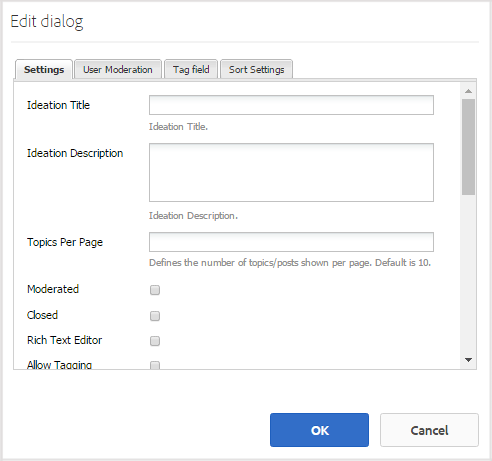

# Ideenfunktion {#ideation-feature}

## Einführung {#introduction}

Die Funktion &quot;Zielversion&quot;bietet einen Bereich für angemeldete Site-Besucher (Community-Mitglieder) in der Umgebung &quot;Veröffentlichen&quot;für:

* Erstellen Sie Ideen, die mit der Community geteilt werden sollen
* Ansicht und Kommentar zu Ideen
* Folgen Sie einer Idee
* Abstimmung über eine Idee

In diesem Abschnitt der Dokumentation wird Folgendes beschrieben:

* Hinzufügen der Suchfunktion zu einer AEM Site
* Konfigurationseinstellungen für die Komponente &quot;Idee&quot;

## Hinzufügen einer Idee zu einer Seite {#adding-a-ideation-to-a-page}

Um einer Seite im Autorenmodus eine `Ideation`-Komponente hinzuzufügen, suchen Sie im Komponentenbrowser nach `Communities / Ideation` und ziehen Sie sie auf eine Seite, auf der die Idee angezeigt werden soll.

Die erforderlichen Informationen finden Sie unter [Komponenten der Communities](basics.md).

Wenn die [erforderlichen clientseitigen Bibliotheken](ideation.md#essentials-for-client-side) einbezogen werden, wird die `Ideation`Komponente wie folgt angezeigt:

## Konfigurieren einer Idee {#configuring-an-ideation}

Wählen Sie die platzierte Komponente `Ideation` aus, auf die zugegriffen werden soll, und wählen Sie das Symbol `Configure` aus, mit dem das Bearbeitungsdialogfeld geöffnet wird.

 

### Registerkarte „Settings“{#settings-tab}

Geben Sie unter der Registerkarte **[!UICONTROL Einstellungen]** die Einstellungen für Ideen und Kommentare an:

* **[!UICONTROL Ideentitel]**
Der Anzeigentitel der Idee. Der Standardwert ist 
`Ideation`.

* **[!UICONTROL Ideenbeschreibung]**
Eine Beschreibung, die als Untertitel für die Idee angezeigt wird. Standard ist keine Beschreibung.

* **[!UICONTROL Themen pro]**
SeiteDefiniert die Anzahl der pro Seite angezeigten Ideen/Beiträge. Der Standardwert ist 10.

* ****
ModeriertWenn diese Option aktiviert ist, muss die Veröffentlichung von Ideen und Kommentaren genehmigt werden, bevor sie auf einer Veröffentlichungssite angezeigt werden. Diese Option ist standardmäßig deaktiviert.

* ****
ClosedWenn aktiviert, wird das Ideationsforum für neue Ideen und Kommentare geschlossen. Diese Option ist standardmäßig deaktiviert.

* **[!UICONTROL Rich Text]**
EditorWenn aktiviert, können Ideen und Kommentare mit Markup eingegeben werden. Diese Option ist standardmäßig deaktiviert.

* **[!UICONTROL Tagging zulassen]** Ist diese Option aktiviert, können Mitglieder ihren Beiträgen Tag-Beschriftungen hinzufügen (siehe Registerkarte **[!UICONTROL Tag-Feld]**). Diese Option ist standardmäßig deaktiviert.

* **[!UICONTROL Datei-]**
Uploads zulassenWenn diese Option aktiviert ist, erlauben Sie, dass Dateianlagen zur Idee oder zum Kommentar hinzugefügt werden. Diese Option ist standardmäßig deaktiviert.

* **[!UICONTROL Max.]**
DateigrößeRelevant nur, wenn 
`Allow File Uploads` aktiviert ist. Mit diesem Feld lässt sich die Größe (in Byte) der hochgeladenen Dateien beschränken. Der Standardwert ist 104857600 (10 MB).

* **[!UICONTROL Zulässige]**
DateitypenRelevant nur, wenn 
`Allow File Uploads` aktiviert ist. Eine kommagetrennte Liste der zulässigen Dateierweiterungen inklusive Punkt. Beispiel: .jpg, .jpeg., png, .doc, .docx, .pdf. Wurden Dateitypen festgelegt, können Dateien nicht angegebenen Typs nicht hochgeladen werden. Die Standardeinstellung ist nicht angegeben, sodass alle Dateitypen zulässig sind.

* **[!UICONTROL Max.]**
Größe der Bilddatei anhängenRelevant nur, wenn &quot;Datei-Uploads zulassen&quot;aktiviert ist. Die maximal zulässige Anzahl von Bytes einer Bilddatei. Der Standardwert ist 2097152 (2 MB).

* **[!UICONTROL Antworten]**
zulassenWenn diese Option aktiviert ist, erlauben Sie Antworten auf Kommentare, die zur Idee gepostet wurden. Diese Option ist standardmäßig deaktiviert.

* **[!UICONTROL Erlauben Sie Benutzern, Kommentare und]**
Themen zu löschenWenn diese Option aktiviert ist, gestatten Sie Mitgliedern, die von ihnen veröffentlichten Kommentare und Ideen zu löschen. Diese Option ist standardmäßig deaktiviert.

* **[!UICONTROL Zulassen von]**
FolgendemWenn aktiviert, fügen Sie die folgende Funktion für Ideenbeiträge hinzu, mit der Mitglieder über neue Beiträge   benachrichtigt werden können. Diese Option ist standardmäßig deaktiviert.

* **[!UICONTROL E-Mail-]**
Abonnements zulassenWenn diese Option aktiviert ist, können Sie zulassen, dass Mitglieder per E-Mail über neue Beiträge informiert werden ([Abonnement](subscriptions.md)). Erfordert die Überprüfung von `Allow Following` und [E-Mail-Konfiguration](email.md). Diese Option ist standardmäßig deaktiviert.

* **[!UICONTROL Zulassen der]**
AbstimmungWenn aktiviert, lassen Sie die Abstimmung über die Kommentare einer Idee zu. Diese Option ist standardmäßig deaktiviert.

* **[!UICONTROL Anzeigen von]**
KennzeichenWenn aktiviert, zeigen Sie verdiente und zugewiesene   Abzeichen mit der Idee eines Mitglieds an. Diese Option ist standardmäßig deaktiviert.

* **[!UICONTROL Zulassen von]**
speziellen Inhalten, kann die Idee als  [speziellen Inhalt](featured.md) identifiziert werden. Diese Option ist standardmäßig deaktiviert.

### Benutzermoderation, Registerkarte {#user-moderation-tab}

Geben Sie auf der Registerkarte **[!UICONTROL Benutzermoderation]** an, wie die veröffentlichten Ideen und Kommentare (vom Benutzer generierte Inhalte) verwaltet werden. Weitere Informationen finden Sie unter [Moderation benutzergenerierter Inhalte](moderate-ugc.md).

* **[!UICONTROL Posts ablehnen]** Ist diese Option aktiviert, können moderierende Mitglieder Beiträge ablehnen und so verhindern, dass diese im Forum veröffentlicht werden. Diese Option ist standardmäßig deaktiviert.

* **[!UICONTROL Themen schließen/erneut öffnen]** Ist diese Option aktiviert, können moderierende Mitglieder Themen für die weitere Bearbeitung oder Kommentare schließen oder bereits geschlossene Themen erneut öffnen. Diese Option ist standardmäßig deaktiviert.

* **[!UICONTROL Posts kennzeichnen]** Ist diese Option aktiviert, können Mitglieder Themen oder Kommentare anderer Mitglieder als unangemessen kennzeichnen. Diese Option ist standardmäßig deaktiviert.

* **[!UICONTROL Liste mit Kennzeichnungsgründen]** Ist diese Option aktiviert, können Mitglieder aus einer Dropdown-Liste den Grund auswählen, aus dem ein Thema oder ein Kommentar als unangemessen gekennzeichnet wird. Diese Option ist standardmäßig deaktiviert.

* **[!UICONTROL Grund für benutzerdefinierte Kennzeichnung]** Ist diese Option aktiviert, können Mitglieder einen eigenen Grund dafür eingeben, warum sie Themen oder Kommentare als unangemessen kennzeichnen möchten. Diese Option ist standardmäßig deaktiviert.

* **[!UICONTROL Schwellenwert für Moderation]** Geben Sie an, wie oft ein Thema oder ein Kommentar von Mitgliedern als unangemessen gekennzeichnet werden muss, bevor Moderatoren benachrichtigt werden. Der Standardwert ist 1 (einmal).

* **[!UICONTROL Kennzeichnungslimit]** Geben Sie an, wie oft ein Thema oder ein Kommentar als unangemessen gekennzeichnet werden muss, bevor es oder er aus dem öffentlichen Bereich ausgeblendet wird. Bei einem Wert von -1 wird das gekennzeichnete Thema oder der gekennzeichnete Kommentar nie ausgeblendet. In allen anderen Fällen muss der Wert größer als der oder gleich dem „Schwellenwert für Moderation“ sein. Der Standardwert ist 5.

### Tag-Feld, Registerkarte {#tag-field-tab}

Auf der Registerkarte **[!UICONTROL Tag-Feld]** wird eingeschränkt, welche Tags je nach ausgewähltem Namespace (falls auf der Registerkarte **[!UICONTROL Einstellungen]** aktiviert) verwendet werden können.

* **[!UICONTROL Zulässige]**
NamespacesRelevant, wenn 
`Allow Tagging` wird unter dem  **** Einstellungsstab überprüft. Die verwendbaren Tags sind auf die ausgewählten Namespace-Kategorien beschränkt. Die Liste der Namensraum umfasst &quot;Standard-Tags&quot;(den standardmäßigen Namensraum) sowie &quot;Alle Tags einschließen&quot;. Standardmäßig ist die Option nicht aktiviert, es sind also alle Namespaces zulässig.

* **[!UICONTROL Empfehlungsgrenze]** Geben Sie die Anzahl der Tags an, die Mitgliedern als Vorschlag angezeigt werden sollen, wenn sie Beiträge im Forum veröffentlichen. Ein Wert von 
**-** 1 bedeutet keine Begrenzung. Der Standardwert ist 0.

### Sortiereinstellungen, Registerkarte {#sort-settings-tab}

Geben Sie unter der Registerkarte **[!UICONTROL Sortiereinstellungen]** an, wie die veröffentlichten Kommentare sortiert werden, wenn sie angezeigt werden.

* **[!UICONTROL Sortieren]**
nachAlle zulässigen Sortierungsauswahlen markieren: 
`Newest, Oldest, Last Updated, Most Viewed, Most Active, Most Followed and Most Liked`. Der Standardwert ist `Newest, Oldest, Last Updated`.

* **[!UICONTROL Legen Sie]**
DefaultPull nach unten fest, um eine der aktivierten Sortieroptionen auszuwählen, die als Standard angezeigt werden soll. Der Standardwert ist 
`Newest`.

* **[!UICONTROL Zeitoptionen für Analytics-]**
SortierungZiehen Sie nach unten, um eine der folgenden Optionen auszuwählen 
`All, Last 24 Hours, Last 7 Days, Last 30 Days`. Der Standardwert ist `All`.

## Site-Besuchererlebnis {#site-visitor-experience}

### Erstellen einer Idee {#creating-idea}

Wie bei allen Community-Funktionen, wenn nicht angemeldet, kann ein Site-Besucher nur Ideen lesen und Ansicht andere Meinungen (durch Kommentare und Abstimmung/Gefällt mir).

Nach der Anmeldung kann ein Mitglied eine neue Idee erstellen.

Bevor Sie die Idee einreichen, kann das Mitglied einen Entwurf speichern.

Durch Auswahl der Schaltfläche `Save as Draft` wird ein Entwurf gespeichert.

Wenn Sie gespeicherte Entwürfe auf der Registerkarte `My Drafts` anzeigen, wählen Sie `Read More` aus, um erneut in den Bearbeitungsmodus zu wechseln:

#### Feedback {#providing-feedback} bereitstellen

Sobald die Idee veröffentlicht ist, können sich andere Mitglieder anmelden, die Idee ( `Read More`) öffnen und die Idee, so hinzufügen, um die Stimmenanzahl, und Kommentare.

### Zusätzliche Informationen {#additional-information}

Weitere Informationen finden Sie auf der Seite [Grundlegende Ideen](ideation.md) für Entwickler.

Informationen zur Moderation von veröffentlichten Themen und Kommentaren finden Sie unter [Moderation benutzergenerierter Inhalte](moderate-ugc.md).

Informationen zum Tagging von veröffentlichten Themen und Kommentaren finden Sie unter [Tagging benutzergenerierter Inhalte](tag-ugc.md).
