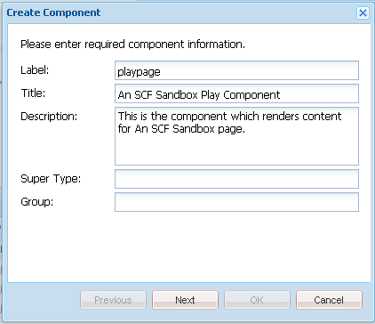

# Erste Sandbox-Anwendung {#initial-sandbox-application}

In diesem Abschnitt erstellen Sie Folgendes:

* Die **[template](#createthepagetemplate)** , die zum Erstellen von Inhaltsseiten in der Beispiel-Website verwendet wird
* Die **[Komponente und Skript](#create-the-template-s-rendering-component)** , die zum Rendern der Website-Seiten verwendet wird

## Erstellen der Inhaltsvorlage {#create-the-content-template}

Eine Vorlage definiert den Standardinhalt einer neuen Seite. Bei komplexen Websites werden ggf. auch mehrere Vorlagen für die Erstellung der verschiedenen Seitentypen der Website verwendet. Darüber hinaus kann der Vorlagensatz zu einem Blueprint werden, der zum Rollout von Änderungen an einem Servercluster verwendet wird.

Bei dieser Übung basieren jedoch alle Seiten auf einer einfachen Vorlage.

1. Im Explorer-Bereich der CRXDE Lite

   * Wählen Sie `/apps/an-scf-sandbox/templates` aus.
   * **[!UICONTROL Erstellen > Vorlage erstellen]**

1. Geben Sie im Dialogfeld „Vorlage erstellen“ die folgenden Werte ein und klicken Sie anschließend auf **[!UICONTROL Weiter]**:

   * Bezeichnung: `playpage`
   * Titel: `An SCF Sandbox Play Template`
   * Beschreibung: `An SCF Sandbox template for play pages`
   * Ressourcentyp: `an-scf-sandbox/components/playpage`
   * Ranking: &lt;leave as=&quot;&quot; default=&quot;&quot;>

   Der Titel wird für den Knotennamen verwendet.

   Der Ressourcentyp wird auf der Seite `playpage`Der Knoten jcr:content der Eigenschaft `sling:resourceType`. Er identifiziert die Komponente (Ressource), die den Inhalt rendert, wenn sie von einem Browser angefordert wird.

   In diesem Fall werden alle Seiten mit der Variablen `playpage`Vorlage wird von der `an-scf-sandbox/components/playpage` -Komponente. Standardmäßig ist der Pfad zur Komponente relativ, sodass Sling zuerst in der `/apps` und, falls nicht gefunden, im `/libs` Ordner.

   

1. Stellen Sie bei Verwendung von &quot;Kopieren/Einfügen&quot;sicher, dass der Wert &quot;Ressourcentyp&quot;keine führenden oder nachfolgenden Leerzeichen aufweist.

   Klicken Sie auf **[!UICONTROL Weiter]**.

1. &quot;Zulässige Pfade&quot;bezieht sich auf die Pfade von Seiten, die diese Vorlage verwenden, sodass die Vorlage für die **[!UICONTROL Neue Seite]** angezeigt.

   Um einen Pfad hinzuzufügen, klicken Sie auf die Schaltfläche mit dem Pluszeichen `+` und Typ `/content(/.&ast;)?` in das angezeigte Textfeld ein. Wenn Sie Kopieren/Einfügen verwenden, stellen Sie sicher, dass keine führenden oder nachfolgenden Leerzeichen vorhanden sind.

   Hinweis: Der Wert der zulässigen Pfadeigenschaft ist ein *regulären Ausdruck.* Inhaltsseiten mit einem Pfad, der dem Ausdruck entspricht, können die Vorlage verwenden. In diesem Fall stimmt der reguläre Ausdruck mit dem Pfad der **/content** Ordner und alle zugehörigen Unterseiten.

   Wenn ein Autor eine Seite unten erstellt `/content`, die `playpage`Vorlage mit dem Titel &quot;Eine SCF-Sandbox-Seitenvorlage&quot;wird in einer Liste der zu verwendenden Vorlagen angezeigt.

   Nachdem die Stammseite aus der Vorlage erstellt wurde, kann der Zugriff auf die Vorlage auf diese Website beschränkt werden, indem die Eigenschaft so geändert wird, dass der Stammpfad in den regulären Ausdruck aufgenommen wird, d. h..

   `/content/an-scf-sandbox(/.&ast;)?`

   

1. Klicken Sie auf **[!UICONTROL Weiter]**.

   Klicken **[!UICONTROL Nächste]** im **[!UICONTROL Zugelassene übergeordnete Elemente]** Bereich.

   Klicken **[!UICONTROL Nächste]** im **[!UICONTROL Zugelassene Kinder]** Bedienfelder.

   Klicken Sie auf **[!UICONTROL OK]**.

1. Wenn Sie auf OK klicken und die Erstellung der Vorlage abgeschlossen haben, werden rote Dreiecke in den Ecken der Registerkarte Eigenschaften für die neue `playpage`Vorlage. Diese roten Dreiecke zeigen Bearbeitungen an, die nicht gespeichert wurden.

   Klicken **[!UICONTROL Alle speichern]** , um die neue Vorlage im Repository zu speichern.

   

### Erstellen der Rendering-Komponente der Vorlage {#create-the-template-s-rendering-component}

Erstellen Sie die *component* definiert den Inhalt und rendert alle Seiten, die basierend auf der [Paketvorlage](#createthepagetemplate).

1. Klicken Sie in CRXDE Lite mit der rechten Maustaste auf **`/apps/an-scf-sandbox/components`** und klicken Sie auf **[!UICONTROL Erstellen > Komponente]**.
1. Durch Festlegen des Knotennamens (Beschriftung) auf *playpage*, lautet der Pfad zur Komponente

   `/apps/an-scf-sandbox/components/playpage`

   , der dem Ressourcentyp der Paketvorlage entspricht (optional abzüglich der ersten **`/apps/`** Teil des Pfads).

   Geben Sie im Dialogfeld **[!UICONTROL Komponente erstellen]** die folgenden Eigenschaftswerte ein:

   * Titel: **playpage**
   * Titel: **Eine SCF-Sandbox-Abspielkomponente**
   * Beschreibung: **Dies ist die Komponente, die Inhalte für eine SCF-Sandbox-Seite rendert.**
   * Super Type: *&lt;leave blank=&quot;&quot;>*
   * Gruppe:

   

1. Klicken **[!UICONTROL Nächste]** bis zum **[!UICONTROL Zugelassene Kinder]** Bereich des Dialogfelds wird angezeigt

   * Klicken Sie auf **[!UICONTROL OK]**
   * Klicken Sie auf **[!UICONTROL Alle speichern]**

1. Überprüfen Sie, ob der Pfad zur Komponente und der resourceType für die Vorlage übereinstimmen.

   >[!CAUTION]
   >
   >Die Korrespondenz zwischen dem Pfad zur PayPage-Komponente und der sling:resourceType-Eigenschaft der PayPal-Vorlage ist für die korrekte Funktionsweise der Website von entscheidender Bedeutung.

   
