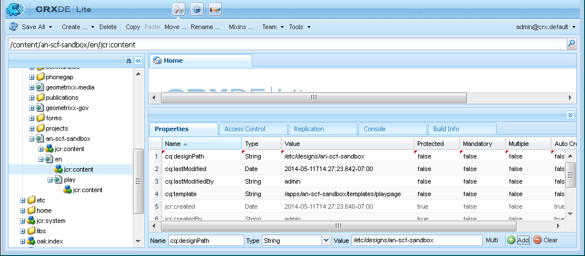

# Anfänglicher Sandbox-Inhalt {#initial-sandbox-content}

In diesem Abschnitt erstellen Sie die folgenden Seiten, die alle die [Seitenvorlage](initial-app.md#createthepagetemplate) verwenden:

* Sandbox-Site von SCF, die zur englischen Version der Hauptseite weiterleitet

   * SCF Sandbox - Die Hauptseite für die englische Version der Site

      * SCF Play - Untergeordnetes Element der Hauptseite, auf der die Wiedergabe erfolgen soll

Obwohl dieses Tutorial keine [Sprachkopien](../../help/sites-administering/tc-prep.md) enthält, wurde es so entwickelt, dass die Stammseite die Erkennung der bevorzugten Sprache für den Benutzer über die HTML-Kopfzeile implementieren und zur entsprechenden Hauptseite für die Sprache weiterleiten kann. Die Konvention besteht darin, den aus zwei Buchstaben bestehenden Ländercode für den Knotennamen der Seite zu verwenden, z. B. &quot;en&quot;für Englisch, &quot;fr&quot;für Französisch usw.

## Erste Seiten erstellen {#create-first-pages}

Da es nun eine [Seitenvorlage](initial-app.md#createthepagetemplate) gibt, können wir die Stammseite der Website im Verzeichnis /content einrichten.

1. Die Standard-Benutzeroberfläche bietet derzeit Blueprints zum Erstellen von Sites. Da in diesem Tutorial eine einfache Site erstellt wird, ist die klassische Benutzeroberfläche nützlich.

   Um zur klassischen Benutzeroberfläche zu wechseln, wählen Sie die globale Navigation aus und bewegen Sie den Mauszeiger über die rechte Seite des Projektsymbols. Wählen Sie das Symbol *Zur klassischen Benutzeroberfläche wechseln* aus, das angezeigt wird:

   

   Die Möglichkeit, zur klassischen Benutzeroberfläche zu wechseln, muss von einem Administrator ](../../help/sites-administering/enable-classic-ui.md) aktiviert werden.[

1. Wählen Sie auf der Begrüßungsseite [Klassische Benutzeroberfläche](http://localhost:4502/welcome.html) **[!UICONTROL Websites]** aus.

   

   Alternativ können Sie direkt auf die klassische Benutzeroberfläche für Websites zugreifen, indem Sie zu [/siteadmin.](http://localhost:4502/siteadmin) navigieren.

1. Wählen Sie im Explorer-Bereich **[!UICONTROL Websites]** und dann in der Symbolleiste **[!UICONTROL Neu > Neue Seite]** aus.

   Geben Sie im Dialogfeld **[!UICONTROL Seite erstellen]** Folgendes ein:

   * Titel: `SCF Sandbox Site`
   * Name: `an-scf-sandbox`
   * Wählen Sie **[!UICONTROL Eine SCF-Sandbox-Abspielvorlage]**
   * Klicken Sie auf **[!UICONTROL Erstellen]**.

   

1. Wählen Sie im Explorer-Bereich die soeben erstellte Seite `/Websites/SCF Sandbox Site` aus und klicken Sie auf **[!UICONTROL Neu > Neue Seite]**:

   * Titel: `SCF Sandbox`
   * Name: `en`
   * Wählen Sie **Eine SCF-Sandbox-Abspielvorlage**
   * Klicken Sie auf **Erstellen**.

1. Wählen Sie im Explorer-Bereich die soeben erstellte Seite `/Websites/SCF Sandbox Site/SCF Sandbox` aus und klicken Sie auf **[!UICONTROL Neu > Neue Seite]**

   * Titel: `SCF Play`
   * Name: `play`
   * Wählen Sie **[!UICONTROL Eine SCF-Sandbox-Abspielvorlage]**
   * Klicken Sie auf **[!UICONTROL Erstellen]**.

1. So wird die Website jetzt in der Websites-Konsole angezeigt. Beachten Sie, dass untergeordnete Seiten des im Explorer-Bereich ausgewählten Elements im rechten Bereich angezeigt werden, wo sie verwaltet werden können.

   

   Dies ist die Repository-Ansicht, die mit dem Website-Tool und der Vorlage erstellt wurde:

   

## Fügen Sie den Designpfad {#add-the-design-path} hinzu.

Wenn ` [/etc/designs/an-scf-sandbox](setup-website.md#setupthedesigntreeetcdesigns)` mit dem Abschnitt &quot;Designs&quot;der Tools-Konsole erstellt wurde, lautet die Eigenschaft &quot;

* `cq:template="/libs/wcm/core/templates/designpage"`

definiert wurde, was die optionale Möglichkeit bietet, mit `currentDesign.getPath()` auf Design-Assets in einem Skript zu verweisen. Beispiel

* &lt;>

   * Name: `cq:designPath`
   * Typ: `String`
   * Wert: `/etc/designs/an-scf-sandbox`

* Klicken Sie auf das grüne `[+] Add`

Das Repository sollte wie folgt aussehen:

* Klicken Sie auf **[!UICONTROL Alle speichern]**

[ Probleme beim Sparen? Melden Sie sich erneut an! ]

>[!NOTE]
>
>Die Verwendung von cq:designPath ist optional und steht nicht in Zusammenhang mit der [Verwendung von clientlibs](develop-app.md#includeclientlibsintemplate), die im Wesentlichen erforderlich sind, da die SCF-Komponenten [clientlibs](client-customize.md#clientlibs-for-scf) verwenden, um ihre JS und CSS zu verwalten.
