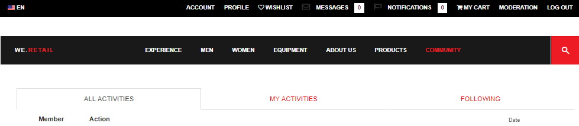
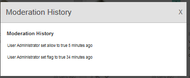

# Moderationskonsole {#moderation-console}

In AEM Communities ist eine Massenmoderation [von Community-Inhalten](moderate-ugc.md) sowohl von Autor- als auch von Veröffentlichungs-Umgebung durch Administratoren und Community-Moderatoren möglich (vertrauenswürdige Community-Mitglieder, die als Moderatoren zugewiesen sind).

Administratoren und Community-Moderatoren können auch [kontextbezogene Moderation](in-context.md) in der Veröffentlichungs-Umgebung durchführen.

Eine Funktion aller [Community-Sites](sites-console.md) ist ein `Administration`Menüelement, das Benutzern zur Verfügung steht, die sich mit Administratorrechten anmelden. Der Link `Administration`ermöglicht den Zugriff auf die Moderationskonsole.

In der Moderationskonsole haben Administratoren und Community-Moderatoren Zugriff auf alle benutzergenerierten Inhalte (UGC), für die sie über die Berechtigung zum Moderieren verfügen. Wenn es zulässig ist, mehrere Sites zu moderieren, können Beiträge auf allen Sites Ansicht oder nach ausgewählten Communities gefiltert werden.

Weitere Informationen finden Sie unter [Verwalten von Benutzern und Benutzergruppen](users.md).

Die Moderationskonsole unterstützt:
* Massenmäßige Moderation von Aufgaben
* UGC-Suche
* Ansicht von UGC-Details
* Ansicht von UGC-Autorendetails

Nur bei der Anmeldung als Administrator oder als Mitglied mit ` [moderator permissions](in-context.md#identifyingtrustedmembers)` können Moderations-Aufgaben durchgeführt werden.

## Zugriff auf die Umgebung veröffentlichen {#publish-environment-access}

Der Zugriff auf die Moderationskonsole von einer veröffentlichten Community-Site erfolgt über einen Link &quot;Administration&quot;, der angezeigt wird, wenn ein Community-Moderator angemeldet ist.

Über den Link &quot;Administration&quot;wird die Moderationskonsole angezeigt:

## Zugriff auf Autorensoftware {#author-environment-access}

In der Umgebung &quot;Autor&quot;zur Moderationskonsole

* Aus globaler Navigation: **[!UICONTROL Navigation > Communities > Moderation]**

Nur bei der Anmeldung als Administrator oder als Mitglied mit ` [moderator permissions](in-context.md#identifyingtrustedmembers)` können Moderations-Aufgaben durchgeführt werden. Der einzige Community-Inhalt, der angezeigt wird, ist der, den das angemeldete Mitglied moderieren darf.

>[!NOTE]
>
>UGC aus der Veröffentlichungs-Umgebung ist nur beim Autor sichtbar, wenn das ausgewählte SRP einen gemeinsamen Store implementiert. Beispielsweise ist die Datenspeicherung standardmäßig JSRP, also kein gemeinsamer Speicher für Autoren und Veröffentlichungen. Weitere Informationen finden Sie unter [Community-Inhaltsspeicher](working-with-srp.md).

## Benutzeroberfläche der Moderationskonsole {#moderation-console-ui}

Abgesehen von der linken Navigationsleiste (die beim Autor, aber nicht bei der Veröffentlichung angezeigt wird) verfügt die Moderations-Benutzeroberfläche über die folgenden Hauptbereiche:

* **[Navigationsleiste oben](#top-navigation-bar)**
* **[Symbolleiste](#toolbar)**
* **[Inhaltsbereich](#content-area)**

### Obere Navigationsleiste {#top-navigation-bar}

Die obere Navigationsleiste ist für alle Konsolen konstant. Weitere Informationen finden Sie unter [Grundlegender Umgang](../../help/sites-authoring/basic-handling.md).

### Symbolleiste {#toolbar}

Die Symbolleiste, die sich unterhalb der oberen Navigationsleiste befindet, bietet den folgenden Umschalter auf der linken Seite:

* [Filter ](moderation.md#filter-rail) railopiert eine Leiste, die eine Auswahl von Eigenschaften zum Filtern des Inhalts ermöglicht.

Die Symbolleiste, die sich unterhalb der oberen Navigationsleiste befindet, bietet den folgenden Umschalter auf der linken Seite:

[Filterschiene](moderation.md#filter-rail)\
Öffnet eine Leiste bei Auswahl der Option &quot;Suchen&quot;, die eine Auswahl von Eigenschaften zum Filtern des Inhalts ermöglicht.

### Inhaltsbereich {#content-area}

Der Inhaltsbereich enthält Informationen für veröffentlichte UGC:

* Die UGC veröffentlicht
* Mitgliedsname
* Mitglied Avatar
* Speicherort des Beitrags
* Zeitpunkt der Veröffentlichung
* Anzahl der Antworten auf den Beitrag
* [Dem Beitrag ](moderate-ugc.md#sentiment) zugeordnete Sentimentwerte
* Bei Genehmigung wird ein Häkchen angezeigt
* Wenn eine Anlage vorhanden ist, wird eine Paperclip angezeigt

>[!NOTE]
>
>Der Inhaltsbereich verfügt über einen *unendlichen Bildlauf*, sodass Sie mit dem Bildlauf fortfahren können, bis das Ende des Inhalts erreicht ist. Die Symbolleiste bleibt auch beim Scrollen in einer festen, sichtbaren Position über dem Inhaltsbereich.

### Filterleiste {#filter-rail}

Das Seitensymbol öffnet die Filterleiste. Die Filterleiste, die links neben dem Inhaltsbereich angezeigt wird, bietet verschiedene Filter, von denen jede unmittelbar auf das referenzierte UGC im Inhaltsbereich wirkt.

Die Filter in jeder Kategorie sind **OR** zusammen und die Filter in verschiedenen Kategorien sind **AND** zusammen.

Wenn Sie z. B. sowohl **Frage** als auch **Antwort** aktivieren, wird Inhalt angezeigt, der entweder eine **Frage** *oder* und **Antwort** lautet.

Wenn Sie jedoch **Frage** und **Ausstehend** aktivieren, wird nur Inhalt angezeigt, der eine **Frage** ist und **Ausstehend** lautet.

>[!NOTE]
>
>Community-Moderatoren können die vordefinierten Filter in der Benutzeroberfläche der Moderationskonsole mit einem Lesezeichen versehen. Da diese Filter an das Ende der URL angehängt werden (als Zeichenfolgenparameter für Abfragen), können Moderatoren später zu den mit Lesezeichen versehenen Filtern zurückkehren und diese Links auch freigeben.

Wenn die Filterleiste geöffnet ist, wird das Seitenbedienfeld durch das Symbol &quot;Suchen&quot;geschlossen. Um die Filterleiste zu schließen und nur den vom Benutzer erstellten Inhalt Ansicht, klicken Sie auf das Suchsymbol und wählen Sie die Option &quot;Nur Inhalt&quot;.

#### Inhalts-Pfad {#content-path}

Der Inhaltspfad beschränkt die Anzeige des Referenz-UGC auf die im angegebenen Inhalts-Repository abgelegten Beiträge.

#### Textsuche {#text-search}

Die Textsuche beschränkt die angezeigte UGC auf Beiträge, die den eingegebenen Text enthalten.

#### Website {#site}

Site beschränkt die referenzierte UGC auf Beiträge auf ausgewählte Community-Sites. Wenn keine Sites markiert sind, werden alle Verweise auf UGC angezeigt.

>[!NOTE]
>
>Wenn ein Administrator auf die Massen-Moderationskonsole zugreift, werden alle Verweise auf UGC angezeigt, einschließlich Sites, die nicht mit dem [Site-Erstellungsassistenten](sites-console.md) erstellt wurden, wie z. B. die Geometrixx.
>
>Wenn ein Mitglied einer vertrauenswürdigen Community auf die Massenmoderationskonsole zugreift, werden nur Verweise auf UGC angezeigt, die für Community-Sites erstellt wurden, die das Mitglied moderieren darf, und können mit dem Site-Filter gefiltert werden.

#### Inhaltstyp {#content-type}

Content Type beschränkt die referenzierte UGC auf Beiträge des ausgewählten Ressourcentyps. Es können ein oder mehrere der folgenden Typen ausgewählt werden. Alle Typen werden angezeigt, wenn keine ausgewählt ist.

* **Kommentar**
* **Forumthema**
* **Forumsantwort**
* **Frage**
* **Antwort**
* **Blog-Artikel**
* **Blog-Kommentar**
* **Kalenderereignis**
* **Kalenderkommentar**
* **Ordner in Dateibibliothek**
* **Dokument in Dateibibliothek**
* **Idee**
* **Ideen-Kommentar**

#### Zusätzliche Inhaltstypen {#additional-content-types}

So fügen Sie zusätzliche Ressourcen zum Filtern hinzu:

* Auf der Authoring-Instanz
* Anmelden als Administrator
* Öffnen Sie [Web-Konsole](http://localhost:4502/system/console/configMgr)
* Suchen Sie nach `AEM Communities Moderation Dashboard Filters`
* Wählen Sie die Konfiguration aus, die im Bearbeitungsmodus geöffnet werden soll
* Geben Sie den ResourceType einer Komponente ein, nach der gefiltert werden soll
   * Geben Sie zum Beispiel Folgendes ein, um nach eingeschlossenen Abstimmungskomponenten zu filtern:\
      `Voting=social/tally/components/hbs/voting`

* Wählen Sie Speichern aus
* Communities - Moderationskonsole aktualisieren

Das Ergebnis ist ein neuer auswählbarer Filter für `Voting`unter der Filtergruppe `Content Type`.

Wenn dieser Filter ausgewählt ist, zeigt der Inhalt des Dashboards UGC an, das mit einem der eingegebenen ResourceTypes übereinstimmt.

#### Status{#status}

Der Status beschränkt die referenzierte UGC auf Beiträge mit dem ausgewählten Status, bei denen es sich um einen oder mehrere Beiträge mit dem Status Ausstehend, Genehmigt, Verweigert oder Schließen sowie Entwurf oder Geplant für Blog-Artikel und Beantwortet oder Nicht beantwortet für Fragen zur Servicequalitätsprüfung handeln kann. Wenn keine ausgewählt ist, werden alle angezeigt.

>[!NOTE]
>
>Wenn nur der Status &quot;Nicht beantwortet&quot;ausgewählt ist, wird dem Moderator der gesamte Inhalt (für alle Inhaltstypen) mit Ausnahme der beantworteten Fragen angezeigt. Dies liegt daran, dass die Eigenschaft, die für die Antwort Frage verantwortlich ist, bei nicht beantworteten Fragen und anderen Inhalten wie Forenthema, Blog-Artikel oder Kommentaren nicht vorhanden ist.

#### Kennzeichnung {#flagging}

Durch die Kennzeichnung wird die Anzeige des referenzierten UGC auf Beiträge beschränkt, die markiert oder ausgeblendet sind.

Sobald ein Inhaltselement markiert ist, bleibt es gekennzeichnet, bis Sie die Markierung für dieses Inhaltselement aufheben, indem Sie die Schaltfläche **[!UICONTROL Flag]** erneut markieren. Beachten Sie, dass es keine Kennzeichnungsebenen gibt, wie z. B. wichtig oder nachfolgende.

#### Mitglieder {#members}

Mitglieder beschränken die referenzierte UGC, die für UGC angezeigt wird, gepostet durch den angegebenen Mitgliedsnamen.

#### Veröffentlichungszeitraum {#posted-in-the-last}

&quot;Gepostet in der letzten&quot;beschränkt die referenzierte Benutzerkontensteuerung auf Beiträge, die in der letzten Stunde, dem letzten Tag, der letzten Woche, dem letzten Monat oder dem letzten Jahr erstellt wurden.

#### Empfindung {#sentiment}

[Sentimenteinschränkung ](moderate-ugc.md#sentiment) beschränkt die referenzierte UGC auf Beiträge mit einem Sentimentwert, der entweder positiv, negativ oder neutral ist.

## Moderationsaktionen {#moderation-actions}

[Moderationsaktionen ](moderate-ugc.md#moderation-actions) können für eine oder mehrere Auswahlen im Inhaltsbereich oder beim Anzeigen von Inhaltsdetails durchgeführt werden.

Wenn Sie die Beiträge stapelweise moderieren möchten, klicken Sie im Inhaltsbereich auf das Symbol Auswählen ( ) in einem Beitrag, das angezeigt wird, wenn Sie den Mauszeiger (Desktop) darüber bewegen oder indem Sie mit dem Finger auf den Beitrag drücken (Mobil). Auf diese Weise können Sie den Mehrfachauswahlmodus aufrufen und die nachfolgenden Beiträge auswählen, die per Mausklick gepostet werden sollen. Verwenden Sie die in der Symbolleiste angezeigten Schaltflächen, um Moderationsaktionen an den ausgewählten Beiträgen durchzuführen. Alle Aktionen werden zur Bestätigung aufgefordert.

Um einen einzelnen Beitrag im Inhaltsbereich zu moderieren, halten Sie den Mauszeiger über ihn (Desktop) oder drücken Sie die Eingabetaste und halten Sie den Finger auf dem Beitrag (Mobil), sodass Schaltflächen auf dem Beitrag angezeigt werden. Wenn Sie mit einem einzigen Inhaltsdetail arbeiten, wird nur eine Löschaktion zur Bestätigung aufgefordert.

### Moderieren mehrerer Beiträge {#moderating-multiple-posts}

Geben Sie den Massenauswahlmodus ein, indem Sie auf das Symbol `Select` für einen Beitrag klicken:

Um den Massenauswahlmodus zu beenden, wählen Sie in der Symbolleiste das Symbol zum Abbrechen (x) aus:

Folgende Moderationsaktionen können an mehreren Beiträgen durchgeführt werden:

* Ablehnen
* Löschen
* Beiträge schließen/erneut öffnen

Die Symbole für diese Aktionen werden nur dann in der Symbolleiste angezeigt, wenn mehrere Beiträge ausgewählt sind.

### Moderieren eines einzelnen Beitrags {#moderating-a-single-post}

In einem Auswahlmodus ist es möglich,

* Ansicht der Benutzerdetails durch Auswahl des Benutzernamens
* Ansicht des Beitrags im Kontext durch Auswahl des Links zum Beitrag
* [Antwort](#reply)
* [Gastzugang](#allow)
* [Ablehnen](#deny)
* [Löschen](#delete)
* [Schließen](#close)
* Ansicht [Moderationsverlauf](#moderation-history)
* [Details anzeigen](#viewdetails)

Auf der Ansicht der Karte über den Symbolen für Moderationsaktionen befindet sich der Beitragstext, und unten stehen die Daten, die auf

* Wenn Antworten vorliegen, und wenn ja, vor der Anzahl der Antworten
* Wenn gekennzeichnet wurde
* Wurde genehmigt
* Zeitpunkt der Veröffentlichung des UGC

#### Antwort {#reply}

Wenn Sie mit einem einzelnen Beitrag arbeiten, wird ein Symbol zum Antworten angezeigt, wenn der UGC-Typ Antworten unterstützt und so konfiguriert ist, dass Antworten zulässig sind.

#### Gastzugang {#allow}

Wenn Sie mit einem einzelnen Beitrag arbeiten, wird das Symbol Zulassen angezeigt, wenn der Beitrag markiert oder verweigert wurde. Wenn die Option &quot;Zulassen&quot;markiert ist, werden alle Flags gelöscht.

#### Ablehnen {#deny}

Die Moderationsaktion **Ablehnen** steht nur für moderierte Inhalte zur Verfügung und wird nur im Mehrfachauswahlmodus auf nicht moderierten Inhalten angezeigt.

Nicht moderierte Inhalte werden immer genehmigt.

Moderierte Inhalte werden zunächst in den Status &quot;Ausstehend&quot;versetzt und können später geändert werden, um genehmigt oder verweigert zu werden.

Inhalt, der den Status &quot;Ausstehend&quot;verlässt, kann nie in den Status &quot;Ausstehend&quot;zurückkehren. Inhalte, die als genehmigt oder verweigert markiert sind, können jederzeit in einen anderen Status geändert werden.

#### Löschen {#delete}

In einem Auswahl- oder Massenmodus können Sie Elemente auswählen und löschen. Die Löschaktion führt zu einem Bestätigungsdialogfeld. Nach dem Löschen verschwinden diese Elemente sofort aus dem Inhaltsbereich. **Sobald UGC gelöscht wurde, wird es dauerhaft aus dem Repository entfernt und kann später nicht mehr abgerufen werden.**

#### Schließen {#close}

Beim Arbeiten mit einem einzelnen Beitrag wird ein Schließen-Symbol angezeigt, wenn der UGC-Typ die Möglichkeit unterstützt, weitere Beiträge für diese Ressource zu verhindern.

#### Moderationsverlauf {#moderation-history}

Wenn Sie mit einem einzelnen Beitrag arbeiten, wird ein Symbol für den Moderationsverlauf angezeigt, wenn Sie den Mauszeiger darüber halten. Wenn Sie das Symbol auswählen, wird ein Fenster mit einem Verlauf der Aktionen angezeigt, die in Bezug auf den UGC-Beitrag durchgeführt wurden.

Um zur Inhaltsbereichsanzeige mehrerer UGC-Beiträge zurückzukehren, wählen Sie das X oben rechts im Detailbereich &quot;Ansicht&quot;aus.

Beispiel:

#### Details anzeigen {#view-detail}

Wenn Sie mit einem einzelnen Beitrag arbeiten, können Sie weitere Details anzeigen, indem Sie das UGC im Detailmodus öffnen.

Bewegen Sie dazu den Mauszeiger über den Beitrag, um das Symbol `View Detail` anzuzeigen, und wählen Sie es aus, um ein Fenster mit weiteren Details zum Beitrag anzuzeigen.

Um zur Inhaltsbereichsanzeige mehrerer UGC-Beiträge zurückzukehren, wählen Sie das X oben rechts im Detailbereich &quot;Ansicht&quot;aus.

Beispiel:

