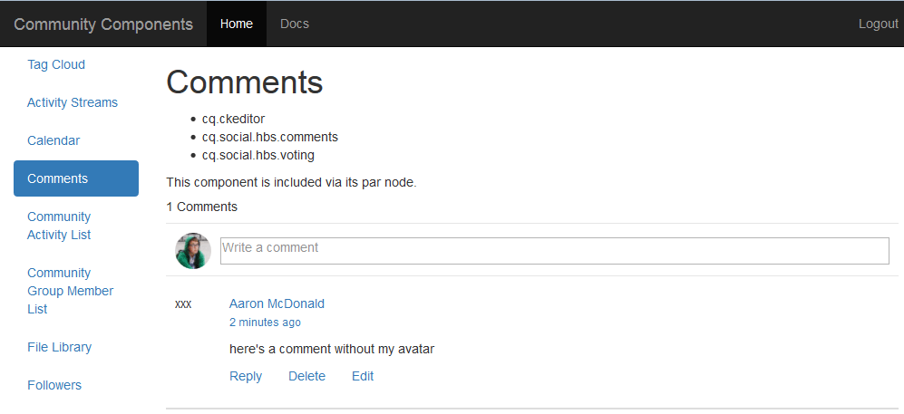

# Erscheinungsbild ändern {#alter-the-appearance}

## Skript ändern {#modify-the-script}

Das Skript &quot;comment.hbs&quot;ist für die Erstellung des gesamten HTML für jeden Kommentar zuständig.

So zeigen Sie den Avatar nicht neben jedem veröffentlichten Kommentar an:

1. Kopieren `comment.hbs`von `libs`nach `apps`
   1. Wählen Sie nun eine der folgenden Optionen aus `/libs/social/commons/components/hbs/comments/comment/comment.hbs`
   1. Auswahl **[!UICONTROL kopieren]**
   1. Wählen Sie nun eine der folgenden Optionen aus `/apps/social/commons/components/hbs/comments/comment`
   1. Einfügen **[!UICONTROL auswählen]**
1. Öffnen Sie die Überlagerung `comment.hbs`
   * Doppelklicken Sie auf Knoten `comment.hbs`in `/apps/social/commons/components/hbs/comments/comment folder`
1. Suchen Sie die folgenden Zeilen und löschen oder kommentieren Sie sie aus:

```xml
<aside class="scf-comment-author">
        </img>
```

Löschen Sie die Zeilen oder umschließen Sie sie mit &#39;&lt;!—&#39; und &#39;—>&#39;, um sie zu kommentieren. Außerdem werden die Zeichen &quot;xxx&quot;als visueller Indikator hinzugefügt, wo der Avatar gewesen wäre.

```xml
<!-- do not display avatar with comment
    <aside class="scf-comment-author">
        </img>
```

## Overlay replizieren {#replicate-the-overlay}

Schieben Sie die überlagerte Kommentarkomponente mithilfe des Replikationswerkzeugs an die Veröffentlichungsinstanz.

>[!NOTE]
>
>Eine stabilere Form der Replikation wäre, ein Paket im Package Manager zu erstellen und es zu [aktivieren](../../help/sites-administering/package-manager.md#replicating-packages) . Ein Paket kann exportiert und archiviert werden.

Wählen Sie in der globalen Navigation &quot; **[!UICONTROL Werkzeuge&quot;> &quot;Bereitstellung&quot;> &quot;Replikation]** &quot;und **[!UICONTROL aktivieren Sie anschließend die Struktur]**.

Geben Sie als Startpfad ein `/apps/social/commons` und wählen Sie **[!UICONTROL Aktivieren]**.


## Ergebnisse anzeigen {#view-results}

Wenn Sie sich als Administrator bei der Veröffentlichungsinstanz anmelden, z. B. http://localhost:4503/crx/de als Administrator/Administrator, können Sie überprüfen, ob die überlagerten Komponenten vorhanden sind.

Wenn Sie sich abmelden, sich erneut anmelden `aaron.mcdonald@mailinator.com/password` und die Seite aktualisieren, werden Sie feststellen, dass der gepostete Kommentar nicht mehr mit einem Avatar angezeigt wird, sondern eine einfache &quot;xxx&quot;.



