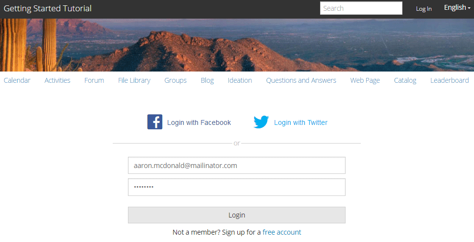

# Erleben Sie die veröffentlichte Site {#experience-the-published-site}

## Zu neuer Site bei Veröffentlichung suchen {#browse-to-new-site-on-publish}

Nachdem die neu erstellte Communities-Site veröffentlicht wurde, navigieren Sie zur URL, die beim Erstellen der Site angezeigt wird, jedoch auf dem Veröffentlichungsserver, z.

* Autor-URL = http://localhost:4502/content/sites/engage/en.html
* Veröffentlichungs-URL = http://localhost:4503/content/sites/engage/en.html

Um Verwirrung darüber zu vermeiden, welches Mitglied bei Autor und Veröffentlichung angemeldet ist, wird empfohlen, für jede Instanz verschiedene Browser zu verwenden.

Bei der ersten Ankunft auf der veröffentlichten Site wäre der Site-Besucher normalerweise nicht bereits angemeldet und anonym.

## http://localhost:4503/content/sites/engage/en.html {#http-localhost-content-sites-engage-en-html}

## Anonymer Site-Besucher {#anonymous-site-visitor}

In der Benutzeroberfläche sieht ein anonymer Site-Besucher Folgendes:

* Titel der Site. Erste Schritte-Lernprogramm
* Kein Profil-Link
* Keine Nachrichten-Verknüpfung
* Kein Benachrichtigungslink
* Suchfeld
* Link anmelden
* Das Markenbanner
* Menüverknüpfungen für die in der Referenz-Site-Vorlage enthaltenen Komponenten

Wenn Sie verschiedene Links auswählen, befinden Sie sich im schreibgeschützten Modus.

## Anonymen Zugriff auf JCR {#prevent-anonymous-access-on-jcr} verhindern

Durch eine bekannte Einschränkung wird der Inhalt der Community-Site anonymen Besuchern über jcr-Inhalte und json zugänglich gemacht, obwohl **Anonymen Zugriff zulassen** für den Site-Inhalt deaktiviert ist. Dieses Verhalten kann jedoch mithilfe von Sling-Beschränkungen als Behelfslösung gesteuert werden.

Gehen Sie wie folgt vor, um den Inhalt Ihrer Community-Site vor dem Zugriff durch anonyme Benutzer durch jcr-Inhalte und json zu schützen:

1. Wechseln Sie in der AEM-Autoreninstanz zu https://&lt;Host>:&lt;Port>/editor.html/content/site/&lt;sitename>.html.

   >[!NOTE]
   >
   >Gehen Sie nicht zur lokalisierten Site.

1. Gehen Sie zu **[!UICONTROL Seiteneigenschaften]**.

   

1. Navigieren Sie zur Registerkarte **[!UICONTROL Erweitert]**.

   

1. Aktivieren Sie **[!UICONTROL Authentifizierungsanforderung]**.
1. hinzufügen den Pfad der Anmeldeseite. Beispiel: `/content/......./GetStarted`.
1. Veröffentlichen Sie die Seite.

## Vertrauenswürdiges Community-Mitglied {#trusted-community-member}

Dieses Erlebnis setzt voraus, dass Aaron McDonald](tutorials.md#demo-users) die Rollen von [Community Manager und Moderator](create-site.md#roles) zugewiesen wurden. [ Andernfalls kehren Sie zur Autorendatei zurück, um die Site-Einstellungen zu ändern. Wählen Sie dann Aaron McDonald als Community Manager und Moderator aus.

Wählen Sie in der oberen rechten Ecke `Log in` und melden Sie sich mit dem Benutzernamen &quot;aaron.mcdonald@mailinator.com&quot;und dem Kennwort &quot;password&quot;an. Beachten Sie die Möglichkeit, sich mit Twitter- oder Facebook-Anmeldedaten anzumelden.

Nach der Anmeldung gibt es einen neuen Menüpunkt `Administration`, der angezeigt wird, weil dem Mitglied die Rolle Moderator zugewiesen wurde. Die Auswahl verschiedener Links ist jetzt interessanter.

Beachten Sie, dass die Kalenderseite die Startseite ist, da die gewählte Referenz-Site-Vorlage zuerst die Kalenderfunktion enthielt, gefolgt von der Aktivität-Stream-Funktion, der Forumsfunktion usw. Diese Struktur ist in der Konsole [Site-Vorlage](sites.md#edit-site-template) oder beim Ändern der Site-Eigenschaften in der Authoring-Umgebung sichtbar:

>[!NOTE]
>
>Weitere Informationen zu Communities-Komponenten und -Funktionen finden Sie unter
>
>* [Communities-Komponenten](author-communities.md)  (für Autoren)
>* [Komponenten-, Funktionen- und Funktionsgrundlagen](essentials.md)  (für Entwickler)

>

## Forum-Link {#forum-link}

Ansicht der Basisforumsfunktion durch Auswahl des Forumslinks.

Mitglieder können ein neues Thema posten oder einem Thema folgen.

Site-Besucher können Beiträge auf verschiedene Weise Ansicht leisten und sortieren.

## Gruppen-Link {#groups-link}

Da Aaron ein Gruppenadministrator ist, kann Aaron durch Auswahl des Links Gruppen eine neue Community-Gruppe erstellen, indem es eine Gruppenvorlage, ein Bild, ob die Gruppe offen oder geheim ist, und einladende Mitglieder auswählt.

Dies ist ein Beispiel, bei dem eine Gruppe in der Umgebung zum Veröffentlichen erstellt wird.

Gruppen können auch in der Autorenkonsole erstellt und innerhalb der Community-Site in der Autorenkonsole verwaltet werden (die [Community-Gruppenkonsole](groups.md)). Das Erlebnis [Erstellen von Gruppen unter author](nested-groups.md) wird als Nächstes in dieser Übung angezeigt.

Erstellen einer Referenzgruppe:

1. Wählen Sie **[!UICONTROL Neue Gruppe]**
1. **[!UICONTROL Registerkarte „Settings“]**
   * Gruppenname: `Sports`
   * Beschreibung: `A parent group for various sporting groups`
   * Gruppen-URL-Name: `sports`
   * select `Open Group` (Erlauben Sie allen Community-Mitgliedern die Teilnahme durch Beitritt)
1. **[!UICONTROL Registerkarte &quot;Vorlage&quot;]**
   * Wählen Sie `Reference Group` (enthält eine Gruppenfunktion in ihrer Struktur, um verschachtelte Gruppen zuzulassen)
1. Wählen Sie **[!UICONTROL Gruppe erstellen]**

Nachdem eine neue Gruppe erstellt wurde, wählen Sie **die neue Sportgruppe** aus, um zwei Gruppen (verschachtelt) darin zu erstellen. Da eine Site-Struktur nicht mit der Funktion &quot;Gruppen&quot;beginnen kann, muss nach dem Öffnen der Gruppe &quot;Sport&quot;der Link &quot;Gruppen&quot;ausgewählt werden:

Der zweite Satz von Links, beginnend mit `Blog`, gehört zur aktuell ausgewählten Gruppe, der `Sports`Gruppe. Durch Auswahl des Links &quot;Sport&quot; `Groups` können zwei Gruppen innerhalb der Gruppe &quot;Sport&quot;verschachtelt werden.

Fügen Sie als Beispiel zwei n `ew groups.` hinzu

* Einen Namen mit dem Namen `Baseball`
   * Lassen Sie sie als `Open Group` eingestellt (erforderliche Mitgliedschaft)
   * Wählen Sie auf der Registerkarte &quot;Vorlagen&quot;die Option `Conversational Group`
* Einen Namen mit dem Namen `Gymnastics`
   * Ändern Sie die Einstellung in `Member Only Group` (eingeschränkte Mitgliedschaft)
   * Wählen Sie auf der Registerkarte &quot;Vorlagen&quot;die Option `Conversational Group`

**Hinweis**:

* Eine Aktualisierung der Seite kann erforderlich sein, bevor beide Gruppen angezeigt werden
* Diese Vorlage enthält *nicht *die Funktion groups, sodass keine weitere Verschachtelung von Gruppen möglich ist
* Beim Autor bietet die [Gruppenkonsole](groups.md) eine dritte Auswahl - eine `Public Group` (optionale Mitgliedschaft)

Nachdem beide Gruppen erstellt wurden, wählen Sie die Baseball-Gruppe, eine offene Gruppe, und beachten Sie die Links: `Discussions` `What's New` `Members`
Die Links der Gruppe werden unterhalb der Links der Haupt-Site angezeigt und führen zur folgenden Anzeige:

Unter &quot;Autor - mit Administratorrechten&quot;navigieren Sie zur Konsole [Communities Gruppen](members.md) und fügen Sie Weston McCall der Gruppe `Community Engage Gymnastics <uid> Members` hinzu.

Melden Sie sich bei der Veröffentlichung als Aaron McDonald an und Ansicht der Gruppen in der Gruppe &quot;Sport&quot;als anonymer Site-Besucher:

* Von Startseite
* Link `Groups`auswählen
* Link `Sports`auswählen
* Wählen Sie den Link &quot;Sport&quot; `Groups`aus.

Nur die Baseballgruppe wird angezeigt.

Melden Sie sich als Weston McCall (weston.mccall@dodgit.com / Kennwort) an und navigieren Sie zum gleichen Speicherort. Beachten Sie, dass Weston in der Lage ist, `Join` die offene `Baseball` Gruppe und entweder `enter or Leave` die private `Gymnastics`Gruppe zu verwenden.

## Webseitenlink {#web-page-link}

Ansicht der grundlegenden Webseite, die in der Site enthalten ist, durch Auswahl des Links &quot;Webseite&quot;. Die standardmäßigen AEM Authoring-Werkzeuge können verwendet werden, um dieser Umgebung Inhalte hinzuzufügen.

Gehen Sie beispielsweise zur Instanz **author**, öffnen Sie den Ordner `engage` in der Konsole [Communities Sites](sites-console.md) und klicken Sie auf das Symbol **Site öffnen**, um in den Bearbeitungsmodus für Autoren zu wechseln. Wählen Sie dann den Vorschau-Modus aus, um den Link `Web Page`auszuwählen, und wählen Sie dann den Bearbeitungsmodus, um die Titel- und Textkomponenten hinzuzufügen. Als letztes veröffentlichen Sie entweder nur die Seite oder die gesamte Site erneut.

## Administrationslink {#administration-link}

Wenn das Community-Mitglied über Moderationsberechtigungen verfügt, wird der Link &quot;Administration&quot;angezeigt. Wenn Sie ihn auswählen, wird der gepostete Community-Inhalt angezeigt und es ist [moderiert](moderate-ugc.md) auf eine ähnliche Weise wie die [Moderationskonsole](moderation.md) in der Authoring-Umgebung zulässig.

Verwenden Sie die Zurück-Schaltfläche des Browsers, um zur veröffentlichten Site zurückzukehren. Die meisten Konsolen sind in der Umgebung &quot;Veröffentlichen&quot;nicht über die globale Navigation zugänglich.

## Selbstregistrierung {#self-registration}

Nach dem Abmelden ist es möglich, eine neue Benutzerregistrierung zu erstellen.

* Wählen Sie nun eine der folgenden Optionen aus `Log In`
* Wählen Sie nun eine der folgenden Optionen aus `Sign up for a new account`

 

Standardmäßig ist die E-Mail-Adresse die Anmelde-ID. Wenn diese Option deaktiviert ist, kann der Besucher seine eigene Anmelde-ID (Benutzername) eingeben. Der Benutzername muss in der Umgebung zum Veröffentlichen eindeutig sein.

Nachdem Sie den Benutzernamen, die E-Mail-Adresse und das Kennwort angegeben haben, können Sie den Benutzer durch Auswahl von `Sign Up`erstellen und signieren.

Nach dem Anmelden ist die erste angezeigte Seite ihre `Profile`Seite, die sie personalisieren können.

Wenn das Mitglied seine Anmelde-ID vergisst, ist es möglich, wiederherzustellen, wenn ihre E-Mail-Adresse verwendet wird.

