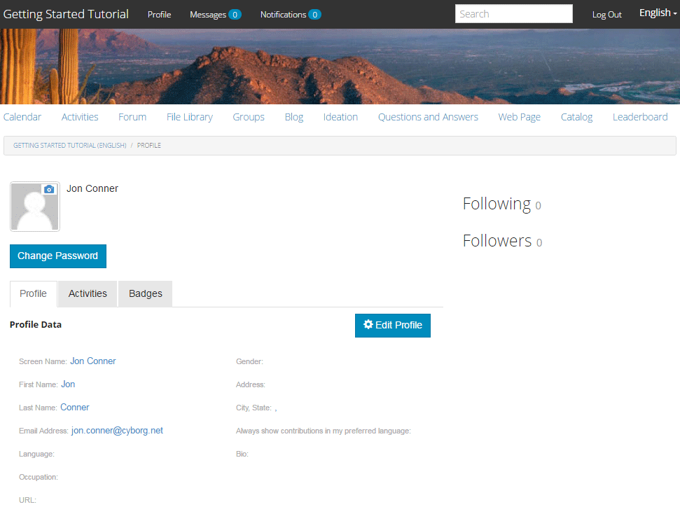

# Erlebnis der veröffentlichten Site {#experience-the-published-site}

>[!CAUTION]
>
>AEM 6.4 hat das Ende der erweiterten Unterstützung erreicht und diese Dokumentation wird nicht mehr aktualisiert. Weitere Informationen finden Sie in unserer [technische Unterstützung](https://helpx.adobe.com/de/support/programs/eol-matrix.html). Unterstützte Versionen suchen [here](https://experienceleague.adobe.com/docs/?lang=de).

## Navigieren zur neuen Site bei der Veröffentlichung {#browse-to-new-site-on-publish}

Nachdem die neu erstellte Communities-Site veröffentlicht wurde, navigieren Sie zur URL, die beim Erstellen der Site angezeigt wird, aber auf dem Veröffentlichungsserver, z. B.

* Autoren-URL = http://localhost:4502/content/sites/engage/en.html
* Veröffentlichungs-URL = http://localhost:4503/content/sites/engage/en.html

Um Verwirrungen zu vermeiden, welches Mitglied bei der Autoren- und Veröffentlichungsinstanz angemeldet ist, wird empfohlen, für jede Instanz unterschiedliche Browser zu verwenden.

Bei der ersten Ankunft auf der veröffentlichten Site wäre der Site-Besucher in der Regel nicht bereits angemeldet und anonym.

## http://localhost:4503/content/sites/engage/en.html {#http-localhost-content-sites-engage-en-html}

## Anonymer Site-Besucher {#anonymous-site-visitor}

Einem anonymen Site-Besucher wird in der Benutzeroberfläche Folgendes angezeigt:

* Titel der Site. Tutorial zu den ersten Schritten
* Kein Profillink
* Keine Nachrichtenverbindung
* Kein Benachrichtigungslink
* Suchfeld
* Anmelde-Link
* Das Markenbanner
* Menülinks für die Komponenten, die in der Referenz-Site-Vorlage enthalten sind

Wenn Sie verschiedene Links auswählen, befinden sie sich im schreibgeschützten Modus.

## Verhindern des anonymen Zugriffs auf JCR {#prevent-anonymous-access-on-jcr}

Bei einer bekannten Einschränkung wird der Community-Site-Inhalt anonymen Besuchern über jcr-Inhalte und json bereitgestellt, obwohl **Anonymen Zugriff zulassen** für den Inhalt der Site deaktiviert ist. Dieses Verhalten kann jedoch mithilfe von Sling-Einschränkungen als Problemumgehung gesteuert werden.

Gehen Sie wie folgt vor, um den Inhalt Ihrer Community-Site vor dem Zugriff anonymer Benutzer durch jcr-Inhalte und JSON zu schützen:

1. Wechseln Sie in der AEM-Autoreninstanz zu https://&lt;host>:&lt;port>/editor.html/content/site/&lt;sitename>.html.

   >[!NOTE]
   >
   >Gehen Sie nicht zur lokalisierten Site.

1. Navigieren Sie zu **[!UICONTROL Seiteneigenschaften]**.

   

1. Navigieren Sie zur Registerkarte **[!UICONTROL Erweitert]**.

   

1. Aktivieren **[!UICONTROL Authentifizierungspflicht]**.
1. Fügen Sie den Pfad der Anmeldeseite hinzu. Beispiel: `/content/......./GetStarted`.
1. Veröffentlichen Sie die Seite.

## Vertrauenswürdiger Community-Mitglied {#trusted-community-member}

Dieses Erlebnis setzt voraus [Aaron McDonald](tutorials.md#demo-users) den Rollen von [Community-Manager und -Moderator](create-site.md#roles). Wenn nicht, kehren Sie zur Autorenumgebung zurück zu [Ändern der Site-Einstellungen](sites-console.md#modifying-site-properties) und wählen Sie Aaron McDonald als Community Manager und Moderator aus.

Wählen Sie oben rechts `Log in`und melden Sie sich mit dem Benutzernamen &quot;aaron.mcdonald@mailinator.com&quot; und dem Kennwort &quot;password&quot; an. Beachten Sie die Möglichkeit, sich mit Twitter- oder Facebook-Anmeldeinformationen anzumelden.

Nach der Anmeldung erscheint ein neues Menüelement. `Administration`, der angezeigt wird, weil dem Mitglied die Rolle Moderator zugewiesen wurde. Die Auswahl verschiedener Links ist interessanter.

Beachten Sie, dass die Kalenderseite die Startseite ist, da die ausgewählte Referenz-Site-Vorlage zuerst die Kalenderfunktion, gefolgt von der Aktivitäts-Stream-Funktion, der Forumsfunktion usw. enthält. Diese Struktur ist in der [Site-Vorlage](sites.md#edit-site-template) -Konsole oder beim Ändern der Site-Eigenschaften in der Autorenumgebung:

>[!NOTE]
>
>Weitere Informationen zu Communities-Komponenten und -Funktionen finden Sie unter
>
>* [Communities-Komponenten](author-communities.md) (für Autoren)
>* [Komponenten-, Funktionen- und Funktionsgrundlagen](essentials.md) (für Entwickler)
>

## Forum-Link {#forum-link}

Klicken Sie auf den Link Forum , um die grundlegende Forumsfunktion anzuzeigen.

Mitglieder können ein neues Thema posten oder einem Thema folgen.

Besucher der Site können Beiträge auf verschiedene Weise anzeigen und sortieren.

## Gruppenlink {#groups-link}

Da Aaron ein Gruppenadministrator ist, kann Aaron mithilfe des Gruppenlinks eine neue Community-Gruppe erstellen, indem es eine Gruppenvorlage und ein Bild auswählt, ob die Gruppe offen oder geheim ist, und Mitglieder einlädt.

Dies ist ein Beispiel, bei dem eine Gruppe in der Veröffentlichungsumgebung erstellt wird.

Gruppen können auch in der Autorenumgebung erstellt und innerhalb der Community-Site in der Autorenumgebung verwaltet werden (die [Community-Gruppen-Konsole](groups.md)). Die Erfahrung von [Erstellen von Gruppen in der Autoreninstanz](nested-groups.md) ist als Nächstes in diesem Tutorial verfügbar.

Erstellen einer Referenzgruppe:

1. Auswählen **[!UICONTROL Neue Gruppe]**
1. **[!UICONTROL Registerkarte Einstellungen]**
   * Gruppenname: `Sports`
   * Beschreibung: `A parent group for various sporting groups`
   * Gruppen-URL-Name: `sports`
   * select `Open Group` (ermöglicht jedem Community-Mitglied die Teilnahme durch Teilnahme)
1. **[!UICONTROL Registerkarte &quot;Vorlage&quot;]**
   * Auswählen `Reference Group` (enthält eine Gruppenfunktion in ihrer Struktur, um verschachtelte Gruppen zuzulassen)
1. Auswählen **[!UICONTROL Gruppe erstellen]**

Nachdem eine neue Gruppe erstellt wurde, **die neue Gruppe &quot;Sport&quot;auswählen** , um zwei (verschachtelte) Gruppen darin zu erstellen. Da eine Site-Struktur nicht mit der Funktion &quot;Gruppen&quot;beginnen kann, müssen Sie nach dem Öffnen der Gruppe &quot;Sport&quot;den Link Gruppen auswählen:

Der zweite Satz von Links, beginnend mit `Blog`, gehören zur aktuell ausgewählten Gruppe, die `Sports`hinzugefügt. Durch Auswahl von &quot;Sport&quot; `Groups` -Link, ist es möglich, zwei Gruppen innerhalb der Gruppe Sport zu verschachteln.

Fügen Sie beispielsweise zwei n hinzu `ew groups.`

* Eins namens `Baseball`
   * Lassen Sie es als `Open Group` (erforderliche Mitgliedschaft)
   * Wählen Sie auf der Registerkarte Vorlagen die Option `Conversational Group`
* Eins namens `Gymnastics`
   * Ändern Sie die Einstellung in `Member Only Group` (beschränkte Mitgliedschaft)
   * Wählen Sie auf der Registerkarte Vorlagen die Option `Conversational Group`

**Hinweis**:

* Eine Aktualisierung der Seite kann erforderlich sein, bevor beide Gruppen angezeigt werden
* Diese Vorlage enthält *nicht *die Funktion &quot;Gruppen&quot;, sodass keine weitere Verschachtelung von Gruppen möglich ist.
* Wenn der Autor [Gruppenkonsole](groups.md) bietet eine dritte Wahl - eine `Public Group` (optionale Mitgliedschaft)

Nachdem beide Gruppen erstellt wurden, wählen Sie die Baseball-Gruppe, eine offene Gruppe, und beachten Sie die Links: `Discussions` `What's New` `Members`
Die Links der Gruppe werden unter den Links der Hauptseite angezeigt und zeigen Folgendes an:

Navigieren Sie unter Autor mit Administratorrechten zum [Communities-Gruppenkonsole](members.md) und Weston McCall zum `Community Engage Gymnastics <uid> Members` hinzugefügt.

Melden Sie sich weiterhin als Aaron McDonald an und sehen Sie sich die Gruppen in der Sportgruppe als anonymen Site-Besucher an:

* Von der Startseite
* Auswählen `Groups`link
* Auswählen `Sports`link
* Wählen Sie den Sport aus. `Groups`link

Nur die Baseballgruppe wird sichtbar sein.

Melden Sie sich als Weston McCall (weston.mccall@dodgit.com / Kennwort) an und navigieren Sie zum selben Speicherort. Beachten Sie, dass Weston `Join` die Öffnung `Baseball` Gruppe und entweder `enter or Leave` private `Gymnastics`hinzugefügt.

## Link zur Webseite {#web-page-link}

Zeigen Sie die grundlegende Webseite der Site an, indem Sie den Link Webseite auswählen. Die standardmäßigen AEM-Authoring-Tools können verwendet werden, um Inhalte zu dieser Seite in der Autorenumgebung hinzuzufügen.

Gehen Sie beispielsweise zu **author** -Instanz, öffnen Sie die `engage` im Ordner [Communities Sites-Konsole](sites-console.md), wählen Sie die **Seite öffnen** -Symbol, um in den Bearbeitungsmodus für Autoren zu wechseln. Wählen Sie dann den Vorschaumodus aus, um `Web Page`und wählen Sie dann den Bearbeitungsmodus aus, um die Komponenten Titel und Text hinzuzufügen. Veröffentlichen Sie zuletzt entweder nur die Seite oder die gesamte Site neu.

## Administration-Link {#administration-link}

Wenn das Community-Mitglied über Moderationsberechtigungen verfügt, wird der Link Administration angezeigt. Wenn Sie ihn auswählen, werden der veröffentlichte Community-Inhalt angezeigt und kann [moderiert](moderate-ugc.md) in einer Weise, die dem [Moderationskonsole](moderation.md) in der Autorenumgebung.

Verwenden Sie die Zurück-Schaltfläche des Browsers, um zur veröffentlichten Site zurückzukehren. Die meisten Konsolen können nicht über die globale Navigation in der Veröffentlichungsumgebung aufgerufen werden.

## Selbstregistrierung {#self-registration}

Nach dem Abmelden ist es möglich, eine neue Benutzerregistrierung zu erstellen.

* Klicken Sie auf `Log In`
* Klicken Sie auf `Sign up for a new account`

 

Standardmäßig ist die E-Mail-Adresse die Anmelde-ID. Wenn diese Option deaktiviert ist, kann der Besucher seine eigene Anmelde-ID (Benutzername) eingeben. Der Benutzername muss in der Veröffentlichungsumgebung eindeutig sein.

Nachdem Sie den Namen, die E-Mail-Adresse und das Kennwort des Benutzers angegeben haben, wählen Sie `Sign Up`erstellt den Benutzer und aktiviert ihn zum Signieren.

Nach der Anmeldung ist die erste angezeigte Seite ihre `Profile`-Seite, die sie personalisieren können.

Wenn das Mitglied seine Anmelde-ID vergisst, kann es mithilfe seiner E-Mail-Adresse abgerufen werden.

