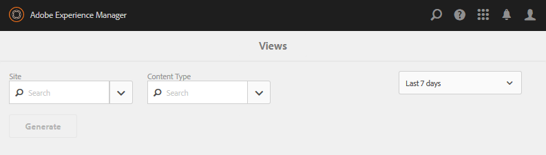

# Berichte-Konsole {#reports-console}

## Übersicht {#overview}

Für AEM Communities gibt es verschiedene Berichte, auf die über die Autorenumgebung auf verschiedene Weise zugegriffen werden kann.

Die verschiedenen Berichte sind im Allgemeinen:

* [Zuweisungsbericht](#assignments-report)  - bietet einer  [Aktivierungs-Community](overview.md#enablement-community) einen Überblick über den Fortschritt der Lernenden bei ihrer Zuweisung, einschließlich eines zugehörigen Punkts bei der Implementierung des SCORM-Standards.
* [Bericht &quot;Ansichten&quot;](#views-report)  - bietet eine Grafik der Ansichten von Inhalten von Community-Mitgliedern und Site-Besuchern für jede Community-Site
* [Bericht zu Beiträgen](#posts-report)  - bietet eine Grafik verschiedener Arten von Beiträgen von Community-Mitgliedern zu jeder Community-Site

Wenn [Adobe Analytics aktiviert ist](sites-console.md#analytics), enthalten Berichte die Anzahl der Ansichten, Wiedergaben, Kommentare und Bewertungen für jede Aktivierungsressource im Zeitverlauf

Tabellarische Berichte können zur nachfolgenden Verarbeitung im CSV-Format exportiert werden.

## Reporting-Konsolen {#reporting-consoles}

### Berichte für Community-Sites {#reports-for-community-sites}

* Über die globale Navigation: **[!UICONTROL Navigation > Communities > Berichte]**
* Wählen Sie aus
   * **[!UICONTROL Zuweisungsbericht]**
      * Erstellen Sie einen Bericht für die ausgewählte Community-Site, den ausgewählten Benutzer oder die Gruppe und die Zuweisung
   * **[!UICONTROL Post-Bericht]**
      * Erstellen Sie einen Bericht für die ausgewählte Community-Site, den Inhaltstyp und den Zeitraum
   * **[!UICONTROL Ansichtsbericht]**
      * Erstellen Sie einen Bericht für die ausgewählte Community-Site, den Inhaltstyp und den Zeitraum
         

### Berichte für Aktivierungsressourcen und Lernpfade {#reports-for-enablement-resources-and-learning-paths}

* Über die globale Navigation: **[!UICONTROL Navigation > Communities > Ressourcen]**
* Vorhandene Aktivierungs-Community-Site auswählen
   * Wählen Sie das Symbol **[!UICONTROL Bericht]** aus, um Berichte zu erstellen, die alle Aktivierungsressourcen abdecken.
   * Aktivierungs-Lernpfad auswählen
   * Wählen Sie das Symbol **[!UICONTROL Bericht]** aus, um Berichte für
      * Die enthaltenen Aktivierungsressourcen
      * Den Lernpfaden zugewiesene Lernende
* Diese Berichte bieten Folgendes:
   * Tabellendaten, als CSV heruntergeladen
      * Identifizieren von Lernenden
      * Ihr Status
      * Ob zugewiesen oder über Katalog aufgerufen
      * Anzahl der abgegebenen Kommentare
      * Sternbewertung

Weitere Informationen finden Sie im Abschnitt [Berichte](resources.md#report) der Ressourcenkonsole.

## Zuweisungsbericht {#assignments-report}

In der Konsole &quot;Zuweisungen&quot;können Berichte nach der Aktivierungs-Community-Site, Benutzern oder Gruppen und der Zuweisung gefiltert werden.

Der Bericht enthält Informationen über ihren Fortschritt sowie etwaige Kommentare oder Bewertungen.

Wählen Sie die Kriterien für den Bericht aus:

* ****
SiteWählen Sie eine Aktivierungs-Community-Site aus.
* **[!UICONTROL Benutzer oder Gruppe]**
   * Wählen Sie Benutzer aus, um einen Bericht für einen Lernenden zu erstellen
   * Gruppe auswählen , um einen Bericht für eine Gruppe von Lernenden zu erstellen
Der Tunneldienst greift über die Veröffentlichungsumgebung auf Mitglieder und Mitgliedergruppen zu
* ****
ZuweisungWählen Sie aus den Aktivierungsressourcen, die den ausgewählten Lernenden zugewiesen sind

Wählen Sie **[!UICONTROL Generate]** aus, um den Bericht zu erstellen:

## Ansichtsbericht {#views-report}

Mit der Konsole &quot;Ansichten&quot;können Berichte zu Seitenansichten von Community-Funktionen für einen bestimmten Zeitraum generiert werden.

Wählen Sie die Kriterien für den Bericht aus:

* ****
SiteAuswählen einer Community-Site
* **[!UICONTROL Content-]**
Typ: Kann &quot;Alle Inhalte&quot;auswählen oder eine der auf der Site vorhandenen Funktionen auswählen
* Zeitrahmen
Wählen Sie eine der folgenden Optionen aus:
   * Letzte 7 Tage
   * Letzte 30 Tage
   * Letzte 90 Tage
   * Letztes Jahr

Wählen Sie **[!UICONTROL Generate]** aus, um den Bericht zu erstellen:

## Post-Bericht {#posts-report}

Die Konsole Beiträge ermöglicht die Erstellung von Berichten über die Anzahl der Beiträge zu Community-Funktionen für einen bestimmten Zeitraum.

Wählen Sie die Kriterien für den Bericht aus:

* ****
SiteAuswählen einer Community-Site
* **[!UICONTROL Content-]**
Typ: Kann &quot;Alle Inhalte&quot;auswählen oder eine der auf der Site vorhandenen Funktionen auswählen
* Zeitrahmen
Wählen Sie eine der folgenden Optionen aus:
   * Letzte 7 Tage
   * Letzte 30 Tage
   * Letzte 90 Tage
   * Letztes Jahr

Wählen Sie **[!UICONTROL Generate]** aus, um den Bericht zu erstellen:

## Fehlerbehebung {#troubleshooting}

### Keine Community-Sites aufgeführt {#no-community-sites-listed}

Wenn keine Community-Sites aufgelistet sind, stellen Sie sicher, dass Adobe Analytics für eine Site aktiviert wurde. Stellen Sie bei der Auswahl von Berichten zu Zuweisungen sicher, dass sich die Zuweisungsfunktion in der Struktur der Community-Site befindet.
