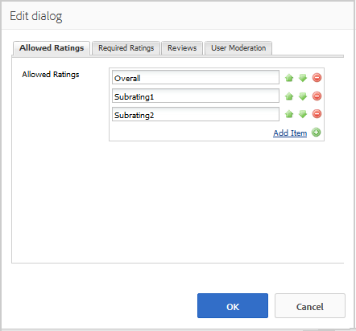
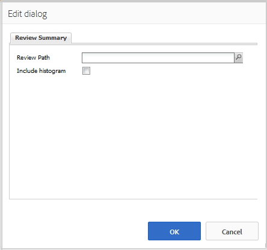

# Verwenden von Bewertungen und Bewertungszusammenfassung (Anzeige) {#using-reviews-and-reviews-summary-display}

Die Komponente `Reviews`ist ein Verbund aus [ `Comments`](comments.md)- und [ `Rating`](rating.md)-Komponenten, die einsatzbereit sind.

Die Komponente `Reviews Summary (Display)` bietet eine Zusammenfassung einer aktiven oder geschlossenen Instanz einer `Reviews`-Komponente, die an anderer Stelle auf der Site angezeigt werden kann.

>[!NOTE]
>
>Das anonyme Posten von Bewertungen wird nicht unterstützt. Besucher der Website müssen sich registrieren (Mitglieder werden) und anmelden, um Kommentare verfassen zu können. Angemeldete Besucher können ihre Bewertungen jederzeit aktualisieren.

## Hinzufügen einer Bewertung zu einer Seite {#adding-a-review-to-a-page}

Um eine Komponente `Reviews` im Autorenmodus zu einer Seite hinzuzufügen, suchen Sie im Komponenten-Browser nach `Communities / Reviews` und ziehen Sie sie an die gewünschte Stelle auf einer Seite, z. B. an eine Position relativ zur Funktion, die Benutzer überprüfen können.

Die erforderlichen Informationen finden Sie unter [Grundlagen der Communities-Komponenten](basics.md).

Wenn die [erforderlichen clientseitigen Bibliotheken](reviews-basics.md#essentials-for-client-side) enthalten sind, wird die `Reviews`Komponente so angezeigt.

## Konfigurieren von Bewertungen {#configuring-reviews}

Wählen Sie die platzierte Komponente `Reviews` aus, um auf das Symbol `Configure` zuzugreifen, mit dem das Bearbeitungsdialogfeld geöffnet wird.

Geben Sie auf der Registerkarte **[!UICONTROL Zulässige Bewertungen]** die vollständige Liste der Bewertungen an, die Mitgliedern angezeigt werden sollen. Die erste Bewertung sollte eine allgemeine/allgemeine Bewertung sein, da sie die durchschnittliche Bewertung für die Komponente `Review Summary (Display)` liefert. Die nächsten beiden Bewertungen in der Standardkonfiguration sollten einen anderen Titel erhalten als &quot;Unterbewertung 1&quot;oder &quot;Unterbewertung 2&quot;.

* **[!UICONTROL Zulässige Bewertungen]**

   Eine Liste von Bewertungen, aus denen ein Mitglied wählen kann.

    Verwenden Sie die Schaltflächen zur Bearbeitung der angezeigten Auswahl (Pfeil nach oben, Pfeil nach unten und Schaltfläche zum Löschen).

   Klicken Sie auf **[!UICONTROL Element hinzufügen]**, um eine weitere Bewertungsmöglichkeit hinzuzufügen.

Geben Sie auf der Registerkarte **[!UICONTROL Erforderliche Bewertungen]** erneut Elemente aus der Liste von **[!UICONTROL Zulässige Bewertungen]** ein, die bewertet werden müssen. Wird ein Element lediglich auf der Registerkarte „Zulässige Bewertungen“ genannt, können die Mitglieder dieses Element unbewertet lassen.

Auf der Webseite werden erforderliche Bewertungen durch einen Stern gekennzeichnet. Ist die Bewertung eines Elements erforderlich, das jedoch nicht bewertet wurde, erhält das Mitglied eine Meldung und kann das Formular erst absenden, wenn das erforderliche Element bewertet wurde.

* **[!UICONTROL Erforderliche Bewertungen]**

   Eine Untergruppe zulässiger Ratings, die angibt, welche Ratings erforderlich sind.

    Verwenden Sie die Schaltflächen zur Bearbeitung der angezeigten Auswahl (Pfeil nach oben, Pfeil nach unten und Schaltfläche zum Löschen).

   Klicken Sie auf **[!UICONTROL Element hinzufügen]**, um eine weitere Antwortmöglichkeit hinzuzufügen.

>[!NOTE]
>
>Wenn ein Element auf der Registerkarte **[!UICONTROL Erforderliche Bewertungen]** eingegeben wird, das nicht auf der Registerkarte **[!UICONTROL Zulässige Bewertungen]** angegeben ist, ist es nicht in den zu bewertenden Elementen enthalten.

Geben Sie auf der Registerkarte **[!UICONTROL Reviews]** an, wie Reviews verarbeitet werden.

* **[!UICONTROL Antworten zulassen]** Ist diese Option aktiviert, können Bewertungen kommentiert werden. Diese Option ist standardmäßig deaktiviert.

* **[!UICONTROL Geschlossen]** Ist diese Option aktiviert, können in der Bewertung keine neuen Bewertungen und Kommentare erstellt werden. Diese Option ist standardmäßig deaktiviert.

* **[!UICONTROL Datei-Uploads zulassen]** Ist diese Option aktiviert, können der Bewertung Dateianhänge hinzugefügt werden. Diese Option ist standardmäßig deaktiviert.

* **[!UICONTROL Max. Dateigröße]****** Nur relevant, wenn die Option „Datei-Uploads zulassen“ aktiviert ist. Dieses Feld begrenzt die Größe (in Byte) einer hochgeladenen Datei. Der Standardwert ist 10 MB.

* **[!UICONTROL Maximale Nachrichtenlänge]** Die Anzahl der Zeichen, die in das Textfeld eingegeben werden kann. Der Standardwert ist 4096 Zeichen.

* **[!UICONTROL Zulässige Dateitypen]****** Nur relevant, wenn die Option „Datei-Uploads zulassen“ aktiviert ist. Eine kommagetrennte Liste der zulässigen Dateierweiterungen inklusive Punkt. Beispiel: .jpg, .jpeg., png, .doc, .docx, .pdf. Wurden Dateitypen festgelegt, können Dateien nicht angegebenen Typs nicht hochgeladen werden. Die Standardeinstellung ist nicht so festgelegt, dass alle Dateitypen zulässig sind.

* **[!UICONTROL Rich-Text-Editor]** Ist diese Option aktiviert, können Beiträge mit Markup versehen werden. Diese Option ist standardmäßig deaktiviert.

* **[!UICONTROL Abstimmung zulassen]** Ist diese Option aktiviert, kann die Funktion „Abstimmung“ Themen hinzugefügt werden. Diese Option ist standardmäßig deaktiviert.

Geben Sie auf der Registerkarte **[!UICONTROL Benutzermoderation]** an, wie die veröffentlichten Bewertungen verwaltet werden. Weitere Informationen finden Sie unter [Moderation benutzergenerierter Inhalte](moderate-ugc.md).

* **[!UICONTROL Vor der Moderation]** Ist diese Option aktiviert, müssen Bewertungen vor ihrer Veröffentlichung zunächst genehmigt werden. Diese Option ist standardmäßig deaktiviert.

* **[!UICONTROL Bewertungen löschen]** Ist diese Option aktiviert, kann das Mitglied, das die Bewertung veröffentlicht hat, diese auch wieder löschen. Diese Option ist standardmäßig deaktiviert.

* **[!UICONTROL Bewertungen ablehnen]** Ist diese Option aktiviert, können Moderatoren Bewertungen ablehnen. Diese Option ist standardmäßig deaktiviert.

* **[!UICONTROL Bewertungen schließen/erneut öffnen]** Ist diese Option aktiviert, können Moderatoren Bewertungen schließen oder erneut öffnen. Diese Option ist standardmäßig deaktiviert.

* **[!UICONTROL Bewertungen kennzeichnen]** Ist diese Option aktiviert, können Mitglieder Bewertungen als unangemessen kennzeichnen. Diese Option ist standardmäßig deaktiviert.

* **[!UICONTROL Liste mit Kennzeichnungsgründen]** Ist diese Option aktiviert, können Mitglieder aus einer Dropdown-Liste den Grund auswählen, aus dem eine Bewertung als unangemessen gekennzeichnet wird. Diese Option ist standardmäßig deaktiviert.

* **[!UICONTROL Grund für benutzerdefinierte Kennzeichnung]** Ist diese Option aktiviert, können Mitglieder einen eigenen Grund dafür eingeben, warum sie Bewertungen als unangemessen kennzeichnen möchten. Diese Option ist standardmäßig deaktiviert.

* **[!UICONTROL Schwellenwert für Moderation]** Geben Sie an, wie oft eine Bewertung von Mitgliedern als unangemessen gekennzeichnet werden muss, bevor Moderatoren benachrichtigt werden. Der Standardwert ist einmal (1).

* **[!UICONTROL Kennzeichnungslimit]** Geben Sie an, wie oft eine Bewertung als unangemessen gekennzeichnet werden muss, bevor sie aus dem öffentlichen Bereich ausgeblendet wird. Dieser Wert muss größer als der oder gleich dem **[!UICONTROL Schwellenwert für Moderation]** sein. Der Standardwert ist 5.

### Hinzufügen einer Bewertungszusammenfassung (Anzeige) zu einer Seite {#adding-a-review-summary-display-to-a-page}

Um eine `Reviews Summary (Display)`-Komponente zu einer Seite im Autorenmodus hinzuzufügen, suchen Sie die Komponente

* `Communities / Reviews Summary (Display)`

und ziehen Sie sie an eine Stelle, an der die Zusammenfassung einer aktiven oder geschlossenen Bewertung angezeigt werden soll.

Die erforderlichen Informationen finden Sie unter [Grundlagen der Communities-Komponenten](basics.md).

Wenn die [erforderlichen clientseitigen Bibliotheken](reviews-basics.md#essentials-for-client-side) enthalten sind, wird die `Reviews Summary (Display)`Komponente so angezeigt.

>[!NOTE]
>
>Der Durchschnitt spiegelt das Stimmenverhältnis für das erste aufgelistete Element auf der Registerkarte „Zulässige Bewertungen“ derjenigen Bewertungen wider, die hier zusammengefasst werden.

### Konfigurieren von Bewertungszusammenfassungen (Anzeige)  {#configuring-reviews-summary-display}

Wählen Sie die platzierte Komponente `Reviews Summary (Display)` aus, um auf das Symbol `Configure` zuzugreifen, mit dem das Bearbeitungsdialogfeld geöffnet wird.

Auf der Registerkarte **[!UICONTROL Bewertungszusammenfassung]** können Sie Folgendes festlegen:

* `Review Path`

   Geben Sie die platzierte Instanz der `reviews`Komponente ein oder navigieren Sie zu ihr, um sie zusammenzufassen. Wenn Sie sie beispielsweise zur Webseite der [Geometrixx Engage-Site hinzufügen,](getting-started.md) lautet der Pfad:

   /content/sites/engage/en/page/jcr:content/content/primary/views

* `Include histogram`

   Wenn diese Option aktiviert ist, zeigen Sie ein Balkendiagramm an, das angibt, wie viele Sternbewertungen es in den zusammengefassten Reviews gibt. Diese Option ist standardmäßig deaktiviert.

### Ändern in einen benutzerdefinierten Bewertungstyp {#changing-to-a-custom-review-type}

Grundlage der Komponente „Bewertungen“ ist das Kommentarsystem.

Durch Änderung des Kommentarressourcentyps generiert das Kommentarsystem nicht mehr mithilfe des Standardsystems eine Instanz eines Kommentars, sondern mithilfe einer Einstellung, die von Entwicklern definiert (erweitert) wurde.

Sobald die benutzerdefinierten Ressourcentypen bekannt sind, geben Sie [Designmodus](../../help/sites-authoring/default-components-designmode.md) ein und doppelklicken Sie auf die platzierte Komponente `Comments` , um ein Dialogfeld mit einer zusätzlichen Registerkarte zu öffnen.

Geben Sie auf der Registerkarte **[!UICONTROL Ressourcentypen]** den benutzerdefinierten Ressourcentyp für neue Instanzen der `Comments or Voting`Komponenten an:

* **[!UICONTROL Kommentarressourcentyp]**

   Navigieren Sie zum Ressourcentyp einer erweiterten `comment`Komponente (einzelner Kommentar) in /apps. Beispiel: `/apps/social/commons/components/hbs/comments/comment`

   Diese Ressource identifiziert den resourceType des UGC, der erstellt wurde, wenn ein Besucher einen Kommentar veröffentlicht.

* **[!UICONTROL Abstimmungs-Ressourcentyp]**

   Navigieren Sie zum Ressourcentyp einer erweiterten `voting`Komponente in /apps. Beispiel: `/apps/social/components/hbs/voting`

   Diese Ressource identifiziert den Ressourcentyp des UGC, der erstellt wurde, wenn ein Besucher eine Stimme sendet.

* **[!UICONTROL Ressourcentyp des Kommentars]**

   Navigieren Sie zum Ressourcentyp einer erweiterten `comments`Komponente (Kommentarsystem) in /apps. Leer lassen, es sei denn, die Seitenvorlage [enthält dynamisch](scf.md#add-or-include-a-communities-component) das Kommentarsystem im zugrunde liegenden Skript, anstatt als Ressource (Kommentarknoten) zur Seite hinzugefügt zu werden. Weitere Informationen erhalten Sie in den Hilfethemen des[{{include}}-Helpers](handlebars-helpers.md#include)

## Site-Besuchererlebnis {#site-visitor-experience}

### Moderatoren und Administratoren {#moderators-and-administrators}

Verfügt der angemeldete Benutzer über Moderator- oder Administratorrechte, kann er Moderationsaufgaben ausführen, die ihm durch die Komponentenkonfiguration gestattet werden, unabhängig davon, wer die Bewertung verfasst hat.

### Mitglieder {#members}

Abhängig von der Konfiguration können angemeldete Besucher Folgendes tun:

* Neuen Review posten
* Bearbeiten einer eigenen Überprüfung
* Löschen einer eigenen Überprüfung
* Anderen Überprüfungskommentaren zuweisen

Pro Mitglied ist nur eine Bewertung zulässig.  Das Mitglied kann seine Meinung jedoch jederzeit ändern.

### Anonym {#anonymous}

Nicht registrierte oder angemeldete Besucher können veröffentlichte Bewertungen lediglich lesen und übersetzen (falls unterstützt), jedoch keine eigenen Bewertungen hinzufügen und keine Kommentare anderer Benutzer kennzeichnen.

## Zusätzliche Informationen {#additional-information}

Weitere Informationen finden Sie auf der Seite [Grundlagen der Überprüfung](reviews-basics.md) für Entwickler.

Informationen zur Moderation von veröffentlichten Kommentaren finden Sie unter [Moderieren benutzergenerierter Inhalte](moderate-ugc.md).

Informationen zur Übersetzung von Kommentaren finden Sie unter [Übersetzung benutzergenerierter Inhalte](translate-ugc.md).
