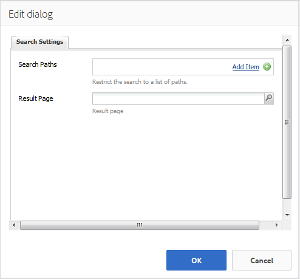

# Suchfunktion {#search-feature}

>[!CAUTION]
>
>AEM 6.4 hat das Ende der erweiterten Unterstützung erreicht und diese Dokumentation wird nicht mehr aktualisiert. Weitere Informationen finden Sie in unserer [technische Unterstützung](https://helpx.adobe.com/de/support/programs/eol-matrix.html). Unterstützte Versionen suchen [here](https://experienceleague.adobe.com/docs/?lang=de).

Die Suchfunktion kann mit verschiedenen anderen Funktionen wie Foren verwendet werden, um die Suche nach Inhalten zu ermöglichen.

Beim Hinzufügen der Möglichkeit, Beiträge von Community-Mitgliedern zu durchsuchen, die als benutzergenerierte Inhalte (UGC) bezeichnet werden, gibt es zwei Komponenten: [ `Search`](#search-features) und [ `Search Results`](#search-results).

Die Seite, die die `Search Results` -Komponente unterstützt sowohl die Suche als auch die Anzeige von Ergebnissen.

Die Seite, die die `Search`-Komponente bietet einen Ort zum Starten einer Suche mit Ergebnissen, die auf der `Search Results` Seite.

Die Suchfunktion kann mit jeder anderen Funktion verwendet werden, die es Site-Besuchern und Mitgliedern ermöglicht, Inhalte anzuzeigen.

## Suchen {#search-features}

### Hinzufügen einer Suche zu einer Seite {#add-search-to-a-page}

So fügen Sie eine `Search` -Komponente auf einer Seite im Autorenmodus verwenden Sie den Komponenten-Browser, um `Communities / Search` und ziehen Sie sie an die gewünschte Stelle auf einer Seite. Verwendung von `Search` eine zweite Seite für die `Search Results.`

Die erforderlichen Informationen finden Sie unter [Grundlagen zu Communities-Komponenten](basics.md).

Wenn die erforderliche clientseitige Bibliothek `cq.social.hbs.search`, enthalten ist, wird die `Search` wird angezeigt.

### Konfigurieren der hinzugefügten Suche {#configure-the-added-search}

Wählen Sie die platzierte `Search` -Komponente, die aufgerufen und ausgewählt werden soll `Configure` -Symbol, über das das Dialogfeld &quot;Bearbeiten&quot;geöffnet wird.

Unter dem **[!UICONTROL Sucheinstellungen]** angeben, wie die Pfade bei der Eingabe einer Abfrage durch einen Besucher durchsucht werden sollen.

* **[!UICONTROL Suchpfade]**
Durch Hinzufügen von Suchpfaden mit der Schaltfläche Element hinzufügen ist die Inhaltssuche eingeschränkt. Um beispielsweise die Suche auf ein bestimmtes Forum zu beschränken, wählen Sie eine Forumskomponente aus, die auf einer Seite platziert wird:

   * `/content/community-components/en/forum/jcr:content/content/forum`

* **[!UICONTROL Ergebnisseite]**
Die Ergebnisse werden auf einer separaten Seite angezeigt, die mithilfe des Browsers angegeben wird, um eine Seite auszuwählen, die die 
`Search Results` Komponente.

## Suchergebnisse {#search-results}

### Hinzufügen von Suchergebnissen zu einer Seite {#add-search-results-to-a-page}

So fügen Sie eine `Search Results` -Komponente auf einer Seite im Autorenmodus verwenden Sie den Komponenten-Browser, um

* `Communities / Search Results`

und ziehen Sie sie an die gewünschte Stelle auf einer Seite. Im Gegensatz zur Suchkomponente ist keine zweite Seite erforderlich, da die Ergebnisse auf derselben Seite angezeigt werden.

Wenn Sie die Suche an einer anderen Stelle auf der Website verwenden, wird diese eine Seite mit `Search Results` kann so konfiguriert werden, dass `Result Page` für alle oder alle Instanzen von `Search`.

Die erforderlichen Informationen finden Sie unter [Grundlagen zu Communities-Komponenten](basics.md).

Wenn die erforderliche clientseitige Bibliothek `cq.social.hbs.search`, enthalten ist, wird die `Search Result` wird angezeigt:

### Konfigurieren des hinzugefügten Suchergebnisses {#configure-the-added-search-result}

Wählen Sie die platzierte `Search Results` -Komponente, die aufgerufen und ausgewählt werden soll `Configure` -Symbol, über das das Dialogfeld &quot;Bearbeiten&quot;geöffnet wird.

Unter dem **[!UICONTROL Suchergebniseinstellungen]** -Registerkarte können Sie festlegen, welche Pfade bei der Suche einbezogen werden sollen, wenn ein Besucher eine Abfrage eingibt.

* **[!UICONTROL Suchergebnisse pro Seite]**
Definieren Sie die Anzahl der Themen/Beiträge, die pro Seite angezeigt werden. Der Standardwert ist 10.

* **[!UICONTROL Suchpfade]**
Durch Hinzufügen von Suchpfaden mit der Schaltfläche Element hinzufügen ist die Inhaltssuche eingeschränkt.

## Zusätzliche Informationen {#additional-information}

Weitere Informationen finden Sie unter [Suchgrundlagen](search-implementation.md) für Entwickler.
