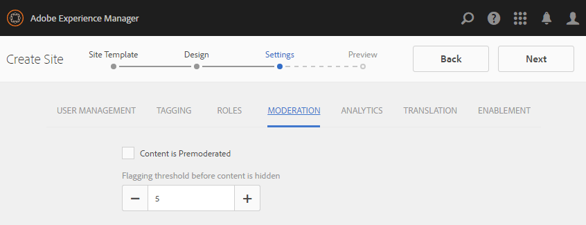
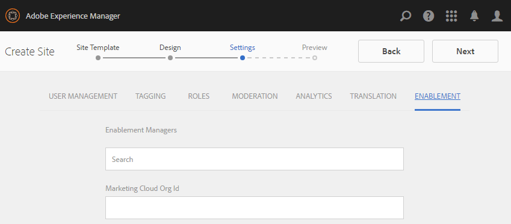

# Communities-Sites-Konsole {#communities-sites-console}

Die Communities Sites-Konsole bietet Zugriff auf:

* Site-Erstellung
* Site-Bearbeitung
* Site-Management
* [Erstellen und Bearbeiten verschachtelter Gruppen](groups.md) (Untergruppen)

Unter [Erste Schritte mit AEM Communities](getting-started.md) erfahren Sie, wie schnell eine Community-Site in der Autorenumgebung erstellt werden kann und wie Sie Community-Gruppen aus der Autor- und Veröffentlichungsumgebung erstellen.

>[!NOTE]
>
>Die Hauptmenüs Communities zur Erstellung von [Community-Sites](sites-console.md), [Community-Site-Vorlagen](sites.md), [Community-Gruppenvorlagen](tools-groups.md) und [Community-Funktionen](functions.md) sind nur für die Verwendung in der Autorenumgebung vorgesehen.

## Voraussetzungen {#prerequisites}

Bevor Sie eine Community-Site erstellen, *müssen* Sie:

* Vergewissern Sie sich, dass eine oder mehrere Instanzen im Veröffentlichungsmodus ausgeführt werden
* Aktivieren des [Tunneldienstes](deploy-communities.md#tunnel-service-on-author) zum Verwalten von Mitgliedern und Mitgliedergruppen
* Identifizieren Sie den [primären Herausgeber.](deploy-communities.md#primary-publisher)
* [Replizierung](deploy-communities.md#replication-agents-on-author) konfigurieren, wenn der primäre Herausgeberanschluss nicht der Standard ist (4503)

Um sicherzustellen, dass die Site viele Funktionen unterstützt, sollten Sie folgende Schritte durchführen:

* Installieren Sie das [neueste Feature Pack](deploy-communities.md#latestfeaturepack)
* Aktivieren von [Adobe Analytics](analytics.md) für AEM Communities
* Konfigurieren von [E-Mail](email.md)
* Identifizieren Sie [Community-Administratoren.](users.md#creating-community-members)
* [OAuth-Handler](social-login.md#adobe-granite-oauth-authentication-handler) für Social-Anmeldung aktivieren

## Zugriff auf die Sites-Konsole von Communities {#accessing-communities-sites-console}

Gehen Sie in der Autorenumgebung zur Konsole Communities Sites:

* Aus globaler Navigation: **[!UICONTROL Communities > Sites]**

Die Communities Sites-Konsole zeigt alle vorhandenen Community-Sites an. In dieser Konsole können Community-Sites erstellt, bearbeitet, verwaltet und gelöscht werden.

To create a new community site, select the **Create** icon.

Um auf eine bestehende Community-Site zuzugreifen, um eine verschachtelte Gruppe zu erstellen, zu bearbeiten, zu veröffentlichen, zu exportieren oder hinzuzufügen, wählen Sie das Ordnersymbol der Sites aus.

Beispielsweise zeigt die folgende Abbildung die Haupt-Konsole Communities Sites mit den Ordnern für zwei Community-Sites: [aktivieren](getting-started-enablement.md) und [aktivieren](getting-started.md):

## Site-Erstellung {#site-creation}

Die Site-Erstellungskonsole bietet einen schrittweisen Ansatz, um Funktionen der Site basierend auf einer ausgewählten [Community-Site-Vorlage](sites.md) und -Einstellungen zusammenzustellen.

Jede erstellte Site enthält eine Anmeldefunktion, da sich Site-Besucher anmelden müssen, bevor sie Inhalte posten, Nachrichten senden oder an einer Gruppe teilnehmen können. Weitere Funktionen sind Benutzerprofile, Messaging, Benachrichtigungen, Site-Menü, Suche, Design und Branding.

Der Prozess wird gestartet, indem Sie die `Create` Schaltfläche oben in der Communities Sites-Konsole auswählen.

Der Erstellungsprozess besteht aus einer Reihe von Schritten, die als Bedienfelder mit einer Reihe von zu konfigurierenden Funktionen (die als Unterbereiche dargestellt werden) dargestellt werden. Es ist möglich, zum **nächsten** Schritt oder zum vorherigen Schritt **Zurück** vorzugehen, bevor die Site im letzten Schritt übernommen wird.

### Schritt 1: Site-Vorlage {#step-site-template}

Im Bedienfeld &quot;Site-Vorlage&quot;werden Titel, Beschreibung, Site-Stammordner, Basissprache, Name und Site-Vorlage angegeben:

* **[!UICONTROL Community-Site-Titel]**: Ein Anzeigentitel für die Site.

   Der Titel wird sowohl auf der veröffentlichten Site als auch in der Benutzeroberfläche des Site-Administrators angezeigt.

* **[!UICONTROL Community-Site-Beschreibung]**: Eine Beschreibung der Site.

   Die Beschreibung wird nicht auf der veröffentlichten Site angezeigt.

* **[!UICONTROL Community-Site-Stammordner]**: Der Stammpfad zur Site.

   Der Standard-Stammordner ist `/content/sites`festgelegt, der Stammordner kann jedoch an einen beliebigen Speicherort auf der Website verschoben werden.

* **[!UICONTROL Community-Site-Basissprache]**: (Für eine Sprache unberührt lassen: Englisch) verwenden Sie das Pulldown-Menü, um eine *oder mehrere* Basissprachen aus den verfügbaren Sprachen (Deutsch, Italienisch, Französisch, Japanisch, Spanisch, Portugiesisch (Brasilien), Chinesisch (Traditionell) und Chinesisch (vereinfacht) auszuwählen. Eine Community-Site wird für jede hinzugefügte Sprache erstellt und befindet sich im selben Site-Ordner, wie unter [Übersetzung von Inhalten für mehrsprachige Sites](../../help/sites-administering/translation.md)beschrieben. Die Stammseite jeder Site enthält eine untergeordnete Seite, die nach dem Sprachcode einer der ausgewählten Sprachen benannt ist, wie z.B. &quot;en&quot; für Englisch oder &quot;fr&quot; für Französisch.

* **[!UICONTROL Community-Site-Name]**: Der Name der Stammseite der Site, die in der URL angezeigt wird

   * Überprüfen Sie den Namen, da er nach der Erstellung der Site nicht leicht geändert werden kann.
   * Die Basis-URL ( `https://*server:port/site root/site name*)` wird unter der `Community Site Name`
   * Für eine gültige URL hängen Sie einen Basissprachcode an + &quot;.html&quot;

      *Beispiel*, `http://localhost:4502/content/sites/mysight/en.html`

* **[!UICONTROL Menü &quot;Community-Site-Vorlage]** &quot;: Verwenden Sie das Pulldown-Menü, um eine verfügbare [Community-Site-Vorlage](tools.md)auszuwählen.

Wählen Sie **[!UICONTROL Weiter]**

### Schritt 2: Design {#step-design}

Das Bedienfeld &quot;Design&quot;enthält 2 Unterbereiche zum Auswählen des Designs und des Branding-Banners:

#### COMMUNITY SITE THEME {#community-site-theme}

Das Framework verwendet [Twitter Bootstrap](https://twitterbootstrap.org/) , um ein reaktionsfähiges, flexibles Design auf die Site zu bringen. Eines der vielen vorgeladenen Bootstrap-Designs kann ausgewählt werden, um die ausgewählte Community-Site-Vorlage zu gestalten, oder ein Bootstrap-Design kann hochgeladen werden.

Wenn diese Option aktiviert ist, wird das Design mit einem undurchsichtigen blauen Häkchen überlagert.

Nachdem die Community-Site veröffentlicht wurde, können Sie die Eigenschaftenbearbeiten und ein anderes Design auswählen.

#### COMMUNITY SITE BRANDING {#community-site-branding}

Das Branding einer Community-Site ist ein Bild, das als Kopfzeile am oberen Rand jeder Seite angezeigt wird.

Das Bild sollte so groß sein, dass es im Browser wie erwartet angezeigt wird, und 120 Pixel hoch.

Beachten Sie beim Erstellen oder Auswählen eines Bildes Folgendes:

* Die Bildhöhe wird auf 120 Pixel abgeschnitten, gemessen vom oberen Rand des Bilds
* Das Bild wird am linken Rand des Browserfensters fixiert
* Die Bildgröße wird nicht geändert, d. h., wenn die Bildbreite ...

   * Weniger als die Browserbreite, wird das Bild horizontal wiederholt
   * Größer als die Browserbreite, scheint das Bild abgeschnitten zu sein

Wählen Sie **[!UICONTROL Weiter]**.

### Schritt 3: Einstellungen {#step-settings}

Das Einstellungsbedienfeld enthält mehrere Unterbereiche mit Funktionen, die konfiguriert werden müssen, bevor Sie zum letzten Schritt zur Erstellung der Site wechseln.

* [BENUTZERVERWALTUNG](#user-management)
* [TAG](#tagging)
* [Rollen](#roles)
* [MODERATION](#moderation)
* [ANALYSEN](#analytics)
* [ÜBERSETZUNG](#translation)
* [AKTIVIERUNG](#enablement)

>[!NOTE]
>
>**Tunnel-Dienst aktivieren**
>
>Einige der Unterbereiche &quot;Einstellungen&quot;ermöglichen es einem vertrauenswürdigen Mitglied, UGC zu moderieren, Gruppen zu verwalten oder Kontakte für die Aktivierung von Ressourcen in der Veröffentlichungsumgebung zu sein.
>
>Die Regel besagt, dass [Benutzer und Benutzergruppen](users.md) (Mitglieder und Mitgliedsgruppen) auf der Seite der Veröffentlichung nicht in der Autorenumgebung dupliziert werden dürfen.
>
>Wenn Sie also die Community-Site in der Autorenumgebung erstellen und vertrauenswürdigen Mitgliedern verschiedene Rollen zuweisen, müssen Sie Mitgliedsdaten aus der Veröffentlichungsumgebung abrufen.
>
>Dies wird erreicht, indem die ` [AEM Communities Publish Tunnel Service](deploy-communities.md#tunnel-service-on-author)`für die Autorenumgebung aktiviert wird.

#### USER MANAGEMENT {#user-management}

>[!NOTE]
>
>Es wird empfohlen, dass [Community-Sites](overview.md#enablement-community) privat genutzt werden (weitere Informationen erhalten Sie von Ihrem Kundenbetreuer).
>
>Eine Community-Site ist privat, wenn anonymen Site-Besuchern der Zugriff verweigert wird, sie sich nicht selbst registrieren können und sie möglicherweise keine Social-Anmeldung verwenden.

* **[!UICONTROL Benutzerregistrierung zulassen]**

   Wenn diese Option aktiviert ist, können Site-Besucher durch Selbstregistrierung Community-Mitglieder werden.

   Wenn diese Option deaktiviert ist, ist die Community-Site *eingeschränkt* und die Site-Besucher müssen der Mitgliedergruppe der Community-Site zugewiesen werden, eine Anforderung stellen oder per E-Mail eine Einladung erhalten. Wenn diese Option deaktiviert ist, sollte der anonyme Zugriff nicht erlaubt sein.

   Deaktivieren Sie die Option für eine *private* Community-Site. Diese Option ist standardmäßig aktiviert.

* **[!UICONTROL Anonymen Zugriff erlauben]**

   Wenn diese Option aktiviert ist, ist die Community-Site *offen* und jeder Besucher der Site kann auf die Site zugreifen.

   Wenn diese Option deaktiviert ist, können nur angemeldete Mitglieder auf die Site zugreifen.

   Deaktivieren Sie die Option für eine *private* Community-Site. Diese Option ist standardmäßig aktiviert.

* **[!UICONTROL Messaging zulassen]**

   Wenn diese Option aktiviert ist, können Mitglieder Nachrichten an einander und an die Gruppe innerhalb der Community-Site senden.

   Wenn diese Option deaktiviert ist, wird Messaging für die Community nicht eingerichtet.

   Diese Option ist standardmäßig deaktiviert.

* **[!UICONTROL Anmeldung über soziale Medien erlauben: Facebook]**

   Wenn diese Option aktiviert ist, gestatten Sie Besuchern der Site, sich mit ihren Facebook-Kontoangaben anzumelden. Die ausgewählte [Facebook-Cloud-Konfiguration](social-login.md#create-a-facebook-connect-cloud-service) sollte so konfiguriert werden, dass Benutzer zur Mitgliedergruppe der Community-Site hinzugefügt werden, sobald die Community-Site erstellt wurde.

   Wenn diese Option deaktiviert ist, wird keine Facebook-Anmeldung angezeigt.

   Lassen Sie das Kontrollkästchen für eine *private* Community-Site deaktiviert. Diese Option ist standardmäßig deaktiviert.

* **[!UICONTROL Anmeldung über soziale Medien erlauben: Twitter]**

   Wenn diese Option aktiviert ist, gestatten Sie Besuchern der Site, sich mit ihren Twitter-Kontoangaben anzumelden. Die ausgewählte [Twitter-Cloud-Konfiguration](social-login.md#create-a-twitter-connect-cloud-service) sollte so konfiguriert werden, dass Benutzer zur Mitgliedergruppe der Community-Site hinzugefügt werden, sobald die Community-Site erstellt wurde.

   Wenn diese Option deaktiviert ist, wird keine Twitter-Anmeldung angezeigt.

   Lassen Sie das Kontrollkästchen für eine *private* Community-Site deaktiviert. Diese Option ist standardmäßig deaktiviert.

>[!NOTE]

**[!UICONTROL Zulassen von Social-Anmeldungen]**
>Während Beispielkonfigurationen für Facebook und Twitter existieren und auswählbar sind, müssen in einer [Produktionsumgebung](../../help/sites-administering/production-ready.md)benutzerdefinierte Facebook- und Twitter-Anwendungen erstellt werden. Siehe [Social-Anmeldung bei Facebook und Twitter](social-login.md).
>
#### TAGGING {#tagging}

Die Tags, die auf Community-Inhalte angewendet werden können, werden durch Auswahl von Tag-Namespaces gesteuert, die zuvor über die [Tagging-Konsole](../../help/sites-administering/tags.md#tagging-console)definiert wurden.

Darüber hinaus wird bei der Auswahl von Tag-Namespaces für die Community-Site die Auswahl beim Definieren von Katalogen und Ressourcen eingeschränkt. Wichtige Informationen finden Sie unter [Tagging-Aktivierungsressourcen](tag-resources.md) .

* Textfeld: beginnen, um die Tags zu identifizieren, die auf der Site verwendet werden dürfen

#### ROLES {#roles}

Die [Rollen von Community-Mitgliedern](users.md) werden mit diesen Einstellungen zugewiesen.

Die Suche nach Community-Mitgliedern ist mit der Type-Ahead-Suche einfach.

* **[!UICONTROL Community-Manager]**

   Wählen Sie mit der Eingabe eines oder mehrerer Community-Mitglieder oder Mitgliedsgruppen aus, die Community-Mitglieder und Mitgliedsgruppen verwalten können.

* **[!UICONTROL Community-Moderatoren]**

   Wählen Sie mit der Eingabe eines oder mehrerer Community-Mitglieder oder Mitgliedsgruppen aus, denen als Moderatoren von benutzergenerierten Inhalten vertraut werden soll.

* **[!UICONTROL Privilegierte Community-Mitglieder]**

   Geben Sie eine Typisierung ein, um ein oder mehrere Community-Mitglieder oder -Mitgliedsgruppen auszuwählen, damit neue Inhalte erstellt werden können, wenn `Allow Privileged Member` diese für eine [Community-Funktion](functions.md)ausgewählt wurden.

#### MODERATION {#moderation}

Die globale Einstellung für die Moderation benutzergenerierter Inhalte (UGC) wird durch diese Einstellungen gesteuert. Die einzelnen Komponenten verfügen über zusätzliche Einstellungen zur Steuerung der Moderation.

* **[!UICONTROL Inhalt ist vormoderiert]**

   Wenn diese Option aktiviert ist, werden gepostete Community-Inhalte erst angezeigt, nachdem sie von einem Moderator genehmigt wurden. Diese Option ist standardmäßig deaktiviert. For more information, see [Moderating Community Content](moderate-ugc.md#premoderation).

* **[!UICONTROL Kennzeichnung des Schwellenwerts, bevor der Inhalt ausgeblendet wird]**

   Wenn der Wert größer als 0 ist, muss ein Thema oder Beitrag markiert werden, bevor er aus der öffentlichen Ansicht ausgeblendet wird. Bei einem Wert von -1 wird das gekennzeichnete Thema oder der Beitrag nie aus der öffentlichen Ansicht ausgeblendet. Der Standardwert ist 5.

#### ANALYTICS {#analytics}

* **[!UICONTROL Analyse aktivieren]**

   Nur verfügbar, wenn Adobe Analytics für Communities-Funktionen [konfiguriert](analytics.md) wurde.

   Diese Option ist standardmäßig deaktiviert. Wenn diese Option aktiviert ist, wird ein zusätzliches Auswahlmenü angezeigt:

* **[!UICONTROL Framework-Verweis der Cloud-Konfiguration]**

   Wählen Sie im Pulldown-Menü das für diese Community-Site konfigurierte Analytics Cloud-Service-Framework aus.

   `Communities`ist das Framework-Beispiel aus der Dokumentation [Analytics Configuration for Communities Features](analytics.md#aem-analytics-framework-configuration) .

#### TRANSLATION {#translation}

* **[!UICONTROL Maschinelle Übersetzung]** zulassen Wenn aktiviert (Standard deaktiviert), ist die maschinelle Übersetzung für UGC innerhalb der Site aktiviert. Dies hat keine Auswirkungen auf andere Inhalte wie Seiteninhalte, auch wenn die Site als mehrsprachige Site eingerichtet wurde. Informationen zum Konfigurieren eines lizenzierten Übersetzungsdiensts für AEM Communities finden Sie unter [Übersetzen benutzergenerierter Inhalte](translate-ugc.md) . Eine vollständige Übersicht finden Sie unter [Übersetzen von Inhalten für mehrsprachige Sites](../../help/sites-administering/translation.md) .

* **[!UICONTROL Maschinelle Übersetzung für ausgewählte Sprachen aktivieren]**

   Die für die maschinelle Übersetzung aktivierten Sprachen entsprechen standardmäßig den Systemeinstellungen, die in der [Konvertierungskonfiguration](translate-ugc.md#translation-integration-configuration)angegeben sind. Diese Standardeinstellungen können für diese Site überschrieben werden, indem Standardwerte gelöscht und/oder andere Sprachen aus dem Pulldown-Menü ausgewählt werden.

* **[!UICONTROL Übersetzungsanbieter auswählen]**

   Standardmäßig ist der Dienstanbieter ein Testdienst, der nur `microsoft`zur Demonstration verwendet wird. Wenn kein Übersetzungsdienstleister lizenziert ist, sollte die Option &quot;maschinelle Übersetzung **zulassen** &quot;deaktiviert werden.

* **[!UICONTROL Globalen geteilten Speicher auswählen]**

   Für eine Website mit mehreren Sprachkopien bietet ein globaler gemeinsamer Store einen einzigen Konversationsthread, der von jeder Sprachkopie aus sichtbar ist. Dies wird erreicht, indem eine der Sprachen als Sprachkopie ausgewählt wird. Der Standardwert ist *kein globaler freigegebener Store*.

* **[!UICONTROL Übersetzungsanbieter-Konfiguration auswählen]**

   Wählen Sie ein [Übersetzungs-Integrationsframework](../../help/sites-administering/tc-tic.md) , das für den lizenzierten Übersetzungsanbieter erstellt wurde.

* **Wählen Sie die Übersetzungsoptionen für Ihre Community-Site**

   * **[!UICONTROL Gesamte Seite übersetzen]**

      Wenn diese Option aktiviert ist, werden alle UGC auf einer Seite in die Basissprache der Seite übersetzt.

      &quot;Standard&quot;ist *nicht ausgewählt*.

   * **[!UICONTROL Nur Auswahl übersetzen]**

      Wenn diese Option aktiviert ist, wird neben jedem Beitrag eine Übersetzungsoption angezeigt, mit der einzelne Beiträge in die Basissprache der Seite übersetzt werden können.

      Default is *selected*.

* **Speicheroptionen auswählen**

   * **[!UICONTROL Beiträge auf Benutzeranfrage übersetzen und anschließend behalten.]**

      Wenn diese Option aktiviert ist, werden Inhalte erst dann übersetzt, wenn eine Anforderung gestellt wurde. Nach der Übersetzung wird die Übersetzung im Repository gespeichert.

      &quot;Standard&quot;ist *nicht ausgewählt*.

   * **[!UICONTROL Übersetzungen nicht behalten]**

      Wenn diese Option aktiviert ist, werden Übersetzungen nicht im Repository gespeichert.

      Wenn diese Option nicht ausgewählt ist, bleiben die Übersetzungen erhalten.

      &quot;Standard&quot;ist *nicht ausgewählt*.

* **[!UICONTROL Intelligentes Rendering]** Wählen Sie eine der

   * `Always show contributions in the original language` (default)
   * `Always show contributions in user preferred language`
   * `Show contributions in user preferred language for only logged-in users`

#### ENABLEMENT {#enablement}

Die `ENABLEMENT`Einstellungen gelten, wenn die ausgewählte Community-Site-Vorlage die [Zuweisungsfunktion](functions.md#assignments-function)enthält, die verfügbar ist, wenn die Aktivierungsfunktionen lizenziert und [konfiguriert](enablement.md)sind. Die Referenz-Website-Vorlage mit der Zuweisungsfunktion ist `Reference Structured Learning Site Template.`

* **[!UICONTROL Aktivierungsmanager]**

   (Erforderlich) Nur Mitglieder der `Community Enablementmanagers` Gruppe können ausgewählt werden, um diese Community für die Aktivierung zu verwalten. Aktivierungsmanager sind für die Zuweisung von Mitgliedern zu Ressourcen verantwortlich. Siehe auch [Verwalten von Benutzern und Benutzergruppen](users.md).

* **[!UICONTROL ID der Marketing Cloud-Organisation]**

   (Optional) Die ID für eine [Video Heartbeat Analytics](analytics.md#video-heartbeat-analytics) -Lizenz.

Wählen Sie **[!UICONTROL Weiter]**.

### Schritt 4: Communities-Site erstellen {#step-create-communities-site}

Falls Anpassungen erforderlich sind, verwenden Sie die Schaltfläche &quot; **Zurück** &quot;, um sie vorzunehmen.

Nachdem **Create** ausgewählt und gestartet wurde, kann der Vorgang zum Erstellen der Site nicht unterbrochen werden.

Nachdem die Site erstellt wurde:

* Das Ändern der URL (Knotenname) wird nicht unterstützt
* Künftige Änderungen an der Community-Site-Vorlage wirken sich nicht auf die erstellte Community-Site aus
* Die Deaktivierung der Community-Site-Vorlage hat keine Auswirkungen auf die erstellte Community-Site.
* Sie können die [STRUKTUR](#modify-structure) einer Community-Site bearbeiten, indem Sie deren Eigenschaften ändern

Nach Abschluss des Vorgangs wird der Ordner für die neue Site in der Konsole Communities Sites angezeigt, in der Autoren Seiteninhalte hinzufügen können oder Administratoren die Eigenschaften der Site ändern können.

Um eine Community-Site zu ändern, wählen Sie ihren Projektordner aus, um ihn zu öffnen:

Wenn Sie den Mauszeiger über eine Site bewegen oder eine Sitekarte berühren, werden Symbole angezeigt, mit denen Sie die Site im Autorenmodusbearbeiten, [die Site-Eigenschaften zur Änderung](#modifying-site-properties)öffnen, die Siteveröffentlichen, die Siteexportieren und die Site [löschen](#deleting-the-site)können.

## Erstellen von Site-Inhalten {#authoring-site-content}

Der Inhalt einer Site kann mit denselben Werkzeugen wie jede andere AEM-Website erstellt werden. Um die Site zum Authoring zu öffnen, wählen Sie das `Open Site` Symbol aus, das angezeigt wird, wenn Sie den Mauszeiger über die Site bewegen. Die Site wird in einer neuen Registerkarte geöffnet, sodass auf die Konsole Communities Sites weiterhin zugegriffen werden kann.

>[!NOTE]
If not familiar with AEM, view the documentation on [basic handling](../../help/sites-authoring/basic-handling.md) and a [quick guide to authoring pages](../../help/sites-authoring/qg-page-authoring.md).

## Ändern der Site-Eigenschaften {#modifying-site-properties}

Die Eigenschaften einer vorhandenen Site, die während des Site-Erstellungsprozesses angegeben werden, können durch Auswahl des `Edit Site`Symbols geändert werden, das beim Bewegen der Maus über die Site angezeigt wird.

`Details of the following properties match the descriptions provided in the` Abschnitt [Site-Erstellung](#site-creation) .

### Basic ändern {#modify-basic}

Das BASIC-Bedienfeld ermöglicht die Änderung von

* Community-Site-Titel
* Community-Site-Beschreibung

Der Community-Site-Name darf nicht geändert werden.

Die Auswahl einer anderen Community-Site-Vorlage hätte keine Auswirkungen auf eine vorhandene Community-Site, da keine Verbindung zwischen Vorlagen und Sites bestehen bleibt.

Stattdessen kann die [STRUKTUR](#modify-structure) der Community-Site geändert werden.

### Struktur ändern {#modify-structure}

Das STRUKTURbedienfeld ermöglicht die Änderung der Struktur, die ursprünglich aus der ausgewählten Community-Site-Vorlage erstellt wurde. Über den Bereich können Sie

* Ziehen Sie zusätzliche [Community-Funktionen](functions.md) in die Site-Struktur.
* Auf einer Instanz einer Community-Funktion in der Site-Struktur:

   * **`gear icon`**

      Bearbeitungseinstellungen, einschließlich des Anzeigentitels und des URL-Namens&amp;ast;

      sowie [privilegierte Mitgliedergruppen](users.md#privilegedmembersgroups)

   * **`trashcan icon`**
      
      Funktionen aus der Site-Struktur entfernen (löschen)

   * **`grid icon`**

      die Reihenfolge der Funktionen ändern, die in der Navigationsleiste auf der obersten Navigationsebene der Site angezeigt werden

>[!NOTE]
Sie können die Reihenfolge aller Funktionen in der Site-Struktur mit Ausnahme der Funktion oben ändern. Daher kann die Homepage der Communities-Site nicht geändert werden.

>[!CAUTION]
Der Anzeigentitel kann ohne Nebenwirkungen geändert werden, es wird jedoch nicht empfohlen, den URL-Namen einer Community-Funktion zu bearbeiten, die zu einer Community-Site gehört.
Wenn Sie beispielsweise die URL umbenennen, wird die vorhandene UGC nicht verschoben, sodass die UGC verliert wird.

>[!CAUTION]
Die Funktion groups darf *nicht* die *erste oder einzige* Funktion in der Site-Struktur sein.
Jede andere Funktion, wie die [Seitenfunktion](functions.md#page-function), muss eingeschlossen und zuerst aufgeführt werden.

#### Beispiel: Hinzufügen einer Katalogfunktion zu einer Community-Site-Struktur {#example-adding-a-catalog-function-to-a-community-site-structure}

### Design ändern {#modify-design}

Das DESIGN-Bedienfeld ermöglicht die Anwendung eines neuen Designs:

* [Community-Site-Thema](#community-site-theme)
* [Community-Site-Branding](#community-site-branding)
   * Blättern Sie nach unten im Bedienfeld, um das Markenbild zu ändern

### Einstellungen ändern {#modify-settings}

Das Bedienfeld &quot;EINSTELLUNGEN&quot;ermöglicht den Zugriff auf die meisten Einstellungen unter den Unterfeldern von Schritt 3 der Community-Site-Erstellung:

* [Benutzerverwaltung](#user-management)
* [Tags](#tagging)
* [Moderation](#moderation)
* [Mitgliederrollen](#roles)
* [Analytics](#analytics)
* [Übersetzung](#translation)

### Miniaturansicht ändern {#modify-thumbnail}

Im Bereich &quot;MINIATURANSICHT&quot;kann ein Bild hochgeladen werden, das die Site in der Konsole &quot;Communities Sites&quot;darstellt.

### Aktivierung ändern {#modify-enablement}

Das Fenster &quot;ENABLEMENT&quot;ermöglicht den Zugriff auf die Einstellungen, die während der Erstellung der Community-Site bereitgestellt werden.

Siehe Beschreibung der [AKTIVIERUNG](#enablement) .

## Veröffentlichen der Site {#publishing-the-site}

Nachdem eine Community-Site neu erstellt oder geändert wurde, ist es möglich, die Site zu veröffentlichen (aktivieren), indem Sie das Symbol auswählen, das angezeigt wird, wenn Sie den Mauszeiger über die Site bewegen. `Publish Site`

Nach erfolgreicher Veröffentlichung der Site wird ein Hinweis angezeigt.

### Veröffentlichen mit verschachtelten Gruppen {#publishing-with-nested-groups}

Nach dem Veröffentlichen einer Community-Site muss jede Untergemeinschaft (verschachtelte Gruppe), die mit der [Gruppenkonsole](groups.md)erstellt wurde, einzeln veröffentlicht werden.

## Exportieren der Site {#exporting-the-site}

Wählen Sie das Exportsymbol, wenn Sie den Mauszeiger über die Site bewegen, um ein Paket der Community-Site zu erstellen, das sowohl im [Paketmanager](../../help/sites-administering/package-manager.md) gespeichert als auch heruntergeladen wird.\
Beachten Sie, dass UGC nicht im Site-Paket enthalten ist.

## Löschen der Site {#deleting-the-site}

Um die Community-Site zu löschen, wählen Sie das Symbol &quot;Site löschen&quot;, das angezeigt wird, wenn Sie den Mauszeiger über die Site in der Communities Site-Konsole bewegen. Durch diese Aktion werden alle mit der Site verknüpften Elemente entfernt, z. B. UGC, Benutzergruppen, Assets und Datenbankdatensätze.

## Community-Benutzergruppen erstellt {#created-community-user-groups}

Sobald die neue Community-Site veröffentlicht wurde, werden neue Mitgliedsgruppen (Benutzergruppen werden in der Veröffentlichungsumgebung erstellt) mit den entsprechenden Berechtigungen für verschiedene Verwaltungs- und Mitgliedsrollen erstellt.

Der für die Mitgliedergruppen erstellte Name enthält den *Site-Namen* , der in [Schritt 1](#step13asitetemplate) der Site zugewiesen wurde (den Namen, der in der URL angezeigt wird), sowie eine eindeutige ID, um Konflikte mit Community-Sites und -Gruppen mit demselben Site-Namen für verschiedene Community-Site-Wurzeln zu vermeiden.

Wenn der Name beispielsweise &quot;interagieren&quot;für eine Site mit dem Titel &quot;Erste Schritte-Tutorial&quot;wäre, wäre die Benutzergruppe für Moderatoren:

* Titel: Community-Interaktionsmoderatoren
* Name: community-*engagement-uid*-moderators

Beachten Sie, dass alle Mitglieder, denen beim Erstellen der Site Rollen als Moderatoren oder Gruppenadministratoren zugewiesen wurden, der entsprechenden Gruppe zugewiesen und der Mitgliedergruppe zugewiesen werden. Diese Gruppen und Mitgliederzuweisungen werden bei der Veröffentlichung der neuen Site erstellt.

Weitere Informationen finden Sie unter [Verwalten von Benutzern und Benutzergruppen](users.md).

>[!NOTE]
Wenn Social-Anmeldung [zulassen: Facebook](#user-management) ist aktiviert, sobald die Benutzergruppe
* community-*&lt;site-name>*-*&lt;uid>*-members

erstellt wurde, sollte der angewendete [Facebook-Cloud-Dienst](social-login.md#createafacebookcloudservice) so konfiguriert sein, dass dieser Gruppe Benutzer hinzugefügt werden.

## Authentifizierungsfehler konfigurieren {#configure-for-authentication-error}

Standardmäßig wird eine Community-Site zu einer Beispielseite für die Anmeldung umgeleitet, wenn der Benutzer die falschen Anmeldeinformationen eingibt und sich nicht anmeldet. Diese Beispielanmeldung ist auf einem [Produktionsserver](../../help/sites-administering/production-ready.md)nicht vorhanden.

Führen Sie zur korrekten Umleitung die folgenden Schritte aus, um sicherzustellen, dass die Authentifizierung bei der Umleitung auf die Community-Site fehlschlägt, sobald eine Site konfiguriert wurde und veröffentlicht wird:

* Auf jeder AEM-Veröffentlichungsinstanz
* Erste Anmeldung mit Administratorrechten
* Access the [Web Console](../../help/sites-deploying/configuring-osgi.md)
   * For example, [http://localhost:4503/system/console/configMgr](http://localhost:4503/system/console/configMgr)

* Suchen `Adobe Granite Login Selector Authentication Handler`
* Wählen Sie das `pencil`Symbol aus, um die Konfiguration zur Bearbeitung zu öffnen
* Geben Sie eine Seitenzuordnung **[!UICONTROL für die Anmeldung]** wie folgt ein:

   `/content/sites/<site-name>/path/to/login/page:/content/sites/<site-name>`

   Beispiel:

   `/content/sites/engage/en/signin:/content/sites/engage/en`

* Wählen Sie **[!UICONTROL Speichern]**

### Testauthentifizierungsumleitung {#test-authentication-redirection}

In derselben AEM-Veröffentlichungsinstanz, die mit einer Zuordnung der Anmeldeseite für die Community-Site konfiguriert wurde:

* Zur Homepage der Community-Site navigieren
   * Beispiel: [http://localhost:4503/content/sites/engage/en.html](http://localhost:4503/content/sites/engage/en.html)

* Abmelden auswählen
* Anmeldung auswählen
* Geben Sie offensichtlich falsche Anmeldeangaben ein, z. B. Benutzername &quot;x&quot;und Kennwort &quot;x&quot;
* Die Anmeldeseite sollte mit dem Fehler &quot;Ungültige Anmeldung&quot;angezeigt werden

## Zugriff auf Community-Sites über die Haupt-Sites-Konsole {#accessing-community-sites-from-main-sites-console}

In der Konsole der globalen Navigations-Sites befinden sich Community-Sites im `Community Sites` Ordner.

Obwohl es möglich ist, auf eine Community-Site auf diese Weise zuzugreifen, sollte die Community-Site für Verwaltungsaufgaben von der Communities Sites-Konsole aus aufgerufen werden.

