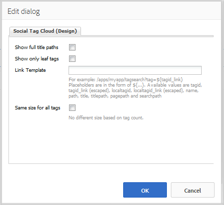

# Verwenden von einer Social-Tag-Cloud {#using-social-tag-cloud}

## Einführung {#introduction}

Die Komponente `Social Tag Cloud` hebt Tags hervor, die von Community-Mitgliedern beim Posten von Inhalten angewendet werden. Dies dient der Bestimmung beliebter Themen und ermöglicht es Site-Besuchern, gekennzeichnete Inhalte schneller aufzufinden.

Informationen zu einer weiteren Möglichkeit zur Bestimmung von Trends finden Sie unter [Aktivitätstrends](trends.md).

Diese Seite dokumentiert die Einstellungen des Komponentendialogfelds `Social Tag Cloud` und beschreibt das Benutzererlebnis.

Detaillierte Informationen für Entwickler finden Sie unter [Tag-Grundlagen](tag.md).

Informationen zum Erstellen und Verwalten von Tags sowie dazu, auf welche Inhalts-Tags angewendet wurden, finden Sie unter [Verwalten von Tags](../../help/sites-administering/tags.md) .

## Hinzufügen einer Social-Tag-Cloud {#adding-a-social-tag-cloud}

Um eine Komponente `Social Tag Cloud` im Autorenmodus zu einer Seite hinzuzufügen, suchen Sie im Komponenten-Browser nach `Communities / Social Tag Cloud` und ziehen Sie sie an die gewünschte Stelle auf einer Seite, auf der die Tag-Cloud angezeigt werden soll.

Die erforderlichen Informationen finden Sie unter [Grundlagen der Communities-Komponenten](basics.md).

Wenn die [erforderlichen clientseitigen Bibliotheken](tag.md#essentials-for-client-side) eingeschlossen sind, wird die Komponente `Social Tag Cloud` so angezeigt:

## Konfigurieren einer Social-Tag-Cloud {#configuring-social-tag-cloud}

Wählen Sie die platzierte Komponente `Social Tag Cloud` aus, um auf das Symbol `Configure` zuzugreifen, mit dem das Bearbeitungsdialogfeld geöffnet wird.

Legen Sie auf der Registerkarte **[!UICONTROL Social Tag-Cloud]** fest, welche Tags angezeigt werden sollen, und geben Sie den Ort der Suchergebnisseite an, falls es sich bei den Tags um aktive Links handelt:

* **[!UICONTROL Anzuzeigende Social Tags]** Legt fest, welche UGC-Tags angezeigt werden sollen. Die verfügbaren Optionen sind

   * `From page and child pages`
   * `All tags`

   Der Standardwert ist `From page and child pages`, wobei &quot;page&quot;auf die unten stehende Einstellung **Seite** verweist.

* **[!UICONTROL Seite]**
 (erforderlich, wenn nicht erforderlich) 
`All tags)` Der Pfad zum benutzergenerierten Inhalt einer Seite. Wird kein Pfad angegeben, verweist die Standardeinstellung automatisch auf die aktuelle Seite.

* **[!UICONTROL Keine Einschränkung bezüglich Tags]** Ist diese Option aktiviert, werden Tags in der Tag-Cloud als normaler Text dargestellt. Wenn diese Option deaktiviert ist, werden die Tags als aktive Links angezeigt, die nach allen Inhalten suchen, auf die dieses Tag angewendet wird. Standardmäßig ist die Option deaktiviert und es muss ein **[!UICONTROL Suchergebnispfad]** festgelegt werden.

* **[!UICONTROL Suchergebnispfad]**
Der Pfad zu einer Seite, auf der ein 
`Search Result` -Komponente platziert wurde, die so konfiguriert ist, dass sie auf UGC verweist, das den durch die  **** Seiteneinstellung angegebenen UGC-Pfad enthält.

## Anpassen der Anzeige einer Social-Tag-Cloud {#change-display-of-social-tag-cloud}

Um die Anzeige von **Social Tag Cloud** zu bearbeiten, geben Sie [Designmodus](../../help/sites-authoring/default-components-designmode.md) ein und doppelklicken Sie auf die platzierte Komponente `Social Tag Cloud`, um ein Dialogfeld mit einer zusätzlichen Registerkarte zu öffnen.

Geben Sie auf der Registerkarte **[!UICONTROL Social Tag Cloud (Design)]** an, wie Tags angezeigt werden sollen. Ein Tag kann ein einfaches Tag, ein einzelnes Wort im Standard-Namespace oder eine hierarchische Taxonomie sein:

* **[!UICONTROL Vollständige Titelpfade anzeigen]** Ist diese Option aktiviert, werden die Titel der übergeordneten Tags sowie der Namespace für alle verwendeten Tags angezeigt.

   Beispiel:

   * Aktiviert: `Geometrixx Media: Gadgets / Cars`
   * Deaktiviert: `Cars`

   Bei einfachen Tags ist kein Unterschied feststellbar.

   Diese Option ist standardmäßig deaktiviert.

* **[!UICONTROL Nur Leaf-Tags anzeigen]** Ist diese Option aktiviert, werden nur verwendete Tags angezeigt, in denen keine weiteren Tags enthalten sind.

   Beispielsweise bei der Tag-ID von

   `Geometrixx Media: Gadgets / Cars`

   Es gibt 3 Tags, die angewendet werden können: `Geometrixx Media (the namespace)`, `Gadgets` und `Cars`

   * Aktiviert: nur `Cars` wird angezeigt, sofern angewendet
   * deaktiviert: `Geometrixx Media` und `Gadgets`sowie `Cars` werden angezeigt, sofern angewendet

   Einfache Tags sind immer Leaf-Tags.

   Diese Option ist standardmäßig deaktiviert.

* **[!UICONTROL Verknüpfungsvorlage]** Eine Vorlage, die sich von der Standardeinstellung unterscheidet und dazu dient, Links in einer Tag-Cloud anzuzeigen, wenn diese im Dialogfeld für die Komponentenbearbeitung aktiviert wurden.

* **[!UICONTROL Gleiche Größe für alle Tags]** Ist diese Option aktiviert, werden alle Wörter einer Tag-Cloud nach demselben Muster formatiert. Wenn diese Option deaktiviert ist, werden Wörter je nach Verwendung unterschiedlich formatiert. Diese Option ist standardmäßig deaktiviert.

## Zusätzliche Informationen {#additional-information}

Weitere Informationen finden Sie auf der Seite [Tag Essentials](tag.md) für Entwickler.

Informationen zum Erstellen und Verwalten von Tags finden Sie unter [Tagging benutzergenerierter Inhalte](tag-ugc.md) (UGC) .
