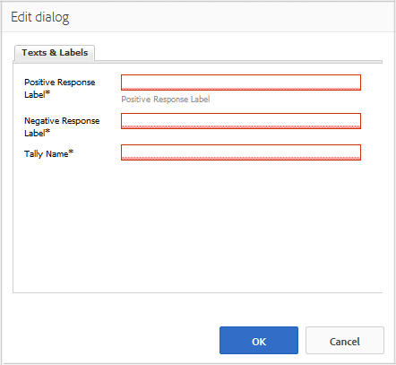

# Verwenden einer Abstimmung {#using-voting}

Die Komponente `Voting` ist ein nützliches Tool, mit dem Community-Mitglieder bestimmte Inhalte bewerten können, z. B. eine Antwort innerhalb einer QnA-Komponente. Mit der Komponente `Voting` wählen die Mitglieder Pfeile nach oben oder unten aus, um ihre Meinung anzugeben.

## Hinzufügen einer Abstimmung zu einer Seite {#adding-voting-to-a-page}

Um eine Komponente `Voting` im Autorenmodus zu einer Seite hinzuzufügen, suchen Sie im Komponenten-Browser nach `Communities / Voting` und ziehen Sie sie an die gewünschte Stelle auf einer Seite, z. B. an eine Position relativ zur Funktion, über die Benutzer abstimmen können.

Die erforderlichen Informationen finden Sie unter [Grundlagen der Communities-Komponenten](basics.md).

Wenn die [erforderlichen clientseitigen Bibliotheken](essentials-voting.md#essentials-for-client-side) eingeschlossen sind, wird die Komponente `Voting` so angezeigt.

## Konfigurieren einer Abstimmung {#configuring-voting}

Wählen Sie die platzierte Komponente `Voting` aus, um auf das Symbol `Configure` zuzugreifen, mit dem das Bearbeitungsdialogfeld geöffnet wird.

Geben Sie auf der Registerkarte **[!UICONTROL Texte und Beschriftungen]** die Eigenschaften an, die zum Aufzeichnen von Stimmen verwendet werden.

* **[!UICONTROL Beschriftung für positive Antwort]**
(
*Erforderlich*) Der interne Eigenschaftsname für eine positive Antwort.

* **[!UICONTROL Beschriftung für negative Antwort]**
(
*Erforderlich*) Der interne Eigenschaftsname für eine negative Antwort.

* **[!UICONTROL Zählername]**
(
*Erforderlich*) Der interne, identifizierbare Eigenschaftsname für diese Instanz einer Abstimmungskomponente.

## Site-Besuchererlebnis {#site-visitor-experience}

### Mitglieder {#members}

Mitglieder dürfen nur einmal abstimmen, können ihre Meinung jedoch jederzeit ändern.

### Anonym {#anonymous}

Eine anonyme Abstimmung wird nicht unterstützt. Besucher der Website müssen sich registrieren (Mitglieder werden) und anmelden, um selbst abstimmen zu können.

## Zusätzliche Informationen {#additional-information}

Weitere Informationen finden Sie auf der Seite [Grundlagen der Abstimmung](essentials-voting.md) für Entwickler.
