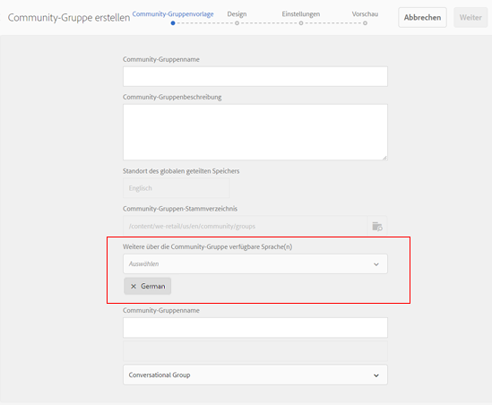

# Neue Funktionen in AEM 6.4 Communities {#what-s-new-in-aem-communities}

AEM Communities bietet Unternehmen ein Framework für die Zusammenarbeit zwischen ihren Partnern, Kunden und Mitarbeitern. Es bietet soziale Funktionen für die Website-Struktur und hilft Unternehmen, sich mit ihren Stakeholdern zu beschäftigen und ihnen Wissen zur Verfügung zu stellen, um ihren Markenwert zu verbessern.

AEM 6.4 Communities bietet Funktionen, mit denen die Benutzererfahrung in der Community verbessert und die heutigen Aufgaben von Community-Administratoren, -Moderatoren und -Managern vereinfacht werden können.

Lesen Sie für eine schnelle Einführung in neue Funktionen und Verbesserungen weiter. Siehe auch AEM 6.4 Communities [Versionshinweise](../release-notes/communities-release-notes.md). Die Dokumentation zu AEM 6.4 Communities finden Sie im [AEM 6.4 Communities-Benutzerhandbuch](home.md).

## Verwalten von Untergemeinschaften oder Community-Gruppen {#managing-sub-communities-or-community-groups}

Mit AEM Communities können Community-Administratoren mithilfe vordefinierter Vorlagen in der Autorenumgebung Gruppen und Untergruppen innerhalb der Communities-Site erstellen. Diese Gruppen dienen als Untergruppen, die viele Konfigurationen übernehmen können, wie Designs und Stile von der übergeordneten Site. Diese Gruppen können jedoch von der übergeordneten Site abweichen, z. B. wenn sie unterschiedliche Gruppen-Moderatoren haben, oder können die Sicherheitsstufe variieren. Diese Gruppen fungieren als unabhängige, vollwertige Mini-Gemeinschaften, die durch die folgenden Verbesserungen weiter gestärkt werden.

### Erstellen mehrsprachiger Gruppen in einem einzigen Schritt{#create-multi-locale-groups-in-single-step} 

Als Teil einer Community-Site können mehrsprachige Gruppen in einem einzigen Vorgang erstellt werden. **[!UICONTROL Das]** Feld Zusätzliche verfügbare Community-Gruppensprache(n) in der  **[!UICONTROL Community-]** Gruppenvorlagen-Seite, das beim Erstellen einer  [neuen Community-](groups.md) Gruppe auf einer Community-Site verfügbar ist, macht dies möglich.

Um solche Gruppen zu erstellen, können Benutzer einfach über die Sites-Konsole zur Gruppenkollektion der gewünschten Communities-Site navigieren. Erstellen Sie eine Gruppe und geben Sie die gewünschten Sprachen im Feld **[!UICONTROL Zusätzliche verfügbare Community-Gruppensprache(n)]** der Seite **[!UICONTROL Community-Gruppenvorlage]** an.

### Löschen von Community-Gruppen aus der Gruppenkonsole {#delete-community-groups-from-groups-console}

AEM 6.4 Communities bietet das Symbol &quot;Gruppe löschen&quot;für die vorhandenen Community-Gruppen in der Community-Gruppensammlung in der Community-Sites-Konsole. Dies ermöglicht das [Löschen von Gruppen](groups.md#deleting-the-group) mit einem Klick sowie das Löschen aller Elemente, die mit der Gruppe verbunden sind (z. B. Inhalte und Benutzermitgliedschaften).

### Erstellen und Zuweisen von Aktivierungsressourcen innerhalb von Gruppen {#create-and-assign-enablement-resources-within-groups}

Lerninhalte können jetzt für eine bestimmte Gruppe von Community-Mitgliedern erstellt, verwaltet und veröffentlicht werden. Aufgrund der Verfügbarkeit von Katalog- und Zuweisungsfunktionen für Community-Gruppen (und nicht nur für die gesamte Community-Site) können Aktivierungsmanager [Aktivierungsressourcen](resource.md) zuweisen und Lernpfade auch einer kleinen Gruppe von Personen zuweisen.

## Moderieren benutzergenerierter Inhalte {#moderating-user-generated-content}

AEM 6.4 Communities bietet wenig Verbesserungen der Moderation, die dazu beitragen, das tägliche Leben von Moderatoren in der Community zu erleichtern.

### Automatische Spamerkennung{#automatic-spam-detection} 

Die neue Spamerkennungs-Engine hilft beim Filtern unerwünschter und unerwünschter benutzergenerierter Inhalte auf Community-Sites oder -Gruppen. Wenn diese Funktion aktiviert ist, kann sie einen vom Benutzer generierten Inhalt basierend auf einem vordefinierten Satz von Spam-Wörtern als Spam oder Nicht Spam kennzeichnen. Moderatoren können den Inhalt weiter bearbeiten, um ihn in der Veröffentlichungsinstanz zu verweigern oder anzuzeigen. Diese Moderationsaktionen können inline oder über die Massenmoderationskonsole durchgeführt werden.

[Spam-](moderate-ugc.md#spam-detection) Erkennung findet und kennzeichnet ein bestimmtes Stück benutzergenerierten Inhalts mit 90% Genauigkeit. Diese Funktion ist jedoch nicht standardmäßig aktiviert. Um dies zu aktivieren, müssen Community-Administratoren zu configMgr auf System/Konsole navigieren und Spam Process hinzufügen.

### Neue (Antwort/Nicht beantwortet) Filter für QnA {#new-answered-unanswered-filters-for-qna}

AEM 6.4 fügt zwei [neue Filter](moderation.md#filter-rail) mit dem Namen &quot;Beantwortet und Nicht beantwortet für Fragen zur Frage der Servicequalität&quot;zur Massen-Moderationskonsole hinzu. Diese Filter sind unter Status in der Filterleiste verfügbar.

Wenn Sie den Status Beantwortet auswählen, sind alle beantworteten Fragen für den Moderator im Inhaltsbereich sichtbar. Wenn jedoch nur der Status Nicht beantwortet ausgewählt ist, sieht der Moderator den gesamten Inhalt (für alle Inhaltstypen) mit Ausnahme der beantworteten Fragen, da die Eigenschaft, die für die beantwortete Frage verantwortlich ist, nicht vorhanden ist, wenn keine Fragen beantwortet werden und andere Inhalte wie Forenthema, Blog-Artikel oder Kommentare enthalten sind.

### Lesezeichen für Moderationsfilter {#bookmark-moderation-filters}

AEM Communities bietet die Möglichkeit, die vordefinierten Moderationsfilter](moderation.md#filter-rail) in der Moderationskonsole mit einem Lesezeichen zu versehen. [ Diese gespeicherten Lesezeichen können später erneut besucht und für andere Benutzer freigegeben werden.

Benutzer müssen einfach die gewünschten Filter aus der Filterleiste in der Moderationskonsole auswählen, um die gefilterte benutzergenerierte Seite anzuzeigen und die Filter in ihren Browsern mit einem Lesezeichen zu versehen. Diese Filter werden am Ende der URL-Zeichenfolge angehängt und können daher später freigegeben, wiederverwendet und erneut besucht werden.

## Verwalten von Community-Sites {#managing-community-sites}

AEM 6.4 Communities bietet Verbesserungen bei der Site-Verwaltung, die sicherstellen, dass zahlreiche Community-Sites in verschiedenen Sprachen einfach von Site-Administratoren erstellt, verwaltet und gelöscht werden können.

### Erstellen Sie mehrere Gebietsschema-Community-Sites in einem Schritt {#create-multi-locale-community-sites-in-one-step}

AEM Communities ermöglicht die Erstellung von [mehrsprachigen Community-Sites](create-site.md) in einem einzigen Vorgang. Dies ist möglich, da mehrere Sprachen verfügbar sind, die auf der Seite **[!UICONTROL Community Site Base Language]** im Feld **[!UICONTROL Site Template]** ausgewählt werden können, während eine neue Community-Site über die Sites-Konsole erstellt wird.

Benutzer können für alle diese Sites Konfigurationsordner, Branding und viele andere Konfigurationen gleichzeitig auswählen.

### Löschen Sie Community-Sites aus der Sites-Konsole {#delete-community-sites-from-sites-console}

AEM 6.4 Communities bietet das Symbol &quot;Website löschen&quot;auf den vorhandenen Community-Sites in der Community-Sites-Konsole. Dies ermöglicht das [Löschen der Site](create-site.md) und der zugehörigen Elemente mit einem Klick.

## Verwalten von benutzergenerierten Inhalten und Benutzerprofilen {#managing-ugc-and-user-profiles}

AEM Communities hält den Benutzerdatenschutz im Mittelpunkt der Community-Erfahrung und stellt [APIs standardmäßig](user-ugc-management-service.md) und [Beispiel-Servlet](https://github.com/Adobe-Marketing-Cloud/aem-communities-ugc-migration/tree/main/bundles/communities-ugc-management-servlet) bereit. Diese APIs helfen bei der Massenverwaltung (Massenlöschung und Massenexport) von benutzergenerierten Inhalten und der Löschung von Benutzerprofilen und sind bei der Verarbeitung von DSGVO-Konformitäts-Anfragen der EU hilfreich.

## Änderungen an {#what-s-changed}

* Bei der Erstellung einer neuen Community-Site ist die Captcha-Verifizierung in AEM 6.4 Communities nicht mehr standardmäßig verfügbar. Die Communities-Site kann jedoch so angepasst werden, dass sie [Google-Komponente reCAPTCHA](https://helpx.adobe.com/experience-manager/using/aem_recaptcha.html) enthält, um die Sicherheit zu verbessern.
* Die Option zum Hochladen eines benutzerdefinierten CSS wurde aus den Community-Sites und dem Gruppendesign entfernt.
* In der Benutzeroberfläche &quot;Massenmoderation&quot;wurden die Symbole &quot;Nur Inhalt&quot;und &quot;Suche&quot;zur Filterleiste hinzugefügt.
* Der Filter Inhaltspfad wurde in der Benutzeroberfläche &quot;Filterleiste bei Massenmoderation&quot;hinzugefügt.
* Der Wechsel in den Massenmodus und der Massenmodus beenden wurden aus der Benutzeroberfläche für die Massenmoderation entfernt. Um in den Mehrfachauswahlmodus zu wechseln, klicken Sie auf das Symbol Auswählen ( ) in einem Beitrag, das angezeigt wird, wenn Sie mit der Maus (Desktop) darauf zeigen oder auf den Beitrag drücken und einen Finger gedrückt halten (Mobil).
