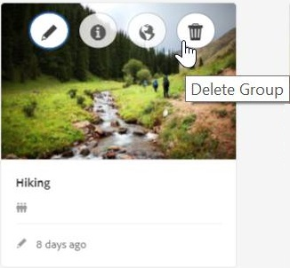

# What&#39;s New in AEM 6.4 Communities {#what-s-new-in-aem-communities}

AEM Communities bietet Unternehmen ein Framework zur Zusammenarbeit zwischen ihren Partnern, Kunden und Mitarbeitern. Es bietet soziale Möglichkeiten zur Website-Struktur und hilft Unternehmen, sich mit ihren Interessenvertretern zu beschäftigen und ihnen Wissen zu vermitteln, um ihren Markenwert auf ihre Weise zu verbessern.

AEM 6.4 Communities bietet Funktionen, um die Benutzererfahrung in der Community zu verbessern und die laufenden Aufgaben von Administratoren, Moderatoren und Managern zu erleichtern.

Lesen Sie weitere Informationen, um schnell neue Funktionen und Verbesserungen vorzustellen. Also, see AEM 6.4 Communities [release notes](../release-notes/communities-release-notes.md). Die Dokumentation zu AEM 6.4 Communities finden Sie im [AEM 6.4 Communities-Benutzerhandbuch](home.md).

## Verwalten von Untergemeinschaften oder Community-Gruppen {#managing-sub-communities-or-community-groups}

Mit AEM Communities können Community-Administratoren Gruppen und Untergruppen innerhalb der Communities-Site mithilfe vordefinierter Vorlagen in der Autorenumgebung erstellen. Diese Gruppen dienen als Untergruppen, die viele Konfigurationen übernehmen können, wie Themen und Stile von der übergeordneten Site. Diese Gruppen können jedoch von der übergeordneten Site abweichen, beispielsweise mit einem anderen Satz von Gruppenmoderatoren, oder die Sicherheitsstufe variieren. Diese Gruppen funktionieren als unabhängige, vollwertige Mini-Communities, die durch die folgenden Erweiterungen weiter gestärkt werden.

### Erstellen mehrsprachiger Gruppen in einem einzigen Schritt{#create-multi-locale-groups-in-single-step} 

Als Teil einer Community-Site können mehrsprachige Gruppen in einem einzigen Vorgang erstellt werden. **[!UICONTROL Zusätzliche verfügbare Community-Gruppensprache(n)]** auf der Seite &quot; **[!UICONTROL Community-Gruppenvorlage]** &quot;, die beim Erstellen einer [neuen Community-Gruppe](groups.md) auf einer Community-Site verfügbar ist, machen dies möglich.

Um solche Gruppen zu erstellen, können die Benutzer über die Site-Konsole einfach zur Gruppensammlung der gewünschten Communities navigieren. Erstellen Sie eine Gruppe und geben Sie die gewünschten Sprachen im Feld &quot; **[!UICONTROL Zusätzliche verfügbare Community-Gruppensprache(n)]** &quot;auf der Seite &quot; **[!UICONTROL Community-Gruppenvorlage]** &quot;an.

### Community-Gruppen aus der Gruppenkonsole löschen {#delete-community-groups-from-groups-console}

AEM 6.4 Communities stellt das Symbol &quot;Gruppe löschen&quot;für die vorhandenen Community-Gruppen in der Community-Gruppensammlung in der Community-Sites-Konsole bereit. Dies ermöglicht das Löschen[ von ](groups.md#deleting-the-group)Gruppen mit nur einem Klick sowie das Löschen aller Elemente, die mit der Gruppe verbunden sind (z. B. Inhalte und Benutzermitgliedschaften).

### Erstellen und Zuweisen von Ressourcen für die Aktivierung innerhalb von Gruppen {#create-and-assign-enablement-resources-within-groups}

Lerninhalte können jetzt für eine bestimmte Gruppe von zielgerichteten Community-Mitgliedern erstellt, verwaltet und veröffentlicht werden. Aufgrund der Verfügbarkeit von Katalog- und Zuweisungsfunktionen für Community-Gruppen (und nicht nur für die gesamte Community-Site), können Aktivierungsmanager auch einer kleinen Gruppe von Personen [Aktivierungsressourcen](resource.md) und Lernpfade zuweisen.

## Moderieren benutzergenerierter Inhalte {#moderating-user-generated-content}

AEM 6.4 Communities bietet nur wenige Verbesserungen bei der Moderation, die entscheidend zur Erleichterung des täglichen Lebens von Moderatoren in der Community beitragen.

### Automatische Spamerkennung{#automatic-spam-detection} 

Die neue Spam-Erkennungs-Engine hilft beim Herausfiltern der unerwünschten und unerwünschten Benutzergenerierten Inhalte auf Community-Sites oder -Gruppen. Wenn diese Funktion aktiviert ist, kann ein Teil des vom Benutzer generierten Inhalts basierend auf einem vordefinierten Satz von Spam-Wörtern als Spam oder Nicht Spam gekennzeichnet werden. Moderatoren können den Inhalt weiter bearbeiten, um ihn in der Veröffentlichungsinstanz zu verweigern oder zu deaktivieren. Diese Moderationsaktionen können inline oder über Massenmoderationskonsole durchgeführt werden.

[Der Spam-Detektor](moderate-ugc.md#spam-detection) findet und kennzeichnet ein bestimmtes Stück von vom Benutzer generierten Inhalten mit 90% Genauigkeit. Diese Funktion ist jedoch nicht standardmäßig aktiviert. Um dies zu aktivieren, müssen Community-Administratoren zu configMgr auf System/Konsole navigieren und Spam Process hinzufügen.

### Neue Filter (beantwortet/unbeantwortet) für QnA {#new-answered-unanswered-filters-for-qna}

AEM 6.4 fügt der Massen-Moderationskonsole zwei [neue Filter](moderation.md#filter-rail)mit dem Namen &quot;Beantwortet&quot;und &quot;Nicht beantwortet&quot;für QnA-Fragen hinzu. Diese Filter sind unter Status in der Filterleiste verfügbar.

Bei Auswahl des Status &quot;Beantwortet&quot;sind alle beantworteten Fragen für den Moderator im Inhaltsbereich sichtbar. Wenn jedoch nur der Status &quot;Nicht beantwortet&quot;ausgewählt ist, wird dem Moderator der gesamte Inhalt (für alle Inhaltstypen) mit Ausnahme der beantworteten Fragen angezeigt, da die Eigenschaft, die für die beantwortete Frage zuständig ist, nicht vorhanden ist, wenn Fragen und andere Inhalte wie Forenthema, Blog-Artikel oder Kommentare nicht beantwortet werden.

### Lesezeichen für Moderationsfilter {#bookmark-moderation-filters}

AEM Communities bietet die Möglichkeit, die vordefinierten Moderationsfilter[ in der Moderationskonsole mit einem ](moderation.md#filter-rail)Lesezeichen zu versehen. Diese gespeicherten Lesezeichen können später erneut besucht und für andere Benutzer freigegeben werden.

Die Benutzer müssen die gewünschten Filter einfach in der Filterleiste in der Moderationskonsole auswählen, um das gefilterte benutzergenerierte Benutzerkontenschutzgerät anzuzeigen und die Filter in ihren Browsern mit einem Lesezeichen zu versehen. Diese Filter werden am Ende der URL-Zeichenfolge angehängt und können daher später freigegeben, wiederverwendet und erneut aufgerufen werden.

## Verwalten von Community-Sites {#managing-community-sites}

AEM 6.4 Communities bietet Site-Management-Verbesserungen, die sicherstellen, dass zahlreiche Community-Sites in verschiedenen Sprachen einfach von Site-Administratoren erstellt, verwaltet und gelöscht werden können.

### Erstellen von Community-Sites mit mehreren Gebietsschemas in einem Schritt {#create-multi-locale-community-sites-in-one-step}

AEM Communities ermöglicht die Erstellung [mehrsprachiger Community-Sites](create-site.md) in einem einzigen Vorgang. Dies ist möglich, da mehrere Sprachen verfügbar sind, die Sie im Feld **[!UICONTROL Community Site Base Language]** auf der Seite **[!UICONTROL Site-Vorlage]** auswählen können, während Sie eine neue Community-Site aus der Site-Konsole erstellen.

Benutzer können Konfigurationsordner, Branding und viele andere Konfigurationen auf einmal für alle diese Sites auswählen.

### Löschen Sie Community-Sites aus der Site-Konsole. {#delete-community-sites-from-sites-console}

AEM 6.4 Communities stellt auf den bestehenden Community-Sites in der Community-Sites-Konsole das Symbol zum Löschen von Sites bereit. Dies ermöglicht das [Löschen der Site](create-site.md) und der zugehörigen Elemente in einem Klick.

## Managing UGC and user profiles {#managing-ugc-and-user-profiles}

AEM Communities stellt [APIs standardmäßig](user-ugc-management-service.md) und als [Beispiel-Servlet](https://github.com/Adobe-Marketing-Cloud/aem-communities-ugc-migration/tree/master/bundles/communities-ugc-management-servlet)bereit, um den Schutz von Benutzerdaten im Zentrum der Community-Erfahrung zu halten. Diese APIs unterstützen die Massenverwaltung (Massenlöschung und Massenexport) benutzergenerierter Inhalte und das Löschen von Benutzerprofilen und sind bei der Bearbeitung von EU-Anforderungen zur Einhaltung der PDF-Richtlinien von entscheidender Bedeutung.

## Änderungen {#what-s-changed}

* Die Captcha-Überprüfung ist beim Erstellen einer neuen Community-Site nicht mehr standardmäßig in AEM 6.4 Communities verfügbar. Die Communities-Site kann jedoch angepasst werden, um die [Google-Komponente reCAPTCHA](https://helpx.adobe.com/experience-manager/using/aem_recaptcha.html) für mehr Sicherheit einzuschließen.
* Die Option zum Hochladen einer benutzerdefinierten CSS wurde aus dem Design der Community-Sites und -Gruppen entfernt.
* In der Benutzeroberfläche &quot;Massenmoderation&quot;der Filterleiste wurden Symbole für &quot;Nur Inhalt&quot;und &quot;Suche&quot;hinzugefügt.
* Der Filter &quot;Inhaltspfad&quot;wurde in der Benutzeroberfläche &quot;Filterleiste in Massenmoderation&quot;hinzugefügt.
* Der Wechsel zum Massenmodus und der Ausstiegsstapelmodus wurden aus der Benutzeroberfläche für die Massenmoderation entfernt. Um in den Mehrfachauswahlmodus zu wechseln, klicken Sie auf das Symbol Auswählen ( ) in einem Beitrag, das angezeigt wird, wenn Sie den Mauszeiger über diesen Beitrag bewegen (Desktop) oder indem Sie mit dem Finger auf den Beitrag drücken (Mobil).
