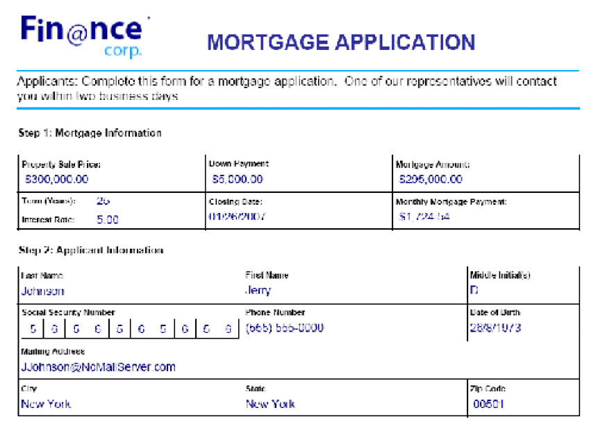

# Umgang mit übermittelten Forms {#handling-submitted-forms}

Webbasierte Anwendungen, mit denen Benutzer interaktive Formulare ausfüllen können, erfordern, dass die Daten an den Server zurückgesendet werden. Mithilfe des Forms-Dienstes können Sie die Daten abrufen, die der Benutzer in ein interaktives Formular eingegeben hat. Nachdem Sie die Daten abgerufen haben, können Sie sie verarbeiten, um Ihre Geschäftsanforderungen zu erfüllen. Sie können beispielsweise die Daten in einer Datenbank speichern, an eine andere Anwendung senden, die Daten an einen anderen Dienst senden, die Daten in einem Formularentwurf zusammenführen, die Daten in einem Webbrowser anzeigen usw.

Formulardaten werden entweder als XML- oder PDF-Daten an den Forms-Dienst gesendet. Dies ist eine Option, die in Designer festgelegt ist. Ein Formular, das als XML gesendet wird, ermöglicht es Ihnen, einzelne Felddatenwerte zu extrahieren. Das heißt, Sie können den Wert jedes Formularfelds extrahieren, das der Benutzer in das Formular eingegeben hat. Ein Formular, das als PDF-Daten übermittelt wird, sind Binärdaten, keine XML-Daten. Sie können das Formular als PDF-Datei speichern oder an einen anderen Dienst senden. Wenn Sie Daten aus einem als XML gesendeten Formular extrahieren und dann die Formulardaten zum Erstellen eines PDF-Dokuments verwenden möchten, rufen Sie einen weiteren AEM Forms-Vorgang auf. (Siehe [Erstellen von PDF-Dokumenten mit gesendeten XML-Daten](/help/forms/developing/creating-pdf-documents-submitted-xml.md))

Das folgende Diagramm zeigt Daten, die an ein Java-Servlet mit dem Namen `HandleData` aus einem interaktiven Formular, das in einem Webbrowser angezeigt wird.

In der folgenden Tabelle werden die Schritte im Diagramm erläutert.

<table>
 <thead>
  <tr>
   <th>
Schritt
</th>
   <th>
Beschreibung
</th>
  </tr>
 </thead>
 <tbody>
  <tr>
   <td>
1
</td>
   <td>
Ein Benutzer füllt ein interaktives Formular aus und klickt auf die Senden-Schaltfläche des Formulars.
</td>
  </tr>
  <tr>
   <td>
2
</td>
   <td>
Die Daten werden an die <code>HandleData</code> Java-Servlet als XML-Daten.
</td>
  </tr>
  <tr>
   <td>
3
</td>
   <td>
Die <code>HandleData</code> Java Servlet enthält Anwendungslogik zum Abrufen der Daten.
</td>
  </tr>
 </tbody>
</table>

## Umgang mit gesendeten XML-Daten {#handling-submitted-xml-data}

Wenn Formulardaten als XML gesendet werden, können Sie XML-Daten abrufen, die die gesendeten Daten darstellen. Alle Formularfelder werden als Knoten in einem XML-Schema angezeigt. Die Knotenwerte entsprechen den vom Benutzer eingegebenen Werten. Betrachten Sie ein Kreditantrag, bei dem jedes Feld im Formular als Knoten in den XML-Daten angezeigt wird. Der Wert jedes Knotens entspricht dem Wert, den ein Benutzer ausfüllt. Angenommen, ein Benutzer füllt das Darlehensformular mit Daten, die im folgenden Formular angezeigt werden.

Die folgende Abbildung zeigt die entsprechenden XML-Daten, die mithilfe der Forms-Dienst-Client-API abgerufen werden.

Die Felder im Darlehensformular. Diese Werte können mit Java XML-Klassen abgerufen werden.

>[!NOTE]
>
>Der Formularentwurf muss in Designer ordnungsgemäß konfiguriert sein, damit Daten als XML-Daten gesendet werden können. Um den Formularentwurf ordnungsgemäß zum Senden von XML-Daten zu konfigurieren, stellen Sie sicher, dass die Schaltfläche Senden im Formularentwurf auf Senden von XML-Daten eingestellt ist. Informationen zum Festlegen der Senden-Schaltfläche zum Senden von XML-Daten finden Sie unter [AEM Forms Designer](https://www.adobe.com/go/learn_aemforms_designer_63).

## Umgang mit übermittelten PDF-Daten {#handling-submitted-pdf-data}

Stellen Sie sich eine Webanwendung vor, die den Forms-Dienst aufruft. Nachdem der Forms-Dienst ein interaktives PDF-Formular an einen Client-Webbrowser rendert hat, füllt der Benutzer das Formular aus und sendet es als PDF-Daten zurück. Wenn der Forms-Dienst die PDF-Daten erhält, kann er die PDF-Daten an einen anderen Dienst senden oder als PDF-Datei speichern. Das folgende Diagramm zeigt den Logikfluss der Anwendung.

Die folgende Tabelle beschreibt die Schritte in diesem Diagramm.

<table>
 <thead>
  <tr>
   <th>
Schritt
</th>
   <th>
Beschreibung
</th>
  </tr>
 </thead>
 <tbody>
  <tr>
   <td>
1
</td>
   <td>
Eine Webseite enthält einen Link, der auf ein Java-Servlet zugreift, das den Forms-Dienst aufruft.
</td>
  </tr>
  <tr>
   <td>
2
</td>
   <td>
Der Forms-Dienst rendert ein interaktives PDF-Formular an den Client-Webbrowser.
</td>
  </tr>
  <tr>
   <td>
3
</td>
   <td>
Der Benutzer füllt ein interaktives Formular aus und klickt auf eine Senden-Schaltfläche. Das Formular wird als PDF-Daten an den Forms-Dienst zurückgesendet. Diese Option wird in Designer festgelegt.
</td>
  </tr>
  <tr>
   <td>
4
</td>
   <td>
Der Forms-Dienst speichert die PDF-Daten als PDF-Datei. 
</td>
  </tr>
 </tbody>
</table>

## Umgang mit gesendeten URL-UTF-16-Daten {#handling-submitted-url-utf-16-data}

Wenn Formulardaten als URL-UTF-16-Daten gesendet werden, erfordert der Client-Computer Adobe Reader oder Acrobat 8.1 oder höher. Enthält der Formularentwurf außerdem eine Senden-Schaltfläche mit URL-kodierten Daten (HTTP Post) und die Datenkodierungsoption UTF-16, muss der Formularentwurf in einem Texteditor wie Notepad geändert werden. Sie können die Kodierungsoption auf Folgendes festlegen: `UTF-16LE` oder `UTF-16BE` für die Senden-Schaltfläche. Designer bietet diese Funktion nicht.

>[!NOTE]
>
>Weitere Informationen zum Forms-Dienst finden Sie unter [Dienstreferenz für AEM Forms](https://www.adobe.com/go/learn_aemforms_services_63).

## Zusammenfassung der Schritte {#summary-of-steps}

Führen Sie die folgenden Aufgaben aus, um gesendete Formulare zu verarbeiten:

1. Projektdateien einschließen.
1. Erstellen Sie ein Forms Client-API-Objekt.
1. Rufen Sie Formulardaten ab.
1. Bestimmen Sie, ob die Formularübermittlung Dateianlagen enthält.
1. Verarbeiten Sie die gesendeten Daten.

**Projektdateien einschließen**

Fügen Sie die erforderlichen Dateien in Ihr Entwicklungsprojekt ein. Wenn Sie eine Clientanwendung mit Java erstellen, schließen Sie die erforderlichen JAR-Dateien ein. Wenn Sie Webdienste verwenden, stellen Sie sicher, dass Sie die Proxy-Dateien einschließen.

**Erstellen eines Forms Client-API-Objekts**

Bevor Sie einen Client-API-Vorgang für den Forms-Dienst programmgesteuert ausführen können, müssen Sie einen Forms-Dienstclient erstellen. Wenn Sie die Java-API verwenden, erstellen Sie eine `FormsServiceClient` -Objekt. Wenn Sie die Forms-Webdienst-API verwenden, erstellen Sie eine `FormsService` -Objekt.

**Abrufen von Formulardaten**

Um die gesendeten Formulardaten abzurufen, rufen Sie die `FormsServiceClient` -Objekt `processFormSubmission` -Methode. Beim Aufrufen dieser Methode müssen Sie den Inhaltstyp des gesendeten Formulars angeben. Wenn Daten von einem Client-Webbrowser an den Forms-Dienst gesendet werden, können sie entweder als XML- oder als PDF-Daten gesendet werden. Um die in Formularfelder eingegebenen Daten abzurufen, können die Daten als XML-Daten gesendet werden.

Sie können auch Formularfelder aus einem Formular abrufen, das als PDF-Daten gesendet wurde, indem Sie die folgenden Laufzeitoptionen festlegen:

* Übergeben Sie den folgenden Wert an die `processFormSubmission` -Methode als Inhaltstypparameter: `CONTENT_TYPE=application/pdf`.
* Legen Sie die `RenderOptionsSpec` -Objekt `PDFToXDP` Wert zu `true`
* Legen Sie die `RenderOptionsSpec` -Objekt `ExportDataFormat` Wert zu `XMLData`

Sie geben den Inhaltstyp des gesendeten Formulars an, wenn Sie die `processFormSubmission` -Methode. In der folgenden Liste sind die zutreffenden Inhaltstypwerte aufgeführt:

* **text/xml**: Stellt den Inhaltstyp dar, der verwendet werden soll, wenn ein PDF-Formular Formulardaten als XML sendet.
* **application/x-www-form-urlencoded**: Stellt den Inhaltstyp dar, der verwendet werden soll, wenn ein HTML-Formular Daten als XML sendet.
* **application/pdf**: Stellt den Inhaltstyp dar, der verwendet werden soll, wenn ein PDF-Formular Daten als PDF sendet.

>[!NOTE]
>
>Sie werden feststellen, dass dem Abschnitt Umgang mit gesendeten Forms drei entsprechende Schnellstarts zugeordnet sind. Die Handling-PDF forms, die als PDF mit dem Java-API-Schnellstart gesendet wurden, zeigen, wie gesendete PDF-Daten verarbeitet werden. Der in diesem Schnellstart angegebene Inhaltstyp lautet `application/pdf`. Der Schnellstart Handling-PDF forms, die mit dem Java-API-Schnellstart als XML gesendet wurden, zeigt, wie gesendete XML-Daten verarbeitet werden, die von einem PDF-Formular gesendet werden. Der in diesem Schnellstart angegebene Inhaltstyp lautet `text/xml`. Ebenso zeigt der Schnellstart Handling HTML forms , der als XML mit dem Java-API-Schnellstart gesendet wurde, wie gesendete XML-Daten verarbeitet werden, die von einem HTML-Formular gesendet werden. Der in diesem Schnellstart angegebene Inhaltstyp ist application/x-www-form-urlencoded.

Sie rufen Formulardaten ab, die an den Forms-Dienst gesendet wurden, und bestimmen den Verarbeitungsstatus. Das heißt, wenn Daten an den Forms-Dienst gesendet werden, bedeutet dies nicht unbedingt, dass der Forms-Dienst die Verarbeitung der Daten abgeschlossen hat und die Daten bereit zur Verarbeitung sind. Beispielsweise können Daten an den Forms-Dienst gesendet werden, damit eine Berechnung durchgeführt werden kann. Nach Abschluss der Berechnung wird das Formular mit den angezeigten Berechnungsergebnissen an den Benutzer zurückgegeben. Bevor Sie gesendete Daten verarbeiten, sollten Sie ermitteln, ob der Forms-Dienst die Verarbeitung der Daten abgeschlossen hat.

Der Forms-Dienst gibt die folgenden Werte zurück, um anzugeben, ob die Verarbeitung der Daten abgeschlossen ist:

* **0 (Senden):** Gesendete Daten können verarbeitet werden.
* **1 (Berechnen):** Der Forms-Dienst hat einen Berechnungsvorgang für die Daten durchgeführt und die Ergebnisse müssen an den Benutzer zurückgegeben werden.
* **2 (Validieren):** Der Forms-Dienst hat die Formulardaten validiert und die Ergebnisse müssen an den Benutzer zurückgegeben werden.
* **3 (Weiter):** Die aktuelle Seite wurde mit Ergebnissen geändert, die in die Client-Anwendung geschrieben werden müssen.
* **4 (Vorherige**): Die aktuelle Seite wurde mit Ergebnissen geändert, die in die Client-Anwendung geschrieben werden müssen.

>[!NOTE]
>
>Berechnungen und Überprüfungen müssen an den Benutzer zurückgegeben werden. (Siehe [Formulardaten berechnen](/help/forms/developing/calculating-form-data.md#calculating-form-data).

**Bestimmen, ob die Formularübermittlung Dateianlagen enthält**

Forms, das an den Forms-Dienst gesendet wird, kann Dateianlagen enthalten. Beispielsweise kann ein Benutzer mithilfe des integrierten Anlagenbereichs von Acrobat Dateianlagen auswählen, die zusammen mit dem Formular gesendet werden sollen. Außerdem können Benutzer Dateianlagen auch über eine HTML-Symbolleiste auswählen, die mit einer HTML-Datei gerendert wird.

Nachdem Sie festgestellt haben, ob ein Formular Dateianhänge enthält, können Sie die Daten verarbeiten. Sie können beispielsweise den Dateianhang im lokalen Dateisystem speichern.

>[!NOTE]
>
>Das Formular muss als PDF-Daten gesendet werden, um Dateianlagen abzurufen. Wenn das Formular als XML-Daten gesendet wird, werden keine Dateianlagen gesendet.

**Verarbeiten der gesendeten Daten**

Je nach Inhaltstyp der gesendeten Daten können Sie die individuellen Formularfeldwerte aus den gesendeten XML-Daten extrahieren oder die gesendeten PDF-Daten als PDF-Datei speichern (oder an einen anderen Dienst senden). Um einzelne Formularfelder zu extrahieren, konvertieren Sie gesendete XML-Daten in eine XML-Datenquelle und rufen Sie dann XML-Datenquellenwerte ab, indem Sie `org.w3c.dom` Klassen.

**Siehe auch**

[Einbeziehung von AEM Forms Java-Bibliotheksdateien](/help/forms/developing/invoking-aem-forms-using-java.md#including-aem-forms-java-library-files)

[Verbindungseigenschaften festlegen](/help/forms/developing/invoking-aem-forms-using-java.md#setting-connection-properties)

[Schnellstarts zur Forms Service-API](/help/forms/developing/forms-service-api-quick-starts.md#forms-service-api-quick-starts)

[Übergeben von Dokumenten an den Forms-Dienst](/help/forms/developing/passing-documents-forms-service.md)

[Erstellen von Webanwendungen, die Forms rendern](/help/forms/developing/creating-web-applications-renders-forms.md)

## Verarbeiten gesendeter Formulare mit der Java-API {#handle-submitted-forms-using-the-java-api}

Verarbeiten Sie ein gesendetes Formular mit der Forms-API (Java):

1. Projektdateien einschließen

   Schließen Sie Client-JAR-Dateien wie adobe-forms-client.jar in den Klassenpfad Ihres Java-Projekts ein.

1. Erstellen eines Forms Client-API-Objekts

   * Erstellen Sie ein `ServiceClientFactory`-&quot; -Objekt, das Verbindungseigenschaften enthält.
   * Erstellen Sie eine `FormsServiceClient` -Objekt durch Verwendung seines Konstruktors und Übergabe des `ServiceClientFactory` -Objekt.

1. Abrufen von Formulardaten

   * Um Formulardaten abzurufen, die in einem Java-Servlet veröffentlicht wurden, erstellen Sie eine `com.adobe.idp.Document` -Objekt durch Verwendung seines Konstruktors und Aufrufen der `javax.servlet.http.HttpServletResponse` -Objekt `getInputStream` -Methode innerhalb des Konstruktors.
   * Erstellen Sie ein Objekt `RenderOptionsSpec`, indem Sie den Konstruktor verwenden. Festlegen des Gebietsschemawerts durch Aufrufen der `RenderOptionsSpec` -Objekt `setLocale` -Methode verwenden und einen string -Wert übergeben, der den Gebietsschema-Wert angibt.

   >[!NOTE]
   >
   >Sie können den Forms-Dienst anweisen, XDP- oder XML-Daten aus gesendeten PDF-Inhalten zu erstellen, indem Sie die `RenderOptionsSpec` -Objekt `setPDF2XDP` Methode und Übergabe `true` und `setXMLData` und übergeben `true`. Sie können dann die `FormsResult` -Objekt `getOutputXML` -Methode zum Abrufen der XML-Daten, die den XDP-/XML-Daten entsprechen. (Die `FormsResult` -Objekt wird von der `processFormSubmission`* -Methode, die im nächsten Unterschritt erläutert wird.)*

   * Rufen Sie die `FormsServiceClient` -Objekt `processFormSubmission` -Methode verwenden und die folgenden Werte übergeben:

      * Die `com.adobe.idp.Document` -Objekt, das die Formulardaten enthält.
      * Ein string -Wert, der Umgebungsvariablen einschließlich aller relevanten HTTP-Header angibt. Geben Sie den zu verarbeitenden Inhaltstyp an. Um XML-Daten zu verarbeiten, geben Sie den folgenden Zeichenfolgenwert für diesen Parameter an: `CONTENT_TYPE=text/xml`. Um PDF-Daten zu verarbeiten, geben Sie den folgenden Zeichenfolgenwert für diesen Parameter an: `CONTENT_TYPE=application/pdf`.
      * Ein string -Wert, der die `HTTP_USER_AGENT` -Kopfzeilenwert, z. B. . `Mozilla/4.0 (compatible; MSIE 6.0; Windows NT 5.1; SV1; .NET CLR 1.1.4322)`. Dieser Parameterwert ist optional.
      * A `RenderOptionsSpec` -Objekt, das Laufzeitoptionen speichert.

      Die `processFormSubmission` -Methode gibt eine `FormsResult` -Objekt, das die Ergebnisse der Formularübermittlung enthält.

   * Stellen Sie fest, ob der Forms-Dienst die Verarbeitung der Formulardaten abgeschlossen hat, indem Sie die `FormsResult` -Objekt `getAction` -Methode. Wenn diese Methode den Wert zurückgibt `0`, können die Daten verarbeitet werden.

1. Bestimmen, ob die Formularübermittlung Dateianlagen enthält

   * Rufen Sie die `FormsResult` -Objekt `getAttachments` -Methode. Diese Methode gibt eine `java.util.List` -Objekt, das Dateien enthält, die mit dem Formular gesendet wurden.
   * Iteration durch die `java.util.List` -Objekt, um zu bestimmen, ob Dateianlagen vorhanden sind. Wenn Dateianlagen vorhanden sind, ist jedes Element ein `com.adobe.idp.Document` -Instanz. Sie können die Dateianlagen speichern, indem Sie die `com.adobe.idp.Document` -Objekt `copyToFile` -Methode und Übergeben einer `java.io.File` -Objekt.

   >[!NOTE]
   >
   >Dieser Schritt ist nur anwendbar, wenn das Formular als PDF übermittelt wird.

1. Verarbeiten der gesendeten Daten

   * Wenn der Dateninhaltstyp `application/vnd.adobe.xdp+xml` oder `text/xml`, erstellen Sie eine Anwendungslogik, um XML-Datenwerte abzurufen.

      * Erstellen Sie eine `com.adobe.idp.Document` -Objekt durch Aufrufen der `FormsResult` -Objekt `getOutputContent` -Methode.
      * Erstellen Sie eine `java.io.InputStream` -Objekt durch Aufrufen der `java.io.DataInputStream` Konstruktor und Übergabe der `com.adobe.idp.Document` -Objekt.
      * Erstellen Sie eine `org.w3c.dom.DocumentBuilderFactory` -Objekt durch Aufrufen des statischen `org.w3c.dom.DocumentBuilderFactory` -Objekt `newInstance` -Methode.
      * Erstellen Sie eine `org.w3c.dom.DocumentBuilder` -Objekt durch Aufrufen der `org.w3c.dom.DocumentBuilderFactory` -Objekt `newDocumentBuilder` -Methode.
      * Erstellen Sie eine `org.w3c.dom.Document` -Objekt durch Aufrufen der `org.w3c.dom.DocumentBuilder` -Objekt `parse` -Methode und Übergabe der `java.io.InputStream` -Objekt.
      * Rufen Sie den Wert jedes Knotens im XML-Dokument ab. Eine Möglichkeit, diese Aufgabe durchzuführen, besteht darin, eine benutzerdefinierte Methode zu erstellen, die zwei Parameter akzeptiert: die `org.w3c.dom.Document` -Objekt und den Namen des Knotens, dessen Wert Sie abrufen möchten. Diese Methode gibt einen Zeichenfolgenwert zurück, der den Wert des Knotens darstellt. Im Code-Beispiel, das diesem Prozess folgt, wird diese benutzerdefinierte Methode aufgerufen `getNodeText`. Der Hauptteil dieser Methode wird angezeigt.
   * Wenn der Dateninhaltstyp `application/pdf`, erstellen Sie eine Anwendungslogik, um die übermittelten PDF-Daten als PDF-Datei zu speichern.

      * Erstellen Sie eine `com.adobe.idp.Document` -Objekt durch Aufrufen der `FormsResult` -Objekt `getOutputContent` -Methode.
      * Erstellen Sie eine `java.io.File` -Objekt durch Verwendung seines öffentlichen Konstruktors. Stellen Sie sicher, dass Sie PDF als Dateinamenerweiterung angeben.
      * Füllen Sie die PDF-Datei, indem Sie die `com.adobe.idp.Document` -Objekt `copyToFile` -Methode und Übergabe der `java.io.File` -Objekt.

**Siehe auch**

[Schnellstart (SOAP-Modus): Umgang mit als XML gesendeten PDF forms mithilfe der Java-API](/help/forms/developing/forms-service-api-quick-starts.md#quick-start-soap-mode-handling-pdf-forms-submitted-as-xml-using-the-java-api)

[Schnellstart (SOAP-Modus): Umgang mit als XML gesendeten HTML-Formularen mithilfe der Java-API](/help/forms/developing/forms-service-api-quick-starts.md#quick-start-soap-mode-handling-html-forms-submitted-as-xml-using-the-java-api)

[Schnellstart (SOAP-Modus): Umgang mit als PDF gesendeten PDF forms mithilfe der Java-API](/help/forms/developing/forms-service-api-quick-starts.md#quick-start-soap-mode-handling-pdf-forms-submitted-as-pdf-using-the-java-api)

[Einbeziehung von AEM Forms Java-Bibliotheksdateien](/help/forms/developing/invoking-aem-forms-using-java.md#including-aem-forms-java-library-files)

[Verbindungseigenschaften festlegen](/help/forms/developing/invoking-aem-forms-using-java.md#setting-connection-properties)

## Verarbeiten gesendeter PDF-Daten mit der Webdienst-API {#handle-submitted-pdf-data-using-the-web-service-api}

Verarbeiten Sie ein gesendetes Formular mit der Forms-API (Webdienst):

1. Projektdateien einschließen

   * Erstellen Sie Java-Proxyklassen, die die Forms-Dienst-WSDL verwenden.
   * Schließen Sie die Java-Proxy-Klassen in Ihren Klassenpfad ein.

1. Erstellen eines Forms Client-API-Objekts

   Erstellen Sie eine `FormsService` Objekt und legen Sie Authentifizierungswerte fest.

1. Abrufen von Formulardaten

   * Um Formulardaten abzurufen, die in einem Java-Servlet veröffentlicht wurden, erstellen Sie eine `BLOB` -Objekt durch Verwendung seines -Konstruktors.
   * Erstellen Sie eine `java.io.InputStream` -Objekt durch Aufrufen der `javax.servlet.http.HttpServletResponse` -Objekt `getInputStream` -Methode.
   * Erstellen Sie eine `java.io.ByteArrayOutputStream` -Objekt mithilfe des Konstruktors und Übergabe der Länge des `java.io.InputStream` -Objekt.
   * Den Inhalt der `java.io.InputStream` Objekt in `java.io.ByteArrayOutputStream` -Objekt.
   * Erstellen Sie ein Byte-Array durch Aufrufen der `java.io.ByteArrayOutputStream` -Objekt `toByteArray` -Methode.
   * Füllen Sie die `BLOB` -Objekt durch Aufrufen seiner `setBinaryData` -Methode verwenden und das Byte-Array als Argument übergeben.
   * Erstellen Sie ein Objekt `RenderOptionsSpec`, indem Sie den Konstruktor verwenden. Festlegen des Gebietsschemawerts durch Aufrufen der `RenderOptionsSpec` -Objekt `setLocale` -Methode verwenden und einen string -Wert übergeben, der den Gebietsschema-Wert angibt.
   * Rufen Sie die `FormsService` -Objekt `processFormSubmission` -Methode verwenden und die folgenden Werte übergeben:

      * Die `BLOB` -Objekt, das die Formulardaten enthält.
      * Ein string -Wert, der Umgebungsvariablen einschließlich aller relevanten HTTP-Header angibt. Geben Sie den zu verarbeitenden Inhaltstyp an. Um XML-Daten zu verarbeiten, geben Sie den folgenden Zeichenfolgenwert für diesen Parameter an: `CONTENT_TYPE=text/xml`. Um PDF-Daten zu verarbeiten, geben Sie den folgenden Zeichenfolgenwert für diesen Parameter an: `CONTENT_TYPE=application/pdf`.
      * Ein string -Wert, der die `HTTP_USER_AGENT` Header-Wert; Beispiel: `Mozilla/4.0 (compatible; MSIE 6.0; Windows NT 5.1; SV1; .NET CLR 1.1.4322)`.
      * A `RenderOptionsSpec` -Objekt, das Laufzeitoptionen speichert.
      * Ein leeres `BLOBHolder` -Objekt, das von der -Methode aufgefüllt wird.
      * Ein leeres `javax.xml.rpc.holders.StringHolder` -Objekt, das von der -Methode aufgefüllt wird.
      * Ein leeres `BLOBHolder` -Objekt, das von der -Methode aufgefüllt wird.
      * Ein leeres `BLOBHolder` -Objekt, das von der -Methode aufgefüllt wird.
      * Ein leeres `javax.xml.rpc.holders.ShortHolder` -Objekt, das von der -Methode aufgefüllt wird.
      * Ein leeres `MyArrayOf_xsd_anyTypeHolder` -Objekt, das von der -Methode aufgefüllt wird. Dieser Parameter wird zum Speichern von Dateianlagen verwendet, die zusammen mit dem Formular gesendet werden.
      * Ein leeres `FormsResultHolder` -Objekt, das von der -Methode mit dem gesendeten Formular gefüllt wird.

      Die `processFormSubmission` -Methode füllt die `FormsResultHolder` mit den Ergebnissen der Formularübermittlung.

   * Stellen Sie fest, ob der Forms-Dienst die Verarbeitung der Formulardaten abgeschlossen hat, indem Sie die `FormsResult` -Objekt `getAction` -Methode. Wenn diese Methode den Wert zurückgibt `0`, sind die Formulardaten zur Verarbeitung bereit. Sie erhalten eine `FormsResult` -Objekt durch Abrufen des Werts der `FormsResultHolder` -Objekt `value` Datenelement.

1. Bestimmen, ob die Formularübermittlung Dateianlagen enthält

   Den Wert der `MyArrayOf_xsd_anyTypeHolder` -Objekt `value` Datenelement (das `MyArrayOf_xsd_anyTypeHolder` -Objekt wurde an die `processFormSubmission` -Methode). Dieses Datenelement gibt ein Array von `Objects`. Jedes Element innerhalb der `Object` Array ist ein `Object`entspricht den Dateien, die zusammen mit dem Formular gesendet wurden. Sie können jedes Element im Array abrufen und in eine `BLOB` -Objekt.

1. Verarbeiten der gesendeten Daten

   * Wenn der Dateninhaltstyp `application/vnd.adobe.xdp+xml` oder `text/xml`, erstellen Sie eine Anwendungslogik, um XML-Datenwerte abzurufen.

      * Erstellen Sie eine `BLOB` -Objekt durch Aufrufen der `FormsResult` -Objekt `getOutputContent` -Methode.
      * Erstellen Sie ein Byte-Array durch Aufrufen der `BLOB` -Objekt `getBinaryData` -Methode.
      * Erstellen Sie eine `java.io.InputStream` -Objekt durch Aufrufen der `java.io.ByteArrayInputStream` -Konstruktor erstellen und das Byte-Array übergeben.
      * Erstellen Sie eine `org.w3c.dom.DocumentBuilderFactory` -Objekt durch Aufrufen des statischen `org.w3c.dom.DocumentBuilderFactory` -Objekt `newInstance` -Methode.
      * Erstellen Sie eine `org.w3c.dom.DocumentBuilder` -Objekt durch Aufrufen der `org.w3c.dom.DocumentBuilderFactory` -Objekt `newDocumentBuilder` -Methode.
      * Erstellen Sie eine `org.w3c.dom.Document` -Objekt durch Aufrufen der `org.w3c.dom.DocumentBuilder` -Objekt `parse` -Methode und Übergabe der `java.io.InputStream` -Objekt.
      * Rufen Sie den Wert jedes Knotens im XML-Dokument ab. Eine Möglichkeit, diese Aufgabe durchzuführen, besteht darin, eine benutzerdefinierte Methode zu erstellen, die zwei Parameter akzeptiert: die `org.w3c.dom.Document` -Objekt und den Namen des Knotens, dessen Wert Sie abrufen möchten. Diese Methode gibt einen Zeichenfolgenwert zurück, der den Wert des Knotens darstellt. Im Code-Beispiel, das diesem Prozess folgt, wird diese benutzerdefinierte Methode aufgerufen `getNodeText`. Der Hauptteil dieser Methode wird angezeigt.
   * Wenn der Dateninhaltstyp `application/pdf`, erstellen Sie eine Anwendungslogik, um die übermittelten PDF-Daten als PDF-Datei zu speichern.

      * Erstellen Sie eine `BLOB` -Objekt durch Aufrufen der `FormsResult` -Objekt `getOutputContent` -Methode.
      * Erstellen Sie ein Byte-Array durch Aufrufen der `BLOB` -Objekt `getBinaryData` -Methode.
      * Erstellen Sie eine `java.io.File` -Objekt durch Verwendung seines öffentlichen Konstruktors. Stellen Sie sicher, dass Sie PDF als Dateinamenerweiterung angeben.
      * Erstellen Sie ein `java.io.FileOutputStream`-Objekt, indem Sie seinen Konstruktor verwenden und das `java.io.File`-Objekt übergeben.
      * Füllen Sie die PDF-Datei, indem Sie die `java.io.FileOutputStream` -Objekt `write` -Methode verwenden und das Byte-Array übergeben.

**Siehe auch**

[Aufrufen von AEM Forms mit Base64-Kodierung](/help/forms/developing/invoking-aem-forms-using-web.md#invoking-aem-forms-using-base64-encoding)
