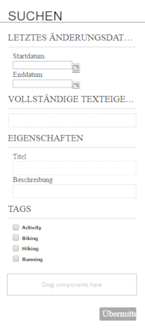
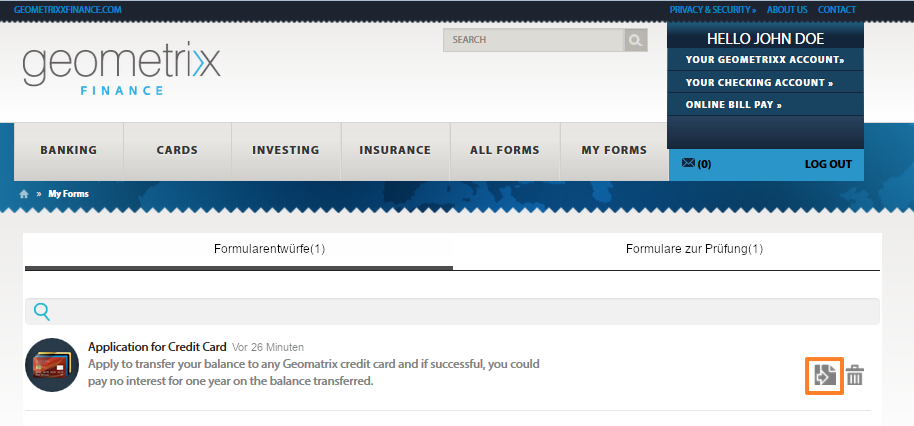

# Öffnen und Ausfüllen veröffentlichter Formulare {#accessing-and-filling-published-forms}

>[!CAUTION]
>
>AEM 6.4 hat das Ende der erweiterten Unterstützung erreicht und diese Dokumentation wird nicht mehr aktualisiert. Weitere Informationen finden Sie in unserer [technische Unterstützung](https://helpx.adobe.com/de/support/programs/eol-matrix.html). Unterstützte Versionen suchen [here](https://experienceleague.adobe.com/docs/?lang=de).

In einer formularzentrierten Portal-Bereitstellung sind die Formularentwicklung und die Portalentwicklung zwei unterschiedliche Aktivitäten. Während Formularentwickler Formulare in einem Repository entwerfen und speichern, erstellen Webentwickler eine Webanwendung, um Formulare aufzulisten und Übermittlungen zu verarbeiten. Forms wird dann in die Webstufe kopiert, da keine Kommunikation zwischen dem Formular-Repository und der Webanwendung besteht.

Dies führt häufig zu Problemen bei der Verwaltung der Einrichtung und zu Produktionsverzögerungen. Wenn beispielsweise eine neuere Version eines Formulars im Repository verfügbar ist, ersetzt der Formularentwickler das Formular auf der Webstufe, ändert die Webanwendung und stellt das Formular erneut auf der öffentlichen Website bereit. Eine erneute Bereitstellung der Webanwendung kann zu Serverausfällen führen. Da der Serverausfall eine geplante Aktivität ist, können die Änderungen nicht sofort an die öffentliche Site gesendet werden.

Forms Portal reduziert den Verwaltungsaufwand und Produktionsverzögerungen. Es bietet Webentwicklern Komponenten zum Erstellen und Anpassen eines Formularportals auf mit Adobe Experience Manager (AEM) erstellten Websites.

Weitere Informationen zu Forms Portal und seinen Funktionen finden Sie unter [Einführung in das Veröffentlichen von Formularen in einem Portal](/help/forms/using/introduction-publishing-forms.md).

## Erste Schritte mit dem Forms Portal {#getting-started-with-forms-portal}

Navigieren Sie zur veröffentlichten Forms Portal-Seite. Weitere Informationen zum Erstellen einer Forms Portal-Seite finden Sie unter [Erstellen einer Forms Portal-Seite](/help/forms/using/creating-form-portal-page.md).

Die Komponente „Search &amp; Lister“ von Forms Portal zeigt die in der Veröffentlichungsinstanz des AEM-Servers verfügbaren Formulare. Diese Liste enthält alle Formulare oder die im Filter zum Zeitpunkt der Erstellung der Forms Portal-Seite definierten Formulare. Eine Forms Portal-Seite sieht ähnlich aus wie in der folgenden Abbildung dargestellt:

**Abbildung:** *Beispiel einer Forms Portal-Seite*

### Search &amp; Lister {#search-and-lister}

Mit der Komponente &quot;Search &amp; Lister&quot;können Sie Ihrem Formularportal die folgenden Funktionen hinzufügen:

* Auflisten von Formularen in der Bedienfeld-, Karten- oder Rasteransicht, die standardmäßig verfügbar sind. Es werden auch benutzerdefinierte templatesList-Formulare aus bestimmten Ordnern in Forms Manager unterstützt.
* Geben Sie an, wie Formulare wiedergegeben werden: HTML5, PDF oder beides.
* Geben Sie an, wie PDF- und XFA-Formulare wiedergegeben werden - HTML5, PDF oder beides. Nicht-XFA-Formulare wie HTML5.
* Aktivieren Sie die Suche nach Formularen anhand von Kriterien wie Formulareigenschaften, Metadaten und Tags.
* Senden von Formulardaten an ein Servlet.
* Verwenden Sie benutzerdefinierte Style Sheets (CSS), um das Erscheinungsbild des Portals anzupassen.
* Erstellen von Links zu Formularen.

Sie können auf der Forms Portal-Seite mithilfe der folgenden Optionen nach Formularen suchen:

* Volltextsuche
* Erweiterte Suche

Mit der Volltextsuche können Sie Formulare anhand der angegebenen Schlüsselwörter suchen und auflisten.

**Abbildung:** *Dialogfeld für erweiterte Suche*

Mit der erweiterten Suche können Sie Formulare basierend auf angegebenen Formulareigenschaften suchen. Dies liefert spezifischere Ergebnisse als die Volltextsuche. Die erweiterte Suche umfasst die Suche anhand von Tags, Eigenschaften (wie Autor, Beschreibung und Titel), Änderungsdatum und Volltext.

Lister zeigt Formulare anhand der Suchparameter. Jedes Formular im Suchergebnis wird mit einem Symbol angezeigt, das mit dem verknüpften Formular verknüpft ist. Sie können auf das Symbol klicken, um das zugehörige Formular zu öffnen und damit zu arbeiten.

### Ausfüllen eines Formulars {#filling-a-form}

**Abbildung:** *Beispiel für ein adaptives Formular*

Der Zugriff auf die Formulare erfolgt über den Link, der zusammen mit dem Formular in der Komponente &quot;Search &amp; Lister&quot;der Seite bereitgestellt wird.

Jedes Formular enthält Hilfeinformationen, mit denen ein Benutzer das Formular ausfüllen kann.

#### Entwürfe und Übermittlung {#drafts-and-submission}

Ein Benutzer hat die Möglichkeit, einen Entwurf eines Formulars zu speichern, indem er auf die Schaltfläche Speichern klickt. Auf diese Weise kann der Benutzer über einen bestimmten Zeitraum an einem Formular arbeiten, bevor er das Formular sendet.

Die im Formular eingegebenen Daten (einschließlich Anlagen) werden als Entwurf auf dem Server gespeichert. Der Entwurf eines Formulars kann beliebig oft gespeichert werden. Das gespeicherte Formular wird auf der Registerkarte &quot;Entwürfe&quot;der Komponente &quot;Drafts and Submissions&quot;der Seite angezeigt.

Nach dem Ausfüllen des Formulars versenden Benutzer die Formulare, indem sie auf dem Formular auf die Schaltfläche „Übermitteln“ klicken. Die gesendeten Formulare werden auf der Registerkarte &quot;Übermittlungen&quot;der Komponente &quot;Drafts and Submissions&quot;der Seite angezeigt.

>[!NOTE]
>
>Übermittelte Formulare werden nur dann auf der Registerkarte „Übermittelte Formulare“ angezeigt, wenn die Übermittlungsaktion für das adaptive Formular als Forms Portal-Übermittlungsaktion konfiguriert ist. Weitere Informationen zu Sendeaktionen finden Sie unter [Konfigurieren der Sendeaktion](/help/forms/using/configuring-submit-actions.md).

**Abbildung:** *Komponente &quot;Drafts and Submissions&quot;*

## Ein neues Formular mit den gesendeten Formulardaten starten {#start-a-new-form-using-submitted-form-data}

Es gibt bestimmte Formulare, die Sie häufig ausfüllen und senden müssen. So wird beispielsweise jedes Jahr das Formular für die Einreichung der Steuererklärung eingesendet. Dabei ändern sich zwar einige Angaben von Jahr zu Jahr, andere wie zur Person oder zur Familie jedoch nicht. Sie müssen jedoch das gesamte Formular von Grund auf neu ausfüllen.

AEM Forms trägt zu einem optimierten Benutzererlebnis beim Ausfüllen von Formularen bei und reduziert dafür benötigte Zeit erheblich. Endbenutzer können für ein neues Formular die Daten von einem früher gesendeten Formular verwenden. Diese Funktion ist integriert in der [Komponente „Drafts and Submissions“](/help/forms/using/draft-submission-component.md). Wenn Sie die Komponente „Drafts and Submissions“ zu Ihrer Forms Portal-Seite hinzufügen und sie veröffentlichen, finden Endbenutzer auf der Registerkarte „Gesendete Formulare und Entwurfsformulare“ die Option, ein neues Formular mit den Daten eines zuvor gesendeten Formulars zu beginnen. Die folgende Abbildung verdeutlicht diese Option.

Wenn Sie auf die Schaltfläche klicken, um ein neues Formular zu initiieren, wird ein neues Formular mit Daten aus dem entsprechenden gesendeten Formular geöffnet. Jetzt können Sie die Informationen überprüfen und bei Bedarf aktualisieren und das Formular senden.
