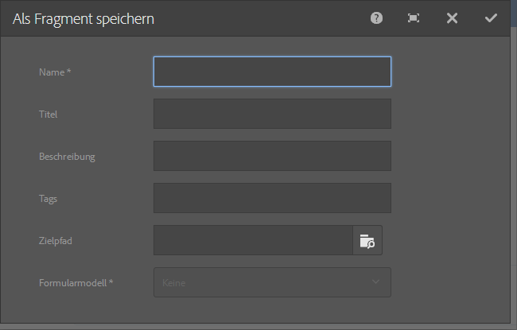

# Adaptive Formularfragmente {#adaptive-form-fragments}

>[!CAUTION]
>
>AEM 6.4 hat das Ende der erweiterten Unterstützung erreicht und diese Dokumentation wird nicht mehr aktualisiert. Weitere Informationen finden Sie in unserer [technische Unterstützung](https://helpx.adobe.com/de/support/programs/eol-matrix.html). Unterstützte Versionen suchen [here](https://experienceleague.adobe.com/docs/?lang=de).

Zwar wird jedes Formular für einen bestimmten Zweck entwickelt, doch enthalten die meisten Formularen einige gängige Elemente (z. B. für persönliche Angaben wie Name und Anschrift, Angaben zu Familienstand, Einkommen usw.). Formularentwickler müssen diese gängigen Segmente jedes Mal erstellen, wenn ein neues Formular erstellt wird.

Adaptive Formulare bieten einen bequemen Mechanismus, um Formularsegmente wie ein Bedienfeld oder eine Gruppe von Feldern nur einmal zu erstellen und sie in adaptiven Formularen wiederzuverwenden. Diese wiederverwendbaren und eigenständigen Segmente werden als adaptive Formularfragmente bezeichnet.

## Erstellen eines Fragments {#create-a-fragment}

Sie können ein adaptives Formularfragment von Grund auf neu erstellen oder ein Bedienfeld in einem vorhandenen adaptiven Formular als Fragment speichern.

### Neuerstellen von Fragmenten {#create-fragment-from-scratch}

1. Melden Sie sich bei der Author-Instanz von AEM Forms unter https://[*Hostname*]:[*Port*]/aem/forms.html an.
1. Klicken **[!UICONTROL Erstellen > Adaptives Formularfragment]**.
1. Geben Sie Titel, Namen, Beschreibung und Tags für das Fragment an.

   >[!NOTE]
   >
   >Stellen Sie sicher, dass Sie einen eindeutigen Namen für das Fragment angeben. Wenn bereits ein anderes Fragment mit demselben Namen vorhanden ist, kann das Fragment nicht erstellt werden.

1. Klicken Sie, um die Registerkarte **[!UICONTROL Formularmodell]** zu öffnen. Wählen Sie dann aus der Dropdown-Liste **[!UICONTROL Auswählen]** eines der folgenden Fragmentmodelle:

   * **[!UICONTROL Keines]**: Gibt an, dass das Fragment von Grund auf ohne Formularmodell erstellt werden soll.
   * **[!UICONTROL Formularvorlage]**: Das Fragment mit mithilfe einer XDP-Vorlage erstellt, die auf AEM Forms hochgeladen wurde. Wählen Sie die entsprechende XDP-Vorlage als Formularmodell für das Fragment aus.

   

   Die Teilformulare, die als Fragmente in der ausgewählten Vorlage markiert sind, werden ebenfalls angezeigt. Sie können ein Teilformular für ein adaptives Formularfragment aus der Dropdownliste auswählen.

   

   Darüber hinaus können Sie ein adaptives Formularfragment mithilfe von Teilformularen erstellen, die nicht als Fragmente in der Formularvorlage markiert sind, indem Sie den SOM-Ausdruck für das Teilformular in der Dropdown-Liste angeben.

   * **[!UICONTROL XML-Schema]**: Das Fragment wird mithilfe eines XML-Schemas erstellt, das auf AEM Forms hochgeladen wurde. Sie können ein XML-Schema als Formularmodell hochladen oder aus den verfügbaren Schemas wählen.

   

   Sie können ein adaptives Formularfragment auch erstellen, indem Sie einen „complexType“ im ausgewählten Schema aus der Dropdownliste wählen.

   

1. Klicken Sie auf **[!UICONTROL Erstellen]** und dann auf **[!UICONTROL Öffnen]**, um das Fragment mit einer Standardvorlage im Bearbeitungsmodus zu öffnen.

Im Bearbeitungsmodus können Sie eine beliebige adaptive Formularkomponente aus dem AEM Sidekick auf das Fragment ziehen. Weitere Informationen zu adaptiven Formularkomponenten finden Sie unter [Einführung in das Authoring adaptiver Formulare](/help/forms/using/introduction-forms-authoring.md).

Wenn Sie außerdem ein XML-Schema oder eine XDP-Formularvorlage als Formularmodell für Ihr Fragment ausgewählt haben, wird in der Inhaltssuche eine neue Registerkarte mit der Formularmodellhierarchie angezeigt. Sie können dann Formularmodellelemente auf das Fragment ziehen. Die hinzugefügten Formularmodellelemente werden in Formularkomponenten konvertiert, während die ursprünglichen Eigenschaften aus der zugehörigen XDP oder XSD beibehalten werden.

### Bereich als Fragment speichern {#save-panel-as-a-fragment}

1. Öffnen Sie ein adaptives Formular, das den Bereich enthält, den Sie als adaptives Formularfragment speichern möchten.
1. Klicken Sie in der Symbolleiste des Bedienfelds auf **[!UICONTROL Als Fragment speichern]**. Das Dialogfeld Als Fragment speichern wird geöffnet.

   >[!NOTE]
   >
   >Wenn das Bedienfeld, das Sie als Fragment speichern, ein untergeordnetes Bedienfeld enthält, enthält das daraus resultierende Fragment sie.

1. Geben Sie im Dialogfeld &quot;Fragmenterstellung&quot;die folgenden Informationen an:

   * **[!UICONTROL Name]**: Name des Fragments. Der Standardwert ist der Elementname des Bedienfelds. Dies ist ein Pflichtfeld.

      >[!NOTE]
      >
      >Stellen Sie sicher, dass Sie einen eindeutigen Namen für das Fragment angeben. Wenn bereits ein anderes Fragment mit demselben Namen vorhanden ist, kann das Fragment nicht erstellt werden.

   * **[!UICONTROL Titel]**: Titel des Formulars. Der Standardwert ist der Titel des Bedienfelds.
   * **[!UICONTROL Beschreibung]**: Beschreibung des Fragments.
   * **[!UICONTROL Tags]**: Kennzeichnet Metadaten für das Fragment.
   * **[!UICONTROL Zielpfad]**: Pfad für das Repository, in dem das Fragment gespeichert wird. Wenn Sie keinen Pfad angeben, wird neben dem Knoten, der das adaptive Formular enthält, ein Knoten mit demselben Namen wie der des Fragments erstellt. Das Fragment wird in diesem Knoten gespeichert.
   * **[!UICONTROL Formularmodell]**: Je nach Formularmodell für das adaptive Formular zeigt dieses Feld die **[!UICONTROL XML-Schema]**, **[!UICONTROL Formularvorlage]** oder **[!UICONTROL Keines]**. Dies ist ein Feld, das nicht bearbeitet werden kann.
   * **[!UICONTROL Fragmentmodellstamm]**: Wird nur in XSD-basierten adaptiven Formularen angezeigt. Sie gibt den Stamm für das Fragmentmodell an. Sie können auch **/** oder den komplexen XSD-Typ aus der Dropdown-Liste auswählen. Beachten Sie, dass Sie das Fragment nur in einem anderen adaptiven Formular wiederverwenden können, wenn Sie den komplexen Typ als Fragmentmodellstamm auswählen.

      Wenn Sie **/** als Fragmentmodellstamm auswählen, wird die vollständige XSD-Struktur vom Stamm in der Registerkarte für das Datenmodell des adaptiven Formulars angezeigt. Für Fragmentmodellstamm eines komplexen Typs werden lediglich die untergeordneten Elemente des ausgewählten komplexen Typs in der Registerkarte des Datenmodells des adaptiven Formulars angezeigt. 

   * **[!UICONTROL XSD-REF]**: Diese Option ist nur in den XSD-basierten adaptiven Formularen verfügbar. Sie zeigt den Ort des XML-Schemas an.
   * **[!UICONTROL XDP Ref]**: Wird nur in XDP-basierten adaptiven Formularen angezeigt. Es wird der Speicherort der XDP-Vorlage angezeigt.

   
   **Abbildung:** *Dialogfeld &quot;Als Fragment speichern&quot;*

1. Klicken Sie auf **[!UICONTROL OK]**.

   Das Bedienfeld wird am angegebenen oder dem Standardspeicherort im Repository gespeichert. Im adaptiven Formular wird das Bedienfeld durch eine Momentaufnahme des Fragments ersetzt. Wie unten gezeigt, werden das Bedienfeld „Allgemeine Informationen“ und seine untergeordneten Bedienfelder, „Persönliche Informationen“ und „Adresse“, als Fragment gespeichert.

   Um das Fragment zu bearbeiten, klicken Sie in der Symbolleiste des Bedienfelds auf das Symbol **[!UICONTROL Element bearbeiten]**. Das Fragment wird in einer neuen Registerkarte oder einem neuen Fenster im Bearbeitungsmodus geöffnet.

   

## Arbeiten mit Fragmenten {#working-with-fragments}

### Konfigurieren des Erscheinungsbildes von Fragmenten {#configure-fragment-appearance}

Jedes Fragment, das Sie in adaptive Formulare einfügen, wird als Platzhalterbild angezeigt. Der Platzhalter zeigt die Titel von bis zu maximal zehn untergeordneten Bedienfeldern im Fragment an. Sie können AEM Forms so konfigurieren, dass das vollständige Fragment anstelle des Platzhalterbilds angezeigt wird.

Führen Sie die folgenden Schritte aus, um vollständige Fragmente in Formularen anzuzeigen:

1. Wechseln Sie zur Seite zur Konfiguration der AEM-Web-Konsole unter https://[*Host*]:[*Port*]/system/console/configMgr.
1. Suchen und klicken Sie auf **[!UICONTROL Webkanal-Konfiguration für adaptive Formulare und interaktive Kommunikation]**, um sie im Bearbeitungsmodus zu öffnen.
1. Deaktivieren **[!UICONTROL Platzhalter anstelle des Fragments aktivieren]** aktivieren, um vollständige Fragmente anstelle des Platzhalterbilds anzuzeigen.

### Einfügen eines Fragments in ein adaptives Formular {#insert-a-fragment-in-an-adaptive-form}

Die von Ihnen erstellten adaptiven Formularfragmente werden auf der Registerkarte Adaptive Formularfragmente in der AEM Inhaltssuche angezeigt. So fügen Sie ein adaptives Formularfragment in ein adaptives Formular ein:

1. Öffnen Sie das adaptive Formular im Bearbeitungsmodus, in das Sie ein adaptives Formularfragment einfügen möchten.
1. Klicken Sie in der Seitenleiste auf **[!UICONTROL Assets]** . Wählen Sie im Assets-Browser **[!UICONTROL Adaptive Formularfragmente]** aus der Dropdown-Liste.

   Sie können auch festlegen, dass alle adaptiven Formularfragmente angezeigt oder nach Formularmodell (Formularvorlage, XML-Schema oder Allgemein) gefiltert werden.

1. Ziehen Sie ein adaptives Formularfragment per Drag-and-Drop in das adaptive Formular.

   >[!NOTE]
   >
   >Das Fragment des adaptiven Formulars ist nicht für das Authoring vom adaptiven Formular aus aktiviert. Außerdem können Sie kein XSD-basiertes Fragment in einem JSON-basierten adaptiven Formular und umgekehrt verwenden.

Das adaptive Formularfragment wird als Verweis in das adaptive Formular eingefügt und mit dem eigenständigen adaptiven Formularfragment synchronisiert. Das bedeutet, dass die Änderungen beim Aktualisieren des adaptiven Formularfragments in allen adaptiven Formularen übernommen werden, in denen das Fragment verwendet wird.

### Einbetten eines Fragments in ein adaptives Formular {#embed-a-fragment-in-adaptive-form}

Sie können ein adaptives Formularfragment in ein adaptives Formular einbetten, indem Sie auf **[!UICONTROL Asset einbetten: *fragmentName *]**in der Symbolleiste des Bedienfelds des hinzugefügten Fragments, wie im folgenden Beispielbild dargestellt.

>[!NOTE]
>
>Das eingebettete Fragment ist nicht mehr mit dem eigenständigen Fragment verknüpft. Sie können die Komponenten im eingebetteten Fragment aus dem adaptiven Formular heraus bearbeiten.

### Verwenden von Fragmenten innerhalb von Fragmenten {#using-fragments-within-fragments}

Sie können verschachtelte adaptive Formularfragmente erstellen, d. h. Sie können ein Fragment per Drag-and-Drop in ein anderes Fragment ziehen und eine verschachtelte Fragmentstruktur haben.

### Ändern von Fragmenten {#change-fragments}

Sie können ein adaptives Formularfragment durch ein anderes ersetzen oder ändern, indem Sie die **[!UICONTROL Fragment-Asset auswählen]** -Eigenschaft im Dialogfeld &quot;Komponente bearbeiten&quot;für ein adaptives Formularfragment-Bedienfeld.

## Automatisches Zuordnen von Fragmenten für die Datenbindung {#auto-mapping-of-fragments-for-data-binding}

Wenn Sie ein adaptives Formularfragment mit einer XFA-Formularvorlage oder einem komplexen XSD-Typ erstellen und das Fragment in ein adaptives Formular ziehen, wird das XFA-Fragment oder der komplexe XSD-Typ automatisch durch das entsprechende adaptive Formularfragment ersetzt, dessen Fragmentmodellstamm dem XFA-Fragment oder komplexen XSD-Typ zugeordnet ist.

Das Fragment-Asset und dessen Bindungen können im Dialogfeld „Komponente bearbeiten“ geändert werden.

>[!NOTE]
>
>Sie können auch ein gebundenes adaptives Formularfragment aus der Bibliothek für adaptive Formularfragmente per Drag-and-Drop in AEM Inhaltssuche ziehen und die richtige Bindungsverweis aus dem Dialogfeld &quot;Komponente bearbeiten&quot;des Bereichs für adaptive Formularfragmente bereitstellen.

## Verwalten von Fragmenten {#manage-fragments}

Sie können mithilfe der AEM Forms-Benutzeroberfläche mehrere Vorgänge für adaptive Formularfragmente ausführen.

1. Rufen Sie `https://[hostname]:[port]/aem/forms.html` auf.

1. Klicken **[!UICONTROL Auswählen]** Wählen Sie in der Symbolleiste der AEM Forms-Benutzeroberfläche ein adaptives Formularfragment aus. In der Symbolleiste werden die folgenden Vorgänge angezeigt, die Sie für das ausgewählte adaptive Formularfragment ausführen können.

<table> 
 <tbody> 
  <tr> 
   <td>
<strong>Vorgang</strong>
 </td> 
   <td>
<strong>Beschreibung</strong>
 </td> 
  </tr> 
  <tr> 
   <td>
Öffnen
 </td> 
   <td>
Öffnet das ausgewählte adaptive Formularfragment im Bearbeitungsmodus.    
 </td> 
  </tr> 
  <tr> 
   <td>
Eigenschaften anzeigen
 </td> 
   <td>
Öffnet den Bereich Eigenschaften . Im Bereich Eigenschaften können Sie Eigenschaften anzeigen und bearbeiten, eine Vorschau erstellen und ein Miniaturbild für das ausgewählte Fragment hochladen. Weitere Informationen finden Sie unter <a href="/help/forms/using/manage-form-metadata.md" target="_blank">Verwalten von Metadaten</a>.    
 </td> 
  </tr> 
  <tr> 
   <td>
Kopieren
 </td> 
   <td>
Kopiert das ausgewählte Fragment. Die Schaltfläche Einfügen wird in der Symbolleiste angezeigt.    
 </td> 
  </tr> 
  <tr> 
   <td>
Download
 </td> 
   <td>
Lädt das ausgewählte Fragment herunter.    
 </td> 
  </tr> 
  <tr> 
   <td>
Vorschau
 </td> 
   <td>
Enthält Optionen zum Anzeigen einer HTML- oder benutzerdefinierten Vorschau des Fragments durch Zusammenführen von Daten aus einer XML-Datei und dem Fragment. Weitere Informationen finden Sie unter <a href="/help/forms/using/previewing-forms.md" target="_blank">Erstellen einer Vorschau für ein Formular</a>.    
 </td> 
  </tr> 
  <tr> 
   <td>
Review starten/verwalten
 </td> 
   <td>
Initiieren und Verwalten einer Review des ausgewählten Fragments. Weitere Informationen finden Sie unter <a href="/help/forms/using/create-reviews-forms.md" target="_blank">Erstellen und Verwalten von Reviews</a>.    
 </td> 
  </tr> 
  <tr> 
   <td>
Wörterbuch erstellen
 </td> 
   <td>
Erstellt ein Wörterbuch zum Lokalisieren des ausgewählten Fragments. Weitere Informationen finden Sie unter <a href="/help/forms/using/lazy-loading-adaptive-forms.md" target="_blank">Lokalisieren adaptiver Formulare</a>.    
 </td> 
  </tr> 
  <tr> 
   <td>
Veröffentlichen/Veröffentlichung rückgängig machen
 </td> 
   <td>
Veröffentlicht das ausgewählte Fragment bzw. macht die Veröffentlichung rückgängig.    
 </td> 
  </tr> 
  <tr> 
   <td>
Löschen
 </td> 
   <td>
Löscht das ausgewählte Fragment.    
 </td> 
  </tr> 
 </tbody> 
</table>

## Lokalisieren von adaptiven Formularen mit Fragmenten {#localizing-adaptive-form-containing-fragments}

Um ein adaptives Formular zu lokalisieren, das adaptive Formularfragmente enthält, müssen Sie das Fragment und das Formular separat lokalisieren. Es wird empfohlen, ein Fragment einmal zu lokalisieren und es in mehreren adaptiven Formularen wiederzuverwenden.

>[!NOTE]
>
>Die Lokalisierungsschlüssel im Fragment werden nicht in der XLIFF-Datei für ein adaptives Formular angezeigt.

## Wichtige Hinweise zum Arbeiten mit Fragmenten {#key-points-to-remember-when-working-with-fragments}

* Stellen Sie sicher, dass der Fragmentname eindeutig ist. Das Fragment kann nicht erstellt werden, wenn ein vorhandenes Fragment mit demselben Namen vorhanden ist.
* Wenn Sie in einem XDP-basierten adaptiven Formular ein Bedienfeld speichern, das ein anderes XDP-Fragment enthält, wird das daraus resultierende Fragment automatisch an das untergeordnete XDP-Fragment gebunden. Im Falle eines XSD-basierten adaptiven Formulars ist das resultierende Fragment an den Schemastamm gebunden.
* Wenn Sie ein adaptives Formularfragment erstellen, wird ein Fragmentknoten erstellt, der dem Knoten „guideContainer“ für ein adaptives Formular in CRXDe Lite ähnelt.
* Ein Fragment in einem adaptiven Formular, das ein anderes Formulardatenmodell verwendet, wird nicht unterstützt. Beispielsweise wird ein XDP-basiertes Fragment in einem XSD-basierten adaptiven Formular nicht unterstützt und umgekehrt.
* Adaptive Formularfragmente sind über die Registerkarte Adaptive Formularfragmente in AEM Inhaltssuche verfügbar.
* Alle Ausdrücke, Skripte oder Stile in einem eigenständigen adaptiven Formularfragment bleiben erhalten, wenn es als Verweis eingefügt oder in ein adaptives Formular eingebettet wird.
* Sie können ein adaptives Formularfragment, das als Verweis eingefügt wird, nicht in einem adaptiven Formular bearbeiten. Sie bearbeiten das eigenständige adaptive Formularfragment oder betten das Fragment im adaptiven Formular ein.
* Wenn Sie ein adaptives Formular veröffentlichen, müssen Sie die eigenständigen adaptiven Formularfragmente veröffentlichen, die als Verweis in das adaptive Formular eingefügt wurden.
* Wenn Sie ein aktualisiertes adaptives Formularfragment erneut veröffentlichen, werden die Änderungen in den veröffentlichten Instanzen des adaptiven Formulars übernommen, in denen das Fragment verwendet wird.
* Das adaptive Formular, das die Überprüfungskomponente enthält, unterstützt keine anonymen Benutzer. Außerdem wird die Verwendung der Überprüfungskomponente in einem adaptiven Formularfragment nicht empfohlen.
* (**Nur Mac**) Um sicherzustellen, dass die Formularfragmentfunktionalität in allen Szenarien einwandfrei funktioniert, fügen Sie der Datei „/private/etc/hosts“ den folgenden Eintrag hinzu:

   `127.0.0.1 <Host machine>`

   **Hostcomputer**: Der Apple Mac-Computer, auf dem AEM Forms bereitgestellt wird.

## Referenzfragmente {#reference-fragments}

Es sind Referenzfragmente für adaptive Formulare verfügbar, mit denen Sie Ihr Formular erstellen können. Weitere Informationen finden Sie unter [Referenzfragmente](/help/forms/using/reference-adaptive-form-fragments.md).
