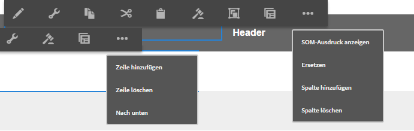
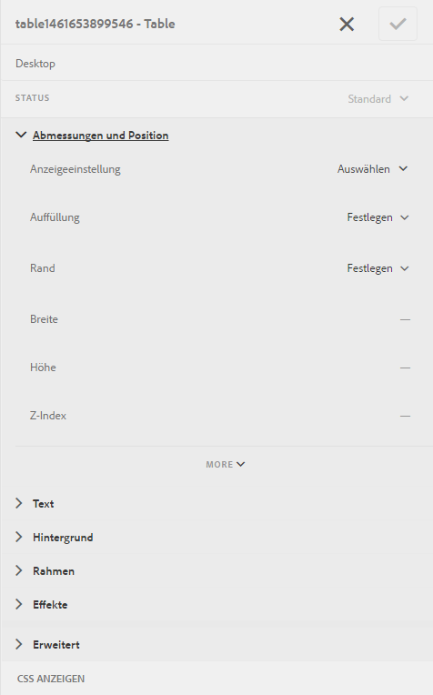

# Tabellen in adaptiven Formularen {#tables-in-adaptive-forms}

>[!CAUTION]
>
>AEM 6.4 hat das Ende der erweiterten Unterstützung erreicht und diese Dokumentation wird nicht mehr aktualisiert. Weitere Informationen finden Sie in unserer [technische Unterstützung](https://helpx.adobe.com/de/support/programs/eol-matrix.html). Unterstützte Versionen suchen [here](https://experienceleague.adobe.com/docs/?lang=de).

Die Verwendung von Tabellen ist eine effektive, vereinfachte und organisierte Methode zur Darstellung komplexer Daten. Es hilft Benutzern, Informationen einfach zu identifizieren und Eingaben in einer geordneten Anordnung von Zeilen und Spalten bereitzustellen. Die meisten Formulare von Finanzdienstleistungen und Regierungsorganisationen erfordern große Datentabellen, um Zahlen zu setzen und Berechnungen durchzuführen.

AEM Forms bietet eine Tabellenkomponente im Komponenten-Browser in der Seitenleiste, mit der Sie Tabellen in adaptiven Formularen erstellen können. Zu den wichtigsten Funktionen gehören:

* Responsives Layout auf Mobilgeräten
* Konfigurierbare Zeilen und Spalten
* Dynamisches Hinzufügen und Löschen von Zeilen zur Laufzeit
* Kombinieren oder Zusammenführen und Aufteilen von Zellen
* Für Sprachausgaben zugänglich
* Benutzerdefiniertes Layout mit CSS
* Kompatibel und zugeordnet mit der XDP-Tabellenkomponente
* Unterstützung für das Hinzufügen von Zeilen oder Zellen mit komplexen XSD-Typelementen
* Zusammenführen von Daten aus einer XML-Datei

## Erstellen einer Tabelle {#create-a-table}

Um eine Tabelle zu erstellen, ziehen Sie die Komponente Tabelle aus dem Komponenten-Browser in den Sidekick und legen Sie sie im adaptiven Formular ab. Standardmäßig enthält die Tabelle zwei Spalten und drei Zeilen, einschließlich der Zeile mit der Kopfzeile.


### Info zu Kopfzeilen- und Textzellen {#about-header-and-body-cells}

Die Kopfzeilenzellen sind Textfelder. Um den Titel für eine Kopfzeile zu ändern, klicken Sie mit der rechten Maustaste auf die Kopfzeilenzelle und klicken Sie auf **Bearbeiten**. Aktualisieren Sie im Dialogfeld &quot;Bearbeiten&quot;den Titel im **Wert** Feld und klicken Sie auf **OK**.

Die Textzellen sind standardmäßig Textfelder. Sie können eine Textzelle durch eine andere im Sidekick verfügbare adaptive Formularkomponente ersetzen, z. B. ein numerisches Feld, eine Datumsauswahl oder eine Dropdownliste.

Beispiel: Die erste Textzeile in der folgenden Tabelle enthält ein Textfeld, eine Datumsauswahl und eine Dropdown-Liste.


Sie können zwei oder mehr Textzellen zusammenführen, indem Sie die zusammenzuführenden Zellen auswählen, mit der rechten Maustaste klicken und die Option **Zusammenführen**. Außerdem können Sie eine zusammengeführte Zelle aufteilen, indem Sie mit der rechten Maustaste darauf klicken und **Zellen teilen**.

### Hinzufügen, Löschen und Verschieben von Zeilen und Spalten {#add-delete-move-rows-and-columns}

Sie können eine Zeile oder Spalte hinzufügen und löschen sowie eine Zeile in einer Tabelle nach oben und unten verschieben.

Um eine Zeile oder Spalte hinzuzufügen oder zu löschen oder eine Zeile zu verschieben, klicken Sie auf eine beliebige Zelle in der Zeile oder Spalte. Eine Dropdown-Liste wird jeweils am oberen Rand der Spalte und links neben der Zeile angezeigt. Das Menü oben bietet Optionen zum Hinzufügen oder Löschen der Spalte, während das Menü auf der linken Seite das Hinzufügen, Löschen oder Verschieben der Zeile ermöglicht.

* Der Vorgang &quot;Hinzufügen&quot;fügt eine Zeile darunter oder eine Spalte rechts neben der ausgewählten Zeile bzw. Spalte hinzu.
* Der Löschvorgang löscht die ausgewählte Zeile oder Spalte.
* Der Vorgang Nach oben bzw. Nach unten verschiebt die ausgewählte Zeile nach oben bzw. nach unten.

Die Dropdown-Liste für die Zeile enthält auch die Option „Bearbeiten“ zum Bearbeiten von Zeileneigenschaften, Einstellungen und Stiloptionen.



>[!NOTE]
>
>Sie können zwar eine beliebige Anzahl von Zeilen zu einer Tabelle hinzufügen, die maximale Anzahl von Spalten, die Sie hinzufügen können, beträgt jedoch sechs. Außerdem können Sie die Kopfzeile nicht aus der Tabelle löschen.

### Die Spaltenbreite einer Tabelle einstellen {#set-column-width}

Führen Sie die folgenden Schritte aus, um die Spaltenbreite für eine Tabelle festzulegen:

1. Tippen Sie auf der **[!UICONTROL Inhalt]**-Registerkarte auf die Komponente **[!UICONTROL Tabelle]** und tippen Sie auf das Konfigurieren-Symbol ().

1. Um die proportionale Breite der einzelnen Spalten der Tabelle festzulegen, geben Sie die jeweiligen Werte als kommagetrennte Liste in das **[!UICONTROL Spaltenbreite]**-Feld ein. Beispiel: Für eine Tabelle mit 3 Spalten führt die Eingabe des Werts „2,4,6“ in das **[!UICONTROL Spaltenbreite]**-Feld dazu, dass die Spaltenbreite für die erste Spalte auf 2/12, für die zweite auf 4/12 und für die dritte auf 6/12 eingestellt wird. 2/12 als Spaltenbreite für die erste Spalte entspricht einem Sechstel der Tabellenbreite. Parallel dazu wird mit dem Wert 4/12 die Breite der zweiten Spalte auf ein Drittel der Tabellenbreite und mit 6/12 die Breite der dritten Spalte auf die Hälfte der Tabellenbreite eingestellt.

### Hinzufügen einer Tabellenbeschreibung {#add-table-description}

Sie können der Tabelle eine Beschreibung hinzufügen, die erklärt, wie die Daten aufgebaut sind, damit sie von Bildschirmlesehilfen interpretiert und ausgelesen werden können. So fügen Sie die Beschreibung hinzu:

1. Wählen Sie die Tabelle aus und tippen Sie auf , damit ihre Eigenschaften in der Seitenleiste angezeigt werden.
1. Geben Sie im Tab Barrierefreiheit eine Zusammenfassung an.
1. Klicken Sie auf **Fertig**.

## Konfigurieren des Tabellenstils {#configure}

Sie können den Stil für eine Tabelle definieren, indem Sie den Stilmodus in der Seitensymbolleiste verwenden. Führen Sie die folgenden Schritte aus, um in den Stilmodus zu wechseln und den Tabellenstil zu bearbeiten

1. Tippen Sie in der Symbolleiste „Seite“ vor „Vorschau“ auf  > **Stil**.

1. Wählen Sie in der Seitenleiste die Tabelle aus und tippen Sie auf die Schaltfläche zum Bearbeiten .

   Die Stileigenschaften werden in der Seitenleiste angezeigt.



>[!NOTE]
>
>Sie können das Farbschema für Kopf- und Textzeilen ändern, indem Sie die Werte der LESS-Variablen ändern. Weitere Informationen finden Sie unter [Designs in AEM Forms](/help/forms/using/themes.md).

## Dynamisches Hinzufügen oder Löschen einer Zeile {#add-or-delete-a-row-dynamically}

Tabellen unterstützen standardmäßig das dynamische Hinzufügen oder Löschen von Zeilen zur Laufzeit.

1. Wählen Sie eine Tabellenzeile aus und tippen Sie auf .
1. Geben Sie auf der Registerkarte Wiederholungseinstellungen die Mindest- und Höchstanzahl der Zeilen in der Tabelle an.
1. Klicken Sie auf **Fertig**.

Zur Laufzeit sehen Sie **`+`** und *`-`* -Schaltflächen zum Hinzufügen oder Löschen einer Zeile.


>[!NOTE]
>
>Das dynamische Hinzufügen und Löschen einer Zeile wird im Mobile-Layout „Kopfzeilen links“ nicht unterstützt.

## Ausdrücke in einer Tabelle {#expressions-in-a-table}

Mit Tabellen in adaptiven Formularen können Sie Ausdrücke in JavaScript schreiben, um Verhaltensweisen wie das Anzeigen oder Ausblenden einer Tabelle oder Zeile, das Addieren aller Zahlen und das Anzeigen der Summe in einer Zelle, das Aktivieren oder Deaktivieren einer Zelle, das Validieren der Benutzereingabe usw. zu erzeugen. Diese Ausdrücke verwenden Skriptmodell-APIs für adaptive Formulare.

Während Tabellen und Zeilen nur Ausdrücke zur Sichtbarkeit unterstützen, um ihre Sichtbarkeit basierend auf dem von einem Ausdruck zurückgegebenen Wert zu steuern, unterstützen Zellen die folgenden Ausdrücke:

* **Initialisierungsskript:** , um eine Aktion nach der Initialisierung eines Felds auszuführen.
* **Skript zum Bestätigen von Werten**: Zum Ändern der Komponenten eines Formulars, nachdem der Wert eines Felds geändert wurde.

>[!NOTE]
>
>Wenn das XFA-Skript zum Ändern/Beenden auch auf dasselbe Feld angewendet wird, wird das XFA-Skript zum Ändern/Beenden vor dem Skript zum Bestätigen von Werten ausgeführt.

* **Ausdrücke für die Berechnung**: Zum automatischen Berechnen des Werts eines Felds.
* **Überprüfungsausdrücke**: , um ein Feld zu validieren.
* **Ausdrücke für den Zugriff**: Zum Aktivieren/Deaktivieren eines Felds.
* **Ausdruck für die Sichtbarkeit**: Zum Steuern der Sichtbarkeit eines Felds oder Bereichs.

Der Sichtbarkeitsausdruck für eine Tabelle oder Zeile kann auf der Registerkarte Bereichseigenschaften des entsprechenden Dialogfelds &quot;Komponente bearbeiten&quot;definiert werden. Die Ausdrücke für eine Zelle können auf der Registerkarte &quot;Skript&quot;des Dialogfelds &quot;Komponente bearbeiten&quot;definiert werden.

Eine vollständige Liste der Klassen, Ereignisse, Objekte und öffentlichen APIs für adaptive Formulare finden Sie unter [JavaScript-Bibliotheks-API-Referenz für adaptive Formulare](https://helpx.adobe.com/aem-forms/6/javascript-api/index.html).

## Layouts für Mobilgeräte {#mobile-layouts}

Tabellen in adaptiven Formularen bieten aufgrund ihrer fließenden und responsiven Layouts ein nicht übereinstimmendes Erlebnis für Mobilgeräte. AEM Forms stellt zwei Tabellenlayouts für Mobilgeräte zur Verfügung: „Kopfzeilen links“ und „Reduzierbare Spalten“.

Sie können ein Tabellenlayout für Mobilgeräte auf der Registerkarte „Stil“ im Dialogfeld „Komponente bearbeiten“ einer Tabelle konfigurieren.

### Kopfzeilen links {#headers-on-left}

Im Layout &quot;Kopfzeilen links&quot;werden die Kopfzeilen der Tabelle links verschoben, wobei nur eine Zelle gegen eine Kopfzeile angezeigt wird. Jede Zeile in diesem Layout wird als eigenständiger Abschnitt angezeigt. Die folgenden Abbildungen vergleichen eine Tabelle auf einem Desktop mit der auf einem Mobilgerät.


**Abbildung:** *Desktop-Ansicht einer Tabelle mit Layout &quot;Kopfzeile links&quot;*


**Abbildung:** *Mobile Ansicht einer Tabelle mit Layout &quot;Kopfzeile links&quot;*

### Layout „Reduzierbare Spalten“  {#collapsible-columns-layout}

Im Layout Reduzierbare Spalten werden die Spalten in der Tabelle je nach Gerätegröße ausgeblendet, um eine oder zwei Spalten anzuzeigen, während andere Spalten reduziert werden. Sie können auf das Symbol zum Reduzieren/Erweitern klicken, um andere Spalten in der Tabelle anzuzeigen.

>[!NOTE]
>
>Das Layout „Reduzierbare Spalten“ ist zwar für Mobilgeräte optimiert, funktioniert aber auch auf Desktops, wenn die Breite nicht ausreicht, um alle Spalten in einer Tabelle anzuzeigen.

In den folgenden Abbildungen wird gezeigt, wie eine Tabelle mit reduzierten und erweiterten Spalten auf einem Mobilgerät aussieht.


**Abbildung:** *Reduzierte Spalten einer Tabelle mit nur zwei Spalten, die auf einem Mobilgerät angezeigt werden*


**Abbildung:** *Erweiterte Spalte einer Tabelle auf einem Mobilgerät*

## Zusammenführen von Daten in einer Tabelle {#merge-data-in-a-table}

Mit Tabellen in adaptiven Formularen können Sie die Tabelle zur Laufzeit mithilfe von Daten aus einer XML-Datei füllen. Die XML-Datendatei kann sich im lokalen Dateisystem des Computers, auf dem der AEM Forms-Server ausgeführt wird, oder im CRX-Repository befinden.

Beispiel: Eine Tabelle mit einer Zusammenfassung von Banktransaktionen, die mit Daten aus einer XML-Datei gefüllt werden soll.


In diesem Beispiel wurde die Eigenschaft &quot;Elementname&quot;für Folgendes festgelegt:

* die Zeile **Zeile1**
* Die Textzelle unter &quot;Transaction date&quot;lautet **tableItem1**
* Die Textzelle unter &quot;Beschreibung&quot;lautet **tableItem2**
* Die Textzelle unter &quot;Transaction type&quot;ist **type**
* die Textzelle unter Betrag in USD ist **tableItem3**

Die XML-Datei, die Daten im folgenden Format enthält:

```xml
<?xml version="1.0" encoding="UTF-8"?><afData>
  <afUnboundData>
    <data>
 <typeSelect>0</typeSelect>
 <Row1>
      <tableItem1>2015-01-08</tableItem1>
      <tableItem2>Purchase laptop</tableItem2>
      <type>0</type>
      <tableItem3>12000</tableItem3>
 </Row1>
 <Row1>
      <tableItem1>2015-01-05</tableItem1>
      <tableItem2>Transport expense</tableItem2>
      <type>0</type>
      <tableItem3>120</tableItem3>
 </Row1>
 <Row1>
      <tableItem1>2014-01-08</tableItem1>
      <tableItem2>Laser printer</tableItem2>
      <type>0</type>
      <tableItem3>500</tableItem3>
 </Row1>
 <Row1>
      <tableItem1>2014-12-08</tableItem1>
      <tableItem2>Credit card payment</tableItem2>
      <type>0</type>
      <tableItem3>300</tableItem3>
 </Row1>
 <Row1>
      <tableItem1>2015-01-06</tableItem1>
      <tableItem2>Interest earnings</tableItem2>
      <type>1</type>
      <tableItem3>12000</tableItem3>
 </Row1>
 <Row1>
      <tableItem1>2015-01-05</tableItem1>
      <tableItem2>Payment from a client</tableItem2>
      <type>1</type>
      <tableItem3>500</tableItem3>
 </Row1>
 <Row1>
      <tableItem1>2015-01-08</tableItem1>
      <tableItem2>Food expense</tableItem2>
      <type>0</type>
      <tableItem3>120</tableItem3>
 </Row1>
 </data>
  </afUnboundData>
  <afBoundData>
    <data/>
  </afBoundData>
  <afBoundData/>
</afData>
```

In der XML-Beispieldatei werden die Daten für eine Zeile durch die `<Row1>`-Tags definiert, die den Elementnamen für die Zeile in der Tabelle festlegen. Innerhalb des `<Row1>`-Tags werden die Daten für die einzelnen Zellen innerhalb des Tags für dessen Elementnamen definiert (z. B. `<tableItem1>`, `<tableItem2>`, `<tableItem3>` und `<type>`).

Um diese Daten mit der Tabelle zur Laufzeit zusammenzuführen, muss das adaptive Formular, das die Tabelle enthält, auf den absoluten Pfad der XML-Datei zeigen. Dabei muss „wcmmode“ aktiviert sein. Wenn das adaptive Formular beispielsweise unter *http://localhost:4502/myForms/bankTransaction.html* und die XML-Datendatei unter *C:/myTransactions/bankSummary.xml* können Sie die Tabelle mit Daten unter der folgenden URL anzeigen:

*http://localhost:4502/myForms/bankTransaction.html?dataRef=file:/// C:/myTransactions/bankSummary.xml&amp;wcmmode=disabled*


## Verwenden von XDP-Komponenten und komplexen XSD-Typen {#use-xdp-components-and-xsd-complex-types}

Wenn Sie ein adaptives Formular basierend auf einer XFA-Formularvorlage erstellt haben, sind die XFA-Elemente auf der Registerkarte &quot;Datenmodell&quot;in AEM Inhaltssuche verfügbar. Sie können diese XFA-Elemente, einschließlich Tabellen, per Drag-and-Drop in das adaptive Formular ziehen.

Das XFA-Tabellenelement ist der Tabellenkomponente zugeordnet und funktioniert in adaptiven Formularen standardmäßig. Alle Eigenschaften und Funktionen der XDP-Tabelle bleiben erhalten, wenn sie in ein adaptives Formular verschoben werden. Sie können jede beliebige Operation darauf ausführen, genau wie bei der nativen adaptiven Formulartabelle. Wenn beispielsweise eine Zeile in einer XDP-Tabelle als wiederholbar markiert ist, wird sie auch wiederholt, wenn sie in adaptiven Formularen abgelegt wird.

Darüber hinaus können Sie XDP-Teilformulare per Drag-and-Drop in die Tabelle einfügen, um eine neue Zeile hinzuzufügen. Beachten Sie jedoch, dass verschachtelte Teilformulare nicht abgelegt werden können.

>[!NOTE]
>
>Eine XDP-Tabelle ohne Kopfzeile wird nicht der Tabellenkomponente des adaptiven Formulars zugeordnet. Stattdessen wird sie der Bereichskomponente des adaptiven Formulars mit fließendem Layout zugeordnet. Wenn Sie eine verschachtelte Tabelle aus einer XDP einem adaptiven Formular hinzufügen, wird die äußere Tabelle in einen Bereich konvertiert, während die innere Tabelle beibehalten wird.

Darüber hinaus können Sie eine Gruppe komplexer XSD-Typelemente per Drag-and-Drop einfügen, um eine Tabellenzeile zu erstellen. Eine neue Zeile wird direkt unter der Zeile erstellt, in der Sie die Elemente abgelegt haben. Die Zellen, die mit den komplexen XSD-Typelementen erstellt wurden, behalten eine Bindungsreferenz zur XSD bei. Sie können auch eine Textzelle durch ein komplexes XSD-Typelement ersetzen, indem Sie das Element in die Zelle ablegen.

>[!NOTE]
>
>Die Anzahl der Elemente in einer XDP-Tabellenkomponente, einem Teilformular oder einem komplexen XSD-Typ darf die Anzahl der Zellen in einer Zeile nicht überschreiten. Sie können beispielsweise nicht vier Elemente in einer Zeile ablegen, die nur drei Zellen enthält. Dies führt zu einem Fehler.
>
>Wenn die Anzahl der Elemente kleiner ist als die Anzahl der Zellen in einer Zeile, fügt die neue Zeile zuerst Zellen basierend auf den Elementen hinzu und dann werden die Standardzellen hinzugefügt, um die verbleibenden Zellen in der Zeile auszufüllen. Wenn Sie beispielsweise eine Gruppe von drei Elementen in einer Zeile ablegen, die aus vier Zellen besteht, basieren die ersten drei Zellen auf den abgelegten Elementen und die restliche Zelle ist die standardmäßige Tabellenzelle.

## Wichtige Aspekte {#key-considerations}

* Wenn Sie beim Authoring einer XSD-basierten Tabelle Zeilen nach oben und unten verschieben, gehen Daten aus Tabellenzeilen verloren, wenn die beim Senden des Formulars generierte Daten-XML verwendet wird.
* Jeder Textzelle in einer Standardtabelle ist ein vordefinierter Elementname zugeordnet. Wenn Sie eine andere Tabelle im adaptiven Formular hinzufügen, haben die Standardtextzellen in der neuen Tabelle denselben Elementnamen wie in der ersten Tabelle. In diesem Fall enthalten die Daten, die beim Senden des Formulars generiert werden, nur Daten in den Standardtextzellen einer der Tabellen. Stellen Sie daher sicher, dass Sie die Elementnamen für Standardtextzellen umbenennen, um sie in allen Tabellen eindeutig zu halten und Datenverlust zu vermeiden.

   Beachten Sie, dass dies lediglich für die standardmäßigen Textzellen gilt. Wenn Sie einer Tabelle weitere Zeilen oder Spalten hinzufügen, werden automatisch eindeutige Elementnamen für nicht standardmäßige Textzellen generiert.
