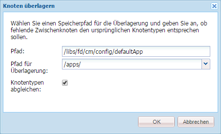
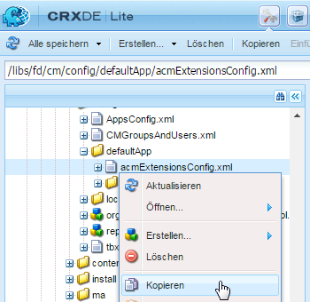
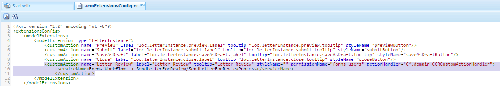
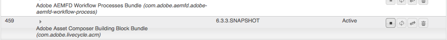
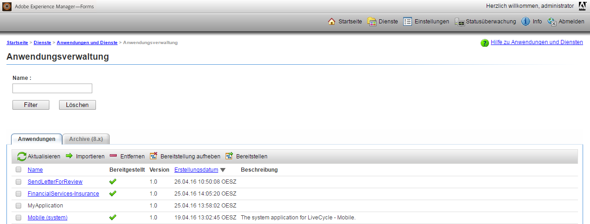
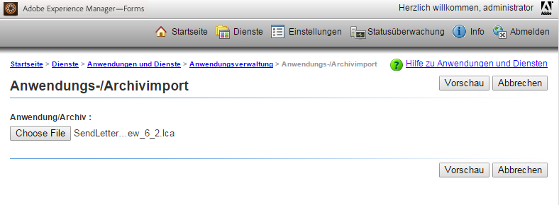

# Fügen Sie benutzerdefinierte Aktionen/Schaltflächen der Benutzeroberfläche „Korrespondenz erstellen“ hinzu {#add-custom-action-button-in-create-correspondence-ui}

## Übersicht {#overview}

Correspondence Management Solution ermöglicht es Ihnen, benutzerdefinierte Aktionen der Benutzeroberfläche „Korrespondenz erstellen“ hinzufügen.

In dem Szenario in diesem Dokument wird erklärt, wie Sie eine Schaltfläche in der Benutzeroberfläche „Korrespondenz erstellen“ einfügen können, um einen Brief als Überprüfungs-PDF im Anhang einer E-Mail zu teilen.

### Voraussetzungen {#prerequisites}

Um dieses Beispiel auszuführen, benötigen Sie Folgendes:

* Kenntnisse von CRX und JavaScript
* LiveCycle-Server

## Szenario: Erstellen Sie die Schaltfläche in der Benutzeroberfläche „Korrespondenz erstellen“, um ein Schreiben zum Review zu senden {#scenario-create-the-button-in-the-create-correspondence-user-interface-to-send-a-letter-for-review}

Hinzufügen einer Schaltfläche mit einer Aktion (hier Buchstaben zum Review senden) zur Benutzeroberfläche „Korrespondenz erstellen“. Diese enthält Folgendes:

1. Hinzufügen der Schaltfläche „Korrespondenz erstellen“ zur Benutzeroberfläche 
1. Hinzufügen der Aktionsbearbeitung zur Schaltfläche
1. Hinzufügen des LiveCycle-Prozesses zur Aktivierung der Aktion &quot;Verarbeiten

### Hinzufügen der Schaltfläche „Korrespondenz erstellen“ zur Benutzeroberfläche  {#add-the-button-to-the-create-correspondence-user-interface}

1. Wechseln Sie zu `https://[server]:[port]/[ContextPath]/crx/de` und melden Sie sich als Administrator an.
1. Erstellen Sie im Programmodner einen Ordner mit dem Namen `defaultApp` und einem ähnlichen Pfad/einer ähnlichen Struktur wie der defaultApp-Ordner (im config-Ordner). Mit den folgenden Schritten können Sie den Ordner erstellen:

   * Klicken Sie mit der rechten Maustaste auf den Ordner **[!UICONTROL defaultApp]** unter dem folgenden Pfad und wählen Sie **[!UICONTROL Überlagerungsknoten]**:

      /libs/fd/cm/config/defaultApp/

      

   * Stellen Sie sicher, dass das Dialogfeld „Überlagerungsknoten“ die folgenden Werte enthält:

      **[!UICONTROL Pfad]**: /libs/fd/cm/config/defaultApp/

      **[!UICONTROL Überlagerungsspeicherort]**: /apps/

      **[!UICONTROL Knotentypen abgleichen]**: Kontrollkästchen aktiviert

      

   * Klicken Sie auf **[!UICONTROL OK]**.
   * Klicken Sie auf **[!UICONTROL Alle speichern]**.

1. Erstellen Sie eine Kopie der acmExtensionsConfig.xml-Datei (vorhanden unter der /libs-Verzweigung) unter der /apps-Verzweigung.

   * Wechseln Sie zu „/libs/fd/cm/config/defaultApp/acmExtensionsConfig.xml“

   * Klicken Sie mit der rechten Maustaste auf die Datei „acmExtensionsConfig.xml“ und wählen Sie **[!UICONTROL Kopieren]**.

      

   * Klicken Sie mit der rechten Maustaste auf den Ordner **[!UICONTROL defaultApp]** unter „/apps/fd/cm/config/defaultApp/,“ und wählen Sie **[!UICONTROL Einfügen]**.
   * Klicken Sie auf **[!UICONTROL Alle speichern]**.

1. Doppelklicken Sie auf die Kopie von „acmExtentionsConfig.xml“, die Sie im Apps-Ordner neu erstellten haben. Die Datei wird zur Bearbeitung geöffnet.
1. Suchen Sie folgenden Code:

   ```xml
   <?xml version="1.0" encoding="utf-8"?>
   <extensionsConfig>
       <modelExtensions>
           <modelExtension type="LetterInstance">
     <customAction name="Preview" label="loc.letterInstance.preview.label" tooltip="loc.letterInstance.preview.tooltip" styleName="previewButton"/>
               <customAction name="Submit" label="loc.letterInstance.submit.label" tooltip="loc.letterInstance.submit.tooltip" styleName="submitButton" permissionName="forms-users"/>
               <customAction name="SaveAsDraft" label="loc.letterInstance.saveAsDraft.label" tooltip="loc.letterInstance.saveAsDraft.tooltip" styleName="submitButton" permissionName="forms-users"/>
               <customAction name="Close" label="loc.letterInstance.close.label" tooltip="loc.letterInstance.close.tooltip" styleName="closeButton"/>
           </modelExtension>
       </modelExtensions>
   </extensionsConfig> 
   ```

1. Um ein Schreiben per E-Mail zu versenden, können Sie den LiveCycle Forms-Arbeitsablauf verwenden. Fügen Sie in „acmExtensionsConfig.xml“ ein Tag „customAction“ unter dem Tag „modelExtension“ wie folgt hinzu:

   ```xml
    <customAction name="Letter Review" label="Letter Review" tooltip="Letter Review" styleName="" permissionName="forms-users" actionHandler="CM.domain.CCRCustomActionHandler">
         <serviceName>Forms Workflow -> SendLetterForReview/SendLetterForReviewProcess</serviceName>
       </customAction>
   ```

   

   Das modelExtension-Tag besitzt eine Reihe von untergeordneten customAction-Tags, die die Aktion, die Berechtigungen und das Erscheinungsbild der Aktionsschaltfläche konfigurieren. Im Folgenden finden Sie eine Liste der customAction Konfigurations-Tags:

   | **Name** | **Beschreibung** |
   |---|---|
   | name | Der alphanumerische Name für die auszuführende Aktion. Der Wert dieses Tags wird benötigt, muss eindeutig sein (d. h. innerhalb des modelExtension-Tags) und muss mit einem Buchstaben beginnen. |
   | label | Die Beschriftung der Aktionsschaltfläche |
   | tooltip | QuickInfo-Text der Schaltfläche, der angezeigt wird, wenn der Benutzer den Cursor auf der Schaltfläche bewegt. |
   | styleName | Name des benutzerdefinierten Stils, der auf die Aktionsschaltfläche angewendet wird. |
   | permissionName | Die entsprechende Aktion wird nur angezeigt, wenn der Benutzer über die von permissionName festgelegte Berechtigung verfügt. Wenn Sie permissionName als `forms-users` angeben, erhalten alle Benutzer Zugriff auf diese Option. |
   | actionHandler | Vollqualifizierter Name der Klasse „ActionHandler“, die aufgerufen wird, wenn der Benutzer auf die Schaltfläche klickt. |

   Neben den oben genannten Parametern kann es weitere Konfigurationen geben, die mit einer customAction verknüpft sind. Diese zusätzlichen Konfigurationen werden für den Handler über das CustomAction-Objekt verfügbar gemacht.

   | **Name** | **Beschreibung** |
   |---|---|
   | serviceName | Wenn eine customAction ein untergeordnetes Tag mit dem Namen „serviceName“ enthält, wird beim Klicken auf die entsprechende Schaltfläche/Verknüpfung ein Prozess mit dem Namen aufgerufen, der im Tag „serviceName“ repräsentiert wird. Stellen Sie sicher, dass dieser Vorgang dieselbe Signatur wie der Brief PostProcess hat. Fügen Sie das Präfix „Forms-Arbeitsablauf“ zum Servicenamen hinzu. |
   | Parameters, die das Präfix „cm_“ im Tag-Namen enthalten | Wenn eine customAction untergeordnete Tags mit dem Namen „cm_“ am Anfang enthält, dann sind diese Parameter in der Nachbearbeitung (Briefnachbearbeitung oder besonderer Prozess, der vom Tag „serviceName“ repräsentiert wird) im Eingabe-XML-Code unter dem relevanten Tag, bei dem das Präfix „cm_“ entfernt wurde, verfügbar. |
   | actionName | Wann immer eine Nachbearbeitung aufgrund eines Klicks erfolgt, enthält die gesendete XML ein spezielles Tag mit einem Namen der Benutzeraktion unter dem Tag. |

1. Klicken Sie auf **[!UICONTROL Alle speichern]**.

#### Erstellen Sie einen lokalen Ordner mit der Eigenschaftendatei in der /apps-Verzweigung {#create-a-locale-folder-with-properties-file-in-the-apps-branch}

Die Datei „ACMExtensionsMessages.properties“ beinhaltet Beschriftungen und Quickinfo-Meldungen von verschiedenen Feldern in der Benutzeroberfläche zur Korrespondenzerstellung. Damit die benutzerdefinierten Aktionen/Schaltflächen funktionieren, müssen Sie eine Kopie dieser Datei in der /apps-Verzweigung erstellen.

1. Klicken Sie mit der rechten Maustaste auf den Ordner **[!UICONTROL locale]** unter dem folgenden Pfad und wählen Sie **[!UICONTROL Überlagerungsknoten]**:

   /libs/fd/cm/config/defaultApp/locale

1. Stellen Sie sicher, dass das Dialogfeld „Überlagerungsknoten“ die folgenden Werte enthält:

   **[!UICONTROL Pfad]**: /libs/fd/cm/config/defaultApp/locale

   **[!UICONTROL Überlagerungsspeicherort]**: /apps/

   **[!UICONTROL Knotentypen abgleichen]**: Kontrollkästchen aktiviert

1. Klicken Sie auf **[!UICONTROL OK]**.
1. Klicken Sie auf **[!UICONTROL Alle speichern]**.
1. Klicken Sie mit der rechten Maustaste auf die folgende Datei und wählen Sie **[!UICONTROL Kopieren]**:

   `/libs/fd/cm/config/defaultApp/locale/ACMExtensionsMessages.properties`

1. Klicken Sie mit der rechten Maustaste auf den Ordner **[!UICONTROL locale]** unter folgendem Pfad und wählen Sie die Option **[!UICONTROL Einfügen]**:

   `/apps/fd/cm/config/defaultApp/locale/`

   ACMExtensionsMessages.properties-Datei wird in den Ordner „locale“ kopiert.

1. Um die Beschriftungen der neu hinzugefügten benutzerdefinierten Aktion/Schaltfläche zu lokalisieren, erstellen Sie die Datei „ACMExtensionsMessages.properties“ für das entsprechende Gebietsschema in `/apps/fd/cm/config/defaultApp/locale/`.

   Beispiel für die Lokalisierung der benutzerdefinierten Aktion/Schaltfläche, die in diesem Artikel erstellt wurde, erstellen Sie eine Datei mit dem Namen ACMExtensionsMessages_fr.properties mit folgendem Eintrag:

   `loc.letterInstance.letterreview.label=Revue De Lettre`

   Sie können in dieser Datei auch mehr Eigenschaften wie für Quickinfo und Stil hinzufügen.  

1. Klicken Sie auf **[!UICONTROL Alle speichern]**.

#### Starten Sie das Asset Composer-Baustein-Bundle von Adobe neu {#restart-the-adobe-asset-composer-building-block-bundle}

Nachdem Sie serverseitige Änderungen vorgenommen haben, starten Sie das Asset Composer-Baustein-Bundle von Adobe neu. In diesem Szenario werden die Dateien „acmExtensionsConfig.xml“ und „ACMExtensionsMessages.properties“ auf der Server-Seite bearbeitet, und folglich erfordert das Asset Composer-Baustein-Bundle von Adobe einen Neustart.

>[!NOTE]
>
>Möglicherweise müssen Sie die Daten im Browsercache löschen.

1. Rufen Sie `https://[host]:[port]/system/console/bundles` auf. Falls erforderlich, melden Sie sich als Administrator an.

1. Suchen Sie das Asset Composer-Baustein-Bundle von Adobe. Starten Sie das Bundle neu: Klicken Sie auf „Anhalten“ und klicken Sie dann auf „Start“.

   

Nachdem das Asset Composer-Baustein-Bundle von Adobe neu gestartet wurde, wird die benutzerdefinierte Schaltfläche in der Benutzeroberfläche „Korrespondenz erstellen“ angezeigt. Sie können ein Schreiben in der Benutzeroberfläche „Korrespondenz erstellen“ öffnen, um eine benutzerdefinierte Schaltfläche in der Vorschau anzuzeigen.

### Hinzufügen der Aktionsbearbeitung zur Schaltfläche {#add-action-handling-to-the-button}

Die Benutzeroberfläche „Korrespondenz erstellen“ ist standardmäßig in der Implementierung der ActionHandler cm.domain.js-Datei am folgenden Speicherort:

/libs/fd/cm/ccr/gui/components/admin/clientlibs/ccr/js/cm.domain.js

Erstellen Sie für die benutzerdefinierte Aktionsbearbeitung eine Überlagerung der cm.domain.js-Datei in der /apps-Verzweigung von CRX.

Das Bearbeiten der Aktion/der Schaltfläche beim Klicken auf die Aktion/Schaltfläche beinhaltet Logik für:

* Ein-/Ausblenden der neu hinzugefügten Aktion: durch Überschreiben der Funktion „actionVisible()“.
* Aktivieren/Deaktivieren der neu hinzugefügten Aktion: erfolgt durch Überschreiben der Funktion actionEnabled().
* Tatsächliche Verarbeitung der Aktion, wenn der Benutzer auf die Schaltfläche klickt: durch Überschreiben der Implementierung der Funktion handleAction().

1. Rufen Sie `https://[server]:[port]/[ContextPath]/crx/de` auf. Falls erforderlich, melden Sie sich als Administrator an.

1. Erstellen Sie im Anwendungsordner einen Ordner mit dem Namen`js` in der /apps-Verzweigung von CRX, mit einer ähnlichen Struktur des folgenden Ordners:

   `/libs/fd/cm/ccr/gui/components/admin/clientlibs/ccrui/js`

   Mit den folgenden Schritten können Sie den Ordner erstellen:

   1. Klicken Sie mit der rechten Maustaste auf den Ordner **[!UICONTROL js]** unter dem folgenden Pfad und wählen Sie **[!UICONTROL Überlagerungsknoten]**:

      `/libs/fd/cm/ccr/gui/components/admin/clientlibs/ccrui/js`

   1. Stellen Sie sicher, dass das Dialogfeld „Überlagerungsknoten“ die folgenden Werte enthält:

      **[!UICONTROL Pfad]**: /libs/fd/cm/ccr/gui/components/admin/clientlibs/ccrui/js

      **[!UICONTROL Überlagerungsspeicherort]**: /apps/

      **[!UICONTROL Knotentypen abgleichen]**: Kontrollkästchen aktiviert

   1. Klicken Sie auf **[!UICONTROL OK]**.
   1. Klicken Sie auf **[!UICONTROL Alle speichern]**.

1. Erstellen Sie im Ordner „js“ eine Datei namens „ccrcustomization.js“ mit dem Code für Aktionsbearbeitung der Schaltfläche mithilfe der folgendem Schritte:

   1. Klicken Sie mit der rechten Maustaste auf den Ordner **[!UICONTROL js]** unter dem folgenden Pfad und wählen Sie **[!UICONTROL Erstellen > Datei erstellen]**:

      `/apps/fd/cm/ccr/gui/components/admin/clientlibs/ccrui/js`

      Benennen Sie die Datei als ccrcustomization.js.

   1. Doppelklicken Sie auf die ccrcustomization.js-Datei, um sie in CRX zu öffnen.
   1. Fügen Sie in die Datei den folgenden Code und klicken Sie auf **[!UICONTROL Alle speichern]**:

      ```
      /* for adding and handling custom actions in Extensible Toolbar.
        * One instance of handler will be created for each action.
        * CM.domain.CCRCustomActionHandler is actionHandler class.
        */
      var CCRCustomActionHandler;
          CCRCustomActionHandler = CM.domain.CCRCustomActionHandler = new Class({
              className: 'CCRCustomActionHandler',
              extend: CCRDefaultActionHandler,
              construct : function(action,model){
              }
          });
          /**
           * Called when user user click an action
           * @param extraParams additional arguments that may be passed to handler (For future use)
           */
          CCRCustomActionHandler.prototype.handleAction = function(extraParams){
              if (this.action.name == CCRCustomActionHandler.SEND_FOR_REVIEW) {
                  var sendForReview = function(){
                      var serviceName = this.action.actionConfig["serviceName"];
                      var inputParams = {};
                      inputParams["dataXML"] = this.model.iccData.data;
                      inputParams["letterId"] = this.letterVO.id;
                      inputParams["letterName"] = this.letterVO.name;
                      inputParams["mailId"] = $('#email').val();
                      /*function to invoke the LivecyleService */
                      ServiceDelegate.callJSONService(this,"lc.icc.renderlib.serviceInvoker.json","invokeProcess",[serviceName,inputParams],this.onProcessInvokeComplete,this.onProcessInvokeFail);
                      $('#ccraction').modal("hide");
                  }
                  if($('#ccraction').length == 0){
                      /*For first click adding popup & setting letterName.*/
                      $("body").append(popUp);
                      $("input[id*='letterName']").val(this.letterVO.name);   
                      $(document).on('click',"#submitLetter",$.proxy( sendForReview, this ));
                  }
                  $('#ccraction').modal("show");
              }
          };
          /**
           * Should the action be enabled in toolbar
           * @param extraParams additional arguements that may be passed to handler (For future use)
           * @return flag indicating whether the action should be enabled
           */
         CCRCustomActionHandler.prototype.actionEnabled = function(extraParams){
                  /*can be customized as per user requirement*/
                  return true;
          };
          /**
           * Should the action be visible in toolbar
           * @param extraParams additional arguments that may be passed to handler (For future use)
           * @return flag indicating whether the action should be enabled
           */
          CCRCustomActionHandler.prototype.actionVisible = function(extraParams){
              /*Check can be enabled for Non-Preview Mode.*/
              return true;
          };
          /*SuccessHandler*/
          CCRCustomActionHandler.prototype.onProcessInvokeComplete = function(response) {
              ErrorHandler.showSuccess("Letter Sent for Review");
          };
          /*FaultHandler*/
          CCRCustomActionHandler.prototype.onProcessInvokeFail = function(event) {
              ErrorHandler.showError(event.message);
          };
          CCRCustomActionHandler.SEND_FOR_REVIEW  = "Letter Review";
      /*For PopUp*/
          var popUp = '<div class="modal fade" id="ccraction" tabindex="-1" role="dialog" aria-hidden="true">'+
          '<div class="modal-dialog modal-sm">'+
              '<div class="modal-content">' +
                  '<div class="modal-header">'+
                      '<button type="button" class="close" data-dismiss="modal" aria-label="Close"><span aria-hidden="true">&times;</span></button>'+
                      '<h4 class="modal-title"> Send Review </h4>'+
                  '</div>'+
                  '<div class="modal-body">'+
                      '<form>'+
                          '<div class="form-group">'+
                              '<label class="control-label">Email Id</label>'+
                              '<input type="text" class="form-control" id="email">'+
                          '</div>'+
                          '<div class="form-group">'+
                              '<label  class="control-label">Letter Name</label>'+
                              '<input id="letterName" type="text" class="form-control" readonly>'+
                          '</div>'+
                          '<div class="form-group">'+
                              '<input id="letterData" type="text" class="form-control hide" readonly>'+
                          '</div>'+
                      '</form>'+
                  '</div>'+
                  '<div class="modal-footer">'+
                     '<button type="button" class="btn btn-default" data-dismiss="modal"> Cancel </button>'+
                     '<button type="button" class="btn btn-primary" id="submitLetter"> Submit </button>'+
                  '</div>'+
              '</div>'+
          '</div>'+
      '</div>';
      ```

### Fügen Sie den LiveCycle-Prozess hinzu, um die Aktions <span class="acrolinxCursorMarker"></span>bearbeitung zu aktivieren {#add-the-livecycle-process-to-enable-action-span-class-acrolinxcursormarker-span-handling}

Aktivieren Sie in diesem Szenario die folgenden Komponenten, die ein Teil der angehängten Datei „components.zip“ sind:

* DSC-Komponente jar (`DSCSample.jar`)
* Brief an LCA für Review-Prozess senden (`SendLetterForReview.lca`)

Laden Sie die `components.zip` abzurufende Datei `DSCSample.jar` und `SendLetterForReview.lca` Dateien. Verwenden Sie diese Dateien, wie in den folgenden Verfahren angegeben.

[Datei abrufen](assets/components.zip)

#### Konfigurieren Sie den LiveCycle-Server, um den LCA-Vorgang auszuführen {#configure-the-livecycle-server-to-run-the-lca-process}

>[!NOTE]
>
>Dieser Schritt ist nur erforderlich, wenn Sie eine &quot;OSGi-Einrichtung und LC-Integration&quot;verwenden, die für die Art der Anpassung, die Sie implementieren, erforderlich ist.

Der LCA-Vorgang wird auf dem LiveCycle-Server ausgeführt und erfordert die Serveradresse und die Anmeldeinformationen.

1. Wechseln Sie zu `https://[server]:[port]/system/console/configMgr` und melden Sie sich als Administrator an.
1. Suchen Sie nach Adobe LiveCycle Client SDK-Konfiguration und klicken Sie auf **[!UICONTROL Bearbeiten]** (Bearbeiten-Symbol). Das Konfigurationsfenster öffnet sich.

1. Geben Sie die folgenden Details ein und klicken Sie auf **[!UICONTROL Speichern]**:

   * **[!UICONTROL Server-URL]**: URL des LC-Servers, dessen Service „An Review senden“ den Aktionsbearbeitungs-Code verwendet.
   * **[!UICONTROL Benutzername]**: Admin-Benutzername des LC-Servers
   * **[!UICONTROL Kennwort:]** Kennwort des Adminbenutzernamens 

   

#### Installieren des LiveCycle Archivs (LCA) {#install-livecycle-archive-lca}

Der erforderliche LiveCycle-Prozess, der den E-Mail-Service-Vorgang aktiviert.

>[!NOTE]
>
>Wenn Sie sehen möchten, wie dieser Vorgang funktioniert oder wenn Sie ähnliche Vorgänge selbst erstellen möchten, benötigen Sie Workbench.

1. Melden Sie sich als Administrator bei der LiveCycle-Server-Administration an unter `https:/[lc server]/:[lc port]/adminui`.

1. Navigieren Sie zu **[!UICONTROL Startseite > Dienste > Anwendungen und Dienste > Anwendungsverwaltung]**.

1. Wenn das Programm SendLetterForReview bereits vorhanden ist, überspringen Sie die verbleibenden Schritte in diesem Verfahren, fahren Sie ansonsten mit den nächsten Schritten fort.

   

1. Wählen Sie **[!UICONTROL Importieren]**.

1. Klicken **[!UICONTROL Datei auswählen]** und wählen Sie **[!UICONTROL SendLetterForReview.lca]**.

   

1. Klicken Sie auf **[!UICONTROL Vorschau]**. 

1. Wählen Sie **[!UICONTROL Assets nach Abschluss des Imports für die Laufzeit bereitstellen]**.

1. Wählen Sie **[!UICONTROL Importieren]**.

#### Hinzufügen von ServiceName zur Liste der Auf die Zulassungsliste gesetzt Dienste {#adding-servicename-to-the-allowlisted-service-list}

Erwähnen Sie im AEM-Server der LiveCycle-Dienste, dass Sie auf den AEM-Server zugreifen möchten.

1. Melden Sie sich als Administrator bei `https:/[host]/:[port]/system/console/configMgr` an.

1. Klicken Sie auf die **[!UICONTROL Adobe LiveCycle Client SDK-Konfiguration]**. Das Bedienfeld Adobe LiveCycle Client SDK-Konfiguration wird angezeigt.
1. Klicken Sie in der Liste „Service-Name“ auf das Symbol „+“ und fügen Sie einen serviceName **[!UICONTROL SendLetterForReview/SendLetterForReviewProcess]** hinzu.

1. Klicken Sie auf **[!UICONTROL Speichern]**.

#### E-Mail-Dienst konfigurieren {#configure-the-email-service}

In diesem Szenario müssen Sie den E-Mail-Dienst im LiveCycle-Server konfigurieren, damit Correspondence Management eine E-Mail senden kann.

1. Melden Sie sich mit Administratorberechtigungen bei der LiveCycle-Server-Administration an unter `https:/[lc server]:[lc port]/adminui`.

1. Navigieren Sie zu **[!UICONTROL Startseite > Dienste > Anwendungen und Dienste > Dienstverwaltung]**.

1. Suchen Sie nach der Option **[!UICONTROL EmailService]** und klicken Sie darauf.

1. Konfigurieren Sie im **[!UICONTROL SMTP-Host]** den E-Mail-Service.

1. Klicken Sie auf **[!UICONTROL Speichern]**.

#### DSC-Dienst konfigurieren {#configure-the-dsc-service}

Um die Correspondence Management-API zu verwenden, laden Sie die `DSCSample.jar` (in diesem Dokument als Teil von `components.zip`) und laden Sie es auf den LiveCycle-Server hoch. Nach dem `DSCSample.jar` auf den LiveCycle-Server hochgeladen wird, verwendet der AEM die `DSCSample.jar` -Datei, um auf die renderLetter-API zuzugreifen.

Weitere Informationen finden Sie unter [Verbinden von AEM Forms mit Adobe LiveCycle](/help/forms/using/aem-livecycle-connector.md).

1. Aktualisieren Sie die AEM-Server-URL in cmsa.properties in `DSCSample.jar`, der sich am folgenden Speicherort befindet:

   DSCSample.jar\com\adobe\livecycle\cmsa.properties

1. Stellen Sie die folgenden Parameter in der Konfigurationsdatei bereit:

   * **crx.serverUrl**=https:/[Host]/:[port]/[Kontextpfad]/[AEM URL]
   * **crx.username** = AEM-Benutzername
   * **crx.password**= AEM
   * **crx.appRoot** = /content/apps/cm

   >[!NOTE]
   >
   >Jedes Mal, wenn Sie serverseitig Änderungen vornehmen, starten Sie den Server neu.

   Die `DSCSample.jar` -Datei verwendet die `renderLetter` API. Weitere Informationen zur renderLetter-API finden Sie unter [Benutzeroberfläche „LetterRenderService“](https://helpx.adobe.com/aem-forms/6-1/javadocs/com/adobe/icc/ddg/api/LetterRenderService.html).

#### Importieren von DSC in AEM Forms on JEE {#import-dsc-to-livecyle}

`DSCSample.jar` -Datei verwendet die `renderLetter` API zum Rendern von Briefen als PDF-Bytes aus XML-Daten, die C als Eingabe gibt. Weitere Informationen zu renderLetter und andere APIs finden Sie unter[ Brief-Render-Dienst](https://helpx.adobe.com/aem-forms/6-2/javadocs/com/adobe/icc/ddg/api/LetterRenderService.html).

1. Anfang Workbench und melden Sie sich an.
1. Wählen Sie **[!UICONTROL Fenster > Ansicht anzeigen > Komponenten]**. Die Komponentenansicht wird in Workbench ES2 hinzugefügt.

1. Klicken Sie mit der rechten Maustaste auf **[!UICONTROL Komponenten]** und wählen Sie **[!UICONTROL Komponente installieren]**.

1. Wählen Sie die Datei `DSCSample.jar` über den Datei-Browser aus und klicken Sie auf **[!UICONTROL Öffnen]**.
1. Klicken Sie mit der rechten Maustaste auf **[!UICONTROL RenderWrapper]** und wählen Sie **[!UICONTROL Komponente starten]**. Wenn die Komponente gestartet wird, erscheint ein grüner Pfeil neben dem Komponentennamen.

## Schreiben an Review senden {#send-letter-for-review}

Nachdem Sie die Aktion und Schaltfläche zum Versenden des Schreibens an den Review konfiguriert haben:

1. Löschen Sie den Browsercache.

1. Klicken Sie in der Benutzeroberfläche „Korrespondenz erstellen“ auf **[!UICONTROL Brief-Review]** und geben Sie die E-Mail-ID des Überprüfers an.

1. Klicken Sie auf **[!UICONTROL Senden]**.


Der Reviewer erhält eine E-Mail von einem System mit dem Schreiben als PDF-Anlage.
