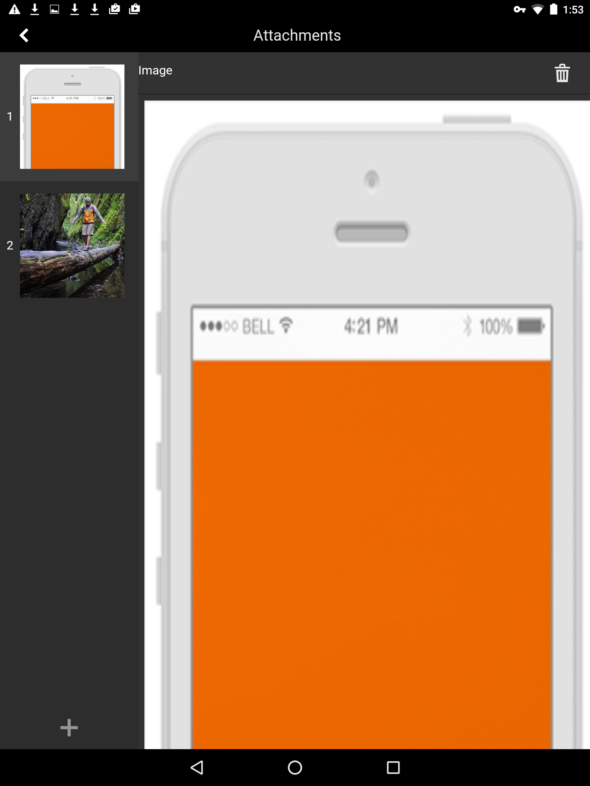

# Hinzufügen von Anhängen  {#adding-attachments}

## Hinzufügen von Anlagen in Formularen, die mit dem AEM Forms Workflow-Server (AEM Forms on JEE) synchronisiert werden {#adding-annotations}

Mit der AEM Forms-App können Sie Bilder, Notizen und Kommentare zu Ihrem Formular hinzufügen, das mit dem AEM Forms JEE-Server synchronisiert wird. Wenn das Formular von einem AEM Forms Workflow-Server geladen wird, werden die Anlagen zu dem Formular hinzugefügt. Sie können auf die Schaltfläche für Anlagen  tippen, um alle Anlagen in einem Formular zusammen anzuzeigen. Die rote Benachrichtigung gibt die Anzahl von Anlagen im Formular an. Wenn das Formular keine Anlagen enthält, wird die rote Benachrichtigungsschaltfläche nicht angezeigt. Wenn keine Anlagen im Formular vorhanden sind, erhalten Sie beim Tippen auf die Schaltfläche für Anlagen  Optionen zum Anhängen von Fotos oder Scribbles.

Ihre Optionen sind:

* **[!UICONTROL Galerie]**: Hiermit können Sie ein Bild aus den auf dem Gerät gespeicherten hinzufügen.

* **[!UICONTROL Kamera]**: Hiermit können Sie ein Foto aufnehmen und es zum Formular hinzufügen. 

* **[!UICONTROL Hinweise]**: Hiermit können Sie eine Notiz oder Textanmerkung hinzufügen. Verwenden Sie , um ein Scribble hinzuzufügen, und , um eine Textanmerkung hinzuzufügen.

>[!NOTE]
>
>Von einem Benutzer hinzugefügte Anlagen sind für andere Benutzer der AEM Forms-App sichtbar. Andere Benutzer können die Anlagen nicht löschen, die von einem Benutzer hinzugefügt werden.

### Der Bildschirm „Anlagen“{#the-attachments-screen}

Um alle Anlagen an einem Ort anzuzeigen, tippen Sie auf . Hier können Sie Anlagen hinzufügen, umbenennen und löschen.

Verwenden Sie die Schaltfläche mit dem **Pluszeichen** (+) im Bildschirm „Anlagen“, um ein weiteres Bild, eine weitere Notiz oder einen weiteren Text anzufügen.

### Hinzufügen eines Fotos {#adding-a-photograph}

Sie können die Kamera Ihres Mobilgeräts oder auf Ihrem Gerät gespeicherte Bilder verwenden, um ein Bild im Formular anzuhängen.

1. Tippen Sie auf die Schaltfläche für Anlagen  am unteren Rand des Fensters.
1. Tippen Sie auf **[!UICONTROL Galerie]** oder **[!UICONTROL Kamera]** im Popup-Menü, das angezeigt wird.
1. Führen Sie je nach ausgewählter Option einen der folgenden Schritte aus:

   1. Wenn Sie **[!UICONTROL Kamera]** auswählen:

      Nehmen Sie ein Foto auf. Tippen Sie dann auf die Schaltfläche **[!UICONTROL Verwenden Sie]** .

      Oder tippen Sie auf die Schaltfläche **[!UICONTROL Retake]**  , um das Foto erneut aufzunehmen.

   1. Wenn Sie **[!UICONTROL Galerie]** auswählen:

      Das Dialogfeld für die Bildauswahl wird eingeblendet. In der Bildauswahl Ihres Geräts tippen Sie auf das Bild, das Sie anfügen möchten.

### Hinzufügen einer Notiz {#adding-a-note}

Mit der Option **Notizen** können Sie dem Formular Freihand-Scribbles oder Textanlagen hinzufügen.

1. Tippen Sie auf die Schaltfläche für Anlagen  am unteren Rand des Fensters.
1. Tippen Sie auf **[!UICONTROL Notizen]** im Popup-Menü, das angezeigt wird.
1. Dadurch wird die Benutzeroberfläche „Notizen“ gestartet, auf der Sie ein Freihand-Scribble erfassen können.

   
   **Abbildung:** *Scribble*

   Sie können die folgenden Optionen in der Scribble-Benutzeroberfläche verwenden:

   * **[!UICONTROL Clear]**: Löscht den gesamten Bildschirm.
   * **[!UICONTROL Fertig]**: Hängt das aktuelle Scribble an.
   * **[!UICONTROL Abbrechen]**: Verwirft das aktuelle Scribble und beendet die Scribble-Benutzeroberfläche.
   * : Löscht das Scribble und ermöglicht das Hinzufügen einer Textanmerkung.

   

## Anlagen in Formularen, die mit den AEM Forms-Servern ohne AEM Forms Workflow (AEM Forms unter OSGi) synchronisiert werden {#attachments-in-forms-synced-with-the-aem-forms-servers-without-aem-forms-workflow-aem-forms-on-osgi}

Anlagen für Mobile Forms, die mit AEM Forms OSGi-Servern synchronisiert werden, funktionieren ähnlich wie die AEM Forms JEE-Server.

Anlagen auf Formularebene werden für adaptive Formulare, die in der AEM Forms-App von einem AEM Forms OSGi-Server geladen werden, nicht unterstützt. Um Bilder oder Textanmerkungen hinzuzufügen, aktivieren Sie Anlagen auf Feldebene im Formular, wenn Sie es erstellen. Ziehen Sie die Dateianlagenkomponente aus dem Komponenten-Browser in das Feld.

Bei adaptiven Formularen können Sie die angehängten Dateien im Datensatzdokument (DoR) anzeigen. Siehe [Generierung eines Datensatzdokuments für adaptive Nicht-XFA-Formulare](/help/forms/using/generate-document-of-record-for-non-xfa-based-adaptive-forms.md).
