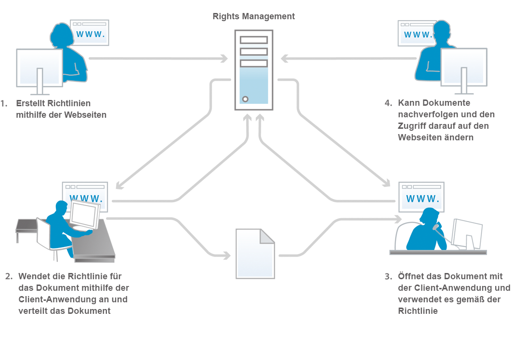

# Informationen zur Dokumentensicherheit {#about-document-security}

>[!CAUTION]
>
>AEM 6.4 hat das Ende der erweiterten Unterstützung erreicht und diese Dokumentation wird nicht mehr aktualisiert. Weitere Informationen finden Sie in unserer [technische Unterstützung](https://helpx.adobe.com/de/support/programs/eol-matrix.html). Unterstützte Versionen suchen [here](https://experienceleague.adobe.com/docs/?lang=de).

Document Security stellt sicher, dass nur autorisierte Benutzer Ihre Dokumente verwenden können. Mit Document Security können Sie alle Informationen, die Sie in einem unterstützten Format gespeichert haben, sicher verteilen. Zu den unterstützten Dateiformaten gehören:

* Adobe PDF-Dateien
* Microsoft® Word-, Excel- und PowerPoint-Dateien

Weitere Informationen dazu, wie Richtlinien unterstützte Dateitypen schützen, finden Sie unter [Zusätzliche Document Security-Informationen](https://www.adobe.com/go/learn_aemforms_doc_security_63).

Mit Document Security können Sie vordefinierte Vertraulichkeitseinstellungen einfach erstellen, speichern und auf Ihre Dokumente anwenden. Um zu verhindern, dass Informationen über Ihre Reichweite hinaus verbreitet werden, können Sie auch überwachen und steuern, wie Empfänger Ihre Dokumente verwenden, nachdem Sie sie verteilt haben.

Sie können Dokumente mithilfe von Richtlinien schützen. A *policy* ist eine Sammlung von Informationen, die Vertraulichkeitseinstellungen und eine Liste autorisierter Benutzer umfasst. Die Vertraulichkeitseinstellungen, die Sie in einer Richtlinie angeben, bestimmen, wie ein Empfänger ein Dokument verwenden kann, auf das Sie die Richtlinie anwenden. Sie können beispielsweise angeben, ob Empfänger Text drucken oder kopieren, Text bearbeiten oder geschützten Dokumenten Signaturen und Kommentare hinzufügen können.

Document Security-Benutzer erstellen Richtlinien über die Webseiten für Endbenutzer. Administratoren verwenden die Document Security-Webseiten, um Richtliniensätze zu erstellen, die freigegebene Richtlinien enthalten, die für alle autorisierten Benutzer verfügbar sind.

Richtlinien werden zwar in Document Security gespeichert, Sie wenden sie jedoch über Ihre Clientanwendung auf Dokumente an. Wie Richtlinien auf PDF-Dokumente angewendet werden, wird ausführlich unter *Hilfe zu Acrobat*. Die Anwendung von Richtlinien mithilfe anderer Anwendungen wie Microsoft Office wird im Abschnitt *Hilfe zu Acrobat Reader DC-Erweiterungen* für die Anwendung.

Wenn Sie eine Richtlinie auf ein Dokument anwenden, schützen die in der Richtlinie angegebenen Vertraulichkeitseinstellungen die Informationen, die das Dokument enthält. Die Vertraulichkeitseinstellungen schützen auch alle Dateien (Text, Audio oder Video) innerhalb eines PDF-Dokuments. Sie können das richtliniengeschützte Dokument an Empfänger verteilen, die durch die Richtlinie autorisiert sind.

**Zugriffskontrolle und Prüfung von Dokumenten**

Die Verwendung einer Richtlinie zum Schutz eines Dokuments gibt Ihnen fortlaufende Kontrolle über dieses Dokument, selbst wenn Sie es verteilen. Sie können das Dokument überwachen, Änderungen an der Richtlinie vornehmen, Benutzer daran hindern, weiterhin auf das Dokument zuzugreifen, und die Richtlinie wechseln, die auf das Dokument angewendet wird.

Über Document Security können Sie richtliniengeschützte Dokumente überwachen und Ereignisse verfolgen, z. B. wenn ein autorisierter oder nicht autorisierter Benutzer versucht, das Dokument zu öffnen.

**Komponenten**

Document Security besteht aus einem Server und einer Benutzeroberfläche:

**Server:** Der Server ist die zentrale Komponente, über die Document Security Transaktionen wie z. B. die Authentifizierung von Benutzern, die Richtlinienverwaltung in Echtzeit und das Durchsetzen der Vertraulichkeit ausführt. Der Server stellt außerdem ein zentrales Repository für Richtlinien, Auditdatensätze und andere zugehörige Informationen bereit.

**Webseiten:** Die Oberfläche, auf der Sie Richtlinien erstellen, richtliniengeschützte Dokumente verwalten und Ereignisse im Zusammenhang mit richtliniengeschützten Dokumenten überwachen. Administratoren können auch globale Optionen wie Benutzerauthentifizierung, Prüfung und Messaging für eingeladene Benutzer konfigurieren und Konten eingeladener Benutzer verwalten.

Die Abbildung zeigt die folgenden Schritte:

1. Der Dokumenteigentümer erstellt Richtlinien mithilfe der Webseiten. Dokumenteigentümer können persönliche Richtlinien erstellen, die nur für sie zugänglich sind. Administratoren und Richtliniensatzkoordinatoren können freigegebene Richtlinien in Richtliniensätzen erstellen, auf die autorisierte Benutzer zugreifen können.
1. Der Dokumenteigentümer wendet die Richtlinie an und speichert und verteilt dann das Dokument. Das Dokument kann per E-Mail, über einen Netzwerkordner oder auf einer Website verteilt werden.
1. Der Empfänger öffnet das Dokument in der entsprechenden Clientanwendung. Der Empfänger kann das Dokument gemäß seiner Richtlinie verwenden.
1. Der Dokumenteigentümer, Richtliniensatzkoordinator oder Administrator kann Dokumente verfolgen und den Zugriff darauf über die Webseiten ändern.

## Über Document Security-Benutzer {#about-document-security-users}

Verschiedene Typen von Benutzern arbeiten mit Document Security, um verschiedene Aufgaben auszuführen:

* Der Systemadministrator oder andere IT-Mitarbeiter installiert und konfiguriert Document Security. Diese Person kann auch für die Konfiguration globaler Einstellungen für den Server, die Webseiten sowie Richtlinien und Dokumente verantwortlich sein.

   Diese Einstellungen können beispielsweise eine Document Security-Basis-URL, Prüf- und Datenschutzbenachrichtigungen, Registrierungshinweise für eingeladene Benutzer und standardmäßige Offline-Nutzungszeiträume umfassen.

* Document Security-Administratoren erstellen Richtlinien und Richtliniensätze und verwalten nach Bedarf richtliniengeschützte Dokumente für Benutzer. Sie erstellen auch Konten eingeladener Benutzer und überwachen System-, Dokument-, Benutzer-, Richtlinien-, Richtliniensatz- und benutzerdefinierte Ereignisse. Möglicherweise sind sie auch in Zusammenarbeit mit einem Systemadministrator für die Konfiguration des globalen Servers sowie der Web-Seiten- und Richtlinieneinstellungen zuständig.

   Administratoren können Benutzern im Bereich &quot;Benutzerverwaltung&quot;von Administration Console die folgenden Rollen zuweisen. Benutzer, denen diese Rollen zugewiesen sind, führen ihre Aufgaben im Bereich der Document Security-Benutzeroberfläche von Administration Console aus.

   **Document Security-Superadministrator**

   Benutzer mit dieser Rolle haben Zugriff auf alle Document Security-Einstellungen in Administration Console. Diese Berechtigungen sind mit der Rolle verknüpft:

   * Konfiguration verwalten
   * Richtlinie verwalten
   * Richtliniensätze verwalten
   * Dokumente verwalten
   * Dokumentherausgeber verwalten
   * Eingeladene und lokale Benutzer verwalten
   * Ereignisse anzeigen
   * Delegieren
   * Externe Benutzer einladen

   **Document Security-Administrator**

   Benutzer mit dieser Rolle können den Document Security-Server mithilfe der Seite &quot;Konfiguration&quot;im Document Security-Abschnitt von Administration Console konfigurieren. Diese Berechtigung ist mit der Rolle &quot;Konfiguration verwalten&quot;verknüpft.

   >[!NOTE]
   >
   >Benutzer mit dieser Rolle müssen auch über die Rolle &quot;Administration Console-Benutzer&quot;verfügen, um sich bei Administration Console anzumelden und Konfigurationseinstellungen zu bearbeiten.

   **Document Security-Richtliniensatz-Administrator**

   Benutzer mit dieser Rolle können den Document Security-Abschnitt von Administration Console verwenden, um die Richtlinien anderer Benutzer zu bearbeiten und Richtliniensätze zu erstellen, zu bearbeiten und zu löschen. Wenn ein Richtliniensatzadministrator einen Richtliniensatz erstellt, kann er diesem Richtliniensatz einen Richtliniensatzkoordinator zuweisen. Diese Berechtigungen sind mit der Rolle verknüpft:

   * Richtlinie verwalten
   * Richtliniensätze verwalten
   * Dokumente verwalten
   * Dokumentherausgeber verwalten
   * Ereignisse anzeigen
   * Delegieren

   >[!NOTE]
   >
   >Benutzer mit dieser Rolle müssen auch über die Rolle &quot;Administration Console-Benutzer&quot;verfügen, um sich bei Administration Console anzumelden und Konfigurationseinstellungen zu bearbeiten.

   **Document Security - eingeladene und lokale Benutzer verwalten**

   Benutzer mit dieser Rolle können Aufgaben ausführen, die zur Verwaltung aller eingeladenen und lokalen Benutzer auf den entsprechenden Document Security-Webseiten erforderlich sind. Diese Berechtigungen sind mit der Rolle verknüpft:

   * Eingeladene und lokale Benutzer verwalten
   * Externe Benutzer einladen
   * Auf Webseiten für Endbenutzer zugreifen

   >[!NOTE]
   >
   >Benutzer mit dieser Rolle müssen auch über die Rolle &quot;Administration Console-Benutzer&quot;verfügen, um sich bei Administration Console anzumelden und Konfigurationseinstellungen zu bearbeiten.

   **Document Security - Benutzer einladen**

   Benutzer mit dieser Rolle können Benutzer einladen. Diese Berechtigungen sind mit der Rolle verknüpft:

   * Externe Benutzer einladen
   * Auf Webseiten für Endbenutzer zugreifen

   **Document Security-Endbenutzer**

   Benutzer mit dieser Rolle können auf Document Security-Webseiten für Endbenutzer zugreifen. Diese Rolle kann auch Administratoren zugewiesen werden, damit sie Richtlinien mithilfe der Endbenutzerseiten erstellen können. Diese Berechtigung ist mit der Rolle Zugriff auf Webseiten für Endbenutzer verknüpft.

* Benutzer innerhalb des Unternehmens, die über gültige Document Security-Konten verfügen, erstellen eigene Richtlinien, verwenden Richtlinien zum Schutz von Dokumenten, verfolgen und verwalten ihre richtliniengeschützten Dokumente und überwachen Ereignisse im Zusammenhang mit ihren Dokumenten.
* Richtliniensatzkoordinatoren verwalten Dokumente, zeigen Ereignisse an und verwalten andere Richtliniensatzkoordinatoren (basierend auf ihren Berechtigungen). Administratoren bestimmen Benutzer als Richtliniensatzkoordinatoren für bestimmte Richtliniensätze.
* Benutzer, die nicht zu Ihrer Organisation gehören (z. B. ein Geschäftspartner), können richtliniengeschützte Dokumente verwenden, wenn sie sich im Document Security-Ordner befinden, wenn der Administrator ein Konto für sie erstellt oder sich bei Document Security über einen automatisierten E-Mail-Einladungsprozess registriert. Je nachdem, wie der Administrator die Zugriffseinstellungen aktiviert, können die eingeladenen Benutzer auch berechtigt sein, Richtlinien auf Dokumente anzuwenden, Richtlinien zu erstellen, zu ändern und zu löschen und andere externe Benutzer zur Verwendung ihrer richtliniengeschützten Dokumente einzuladen.
* Entwickler verwenden das AEM Forms SDK, um benutzerdefinierte Anwendungen in Document Security zu integrieren.

Document Security-Administratoren können benutzerdefinierte Rollen mithilfe der folgenden Berechtigungen in User Management erstellen:

* Document Security - Konfiguration verwalten
* Document Security Eingeladene und lokale Benutzer verwalten
* Document Security - Richtliniensätze verwalten
* Document Security - Richtliniensätze verwalten
* Document Security - Serverereignisse anzeigen
* Document Security - Richtlinieneigentümer ändern

## Richtlinien und richtliniengeschützte Dokumente {#policies-and-policy-protected-documents}

A *policy* definiert einen Satz von Vertraulichkeitseinstellungen und Benutzern, die auf ein Dokument zugreifen können, auf das die Richtlinie angewendet wird. Eine Richtlinie ermöglicht auch eine dynamische Änderung der Berechtigungen für ein Dokument. Dadurch erhält die Person, die das Dokument sichert, die Berechtigung, die Vertraulichkeitseinstellungen zu ändern, um den Zugriff auf das Dokument zu widerrufen oder die Richtlinie zu wechseln.

Der Richtlinienschutz kann mithilfe von Adobe Acrobat® Pro und Acrobat Standard auf ein PDF-Dokument angewendet werden. Der Richtlinienschutz kann auf andere Dateitypen wie Microsoft Word-, Excel- und PowerPoint-Dateien angewendet werden, indem die Clientanwendung mit den entsprechenden installierten Acrobat Reader DC-Erweiterungen verwendet wird.

### Funktionsweise von Richtlinien {#how-policies-work}

Richtlinien enthalten Informationen über die autorisierten Benutzer und die Vertraulichkeitseinstellungen, die auf Dokumente angewendet werden sollen. Bei Benutzern kann es sich um beliebige Personen in Ihrer Organisation handeln sowie um Personen, die außerhalb Ihrer Organisation und über ein Konto verfügen. Wenn der Administrator die Einladungsfunktion für den Benutzer aktiviert, können sogar neue Benutzer zu Richtlinien hinzugefügt werden, wodurch ein E-Mail-Prozess für die Einladung zur Registrierung eingeleitet wird.

Die Vertraulichkeitseinstellungen in einer Richtlinie bestimmen, wie die Empfänger das Dokument verwenden können. Sie können beispielsweise angeben, ob Empfänger Text drucken oder kopieren, Änderungen vornehmen oder geschützten Dokumenten Signaturen und Kommentare hinzufügen können. Dieselbe Richtlinie kann auch für bestimmte Benutzer unterschiedliche Vertraulichkeitseinstellungen festlegen.

>[!NOTE]
>
>Vertraulichkeitseinstellungen, die über eine Richtlinie angewendet werden, setzen Einstellungen außer Kraft, die möglicherweise mithilfe der Kennwort- oder Zertifikatsicherheitsoptionen auf ein PDF-Dokument in Acrobat angewendet wurden. (Weitere Informationen finden Sie in der Acrobat-Hilfe.)

Benutzer und Administratoren erstellen Richtlinien über die Document Security-Webseiten. Auf ein Dokument kann jeweils nur eine Richtlinie angewendet werden. Sie können eine Richtlinie mit einer der folgenden Methoden anwenden:

* Öffnen Sie das Dokument in Acrobat oder einer anderen Clientanwendung und wählen Sie eine Richtlinie zum Schützen des Dokuments aus.
* Senden Sie ein Dokument als E-Mail-Anhang in Microsoft Outlook. In diesem Fall können Sie eine Richtlinie aus einer Richtlinienliste auswählen oder eine automatisch generierte Richtlinie auswählen, die Acrobat mit einem Standardsatz von Vertraulichkeitseinstellungen erstellt, um das Dokument nur für die E-Mail-Nachrichtenempfänger zu schützen.

Eine Richtlinie kann mithilfe der Clientanwendung aus einem Dokument entfernt werden.

Gehen Sie wie folgt vor:

1. Der Dokumenteigentümer sichert das Dokument in einer unterstützten Clientanwendung mit einer Richtlinie, die die Online-Verwendung ermöglicht.
1. Document Security erstellt eine Dokumentlizenz und Dokumentschlüssel und verschlüsselt die Richtlinie. Die Dokumentlizenz, die verschlüsselte Richtlinie und der Dokumentschlüssel werden an die Clientanwendung zurückgegeben.
1. Das Dokument wird mit dem Dokumentschlüssel verschlüsselt und der Dokumentschlüssel wird verworfen. Im Dokument werden jetzt die Lizenz und die Richtlinie eingebettet. Diese Aufgaben werden in der unterstützten Clientanwendung ausgeführt.

Wenn Sie eine Richtlinie auf ein Dokument anwenden, werden die Informationen, die das Dokument enthält, einschließlich aller in PDF-Dokumenten enthaltenen Dateien (Text, Audio oder Video) durch die in der Richtlinie angegebenen Vertraulichkeitseinstellungen geschützt. Document Security generiert eine Lizenz sowie Verschlüsselungsinformationen, die anschließend im Dokument eingebettet werden. Wenn Sie das Dokument verteilen, kann Document Security die Empfänger authentifizieren, die versuchen, das Dokument zu öffnen, und den Zugriff gemäß den in der Richtlinie angegebenen Berechtigungen genehmigen.

Wenn die Offline-Nutzung aktiviert ist, können Empfänger für den in der Richtlinie angegebenen Zeitraum auch offline (ohne aktive Internet- oder Netzwerkverbindung) richtliniengeschützte Dokumente verwenden.

### Funktionsweise richtliniengeschützter Dokumente {#how-policy-protected-documents-work}

Um richtliniengeschützte Dokumente öffnen und verwenden zu können, muss die Richtlinie Ihren Namen als Empfänger enthalten und Sie müssen über ein gültiges Document Security-Konto verfügen. Für PDF-Dokumente benötigen Sie Acrobat oder Adobe Reader®. Für andere Dateitypen benötigen Sie die entsprechende Anwendung für die Datei mit installierten Acrobat Reader DC-Erweiterungen.

Wenn Sie versuchen, ein richtliniengeschütztes Dokument zu öffnen, stellen Acrobat, Adobe Reader oder die Acrobat Reader DC-Erweiterungen eine Verbindung zu Document Security her, um Sie zu authentifizieren. Anschließend können Sie sich anmelden. Wenn die Dokumentnutzung geprüft wird, wird eine Benachrichtigung angezeigt. Nachdem Document Security bestimmt hat, welche Dokumentberechtigungen erteilt werden sollen, verwaltet es die Entschlüsselung des Dokuments. Anschließend können Sie das Dokument gemäß den Vertraulichkeitseinstellungen der Richtlinie verwenden.

Gehen Sie wie folgt vor:

1. Der Dokumentbenutzer öffnet das Dokument in einer unterstützten Clientanwendung und authentifiziert sich beim Server. Die Dokument-ID wird an den Document Security-Server gesendet.
1. Document Security authentifiziert die Benutzer, prüft die Richtlinie auf Autorisierung und erstellt einen Gutschein. Der Gutschein (der den Dokumentschlüssel und die Berechtigungen enthält) wird an die Clientanwendung zurückgegeben.
1. Das Dokument wird mit dem Dokumentschlüssel entschlüsselt und der Dokumentschlüssel wird verworfen. Das Dokument kann dann gemäß den Vertraulichkeitseinstellungen der Richtlinie verwendet werden. Diese Aufgaben werden in der unterstützten Clientanwendung ausgeführt.

Sie können ein Dokument unter folgenden Bedingungen weiterhin verwenden:

* Unbegrenzt oder für den in der Richtlinie angegebenen Gültigkeitszeitraum
* Bis der Administrator oder die Person, die die Richtlinie angewendet hat, den Zugriff auf das Dokument sperrt oder die Richtlinie ändert

Sie können richtliniengeschützte Dokumente auch offline (ohne Internet- oder Netzwerkverbindung) verwenden, wenn die Richtlinie den Offline-Zugriff zulässt. Sie müssen sich zunächst bei Document Security anmelden, um das Dokument zu synchronisieren. Anschließend können Sie das Dokument für die Dauer der Offline-Nutzungsdauer verwenden, die in der Richtlinie angegeben ist.

Wenn die Offline-Nutzungsdauer endet, müssen Sie das Dokument erneut mit Document Security synchronisieren, indem Sie entweder online gehen und ein richtliniengeschütztes Dokument öffnen oder einen Befehl in der Clientanwendung verwenden. (Siehe *Hilfe zu Acrobat* oder *Hilfe zu Acrobat Reader DC-Erweiterungen* für Details.)

Wenn Sie eine Kopie eines richtliniengeschützten Dokuments mithilfe des Menübefehls Speichern oder Speichern unter speichern, wird die Richtlinie automatisch angewendet und für das neue Dokument erzwungen. Ereignisse wie Versuche, das neue Dokument zu öffnen, werden ebenfalls geprüft und für das Originaldokument aufgezeichnet.

## Richtliniensätze {#policy-sets}

*Richtliniensätze* dienen zum Gruppieren verschiedener Richtlinien mit einem gemeinsamen Zweck. Diese Richtliniensätze werden dann einer Untergruppe von Benutzern im System zur Verfügung gestellt.

Jedem Richtliniensatz können ein oder mehrere Richtliniensatzkoordinatoren zugeordnet sein. Der Richtliniensatzkoordinator ist ein Administrator oder Benutzer mit zusätzlichen Berechtigungen. Die *Richtliniensatzkoordinator* ist in der Regel ein Spezialist im Unternehmen, der die Richtlinien in einem bestimmten Richtliniensatz am besten verfassen kann.

Richtliniensatzkoordinatoren können die folgenden Aufgaben ausführen:

* Neue Richtlinien erstellen
* Richtlinien im Richtliniensatz bearbeiten und löschen
* Einstellungen für Richtliniensätze bearbeiten
* Richtliniensatzkoordinatoren hinzufügen und entfernen
* Richtlinien- und Dokumentereignisse für Richtlinien oder Dokumente im Richtliniensatz anzeigen
* Zugriff auf Dokumente sperren
* Richtlinien für das Dokument wechseln.

Richtliniensätze werden von Administratoren und Richtliniensatzkoordinatoren, die dazu berechtigt sind, auf den Document Security-Administrations-Webseiten erstellt und gelöscht.

Richtliniensätze werden meist einer begrenzten Anzahl von Benutzern zur Verfügung gestellt, indem die Benutzer oder Gruppen in einer Domain angegeben werden, die Richtlinien im Richtliniensatz zum Schützen von Dokumenten verwenden dürfen.

Bei der Installation von Document Security wird ein standardmäßiger Richtliniensatz mit dem Namen *Globaler Richtliniensatz*. Der Administrator, der die Software installiert hat, verwaltet diesen Richtliniensatz.
