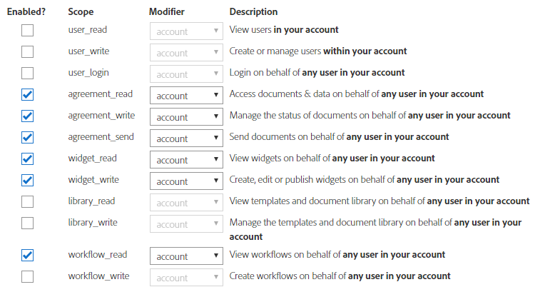

# Integrieren von Adobe Sign mit AEM Forms {#integrate-adobe-sign-with-aem-forms}

Erfahren Sie, wie Sie Adobe Sign für AEM Forms konfigurieren

Adobe Sign aktiviert Arbeitsabläufe für E-Signaturen für adaptive Formulare. E-Signaturen verbessern die Workflows bei der Verarbeitung von Dokumenten in den Bereichen Recht, Vertrieb, Gehaltsabrechnung, Personalverwaltung u. a.

In einem typischen Szenario mit Adobe Sign und adaptiven Formularen füllt der Benutzer ein adaptives Formular aus, um eine Dienstleistung zu beantragen. Dies könnte beispielsweise ein Antrag für eine Kreditkarte oder ein Formular für Dienstleistungen für Bürger. Wenn ein Benutzer das Antragsformular ausfüllt und signiert, wird dieses zur Bearbeitung an den Dienstanbieter gesendet. Dienstanbieter prüft den Antrag und markiert ihn mit Adobe Sign als genehmigt. Sie können ähnliche Workflows für elektronische Signaturen ermöglichen, indem Sie Adobe Sign in AEM Forms integrieren.

Um Adobe Sign mit AEM Forms zu verwenden, konfigurieren Sie Adobe Sign in AEM Cloud-Diensten:

## Voraussetzungen {#prerequisites}

Um Adobe Sign mit AEM Forms zu integrieren, benötigen Sie Folgendes:

* An active [Adobe Sign developer account](https://acrobat.adobe.com/us/en/why-adobe/developer-form.html).
* Einen[ SSL aktivierten](/help/sites-administering/ssl-by-default.md) AEM Forms-Server.
* Eine[ Adobe Sign API-Anwendung](https://www.adobe.io/apis/documentcloud/sign/docs.html#!adobeio/adobeio-documentation/master/sign/gstarted/create_app.md).
* Anmeldeinformationen (Client-ID und Client Secret) der Adobe Sign API-Anwendung.

## Konfigurieren Sie Adobe Sign mit AEM Forms {#configure-adobe-sign-with-aem-forms}

Nachdem die Voraussetzungen erfüllt sind, führen Sie die folgenden Schritte aus, um Adobe Sign mit AEM Forms in der Autoreninstanz zu konfigurieren:

1. On AEM Forms author instance, navigate to **[!UICONTROL Tools **>**General **>**Configuration Browser]**.
1. On the **[!UICONTROL Configuration Browser]** page, tap **[!UICONTROL Create]**.
1. In the **[!UICONTROL Create Configuration]** dialog, specify a **[!UICONTROL Title]** for the configuration, enable **[!UICONTROL Cloud Configurations]**, and tap **[!UICONTROL Create]**. Es wird ein Konfigurationscontainer für Cloud-Dienste erstellt.
1. Navigate to **[!UICONTROL Tools **>**Cloud Services **>**Adobe Sign]**and select the configuration container you created in the above step.

   >[!NOTE]
   >
   >Vergewissern Sie sich, dass die URL der Cloud-Dienste-Konfigurationsseite mit **HTTPS** beginnt. Ist dies nicht der Fall, [aktivieren Sie SSL](/help/sites-administering/ssl-by-default.md) für AEM Forms-Server.

1. On the configuration page, tap **[!UICONTROL Create]** to create Adobe Sign configuration in AEM Forms.
1. In the **[!UICONTROL General]** tab of the **[!UICONTROL Create Adobe Sign Configuration]** page, specify a **[!UICONTROL Name]** for the configuration and tap **[!UICONTROL Next]**. Sie können optional einen Titel angeben und durchsuchen, um ein Miniaturbild für die Konfiguration auszuwählen.

   Kopieren Sie die URL in Ihr aktuelles Browserfenster. Es ist erforderlich, die Adobe Sign-Anwendung mit AEM Forms zu konfigurieren.

1. Konfigurieren Sie OAuth-Einstellungen für die Adobe Sign-Anwendung:

   1. Öffnen Sie ein Browserfenster und melden Sie sich beim Adobe Sign-Entwicklerkonto an.
   1. Wählen Sie die für AEM Forms konfigurierte Anwendung aus und tippen Sie auf „OAuth für Anwendung konfigurieren“.
   1. Fügen Sie im Feld **[!UICONTROL Umleitungs-URL]** die im vorherigen Schritt kopierte HTTPS-URL ein, und klicken Sie dann auf **[!UICONTROL Speichern]**.
   1. Aktivieren Sie die folgenden OAuth-Einstellungen für die Anwendung Adobe Sign und klicken Sie auf **[!UICONTROL Speichern]**.
   * aggrement_read
   * aggrement_write
   * aggrement_send
   * widget_write
   * workflow_read
   Schritt-für-Schritt-Anleitungen zum Konfigurieren der OAuth-Einstellungen für eine Adobe Sign-Anwendung und zum Abrufen der Schlüssel finden Sie in der Entwicklerdokumentation [Konfigurieren von oAuth-Einstellungen für die Anwendung](https://www.adobe.io/apis/documentcloud/sign/docs.html#!adobeio/adobeio-documentation/master/sign/gstarted/configure_oauth.md).

   

1. Kehren Sie zur Seite **[!UICONTROL Adobe Sign-Konfiguration erstellen]** zurück. In the **[!UICONTROL Settings]** tab, the **!UICONTROL OAuth URL]**field mentions the following default URL:

   `https://secure.na1.echosign.com/public/oauth`

   hierbei gilt:

   **na1** bezieht sich auf die Standarddatenbank-Shard.

   Sie können den Wert für die Datenbank-Shard ändern. Starten Sie den Server neu, um den neuen Wert für die Datenbank-Shard verwenden zu können.

1. Specify the **[!UICONTROL Client ID]** (also referred to as Application ID) and **[!UICONTROL Client Secret]**. Wählen Sie die Option **[!UICONTROL Adobe Sign auch für Anhänge aktivieren]**, um Dateien, die an einem adaptiven Formular angehängt sind, an ein entsprechendes Adobe Sign-Dokument, das zum Signiren geschickt wurde, anzuhängen.

   Tap **[!UICONTROL Connect to Adobe Sign]**. Geben Sie bei Aufforderung zur Eingabe der Anmeldeinformationen Benutzername und Kennwort des Kontos an, das bei der Erstellung der Adobe Sign-Anwendung verwendet wurde.

   Tippen Sie auf **[!UICONTROL Erstellen]**, um die Adobe Sign-Konfiguration zu erstellen.

1. Öffnen Sie die AEM Web-Konsole. Die URL lautet `https://[server]:[port]/system/console/configMgr`
1. Open **[!UICONTROL Forms Common Configuration Service]**.
1. Wählen Sie im Feld **[!UICONTROL Zulassen]** **** Alle Benutzer - Alle Benutzer anonym oder angemeldet, können Anhänge in der Vorschau ansehen, Formulare überprüfen und unterzeichnen und klicken Sie auf **[!UICONTROL Speichern]**. Autoreninstanz ist konfiguriert, um Aobe Sign zu verwenden.
1. Melden Sie sich in der Instanz [Veröffentlichen](/help/sites-deploying/deploy.md) an und öffnen Sie die folgende URL:

   `https://<server-name>:<port>/libs/granite/configurations/content/view.html/conf`

1. Wiederholen Sie die Schritte 1 bis 12 zum Konfigurieren von Adobe Sign mit AEM Forms. Verwenden Sie denselben Namen für die Konfiguration (wie in Schritt 3 angegeben) und denselben Namen (wie in Schritt 6 angegeben), um die für die Autoreninstanz konfigurierten Einstellungen zu replizieren.

   Jetzt ist Adobe Sign in AEM Forms integriert und kann in adaptiven Formularen verwendet werden. Um [Adobe Sign service in einem adaptiven Formular zu nutzen](/help/forms/using/working-with-adobe-sign.md#configure-adobe-sign-for-an-adaptive-form), geben Sie den Konfigurationscontainer an, der oben in den Einstellungen für adaptive Formulare erstellt wurde.

## Konfigurieren Sie den Adobe Sign-Scheduler-Dienst, um den Signaturstatus zu synchronisieren {#configure-adobe-sign-scheduler-to-sync-the-signing-status}

Ein Adobe Sign-aktivirtes adaptives Formular wird nur gesendet, nachdem alle Unterzeichner den Unterzeichnungsvorgang abgeschlossen haben. Standardmäßig werden die Adobe Sign-Scheduler-Dienste geplant, um die Unterzeichnerantwort alle 24 Stunden zu überprüfen. Sie können das Standardintervall für Ihre Umgebung ändern. Führen Sie die folgenden Schritte aus, um das Standardintervall zu ändern:

1. Melden Sie sich beim AEM Forms-Server mit den Admin-Anmeldedaten an und navigieren Sie zu **[!UICONTROL Tools]**> **Vorgänge**> **Web-Konsole**.

   Sie können auch die folgende URL in einem Browserfenster öffnen:

   `https://[localhost]:[port]/system/console/configMgr`

1. Suchen und öffnen Sie die Option **[!UICONTROL Adobe Sign-Konfigurationsdienst]**. Geben Sie einen[ Cron-Ausdruck](https://en.wikipedia.org/wiki/Cron#CRON_expression) in das Feld **[!UICONTROL Status-Aktualisierungs-Scheduler-Ausdruck]** und klicken Sie auf **[!UICONTROL Speichern]**. Um beispielsweise den Konfigurationsdienst täglich um 00:00 Uhr auszuführen, geben Sie `0 0 0 1/1 * ? *` im Feld **[!UICONTROL Statusupdate Scheduler-Ausdruck]** an.

Das Standardintervall für den Synchronisationsstatus von Adobe Sign wurde geändert.
