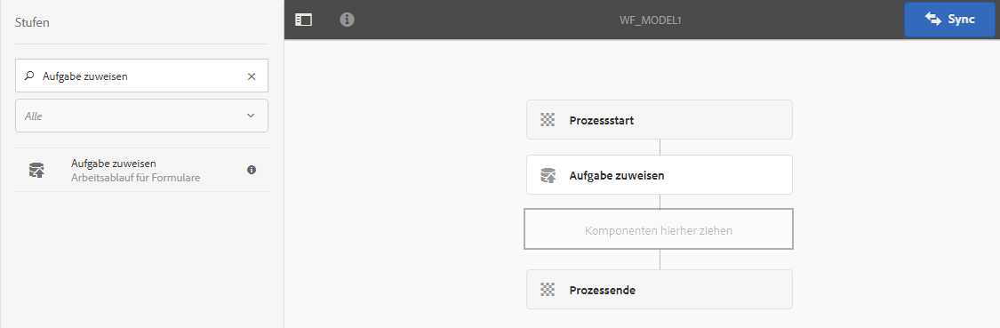
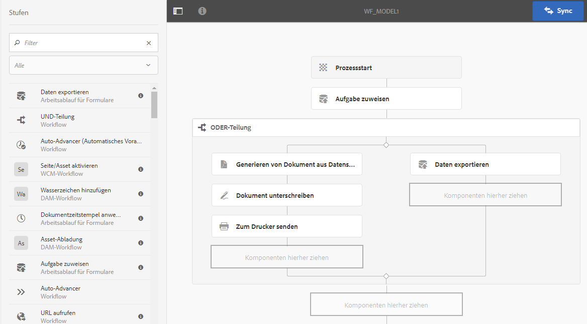

# Formularzentrierte Workflows in OSGi {#forms-centric-workflow-on-osgi}

>[!CAUTION]
>
>AEM 6.4 hat das Ende der erweiterten Unterstützung erreicht und diese Dokumentation wird nicht mehr aktualisiert. Weitere Informationen finden Sie in unserer [technische Unterstützung](https://helpx.adobe.com/de/support/programs/eol-matrix.html). Unterstützte Versionen suchen [here](https://experienceleague.adobe.com/docs/?lang=de).


Unternehmen erfassen Daten aus Hunderten und Tausenden von Formularen, verschiedenen Back-End-Systemen sowie Online- oder Offline-Datenquellen. Sie verfügen außerdem über einen dynamischen Satz von Benutzern, die Entscheidungen über die Daten treffen können, was iterative Prüfungs- und Genehmigungsprozesse erfordert.

Große Unternehmen und Unternehmen haben neben Überprüfungs- und Genehmigungs-Workflows für interne und externe Zielgruppen wiederholte Aufgaben. Konvertieren eines PDF-Dokuments in ein anderes Format. Wenn diese Aufgaben manuell durchgeführt werden, benötigen sie viel Zeit und Ressourcen. Unternehmen müssen außerdem ein Dokument digital signieren und Formulardaten archivieren, um sie später in vordefinierten Formaten verwenden zu können.

## Einführung in den formularzentrierten Workflow in OSGi {#introduction-to-forms-centric-workflow-on-osgi}

Sie können AEM Workflows verwenden, um schnell adaptive formularbasierte Workflows zu erstellen. Diese Workflows können für Überprüfungen und Genehmigungen, Geschäftsprozessabläufe, den Start von Document Services, die Integration in den Acrobat Sign-Signatur-Workflow und ähnliche Vorgänge verwendet werden. Beispiel: Verarbeitung von Kreditkartenanträgen, Workflows zur Genehmigung von Arbeitnehmerurlaub, Speichern eines Formulars als PDF-Dokument. Darüber hinaus können diese Workflows innerhalb eines Unternehmens oder über eine Netzwerk-Firewall verwendet werden.

Mit formularzentrierten Workflows in OSGi können Sie schnell Workflows für verschiedene Aufgaben auf dem OSGi-Stapel erstellen und bereitstellen, ohne die komplette Prozessverwaltungsfunktion auf dem JEE-Stapel zu installieren. Die Entwicklung und Verwaltung von Workflows nutzt die bekannten Funktionen AEM Workflows und AEM Posteingang. Workflows bilden die Grundlage für die Automatisierung realer Geschäftsprozesse, an denen mehrere Softwaresysteme, Netzwerke, Abteilungen und sogar Unternehmen beteiligt sind.

Nach der Einrichtung können diese Workflows manuell ausgelöst werden, um einen definierten Prozess abzuschließen oder programmgesteuert auszuführen, wenn Benutzer ein Formular senden oder [Correspondence Management](/help/forms/using/cm-overview.md) Schreiben. Mit diesen verbesserten AEM-Workflow-Funktionen bietet AEM Forms zwei unterschiedliche, aber ähnliche Funktionen. Im Rahmen Ihrer Bereitstellungsstrategie müssen Sie entscheiden, welche Lösung für Sie geeignet ist. Hier sehen Sie die formularzentrierten AEM-Workflows unter OSGi und Process Management unter JEE im [Vergleich](/help/forms/using/capabilities-osgi-jee-workflows.md). Informationen zur Bereitstellungstopologie finden Sie darüber hinaus unter [Architektur und Bereitstellungstopologien für AEM Forms](/help/forms/using/aem-forms-architecture-deployment.md).

Der formularzentrierte Workflow für OSGi erweitert den [AEM-Posteingang](/help/sites-authoring/inbox.md) und stellt zusätzliche Komponenten (Schritte) für den AEM-Workflow-Editor bereit, um Unterstützung für AEM Forms-zentrierte Workflows hinzuzufügen. Der erweiterte AEM-Posteingang verfügt über ähnliche Funktionen wie [AEM Forms Workspace](/help/forms/using/introduction-html-workspace.md). Neben der Verwaltung von am Menschen orientierten Workflows (Genehmigung, Überprüfung usw.) können Sie AEM Workflows zur Automatisierung verwenden [Document Services](/help/sites-developing/workflows-step-ref.md)-bezogene Vorgänge (z. B. PDF generieren) und elektronische Signaturen (Acrobat Sign).

Das folgende Diagramm zeigt den kompletten Ablauf zum Erstellen, Ausführen und Überwachen eines formularzentrierten Workflows in OSGi.


## Bevor Sie beginnen {#before-you-start}

* Ein Workflow ist eine Darstellung eines realen Geschäftsprozesses. Halten Sie Ihren realen Geschäftsprozess und die Liste der Teilnehmer des Geschäftsprozesses bereit. Außerdem sollten Sie die Begleitmaterialien (adaptive Formulare, PDF-Dokumente und mehr) vor der Erstellung eines Workflows aufbewahren.
* Ein Workflow kann mehrere Phasen aufweisen. Diese Schritte werden im AEM Posteingang angezeigt und helfen, den Fortschritt des Workflows zu melden. Teilen Sie Ihren Geschäftsprozess in logische Phasen auf.
* Sie können den Schritt &quot;Aufgabe zuweisen&quot;AEM Workflows konfigurieren, um E-Mail-Benachrichtigungen an Benutzer oder Bevollmächtigte zu senden. Also, [E-Mail-Benachrichtigungen aktivieren](#configure-email-service).
* Ein Workflow kann auch Acrobat Sign für digitale Signaturen verwenden. Wenn Sie planen, Acrobat Sign in einem Workflow zu verwenden, wird die [Acrobat Sign für AEM Forms konfigurieren](/help/forms/using/adobe-sign-integration-adaptive-forms.md) vor der Verwendung in einem Workflow.

## Erstellen Sie ein Workflow-Modell {#create-a-workflow-model}

Ein Workflow-Modell besteht aus Logik und Fluss eines Geschäftsprozesses. Er besteht aus einer Reihe von Schritten. Diese Schritte sind AEM Komponenten. Sie können Workflow-Schritte nach Bedarf mit Parametern und Skripten erweitern, um einen größeren Funktionsumfang und mehr Kontrollmöglichkeiten zu erzielen. AEM Forms bietet einige Schritte zusätzlich zu AEM vordefinierten Schritten. Eine detaillierte Liste der AEM- und AEM Forms-Schritte finden Sie in der [Referenz zu Workflow-Schritten](/help/sites-developing/workflows-step-ref.md) und unter [Formularzentrierte Workflows in OSGi – Schritt-Referenz](/help/forms/using/aem-forms-workflow.md).

AEM bietet eine intuitive Benutzeroberfläche zum Erstellen eines Workflow-Modells mithilfe der bereitgestellten Workflow-Schritte. Eine schrittweise Anleitung zum Erstellen eines Workflow-Modells finden Sie unter [Erstellen von Workflow-Modellen](/help/sites-developing/workflows-models.md). Das folgende Beispiel enthält eine schrittweise Anleitung zum Erstellen eines Workflow-Modells für einen Genehmigungs- und Überprüfungs-Workflow:

>[!NOTE]
>
>Um ein Workflow-Modell zu erstellen oder zu bearbeiten, müssen Sie zur Gruppe workflow-editor gehören.

### Modell für einen Workflow zur Genehmigung und Prüfung erstellen {#create-a-model-for-an-approval-and-review-workflow}

Validierungs- und Überprüfungs-Workflow sind für Aufgaben vorgesehen, die menschliches Eingreifen erfordern, um Entscheidungen zu treffen. Im folgenden Beispiel wird ein Workflow-Modell für einen Hypothekenantrag erstellt, der von einem Front-Office-Bankmitarbeiter ausgefüllt werden soll. Sobald der Antrag ausgefüllt ist, wird er zur Genehmigung gesendet. Später wird der genehmigte Antrag zur elektronischen Signatur mit Acrobat Sign an den Antragsteller gesendet.

Das Beispiel ist als nachstehendes Paket verfügbar. Importieren und installieren Sie das Beispiel mit dem Package Manager. Sie können auch die folgenden Schritte ausführen, um das Workflow-Modell für die Anwendung manuell zu erstellen:

Im Beispiel wird ein Workflow-Modell für einen Hypothekenantrag erstellt, der von einem Front-Office-Bankmitarbeiter ausgefüllt werden soll. Nach dem Ausfüllen wird der Antrag zur Genehmigung gesendet. Später wird der genehmigte Antrag zur elektronischen Signatur mit Acrobat Sign an den Kunden gesendet. Sie können das Beispiel mit dem Package Manager importieren und installieren.

[Datei laden](assets/example-mortgage-loan-application.zip)

1. Öffnen Sie die Workflow-Modell-Konsole für Arbeitsablaufmodelle. Die Standardeinstellung ist `https://[Server]:[port]/libs/cq/workflow/admin/console/content/models.html/etc/workflow/models`
1. Wählen Sie **[!UICONTROL Erstellen]** und dann **[!UICONTROL Modell erstellen]** aus. Das Dialogfeld „Workflow-Modell hinzufügen“ wird angezeigt.
1. Geben Sie den **[!UICONTROL Titel]** und den **[!UICONTROL Namen]** ein (optional). Beispiel: Hypothekenantrag. Tippen Sie auf **[!UICONTROL Fertig]**.
1. Wählen Sie das neu erstellte Workflow-Modell aus und tippen Sie auf **Bearbeiten.** Jetzt können Sie Workflow-Schritte hinzufügen, um Geschäftslogik zu erstellen. Wenn Sie ein Workflow-Modell neu erstellen, enthält es zunächst:

   * Die Schritte: Flussstart und Flussende. Diese Schritte stellen den Anfang und das Ende des Workflows dar. Diese Schritte sind erforderlich und können nicht bearbeitet oder entfernt werden.
   * Einen Teilnehmer-Beispielschritt mit der Bezeichnung „Schritt 1“. Dieser Schritt ist so konfiguriert, dass er dem Admin-Benutzer ein Arbeitselement zuordnet. Entfernen Sie diesen Schritt.

1. Aktivieren Sie E-Mail-Benachrichtigungen. Sie können einen formularzentrierten Workflow in OSGi so konfigurieren, dass E-Mail-Benachrichtigungen an die Benutzer oder Bevollmächtigten gesendet werden. Führen Sie die folgenden Konfigurationen durch, um E-Mail-Benachrichtigungen zu aktivieren:

   1. Wechseln Sie zum AEM Configuration Manager unter `https://[server]:[port]/system/console/configMgr`.
   1. Öffnen Sie die Konfiguration **[!UICONTROL Day CQ Mail Service]**. Geben Sie Werte in die Felder **[!UICONTROL SMTP-Server-Hostname]**, **[!UICONTROL SMTP-Server-Anschluss]** und **[!UICONTROL Absenderadresse]** ein. Klicken Sie auf **[!UICONTROL Speichern]**.
   1. Öffnen Sie die Konfiguration **[!UICONTROL Day CQ Link Externalizer]**. Geben Sie im Feld **[!UICONTROL Domains]** den tatsächlichen Hostnamen/die IP-Adresse und die Portnummer für lokale, Authoring- und Veröffentlichungsinstanzen an. Klicken Sie auf **[!UICONTROL Speichern]**.

1. Erstellen Sie Workflow-Phasen. Ein Workflow kann mehrere Phasen aufweisen. Diese Schritte werden im AEM Posteingang angezeigt und melden den Fortschritt des Workflows.

   Um einen Schritt zu definieren, tippen Sie auf das Symbol , um die Eigenschaften des Workflow-Modells zu öffnen. Öffnen Sie die Registerkarte **[!UICONTROL Schritte]**, fügen Sie Schritte für das Workflow-Modell hinzu und tippen Sie auf **[!UICONTROL Speichern und Schließen]**. Für einen Hypothekenantrag könnten Sie beispielsweise die folgenden Schritte erstellen: Darlehensantrag, Status des Darlehensantrags, zu signierende Dokumente und signiertes Antragsdokument.

1. Ziehen Sie den Workflow **[!UICONTROL Aufgaben zuweisen]** per Drag-and-Drop in das Workflow-Modell. Machen Sie es zum ersten Schritt des Modells.

   Die Komponente &quot;Aufgabe zuweisen&quot;weist die durch den Workflow erstellte Aufgabe einem Benutzer oder einer Gruppe zu. Neben der Zuweisung der Aufgabe können Sie die Komponente verwenden, um ein adaptives Formular oder eine nicht interaktive PDF für die Aufgabe anzugeben. Das adaptive Formular ist erforderlich, um Benutzereingaben zu akzeptieren, und nicht interaktive PDF oder ein schreibgeschütztes adaptives Formular wird für schreibgeschützte Workflows verwendet.

   Sie können mithilfe dieses Schritts auch das Verhalten der Aufgabe steuern. Erstellen Sie beispielsweise ein automatisches Datensatzdokument, weisen Sie die Aufgabe einem bestimmten Benutzer oder einer bestimmten Gruppe zu, geben Sie den Pfad der gesendeten Daten, den Pfad der vorab auszufüllenden Daten und Standardaktionen an. Weitere Informationen zu den Optionen des Schritts „Aufgabe zuweisen“ finden Sie unter [Formularzentrierte Workflows in OSGi – Schritt-Referenz](/help/forms/using/aem-forms-workflow.md).

   

   Konfigurieren Sie im Beispiel für den Hypothekenantrag den Schritt „Aufgabe zuweisen“ so, dass ein schreibgeschütztes adaptives Formular verwendet und das PDF-Dokument angezeigt wird, nachdem die Aufgabe abgeschlossen ist. Wählen Sie auch die Benutzergruppe aus, die zum Genehmigen des Darlehensantrags berechtigt ist. Deaktivieren Sie auf der Registerkarte **[!UICONTROL Aktionen]** die Option **[!UICONTROL Senden]**. Geben Sie eine **[!UICONTROL Route-Variable]**. Beispiel: actionTaken. Fügen Sie außerdem die Routen Genehmigen und Ablehnen hinzu. Die Routen werden als separate Aktionen (Schaltflächen) im AEM Posteingang angezeigt. Der Workflow wählt eine Verzweigung basierend auf der Aktion (Schaltfläche) aus, auf die ein Benutzer tippt.

   Sie können das Beispielpaket, das zu Beginn des Abschnitts heruntergeladen werden kann, für den vollständigen Wertesatz aller Felder des Schritts &quot;Aufgabe zuweisen&quot;importieren, der für z. B. einen Hypothekenantrag konfiguriert ist.

1. Ziehen Sie die Komponente ODER-Teilung aus dem Schritt-Browser in das Workflow-Modell. Die ODER-Teilung erstellt eine Verzweigung im Workflow, nach der nur einer der beiden Zweige aktiv bleibt. Mit diesem Schritt können Sie bedingte Verarbeitungspfade in einem Workflow einrichten. Sie fügen jeder Verzweigung nach Bedarf Workflow-Schritte hinzu.

   Öffnen Sie die Eigenschaften der ODER-Teilung und fügen Sie die folgenden Codefragmente zu Branch1 und Branch2 hinzu. Diese Codefragmente helfen bei der Auswahl einer Verzweigung, die auf der Benutzeraktion in AEM Posteingang basiert.

   **Codefragment für Verzweigung 1**

   Wenn ein Benutzer im AEM-Posteingang auf **[!UICONTROL Genehmigen]** klickt, wird die Verzweigung 1 aktiviert.

   ```
   function check(){
      var action = workflowData.getMetaDataMap().get("actionTaken","");
   log.info("action " + action);
      return action=="Approve";
   }
   ```

   **Codefragment für Verzweigung 2**

   Wenn der Benutzer im AEM-Posteingang auf **[!UICONTROL Ablehnen]** klickt, wird die Verzweigung 2 aktiviert.

   ```
   function check(){
      var action = workflowData.getMetaDataMap().get("actionTaken","");
   log.info("action " + action);
      return action=="Reject";
   }
   ```

1. Fügen Sie weitere Workflow-Schritte hinzu, um die Geschäftslogik zu erstellen.

   Fügen Sie für das Hypothekenbeispiel ein Datensatzdokument generieren, zwei Aufgabenschritte zuweisen und einen Schritt zum Signieren des Dokuments zu Verzweigung 1 des Modells hinzu, wie in der Abbildung unten dargestellt. Ein Schritt „Aufgabe zuweisen“ dient zum Anzeigen und Senden **zu unterzeichnender Darlehensdokumente an den Antragsteller** und der zweite Schritt „Aufgabe zuweisen“ dient zum **Anzeigen der unterzeichneten Dokumente**. Fügen Sie außerdem Zweig 2 eine Aufgabenkomponente zuweisen hinzu. Diese Verzweigung wird aktiviert, wenn ein Benutzer im AEM-Posteingang auf „Ablehnen“ klickt.

   Für den vollständigen Satz von Werten aller Felder der Schritte &quot;Aufgabe zuweisen&quot;, &quot;Schritt des Datensatzdokuments&quot;und &quot;Schritt des Dokuments signieren&quot;, die für ein Beispiel für eine Hypothekenanwendung konfiguriert sind, importieren Sie das Beispielpaket, das Sie zu Beginn dieses Abschnitts herunterladen können.

   Das Workflow-Modell ist bereit. Sie können den Workflow mit verschiedenen Methoden starten. Weitere Informationen finden Sie unter [Starten eines formularzentrierten Workflows in OSGi](#launch).

   

## Erstellen einer formularzentrierten Workflow-Anwendung {#create-a-forms-centric-workflow-application}

Der Antrag ist das mit dem Workflow verknüpfte adaptive Formular. Wenn eine Anwendung über den Posteingang gesendet wird, wird der zugehörige Workflow gestartet. Um einen Forms-Workflow als Anwendung im AEM-Posteingang und in AEM Forms-Apps verfügbar zu machen, führen Sie folgende Schritte aus, um eine Workflow-Anwendung zu erstellen:

>[!NOTE]
>
>Sie müssen Mitglied der Gruppe fd-administrator sein, um Workflow-Anwendungen erstellen und verwalten zu können.

1. Wechseln Sie in Ihrer AEM-Autoreninstanz zu  > **[!UICONTROL Forms]** > **[!UICONTROL Workflow-Anwendung verwalten]** und Tippen **[!UICONTROL Erstellen]**.
1. Geben Sie im Fenster Workflow-Anwendung erstellen die Eingabe für die folgenden Felder ein und tippen Sie auf **[!UICONTROL Erstellen]**. Eine neue Anwendung wird erstellt und im Bildschirm „Workflow-Anwendungen“ aufgeführt.

<table> 
 <tbody> 
  <tr> 
   <td>Feld</td> 
   <td>Beschreibung</td> 
  </tr> 
  <tr> 
   <td>Titel</td> 
   <td>Der Titel wird im Posteingang angezeigt und hilft Benutzern bei der Auswahl einer Anwendung. Behalten Sie es für beschreibend. Beispiel: Antrag auf Eröffnung eines Sparkontos.<br /> </td> 
  </tr> 
  <tr> 
   <td>Name </td> 
   <td>Geben Sie den Namen der Anwendung an. Zeichen, die keine Buchstaben, Ziffern, Bindestriche oder Unterstriche sind, werden durch Bindestriche ersetzt. </td> 
  </tr> 
  <tr> 
   <td>Beschreibung</td> 
   <td>Die Beschreibung ist im Posteingang AEM. Geben Sie detaillierte Informationen zur Anwendung in den Beschreibungsfeldern ein. Beispielsweise Zweck der Anwendung.<br /> </td> 
  </tr> 
  <tr> 
   <td>Adaptives Formular</td> 
   <td><p>Geben Sie den Pfad eines adaptiven Formulars an. Wenn ein Benutzer eine Anwendung startet, wird das angegebene adaptive Formular angezeigt.</p> <p><strong>Hinweis:</strong> Workflow-Anwendungen unterstützen keine Formulare und PDF-Dokumente, die länger als eine Seite sind oder auf dem Apple iPad einen Bildlauf erfordern. Wenn eine Anwendung auf dem Apple iPad geöffnet wird und das adaptive Formular oder das PDF-Dokument länger als eine Seite ist, gehen die Formularfelder und der Inhalt auf der zweiten Seite verloren.</p> </td> 
  </tr> 
  <tr> 
   <td>Zugriffsgruppe</td> 
   <td><p>Wählen Sie eine Gruppe aus. Die Anwendung wird nur für die Mitglieder der ausgewählten Gruppe in AEM-Posteingang angezeigt. Die Option „Zugriffsgruppe“ stellt alle Gruppen der Workflow-Benutzergruppe zur Auswahl bereit. </p> <br /> </td> 
  </tr> 
  <tr> 
   <td>Vorbefüllungs-Dienst</td> 
   <td>Wählen Sie eine <a href="/help/forms/using/prepopulate-adaptive-form-fields.md#aem-forms-custom-prefill-service" target="_blank">Vorbefüllungs-Dienst</a> für das adaptive Formular.<br /> </td> 
  </tr> 
  <tr> 
   <td>Workflow-Modell</td> 
   <td>Wählen Sie eine <a href="/help/forms/using/aem-forms-workflow.md#create-a-workflow-model">Workflow-Modell</a> für die Anwendung. Ein Workflow-Modell besteht aus einer Logik und einem Ablauf des Geschäftsprozesses. </td> 
  </tr> 
  <tr> 
   <td>Datendateipfad</td> 
   <td>Geben Sie den Pfad der Datendatei im CRX-Repository an. Der Pfad ist relativ zur Payload des adaptiven Formulars und enthält den Namen der Datendatei. Geben Sie immer den vollständigen Namen der Datei einschließlich der Dateierweiterung (wo zutreffend) an. Beispiel: [Payload]/data.xml. </td> 
  </tr> 
  <tr> 
   <td>Anlagenpfad</td> 
   <td>Geben Sie den Pfad des Ordners für Anlagen im CRX-Repository an. Der Anlagenpfad ist relativ zum Payload-Speicherort. Beispiel: [Payload]/data.xml. </td> 
  </tr> 
  <tr> 
   <td>Pfad für Datensatzdokument</td> 
   <td>Geben Sie den Pfad der Datensatzdokumentdatei im CRX-Repository an. Der Pfad wird relativ zum Speicherort der Nutzdaten für das adaptive Formular angegeben. Geben Sie immer den vollständigen Namen der Datei einschließlich der Dateierweiterung (wo zutreffend) an. Beispiel: [Payload]/DOR/creditcard.pdf.</td> 
  </tr> 
 </tbody> 
</table>

## Starten eines formularzentrierten Workflows in OSGi {#launch}

Sie können einen formularzentrierten Workflow wie folgt starten oder auslösen:

* [Senden eines Antrags aus dem AEM-Posteingang](#inbox)
* [Senden einer Anwendung aus der AEM Forms-App](#afa)

* [Senden eines adaptiven Formulars](#af)
* [Verwenden eines überwachten Ordners](#watched)

* [Senden einer interaktiven Kommunikation oder eines Briefes](#letter)

### Senden eines Antrags aus dem AEM-Posteingang {#inbox}

Die von Ihnen erstellte Workflow-Anwendung ist als Antrag im Posteingang verfügbar. Benutzer, die Mitglieder der Gruppe &quot;workflow-users&quot;sind, können die Anwendung ausfüllen und übermitteln, die den zugehörigen Workflow Trigger. Weitere Informationen über die Verwendung des AEM-Posteingangs zum Senden von Anwendungen und Verwalten von Aufgaben finden Sie unter [Verwalten von Forms-Anwendungen und Aufgaben im AEM-Posteingang](/help/forms/using/manage-applications-inbox.md).

### Senden einer Anwendung aus der AEM Forms-App {#afa}

Die AEM Forms-App synchronisiert die Daten mit einem AEM Forms-Server und ermöglicht es Ihnen, Änderungen an den Formulardaten an Aufgaben, an Workflow-Anwendungen und gespeicherten Informationen (Entwürfe/Vorlagen) in Ihrem Konto vorzunehmen. Weitere Informationen finden Sie unter [AEM Forms-App](/help/forms/using/aem-forms-app.md) und in ähnlichen Artikeln.

### Senden eines adaptiven Formulars {#af}

Sie können die Sendeaktionen eines adaptiven Formulars konfigurieren, um einen Workflow beim Senden des adaptiven Formulars zu starten. Adaptive Formulare stellen die **[!UICONTROL Aufrufen eines AEM-Workflows]** Übermittlungsaktion zum Starten eines Workflows bei Übermittlung eines adaptiven Formulars. Detaillierte Informationen zur Übermittlungsaktion finden Sie unter [Konfigurieren der Sendeaktion](/help/forms/using/configuring-submit-actions.md). Um ein adaptives Formular über die AEM Forms-App zu senden, aktivieren Sie in den Eigenschaften des adaptiven Formulars die Option Mit AEM Forms-App synchronisieren .

Sie können ein adaptives Formular so konfigurieren, dass ein Workflow über die AEM Forms-App synchronisiert, gesendet und Trigger wird. Weitere Informationen finden Sie unter [Arbeiten mit einem Formular](/help/forms/using/working-with-form.md).

### Verwenden eines überwachten Ordners {#watched}

Ein Administrator (ein Mitglied der Gruppe &quot;fd-administrators&quot;) kann einen Netzwerkordner konfigurieren, um einen vorkonfigurierten Workflow auszuführen, wenn ein Benutzer eine PDF-Datei im Ordner ablegt. Nach Abschluss des Workflows kann die Ergebnisdatei in einem angegebenen Ausgabeordner gespeichert werden. Ein solcher Ordner wird als [Überwachter Ordner](/help/forms/using/watched-folder-in-aem-forms.md). Führen Sie das folgende Verfahren aus, um einen überwachten Ordner zum Starten eines Workflows zu konfigurieren:

1. Wechseln Sie in Ihrer AEM-Autoreninstanz zu  **[!UICONTROL Forms > Überwachten Ordner konfigurieren]**. . Eine Liste der bereits konfigurierten überwachten Ordner wird angezeigt.
1. Tippen Sie auf **[!UICONTROL Neu]**. Eine Liste der Felder wird angezeigt. Geben Sie einen Wert für die folgenden Felder an, um einen überwachten Ordner für einen Workflow zu konfigurieren:

<table> 
 <tbody> 
  <tr> 
   <td>Feld</td> 
   <td>Beschreibung</td> 
  </tr> 
  <tr> 
   <td><span class="uicontrol">Name</span></td> 
   <td>Geben Sie den Namen des überwachten Ordners an. Dieses Feld unterstützt nur alphanumerische Elemente.</td> 
  </tr> 
  <tr> 
   <td><span class="uicontrol">Pfad </span></td> 
   <td>Geben Sie den physischen Speicherort des überwachten Ordners an. Verwenden Sie in einer Clusterumgebung einen freigegebenen Netzwerkordner, auf den über AEM Clusterknoten zugegriffen werden kann.</td> 
  </tr> 
  <tr> 
   <td><span class="uicontrol">Prozessdateien, die Folgendes verwenden:</span></td> 
   <td>Wählen Sie die <span class="uicontrol">Workflow</span>-Option.  </td> 
  </tr> 
  <tr> 
   <td><span class="uicontrol">Workflow-Modell</span></td> 
   <td>Wählen Sie ein Workflow-Modell.<br /> </td> 
  </tr> 
  <tr> 
   <td><span class="uicontrol">Ausgabedateimuster</span></td> 
   <td>Geben Sie die Ordnerstruktur für Ausgabedateien und Ordner an. Sie können auch eine <a href="/help/forms/using/admin-help/configuring-watched-folder-endpoints.md" target="_blank">Muster für Ausgabedateien und Ordner</a>.</td> 
  </tr> 
 </tbody> 
</table>

1. Tippen **[!UICONTROL Erweitert]**. Geben Sie einen Wert für das folgende Feld an und tippen Sie auf **[!UICONTROL Erstellen]**. Damit ist der überwachte Ordner so konfiguriert, dass er einen Arbeitsablauf startet. Wenn nun eine Datei im Eingabeverzeichnis des überwachten Ordners abgelegt wird, wird der angegebene Workflow ausgelöst.

   | Feld | Beschreibung |
   |---|---|
   | Nutzlast Mapper Filter | Wenn Sie einen überwachten Ordner erstellen, wird eine Ordnerstruktur im CRX-Repository erstellt. Die Ordnerstruktur kann als Nutzlast für den Workflow dienen. Sie können ein Skript schreiben, um einen AEM Workflow zuzuordnen und Eingaben aus der Struktur des überwachten Ordners zu akzeptieren. Eine vordefinierte Implementierung ist verfügbar und im Payload Mapper-Filter aufgeführt. Wenn Sie keine benutzerdefinierte Implementierung haben, wählen Sie die Standardimplementierung aus. |

   Die Registerkarte Erweitert enthält weitere Felder. Die meisten dieser Felder enthalten einen Standardwert. Weitere Informationen zu allen Feldern finden Sie unter [Erstellen oder Konfigurieren eines überwachten Ordners](/help/forms/using/creating-configure-watched-folder.md) Artikel.

### Senden einer interaktiven Kommunikation oder eines Briefes {#letter}

Sie können einen formularbasierten Workflow mit OSGi verknüpfen und ausführen, wenn Sie eine interaktive Mitteilung oder einen Brief einreichen. In Correspondence Management-Workflows werden Workflows für die Nachbearbeitung von interaktiven Kommunikation und Briefen verwendet. Beispielsweise das Versenden von E-Mails, Drucken, Faxen oder Archivieren von endgültigen Briefen. Ausführliche Anweisungen finden Sie unter [Nachbearbeitung interaktiver Kommunikation und Briefe](/help/forms/using/submit-letter-topostprocess.md).

## Zusätzliche Konfigurationen {#additional-configurations}

### E-Mail-Dienst konfigurieren {#configure-email-service}

Sie können die Schritte &quot;Aufgabe zuweisen&quot;und &quot;E-Mail senden&quot;AEM Workflows verwenden, um eine E-Mail zu senden. Führen Sie die folgenden Schritte aus, um E-Mail-Server und andere Konfigurationen anzugeben, die zum Senden von E-Mails erforderlich sind:

1. Wechseln Sie zum AEM Configuration Manager unter `https://[server]:[port]/system/console/configMgr`.
1. Öffnen Sie die Konfiguration **[!UICONTROL Day CQ Mail Service]**. Geben Sie Werte in die Felder **[!UICONTROL SMTP-Server-Hostname]**, **[!UICONTROL SMTP-Server-Anschluss]** und **[!UICONTROL Absenderadresse]** ein. Klicken Sie auf **[!UICONTROL Speichern]**.
1. Öffnen Sie die Konfiguration **[!UICONTROL Day CQ Link Externalizer]**. Geben Sie im Feld **[!UICONTROL Domains]** den tatsächlichen Hostnamen/die IP-Adresse und die Portnummer für lokale, Authoring- und Veröffentlichungsinstanzen an. Klicken Sie auf **[!UICONTROL Speichern]**.

### Bereinigen von Workflow-Instanzen {#purge-workflow-instances}

Da die Minimierung der Anzahl von Workflow-Instanzen die Leistung der Workflow-Engine steigert, sollten Sie regelmäßig abgeschlossene oder laufende Workflow-Instanzen aus dem Repository löschen. Detaillierte Informationen finden Sie unter [Regelmäßiges Bereinigen von Workflow-Instanzen](/help/sites-administering/workflows-administering.md#regular-purging-of-workflow-instances).
