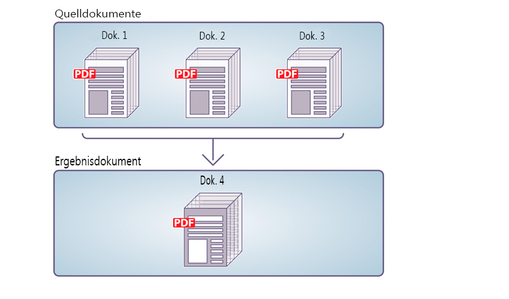
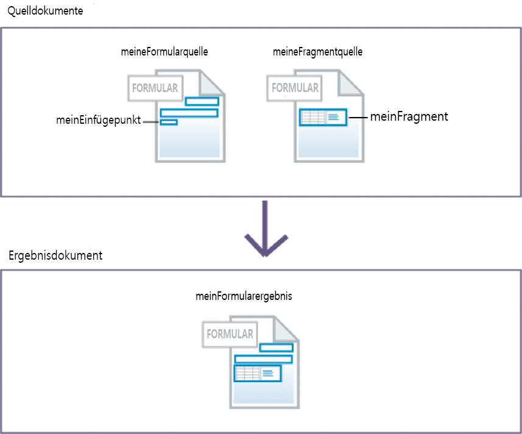
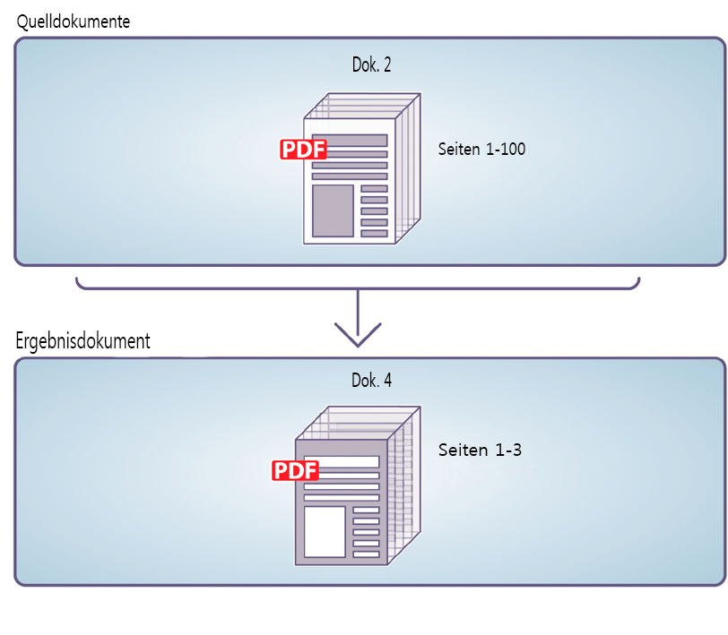
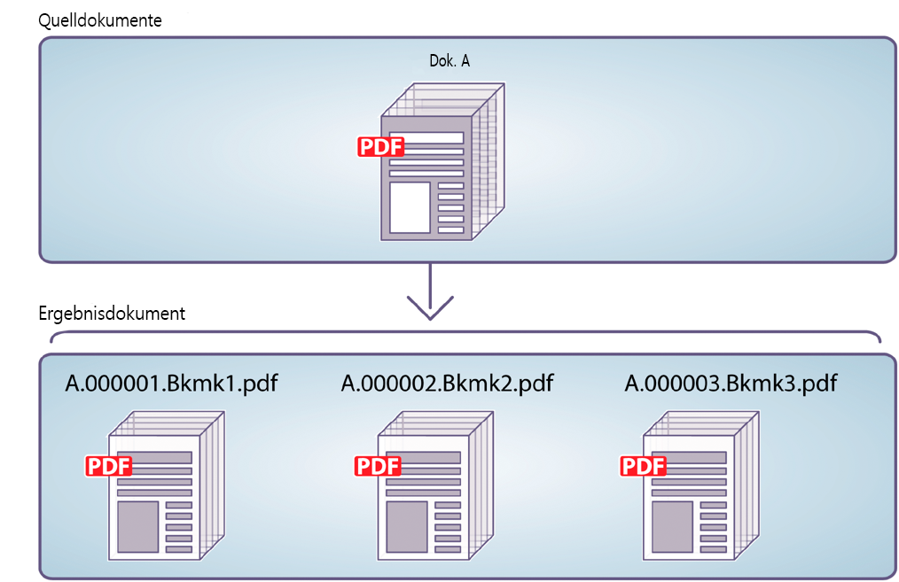

# Verwenden des Assembler-Dienstes {#using-assembler-service}

>[!CAUTION]
>
>AEM 6.4 hat das Ende der erweiterten Unterstützung erreicht und diese Dokumentation wird nicht mehr aktualisiert. Weitere Informationen finden Sie in unserer [technische Unterstützung](https://helpx.adobe.com/de/support/programs/eol-matrix.html). Unterstützte Versionen suchen [here](https://experienceleague.adobe.com/docs/?lang=de).

Mit dem Assembler-Dienst können Sie PDF- und XDP-Dokumente kombinieren, neu anordnen und erweitern und Informationen über PDF-Dokumente abrufen. Jeder Auftrag, der an den Assembler-Dienst gesendet wird, umfasst ein DDX-Dokument (Document Description XML), Quelldokumente und externe Ressourcen (Zeichenfolgen und Grafiken). Weitere Informationen zum Assembler-Dienst finden Sie unter [Übersicht über den Assembler-Dienst](/help/forms/using/overview-aem-document-services.md#p-assembler-service-p).

Sie können den Assembler-Dienst für die folgenden Vorgänge verwenden:

## Zusammenstellen von PDF-Dokumenten {#assemble-pdf-documents}

Mit dem Assembler-Dienst können Sie zwei oder mehr PDF-Dokumente in einem PDF- oder PDF-Portfolio zusammenführen. Sie können auch Funktionen auf das PDF-Dokument anwenden, die die Navigation unterstützen oder die Sicherheit erhöhen. Im Folgenden finden Sie einige Möglichkeiten zum Zusammenführen von PDF-Dokumenten:

### Assemblieren eines einfachen PDF-Dokuments {#assemble-a-simple-pdf-document}

Die folgende Abbildung zeigt, wie drei Quelldokumente in einem Zieldokument zusammengeführt werden.


**Abbildung:** *Assemblieren eines einfachen PDF-Dokuments aus mehreren PDF-Dokumenten*

Im folgenden Beispiel wird ein einfaches DDX-Dokument zum Zusammenführen des Dokuments verwendet. Sie gibt die Namen der Quelldokumente an, die zum Erstellen des Zieldokuments verwendet werden, sowie den Namen des Zieldokuments:

```xml
<PDF result="Doc4">
<PDF source="Doc1"/>
<PDF source="Doc2"/>
<PDF source="Doc3"/>
</PDF>
```

Die Dokumentzusammenführung erstellt ein Zieldokument mit folgendem Inhalt und folgenden\
Eigenschaften:

* Jedes Quelldokument ganz oder teilweise
* Lesezeichen aus jedem Quelldokument (vollständig oder teilweise), die für das zusammengeführte Zieldokument normalisiert wurden
* Andere aus dem Basisdokument (Doc1) übernommene Eigenschaften, einschließlich Metadaten, Seitenbeschriftungen und Seitengröße
* Optional enthält das Zieldokument ein Inhaltsverzeichnis, das aus den Lesezeichen in den Quelldokumenten erstellt wurde

### Erstellen eines PDF-Portfolios {#create-a-pdf-portfolio}

Der Assembler-Dienst kann PDF-Portfolios erstellen, die eine Sammlung von Dokumenten und eine in sich geschlossene Benutzeroberfläche enthalten. Die Benutzeroberfläche wird als PDF-Portfolio-Layout oder PDF-Portfolio-Navigator (Navigator) bezeichnet. PDF-Portfolios erweitern die Funktionalität von PDF-Packages durch Hinzufügen von Navigatoren, Ordnern und Begrüßungsseiten. Die Benutzeroberfläche kann das Benutzererlebnis verbessern, indem sie lokalisierte Textzeichenfolgen, benutzerdefinierte Farbschemata und Grafikressourcen nutzt. Das PDF-Portfolio kann auch Ordner zum Organisieren der Dateien im Portfolio enthalten.

Wenn der Assembler-Dienst das folgende DDX-Dokument interpretiert, stellt er ein PDF-Portfolio zusammen, das einen PDF-Portfolio-Navigator und ein Dateipaket umfasst. Der Dienst ruft den Navigator vom Speicherort ab, der von der myNavigator-Quelle angegeben wurde. Dadurch wird das Standardfarbschema des Navigators in das Farbschema pinkScheme geändert.

```xml
<DDX xmlns="https://ns.adobe.com/DDX/1.0/">
<PDF result="Untitled 1">
<Portfolio>
<Navigator source="myNavigator"/>
<ColorScheme scheme="pinkScheme"/>
</Portfolio>
<PackageFiles>
<PDF source="sourcePDF1"/>
<PDF source="sourcePDF2"/>
</PackageFiles>
</PDF>
</DDX>
```

### Zusammenstellen von verschlüsselten Dokumenten {#assemble-encrypted-documents}

Beim Zusammenführen eines Dokuments können Sie das PDF-Dokument auch mit einem Kennwort verschlüsseln. Nachdem ein PDF-Dokument mit einem Kennwort verschlüsselt wurde, muss ein Benutzer das Kennwort angeben, um das PDF-Dokument in Adobe Reader oder Acrobat anzuzeigen. Um ein PDF-Dokument mit einem Kennwort zu verschlüsseln, muss das DDX-Dokument Verschlüsselungselementwerte enthalten, die zum Verschlüsseln eines PDF-Dokuments erforderlich sind.

Der Encryption-Dienst muss nicht Teil Ihrer LiveCycle-Installation sein, um ein PDF-Dokument mit einem Kennwort zu verschlüsseln.

Wenn eines oder mehrere der Eingabedokumente verschlüsselt sind, geben Sie ein Kennwort ein, um das Dokument als Teil des DDX zu öffnen.

### Zusammenstellen von Dokumenten mithilfe der Bates-Nummerierung {#assemble-documents-using-bates-numbering}

Beim Zusammenführen eines Dokuments können Sie die Bates-Nummerierung verwenden, um auf jede Seite eine eindeutige Seitenkennung anzuwenden. Wenn Sie die Bates-Nummerierung verwenden, wird jeder Seite im Dokument (oder im Dokumentensatz) eine Nummer zugewiesen, die die Seite eindeutig identifiziert. Beispielsweise können Fertigungsdokumente, die Materialaufstellungsinformationen enthalten und mit der Herstellung einer Baugruppe verbunden sind, einen Bezeichner enthalten. Eine Bates-Nummer enthält einen sequenziell inkrementierten numerischen Wert sowie ein optionales Präfix und Suffix. Das Präfix + numerischer Wert + Suffix wird als Bates-Muster bezeichnet.

Die folgende Illustration zeigt ein PDF-Dokument, das einen eindeutigen Bezeichner enthält, der sich in der Kopfzeile des Dokuments befindet.


**Abbildung:** *Ein PDF-Dokument, das eine eindeutige Kennung enthält, die sich in der Kopfzeile des Dokuments befindet*

### Reduzieren und Zusammenstellen von Dokumenten {#flatten-and-assemble-documents}

Mit dem Assembler-Dienst können Sie ein interaktives PDF-Dokument (z. B. ein Formular) in ein nicht interaktives PDF-Dokument umwandeln. Mit einem interaktiven PDF-Dokument können Benutzer Daten in die PDF-Dokumentfelder eingeben oder ändern. Der Prozess der Umwandlung eines interaktiven PDF-Dokuments in ein nicht interaktives PDF-Dokument wird als Reduzieren bezeichnet. Wenn ein PDF-Dokument reduziert wird, behalten Formularfelder ihr grafisches Erscheinungsbild bei, sind jedoch nicht mehr interaktiv. Dies kann ein Grund dafür sein, PDF-Dokumente zu reduzieren. Darüber hinaus funktionieren mit den Feldern verknüpfte Skripte nicht mehr.

Wenn Sie ein PDF-Dokument erstellen, das aus interaktiven PDF-Dokumenten zusammengestellt wird, reduziert der Assembler-Dienst diese Formulare, bevor er sie in das Zieldokument zusammenführt.

>[!NOTE]
>
>Der Assembler-Dienst verwendet den Output-Dienst zum Reduzieren dynamischer XFA-Formulare. Wenn der Assembler-Dienst ein DDX verarbeitet, das es erfordert, ein dynamisches XFA-Formular zu reduzieren, und der Output-Dienst nicht verfügbar ist, wird eine Ausnahme ausgelöst. Der Assembler-Dienst kann ein Acrobat-Formular oder ein statisches XFA-Formular reduzieren, ohne den Output-Dienst zu verwenden.

## Zusammenführen von XDP-Dokumenten {#assemble-xdp-documents}

Sie können den Assembler-Dienst verwenden, um mehrere XDP-Dokumente in einem einzelnen XDP-Dokument oder in einem PDF-Dokument zusammenzuführen. Bei Quell-XDP-Dateien, die Einfügepunkte enthalten, können Sie die einzufügenden Fragmente angeben.

Im Folgenden finden Sie einige Möglichkeiten zum Zusammenführen von XDP-Dokumenten:

### Assemblieren eines einfachen XDP-Dokuments {#assemble-a-simple-xdp-document}

Die folgende Abbildung zeigt, wie drei Quell-XDP-Dokumente in einem einzelnen XDP-Zieldokument zusammengeführt werden. Das XDP-Zieldokument enthält die drei Quell-XDP-Dokumente einschließlich der zugehörigen Daten. Das Zieldokument ruft grundlegende Basisattribute von dem Basisdokument ab, bei dem es sich um das erste XDP-Quelldokument handelt.


**Abbildung:** *Assemblieren eines einfachen XDP-Dokuments aus mehreren XDP-Dokumenten*

Im Folgenden finden Sie ein DDX-Dokument, das das oben gezeigte Ergebnis erzeugt.

```xml
<DDX xmlns="https://ns.adobe.com/DDX/1.0/">
<XDP result="MyXDPResult">
<XDP source="sourceXDP1"/>
<XDP source="sourceXDP2"/>
<XDP source="sourceXDP3"/>
</XDP>
</DDX>
```

### Auflösen von Verweisen während der Zusammenstellung {#resolving-references-during-assembly}

Normalerweise können XDP-Dokumente Bilder enthalten, die entweder durch absolute oder relative Verweise referenziert werden. Der Assembler-Dienst behält standardmäßig die Verweise auf die Bilder im resultierenden XDP-Dokument bei.

Sie können angeben, wie der Assembler-Dienst die in den Quell-XDP-Dokumenten referenzierten Bilder entweder durch absolute oder relative Verweise in den XDP-Dateien beim Zusammenstellen verarbeitet. Sie können festlegen, dass alle Bilder in das Ergebnis eingebettet werden, damit es keine relativen oder absoluten Verweise enthält. Sie definieren dies, indem Sie den Wert des resolveAssets -Tags festlegen, das eine der folgenden Optionen annehmen kann. Standardmäßig werden keine Verweise im Ergebnisdokument aufgelöst.

<table> 
 <tbody> 
  <tr> 
   <th>Wert</th> 
   <th>Beschreibung</th> 
  </tr> 
  <tr> 
   <td>keine</td> 
   <td>Löst keine Verweise auf.</td> 
  </tr> 
  <tr> 
   <td>alle</td> 
   <td>Bettet alle referenzierten Bilder in das Quell-XDP-Dokument ein.</td> 
  </tr> 
  <tr> 
   <td>relativ</td> 
   <td>Bettet alle Bilder, die durch relative Verweise referenziert werden, in die Quell-XDP ein.<br /> Dokument.</td> 
  </tr> 
  <tr> 
   <td>absolut oder</td> 
   <td>Bettet alle Bilder, die durch absolute Verweise referenziert werden, in die Quell-XDP ein.<br /> Dokument.</td> 
  </tr> 
 </tbody> 
</table>

Sie können den Wert des resolveAssets-Attributs entweder im XDP-Quell-Tag oder im Ergebnis-Tag des übergeordneten XDP-Elements angeben. Wenn das Attribut dem XDP-Ergebnis-Tag angegeben ist, wird es von allen XDP-Quellelementen übernommen, die untergeordnete Elemente des XDP-Ergebnisses sind. Die explizite Angabe des Attributs für ein Quellelement überschreibt jedoch allein die Einstellung des Ergebniselements für dieses Quelldokument.

#### Auflösen aller Quellverweise in einem XDP-Dokument {#resolve-all-source-references-in-an-xdp-document}

Um alle Verweise in den Quell-XDP-Dokumenten aufzulösen, geben Sie das Attribut resolveAssets für das\
aus allen resultierend Dokument wie im nachstehenden Beispiel gezeigt an:

```xml
<DDX xmlns="https://ns.adobe.com/DDX/1.0/">
<XDP result="result.xdp" resolveAssets="all">
<XDP source="input1.xdp" />
<XDP source="input2.xdp" />
<XDP source="input3.xdp" />
</XDP>
</DDX
```

Sie können das Attribut auch für alle Quell-XDP-Dokumente separat festlegen, um das gleiche Ergebnis zu erzielen\
Ergebnis.

```xml
<DDX xmlns="https://ns.adobe.com/DDX/1.0/">
<XDP result="result.xdp">
<XDP source="input1.xdp" resolveAssets="all"/>
<XDP source="input2.xdp" resolveAssets="all"/>
<XDP source="input3.xdp" resolveAssets="all"/>
</XDP>
</DDX>
```

#### Auflösen ausgewählter Quellverweise in einem XDP-Dokument {#resolve-selected-source-references-in-an-xdp-document}

Sie können die Quellverweise, die Sie auflösen möchten, selektiv angeben, indem Sie das Attribut resolveAssets für sie angeben. Die Attribute für einzelne Quelldokumente überschreiben die Einstellung des XDP-Zieldokuments. In diesem Beispiel werden die enthaltenen Fragmente ebenfalls aufgelöst.

```xml
<DDX xmlns="https://ns.adobe.com/DDX/1.0/">
<XDP result="result.xdp" resolveAssets="all">
<XDP source="input1.xdp" >
<XDPContent source="fragment.xdp" insertionPoint="MyInsertionPoint"
fragment="myFragment"/>
</XDP>
<XDP source="input2.xdp" />
</XDP>
</DDX>
```

#### Selektive Auflösung absoluter oder relativer Verweise {#selectively-resolve-absolute-or-relative-references}

Sie können absolute oder relative Verweise in allen oder einigen Quelldokumenten selektiv auflösen, wie im folgenden Beispiel gezeigt:

```xml
<DDX xmlns="https://ns.adobe.com/DDX/1.0/">
<XDP result="result.xdp" resolveAssets="absolute">
<XDP source="input1.xdp" />
<XDP source="input2.xdp" />
</XDP>
</DDX
```

### Dynamisches Einfügen von Formularfragmenten in ein XFA-Formular {#dynamically-insert-form-fragments-into-an-xfa-form}

Sie können den Assembler-Dienst verwenden, um ein XFA-Formular zu erstellen, das aus einem anderen XFA-Formular erstellt wird, in das Fragmente eingefügt werden. Mithilfe dieser Funktion können Sie Fragmente verwenden, um mehrere Formulare zu erstellen.

Die Unterstützung für das dynamische Einfügen von Formularfragmenten unterstützt die Steuerung aus einer Hand. Sie verwalten eine einzige Quelle häufig verwendeter Komponenten. Sie können beispielsweise ein Fragment für Ihr Unternehmensbanner erstellen. Wenn sich das Banner ändert, müssen Sie nur das Fragment ändern. Die anderen Formulare, die das Fragment enthalten, bleiben unverändert.

Formularentwickler verwenden LiveCycle Designer zum Erstellen von Formularfragmenten. Diese Fragmente sind eindeutig benannte Teilformulare in einem XFA-Formular. Formularentwickler verwenden Designer auch zum Erstellen von XFA-Formularen mit Einfügepunkten mit eindeutigem Namen. Sie (der Programmierer) schreiben DDX-Dokumente, die angeben, wie Fragmente in das XFA-Formular eingefügt werden.

Die folgende Abbildung zeigt zwei XML-Formulare (XFA-Vorlagen). Das Formular auf der linken Seite enthält einen Einfügepunkt namens myInsertionPoint. Das Formular auf der rechten Seite enthält ein Fragment mit dem Namen myFragment.


**Abbildung:** *Einfügen von Formularfragmenten in ein XFA-Formular*

Wenn der Assembler-Dienst das folgende DDX-Dokument interpretiert, erstellt er ein XML-Formular, das ein anderes XML-Formular enthält. Das myFragment-Teilformular aus dem Dokument myFragmentSource wird an der Einfügemarke myInsertionPoint im Dokument myFormSource eingefügt.

```xml
<DDX xmlns="https://ns.adobe.com/DDX/1.0/">
<XDP result="myFormResult">
<XDP source="myFormSource">
<XDPContent fragment="myFragment" insertionPoint="myInsertionPoint"
source="myFragmentSource"/>
</XDP>
</XDP>
</DDX
```

### Verpacken eines XDP-Dokuments als PDF {#package-an-xdp-document-as-pdf}

Sie können den Assembler-Dienst verwenden, um ein XDP-Dokument als PDF-Dokument zu verpacken, wie in diesem DDX-Dokument dargestellt.

```xml
<DDX xmlns="https://ns.adobe.com/DDX/1.0/">
<PDF result="Untitled 1" encryption="passEncProfile1">
<XDP>
<XDP source="sourceXDP3"/>
<XDP source="sourceXDP4"/>
</XDP>
</PDF>
</DDX>
```

## Aufteilen von PDF-Dokumenten {#disassemble-pdf-documents}

Sie können den Assembler-Dienst verwenden, um ein PDF-Dokument zu zerlegen. Der Dienst kann Seiten aus dem Quelldokument extrahieren oder ein Quelldokument basierend auf Lesezeichen teilen. In der Regel ist diese Aufgabe nützlich, wenn das PDF-Dokument ursprünglich aus vielen Einzeldokumenten erstellt wurde, z. B. aus einer Sammlung von Anweisungen.

### Extrahieren von Seiten aus einem Quelldokument {#extract-pages-from-a-source-document}

In der folgenden Abbildung werden die Seiten 1-3 aus dem Quelldokument extrahiert und in ein neues Zieldokument eingefügt.


**Abbildung:** *Extrahieren bestimmter Seiten aus einem Quelldokument*

Das folgende Beispiel ist ein DDX-Dokument, das zum Aufteilen des Dokuments verwendet wird.

```xml
<PDF result="Doc4">
<PDF source="Doc2" pages="1-3"/>
</PDF>
```

### Aufteilen eines Quelldokuments basierend auf Lesezeichen {#divide-a-source-document-based-on-bookmarks}

In der folgenden Abbildung ist DocA in mehrere Zieldokumente unterteilt. Das Lesezeichen der Stufe 1 auf einer Seite gibt den Beginn eines neuen resultierenden Dokuments an.


**Abbildung:** *Aufteilen eines Quelldokuments basierend auf Lesezeichen in mehrere Dokumente*

Das folgende Beispiel ist ein DDX-Dokument, das Lesezeichen verwendet, um ein Quelldokument aufzuteilen.

```xml
<PDFsFromBookmarks prefix="A">
<PDF source="DocA"/>
</PDFsFromBookmarks>
```

## Bestimmen, ob Dokumente PDF/A-konform sind {#determine-whether-documents-are-pdf-a-compliant}

Mit dem Assembler-Dienst können Sie ermitteln, ob ein PDF-Dokument PDF/A-konform ist. PDF/A ist ein Archivierungsformat für die langfristige Speicherung von Dokumentinhalten. Die Schriftarten werden in das Dokument eingebettet und die Datei ist unkomprimiert. PDF/A-Dokumente sind daher in der Regel größer als normale PDF-Dokumente. Außerdem enthalten PDF/A-Dokumente keine Audio- und Videoinhalte.

## Informationen zu einem PDF-Dokument abrufen {#obtain-information-about-a-pdf-document}

Mit dem Assembler-Dienst können Sie die folgenden Informationen zu einem PDF-Dokument abrufen:

* Textinformationen.

   * Wörter auf jeder Seite des Dokuments
   * Position jedes Wortes auf jeder Seite des Dokuments
   * Sätze in jedem Absatz jeder Seite des Dokuments

* Lesezeichen, einschließlich Seitennummer, Titel, Ziel und Erscheinungsbild. Sie können diese Daten aus einem PDF-Dokument exportieren und in ein PDF-Dokument importieren.

* Dateianlagen, einschließlich Dateiinformationen. Bei Anlagen auf Seitenebene ist auch der Speicherort der Dateianlageanmerkung enthalten. Sie können diese Daten aus einem PDF-Dokument exportieren und in ein PDF-Dokument importieren.

* Paketdateien, einschließlich Dateiinformationen, Ordner, Paket-, Schema- und Felddaten. Sie können diese Daten aus einem PDF-Dokument exportieren und in ein PDF-Dokument importieren.

## Überprüfen von DDX-Dokumenten {#validate-ddx-documents}

Mit dem Assembler-Dienst können Sie ermitteln, ob ein DDX-Dokument gültig ist. Wenn Sie beispielsweise von einer früheren LiveCycle-Version aktualisiert haben, stellt die Überprüfung sicher, dass Ihr DDX-Dokument gültig ist.

## Andere Dienste aufrufen {#call-other-services}

Sie können DDX-Dokumente verwenden, die dazu führen, dass der Assembler-Dienst die folgenden LiveCycle-Dienste aufruft. Der Assembler-Dienst kann nur die mit LiveCycle installierten Dienste aufrufen.

**Reader Extensions-Dienst**: Ermöglicht Adobe Reader-Benutzern das digitale Signieren des resultierenden PDF-Dokuments.

**Forms-Dienst**: Führt eine XDP-Datei und eine XML-Datendatei zusammen, um ein PDF-Dokument zu erstellen, das das ausgefüllte interaktive Formular enthält.

**Output-Dienst**: Konvertiert ein dynamisches XML-Formular in ein PDF-Dokument, das ein nicht interaktives Formular enthält (reduziert das Formular). Der Assembler-Dienst reduziert statische XML-Formulare und Acrobat-Formulare, ohne den Output-Dienst aufzurufen.

```xml
<?xml version="1.0" encoding="UTF-8"?>
<DDX xmlns="https://ns.adobe.com/DDX/1.0/">
<PDF result="outDoc">
<PDF source="doc1"/>
<PDF source="doc2"/>
<ReaderRights
credentialAlias="LCESCred"
digitalSignatures="true"/>
</PDF>
</DDX>
```

Die Verwendung von DDX und dem Assembler-Dienst zum Aufrufen anderer LiveCycle-Dienste kann Ihr Prozessdiagramm vereinfachen. Dies kann sogar den Aufwand für die Anpassung Ihrer Workflows reduzieren. (Siehe auch [Programmgesteuerte Verwendung AEM Document Services](https://helpx.adobe.com/experience-manager/6-4/forms/using/aem-document-services-programmatically.html))
