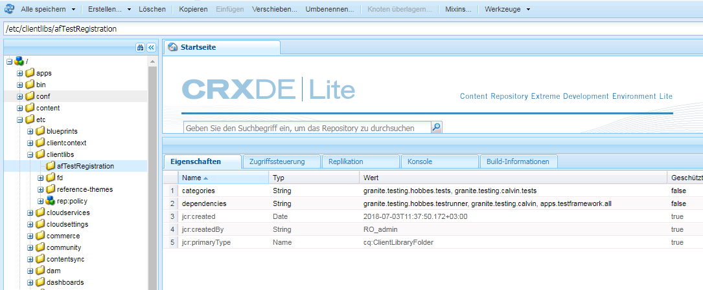

# Automatisieren von Tests von adaptiven Formularen {#automate-testing-of-adaptive-forms}

>[!CAUTION]
>
>AEM 6.4 hat das Ende der erweiterten Unterstützung erreicht und diese Dokumentation wird nicht mehr aktualisiert. Weitere Informationen finden Sie in unserer [technische Unterstützung](https://helpx.adobe.com/de/support/programs/eol-matrix.html). Unterstützte Versionen suchen [here](https://experienceleague.adobe.com/docs/?lang=de).

## Übersicht {#overview}

Adaptive Formulare sind für die Interaktion mit Ihren Kunden von wesentlicher Bedeutung. Es ist wichtig, Ihre adaptiven Formulare bei jeder Änderung, die Sie an ihnen vornehmen, zu testen, z. B. beim Verwenden eines neuen Pakets oder beim Ändern einer Regel im Formular. Allerdings kann das funktionelle Testen adaptiver Formen und jedes Feld in ihnen mühsam sein.

Calvin ermöglicht es Ihnen das automatische Testen der adaptiven Formulare im Webbrowser. Calvin verwendet die Benutzeroberfläche von [Hobbes](/help/sites-developing/hobbes.md) für das Erstellen von Tests und bietet die folgenden Werkzeuge:

* Eine JavaScript-API zum Erstellen von Tests.
* Eine Benutzeroberfläche zum Ausführen von Tests.

Mit Calvin können Sie Testfälle in CRXDE erstellen und UI-Tests direkt im Webbrowser ausführen, um die folgenden Aspekte Ihrer adaptiven Formulare gründlich zu testen:

<table> 
 <tbody> 
  <tr> 
   <td><strong>Zu testende adaptiver Formularaspekte </strong></td> 
   <td><strong>Beschreibung</strong></td> 
  </tr> 
  <tr> 
   <td>Vorabfüllen eines adaptiven Formulars</td> 
   <td> 
    <ul> 
     <li>Wird das Formular basierend auf dem Typ des Datenmodells erwartungsgemäß vorausgefüllt?</li> 
     <li>Werden die Standardwerte von Formularobjekten erwartungsgemäß vorausgefüllt?</li> 
    </ul> </td> 
  </tr> 
  <tr> 
   <td>Senden eines adaptiven Formulars</td> 
   <td> 
    <ul> 
     <li>Werden beim Senden korrekte Daten generiert?</li> 
     <li>Wird das Formular beim Senden erneut auf dem Server validiert?</li> 
     <li>Ist die Sendeaktion für das Formular konfiguriert, das ausgeführt wird?</li> 
    </ul> </td> 
  </tr> 
  <tr> 
   <td><p>Ausdrucksregeln</p> <p> </p> </td> 
   <td> 
    <ul> 
     <li>Werden die mit Formularobjekten verknüpften Ausdrücke wie "calculate", "visible", "execute scripts", nach dem Verlassen eines Felds ausgeführt, nachdem die entsprechenden UI-Vorgänge ausgeführt wurden?<br /> </li> 
    </ul> </td> 
  </tr> 
  <tr> 
   <td>Validierungen</td> 
   <td> 
    <ul> 
     <li>Werden Feldvalidierungen nach der Ausführung der Vorgänge erwartungsgemäß ausgeführt?</li> 
    </ul> </td> 
  </tr> 
  <tr> 
   <td><p>Lazy Loading</p> <p> </p> </td> 
   <td> 
    <ul> 
     <li>Wird beim Klicken Sie auf (oder auf ein Navigationselement eines Bereichs) der HTML-Code vom Server abgerufen, wie es in der Konfiguration für das langsame Laden der Dateien vorgesehen ist?</li> 
    </ul></td> 
  </tr> 
  <tr> 
   <td><p>UI-Interaktion</p> </td> 
   <td> 
    <ul> 
     <li><a href="https://helpx.adobe.com/aem-forms/6-3/calvin-sdk-javascript-api/calvin.html#toc2__anchor" target="_blank">Testen von UI-Interaktion mit adaptiven Formularobjekten </a></li> 
    </ul> </td> 
  </tr> 
 </tbody> 
</table>

### Voraussetzungen {#prerequisites}

Bevor Sie diesen Artikel zum Erstellen Ihrer Testfälle verwenden, müssen Sie Folgendes wissen:

* Erstellen von Test-Suites und Ausführen von Testfällen mit [Hobbes](https://docs.adobe.com/docs/de/aem/6-3/develop/components/hobbes.html)
* [Hobbes-Javascript-APIs](https://docs.adobe.com/docs/de/aem/6-2/develop/ref/test-api/index.html)
* [Calvin JavaScript-APIs](https://helpx.adobe.com/de/aem-forms/6-3/calvin-sdk-javascript-api/calvin.html)

## Beispiel: Erstellen einer Testsuite für ein adaptives Formular mit Hobbes als Test-Framework {#example-create-a-test-suite-for-an-adaptive-form-using-hobbes-as-testing-framework}

Das folgende Beispiel führt Sie durch die Erstellung einer Test-Suite zum Testen mehrerer adaptiver Formulare. Sie müssen für jedes zu testende Formular einen separaten Testfall erstellen. Wenn Sie die folgenden Schritte ausführen und den JavaScript-Code in Schritt 11 ändern, können Sie eine eigene Testsuite erstellen, um Ihre adaptiven Formulare zu testen.

1. Navigieren Sie zu CRXDE Lite in Ihrem Webbrowser: `https://[server]:[port]/crx/de`.
1. Klicken Sie mit der rechten Maustaste auf den Unterordner /etc/clientlibs und dann auf **[!UICONTROL Erstellen > Knoten erstellen]**. Geben Sie einen Namen (hier afTestRegistration) ein, geben Sie den Knotentyp als cq:ClientLibraryFolder an und klicken Sie auf **[!UICONTROL OK]**.

   Der Ordner clientlibs enthält den Registrierungsaspekt Ihrer Anwendung (JS und Init). Es wird empfohlen, alle Hobbes Test Suites-Objekte zu registrieren, die für ein Formular spezifisch sind, im Ordner clientlibs .

1. Geben Sie folgende Werte im neu erstellten Knoten (hier afTestRegistration) ein und klicken Sie auf **[!UICONTROL Alle speichern]**. Diese Eigenschaften helfen Hobbes dabei, den Ordner als Test zu erkennen. Um diese Client-Bibliothek als Abhängigkeit in anderen Client-Bibliotheken wiederzuverwenden, benennen Sie sie granite.testing.calvin.tests.

<table> 
 <tbody> 
  <tr> 
   <td>Eigenschaft</td> 
   <td>Typ</td> 
   <td>Wert</td> 
  </tr> 
  <tr> 
   <td><p>categories</p> </td> 
   <td><p>Zeichenfolge[]</p> </td> 
   <td><p>granite.testing.hobbes.tests, granite.testing.calvin.tests</p> </td> 
  </tr> 
  <tr> 
   <td><p>dependencies</p> </td> 
   <td><p>Zeichenfolge[]</p> </td> 
   <td><p>granite.testing.hobbes.testrunner, granite.testing.calvin, apps.testframework.all</p> </td> 
  </tr> 
 </tbody> 
</table>

>[!NOTE]
>
>Die clientlib granite.testing.calvin.af enthält alle APIs für adaptive Formulare. Diese APIs sind Teil des Calvin-Namespace.



1. Klicken Sie mit der rechten Maustaste auf den Testknoten (hier **afTestRegistration)** und klicken Sie anschließend auf **[!UICONTROL Erstellen > Datei erstellen]**. Nennen Sie die Datei js.txt und klicken Sie auf **[!UICONTROL OK]**.
1. In der js.txt-Datei fügen Sie den folgenden Text ein:

   ```
   #base=.
   js.txt
   ```

1. Klicken Sie auf **[!UICONTROL Alle speichern]** und schließen Sie dann die Datei js.txt.
1. Klicken Sie mit der rechten Maustaste auf den Testknoten (hier **afTestRegistration)** und klicken Sie anschließend Sie auf **[!UICONTROL Erstellen > Datei erstellen]**. Nennen Sie die Datei init.js und klicken Sie auf **[!UICONTROL OK]**.
1. Kopieren Sie folgenden Code in die Datei „init.js“ und klicken Sie auf **[!UICONTROL Alle speichern]**: 

   ```
   (function(window, hobs) {
       'use strict';
       window.testsuites = window.testsuites || {};
     // Registering the test form suite to the sytem
     // If there are other forms, all registration should be done here
       window.testsuites.testForm = new hobs.TestSuite("Adaptive Form - Demo Test", {
           path: '/etc/clientlibs/afTestRegistration/init.js',
           register: true
       });
    // window.testsuites.testForm1 = new hobs.TestSuite("testForm1");
   }(window, window.hobs));
   ```

   Der obige Code erstellt eine Test-Suite mit dem Namen **Adaptives Formular - Demotest**. Um eine Testsuite mit einem anderen Namen zu erstellen, ändern Sie den Namen entsprechend.

1. Klicken Sie auf **[!UICONTROL Erstellen]** > **Knoten erstellen**, um einen Knoten unter dem clientlib-Ordner für jedes Formular zu erstellen, das Sie testen möchten. In diesem Beispiel wird ein Knoten mit dem Namen **testForm** zum Testen eines adaptiven Formulars mit dem Namen **testForm** `.`Geben Sie die folgenden Eigenschaften an und klicken Sie auf **[!UICONTROL OK]**:

   * Name: testForm (Ihr Formularname)
   * Typ: cq:ClientLibraryFolder

1. Fügen Sie dem neu erstellten Knoten (hier testForm) die folgenden Eigenschaften hinzu, um ein adaptives Formular zu testen:

   | **Eigenschaft** | **Typ** | **Wert** |
   |---|---|---|
   | categories | Zeichenfolge[] | granite.testing.hobbes.tests, granite.testing.hobbes.tests.testForm |
   | dependencies | Zeichenfolge[] | granite.testing.calvin.tests |

   >[!NOTE]
   >
   >In diesem Beispiel wird für ein besseres Management eine Abhängigkeit von der Clien-Bibliothek „granite.testing.calvin.tests“ verwendet. Dieses Beispiel fügt auch eine Client-Lib-Kategorie, „granite.testing.hobbes.tests.testForm“ hinzu, um diese Client-Lib, falls erforderlich, wiederzuverwenden.

   

1. Klicken Sie mit der rechten Maustaste auf den Ordner, den Sie für das Testformular erstellt haben (hier testForm), und wählen Sie **[!UICONTROL Erstellen > Datei erstellen]**. Benennen Sie die Datei &quot;scriptingTest.js&quot;, fügen Sie der Datei den folgenden Code hinzu und klicken Sie auf **[!UICONTROL Alle speichern]**

   Um den folgenden Code zum Testen eines anderen adaptiven Formulars zu verwenden, ändern Sie den Pfad und den Namen des Formulars in **navigateTo** (Zeilen 11, 36 und 62) und die entsprechenden Testfälle. Weitere Informationen zu APIs zum Testen verschiedener Aspekte von Formularen und Formularobjekten finden Sie unter [Calvin-APIs](https://helpx.adobe.com/de/aem-forms/6-3/calvin-sdk-javascript-api/calvin.html).

   ```
   (function(window, hobs) {
       'use strict';
   
    var ts = new hobs.TestSuite("Script Test", {
           path: '/etc/clientlibs/testForm/scriptingTest.js',
     register: false
    }) 
   
       .addTestCase(new hobs.TestCase("Checking execution of calculate script")
           // navigate to the testForm which is to be tested
           .navigateTo("/content/forms/af/testForm.html?wcmmode=disabled")
           // check if adaptive form is loaded
           .asserts.isTrue(function () {
               return calvin.isFormLoaded()
           })
           .execSyncFct(function () {
               // create a spy before checking for the expression
               calvin.spyOnExpression("panel1.textbox1");
               // setValue would trigger enter, set the value and exit from the field
               calvin.setValueInDOM("panel1.textbox", "5");
           })
           // if the calculate expression was setting "textbox1" value to "5", let's also check that
           .asserts.isTrue(function () {
               return calvin.isExpressionExecuted("panel1.textbox1", "Calculate");
           })
           .execSyncFct(function () {
               calvin.destroySpyOnExpression("panel1.textbox1");
           })
           .asserts.isTrue(function () {
               return calvin.model("panel1.textbox1").value == "5"
           })
       )
   
       .addTestCase(new hobs.TestCase("Calculate script Test")
           // navigate to the testForm which is to be tested
           .navigateTo("/content/forms/af/cal/demoform.html?wcmmode=disabled&dataRef=crx:///content/forms/af/cal/prefill.xml")
           // check if adaptive form is loaded
           .asserts.isTrue(function () {
               return calvin.isFormLoaded()
           })
   
           .execSyncFct(function () {
               // create a spy before checking for the expression
               calvin.spyOnExpression("panel2.panel1488218690733.downPayment");
               // setValue would trigger enter, set the value and exit from the field
               calvin.setValueInDOM("panel2.panel1488218690733.priceProperty", "1000000");
           })
           .asserts.isTrue(function () {
               return calvin.isExpressionExecuted("panel2.panel1488218690733.downPayment", "Calculate");
           })
           .execSyncFct(function () {
               calvin.destroySpyOnExpression("panel2.panel1488218690733.downPayment");
           })
           .asserts.isTrue(function () {
               // if the calculate expression was setting "downPayment" value to "10000", let's also check that
      return calvin.model("panel2.panel1488218690733.downPayment").value == 10000
           })
       )
   
       .addTestCase(new hobs.TestCase("Checking execution of Value commit script")
           // navigate to the testForm which is to be tested
           .navigateTo("/content/forms/af/cal/demoform.html?wcmmode=disabled&dataRef=crx:///content/forms/af/cal/prefill.xml")
           // check if adaptive form is loaded
           .asserts.isTrue(function () {
               return calvin.isFormLoaded()
           })
   
           .execSyncFct(function () {
               // create a spy before checking for the expression
               calvin.spyOnExpression("panel2.panel1488218690733.priceProperty");
               // setValue would trigger enter, set the value and exit from the field
               calvin.setValueInDOM("panel2.panel1488218690733.priceProperty", "100");
           })
           .asserts.isTrue(function () {
               return calvin.isExpressionExecuted("panel2.panel1488218690733.priceProperty", "Value Commit");
           })
           .execSyncFct(function () {
               calvin.destroySpyOnExpression("panel2.panel1488218690733.priceProperty");
           })
           .asserts.isTrue(function () {
            // if the value commit expression was setting "textbox1488215618594" value to "0", let's also check that
               return calvin.model("panel2.panel1488218690733.textbox1488215618594").value == 0
           })
       );
   
    // register the test suite with testForm
     window.testsuites.testForm.add(ts);
   
    }(window, window.hobs));
   ```

   Der Testfall wird erstellt. Führen Sie den Testfall aus, um adaptive Formulare über Hobbes zu testen. Eine Anleitung zum Ausführen von Testfällen finden Sie unter [„Ausführen von Tests“ in „Testen der Benutzeroberfläche mit automatischen Tests“](/help/sites-developing/hobbes.md).

Sie können das Paket auch in der angehängten Datei SampleTestPackage.zip installieren, um dieselben Ergebnisse zu erzielen wie im Beispiel: Erstellen einer Testsuite für ein adaptives Formular mit Hobbes als Testrahmen.

[Datei laden](assets/sampletestpackage.zip)

## Testen der Benutzeroberfläche mit automatisierten Tests {#testing-your-ui-using-automated-tests}

### Ausführen einer einzelnen Test-Suite {#running-a-single-test-suite}

Testsuiten können einzeln ausgeführt werden. Wenn Sie eine Test-Suite ausführen, ändert sich die Seite, während die Testfälle und ihre Aktionen ausgeführt werden. Die Ergebnisse werden nach Abschluss des Tests angezeigt. Die Ergebnisse werden durch Symbole gekennzeichnet.

Das Häkchen-Symbol kennzeichnet einen erfolgreichen Test:  

Ein Symbol „X“ zeigt einen fehlgeschlagenen Test an: 

So führen Sie eine Test Suite aus:

1. Klicken oder tippen Sie im Testfeld auf den Namen des Testfalls, den Sie ausführen möchten, um die Details der Aktionen zu erweitern.

   

1. Klicken oder tippen Sie auf die Schaltfläche „Tests ausführen“. 

   

1. Der Platzhalter wird durch Seiteninhalte ersetzt, wenn der Test ausgeführt wird.

   

1. Um die Ergebnisse des Testfalls anzuzeigen, tippen oder klicken Sie auf die Beschreibung, um das Feld Ergebnis zu öffnen. Wenn Sie im Feld Ergebnis auf den Namen des Testfalls tippen oder klicken, werden alle Details angezeigt.

   

Die Schritte zum Testen Ihrer AEM adaptiven Formulare ähneln den Schritten zum Testen Ihrer AEM Benutzeroberfläche. Weitere Informationen zum Testen Ihrer adaptiven Formulare finden Sie in den folgenden Themen in [Testen der Benutzeroberfläche](https://helpx.adobe.com/de/experience-manager/6-3/sites-developing/hobbes.html):

* Anzeigen von Test-Suites
* Ausführen mehrerer Tests

## Glossar {#glossary}

<table> 
 <tbody> 
  <tr> 
   <td><strong>Begriff</strong></td> 
   <td><strong>Beschreibung</strong></td> 
  </tr> 
  <tr> 
   <td><p>Test Suite</p> </td> 
   <td><p>Eine Test-Suite ist eine Sammlung verwandter Testfälle.</p> </td> 
  </tr> 
  <tr> 
   <td><p>Testfall</p> </td> 
   <td><p>Ein Testfall stellt eine Aufgabe dar, die ein Benutzer über Ihre Benutzeroberfläche ausführt. Fügen Sie Ihrer Test-Suite Testfälle hinzu, um die Aktivitäten zu testen, die Benutzer durchführen.</p> </td> 
  </tr> 
  <tr> 
   <td><p>Aktionen</p> </td> 
   <td><p>Aktionen sind Methoden, die in der Benutzeroberfläche eine Geste ausführen, z. B. das Klicken auf eine Schaltfläche oder das Füllen eines Eingabefelds mit einem Wert.</p> <p>Die Methoden der Klassen hobs.actions.Assets, hobs.actions.Core und hobs.utils.af sind Aktionen, die Sie in Ihren Tests verwenden können. Alle Aktionen werden synchron ausgeführt.</p> </td> 
  </tr> 
  <tr> 
   <td><p>Autoren- oder Veröffentlichungsumgebung</p> </td> 
   <td><p>Im Allgemeinen können Formulare entweder in der Autoren- oder Veröffentlichungsumgebung getestet werden. Im Falle einer Veröffentlichungsumgebung ist standardmäßig der Zugriff auf die Ausführung des Tests eingeschränkt. Dies liegt daran, dass sich alle Client-Bibliotheken, die mit dem Test-Runner verbunden sind, in der JCR-Struktur unter /libs befinden.</p> </td> 
  </tr> 
 </tbody> 
</table>
