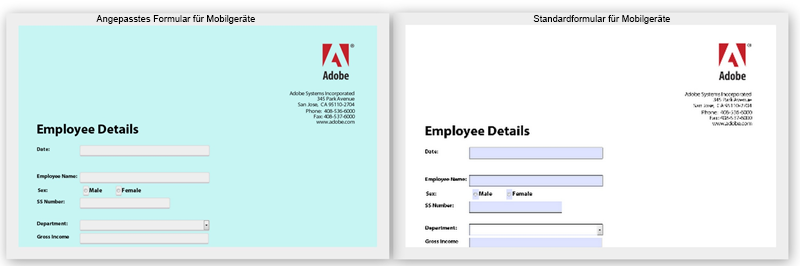

# Ändern von Standardstilen von HTML5-Formularen {#changing-default-styles-of-html-forms}

>[!CAUTION]
>
>AEM 6.4 hat das Ende der erweiterten Unterstützung erreicht und diese Dokumentation wird nicht mehr aktualisiert. Weitere Informationen finden Sie in unserer [technische Unterstützung](https://helpx.adobe.com/de/support/programs/eol-matrix.html). Unterstützte Versionen suchen [here](https://experienceleague.adobe.com/docs/?lang=de).

HTML5-Formulare werden mithilfe von HTML5-Funktionen gerendert. Der Stil des gerenderten Formulars wird mit CSS festgelegt. Das Standarderscheinungsbild von HTML5-Formularen ist der PDF-Darstellung ähnlich. Entwickler können benutzerdefinierte CSS verwenden, um das standardmäßige Erscheinungsbild von HTML5-Formularen zu ändern.

Dieser Artikel enthält Schritt-für-Schritt-Anleitungen, um den Stil eines HTML5-Formulars zu ändern, und der Artikel [Einführung in Stile](/help/forms/using/css-styles.md) enthält detaillierte Informationen zu den verschiedenen Gestaltungsaspekten von HTML5-Formularen. Stellen Sie sicher, dass Sie den Artikel „Einführung in Stile“ gelesen haben, bevor Sie die in diesem Artikel aufgeführten Schritte ausführen.

Die folgenden beiden Bilder zeigen den Unterschied zwischen Standard- und benutzerdefiniertem Stil.

## Gestalten Sie Ihre Formulare {#style-your-forms}

1. **Wählen Sie ein Profil aus, um benutzerdefinierte Stile hinzuzufügen**

   Rufen Sie die CRX DE-Schnittstelle unter der URL **https://&lt;Server>:&lt;Port>/crx/de** auf und erstellen Sie ein Profil oder wählen Sie ein vorhandenes Profil. Wie Sie ein Profil erstellen, erfahren Sie hier: [Erstellen eines neuen Profils](/help/forms/using/custom-profile.md).

1. **Erstellen Sie ein CSS-Stylesheet für die Formatierung der HTML5-Formulare**

   Navigieren Sie zu dem Ordner, in dem Sie den Profil-Renderer erstellt haben, und erstellen Sie eine CSS-Stylesheet-Datei. Die folgenden Schritte sind erforderlich:

   1. Klicken Sie mit der rechten Maustaste auf den Ordner und wählen Sie **erstellen** -> **Datei erstellen** aus dem Menü
   Informationen darüber, welche CSS-Klassen für eine bestimmte Komponente in Ihren HTML5-Formularen erstellt werden sollen, finden Sie unter [Einführung in Stile](/help/forms/using/css-styles.md).

1. **Einschließen des Stylesheets in den Profil-Renderer**

   Öffnen Sie die Profil-Renderer-Seite (JSP-Datei) in CRX DE und fügen Sie die CSS-Datei in die Seite direkt unter der XFA-Client-Bibliothek ein. Führen Sie diese Schritte aus, um die CSS-Datei in das Profil einzuschließen.

   1. Suchen Sie auf der Renderer-Seite nach der folgenden Zeile:

      &lt;cq:includeClientLib categories=&quot;xfaforms.profile&quot; />

   1. Fügen Sie Folgendes unter der darüberstehenden Zeile ein, um das Stylesheet einzuschließen:

      &lt;link href=&quot;/path/to/stylesheet&quot; rel=&quot;stylesheet&quot; type=&quot;text/css&quot;/>

   1. Speichern Sie die Datei.
