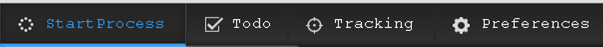

# Ändern der Schriftart auf der Benutzeroberfläche {#changing-the-font-on-the-interface}

Sie können die Schriftart ändern, die in AEM Forms Workspace angezeigt wird. Schriftarten, die in einem bestimmten Bereich der Benutzeroberfläche verwendet werden, werden im entsprechenden Abschnitt des Stylesheets definiert. Sie können die Schriftarten auf der Benutzeroberfläche selektiv ändern.

Follow the [Generic steps for AEM Forms workspace customization](/help/forms/using/generic-steps-html-workspace-customization.md) and depending on your requirements, follow the steps for customizing CSS, HTML, or both.

1. Ändern Sie die Schriftfamilie in einem vorhandenen Stil oder fügen Sie sie hinzu.
1. Ändern Sie die Schriftfamilie inline für das HTML-Element oder fügen Sie sie hinzu.
1. Fügen Sie einen Stil hinzu und verwenden Sie ihn für das HTML-Element.

Um beispielsweise die Schriftart für den Anker-Text in der Navigationsleiste oben in Courier New zu ändern, führen Sie die folgenden Schritte aus:

1. Log in to CRXDE Lite by accessing `https://[server]:[port]/lc/crx/de/index.jsp`.
1. Führen Sie einen der folgenden Schritte aus:

   1. Um die Schriftfamilie in einem vorhandenen Stil zu ändern, fügen Sie Folgendes in der Datei „newStyle.css“ bei „/apps/ws/css“ hinzu.

      ```css
      #topnav a {
         font-family: "Courier New";
      }
      ```

   1. To add the font-family inline for the HTML element, copy the `/libs/ws/js/runtime/templates/appnavigation.html` file to `/apps/ws/js/runtime/templates/appnavigation.html`.

      aktualisieren Sie die Datei „/apps/ws/js/runtime/templates/appnavigation.html“ wie folgt:

      ```
      <li class="process"><a href="#" title="<%= $.t('index.header.topnav.startprocess.detail')%>" style="font-family:Courier New;" ><%= $.t('index.header.topnav.startprocess.name')%></a></li>
      <li class="todo"><a href="#/todo" title="<%= $.t('index.header.topnav.todo.detail')%>" style="font-family:Courier New;" ><%= $.t('index.header.topnav.todo.name')%></a></li>
      <li class="track"><a href="#/tracking" title="<%= $.t('index.header.topnav.tracking.detail')%>" style="font-family:Courier New;" ><%= $.t('index.header.topnav.tracking.name')%></a></li>
      <li class="preference"><a href="#/preferences" title="<%= $.t('index.header.topnav.preferences.detail')%>" style="font-family:Courier New;" ><%= $.t('index.header.topnav.preferences.name')%></a></li>
      ```

      Open the /apps/ws/js/registry.js file for editing and replace `text!/lc/libs/ws/js/runtime/templates/appnavigation.html` with `text!/lc/apps/ws/js/runtime/templates/appnavigation.html`.

   1. Um einen Stil hinzuzufügen, der die Schriftfamilie definiert, fügen Sie Folgendes in der Datei „newStyle.css“ bei „/apps/ws/css“ hinzu.

      ```css
      .myNewFontStyle a {
         font-family: "Courier New";
      }
      ```

      Um die Schriftfamilie für das HTML-Element inline hinzuzufügen, fügen Sie Folgendes in der Datei „appnavigation.html“ bei „/apps/ws/js/runtime/templates“ hinzu.

      ```css
      <div id="topnav" class="myNewFontStyle">
          <ul>
              <li class="process"><a href="#" title="<%= $.t('index.header.topnav.startprocess.detail')%>" ><%= $.t('index.header.topnav.startprocess.name')%></a></li>
              <li class="todo"><a href="#/todo" title="<%= $.t('index.header.topnav.todo.detail')%>"><%= $.t('index.header.topnav.todo.name')%></a></li>
              <li class="track"><a href="#/tracking" title="<%= $.t('index.header.topnav.tracking.detail')%>" ><%= $.t('index.header.topnav.tracking.name')%></a></li>
              <li class="preference"><a href="#/preferences" title="<%= $.t('index.header.topnav.preferences.detail')%>" ><%= $.t('index.header.topnav.preferences.name')%></a></li>
          </ul>
      </div>
      ```

1. Starten Sie Workspace neu und löschen Sie den Browser-Cache, damit die Änderungen sichtbar werden.

 change_font_before **** Abbildung: Navigationsleiste *oben vor der Schriftartanpassung*

 change_font_after **** Abbildung: Navigationsleiste *oben nach der Schriftartanpassung der ersten Registerkarte*

[Support kontaktieren](https://www.adobe.com/account/sign-in.supportportal.html)
