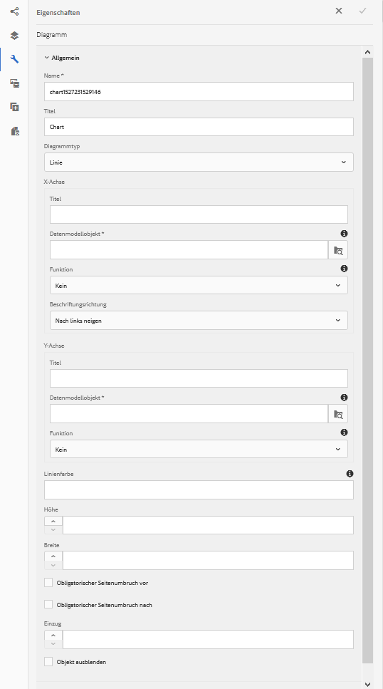
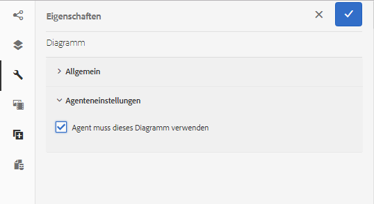
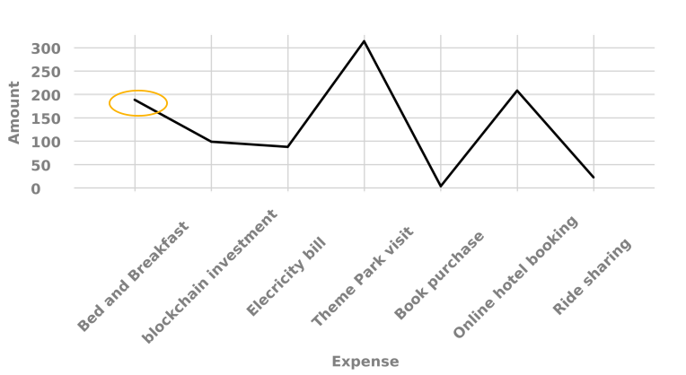
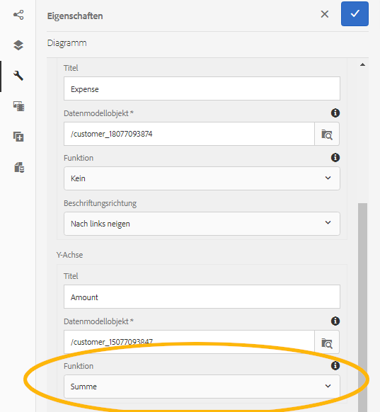

# Verwenden von Diagrammen mit interaktiver Kommunikation {#using-charts-in-interactive-communications}

Mithilfe von Diagrammen in einer interaktiven Kommunikation können Sie große Informationsmengen zu einem einfach zu analysierenden und zu verstehenden visuellen Format zusammenfassen

Ein Diagramm ist eine visuelle Darstellung von Daten. Es verdichtet große Mengen an Informationen in ein leicht verständliches visuelles Format, sodass die Empfänger der interaktiven Kommunikation komplexe Daten besser visualisieren, interpretieren und analysieren können.

Beim Erstellen einer interaktiven Kommunikation können Sie Diagramme hinzufügen, um zweidimensionale Daten vom Formulardatenmodell der Vorlage für die interaktive Kommunikation visuell darzustellen. Mit der Diagrammkomponente können Sie folgende Arten von Diagrammen hinzufügen und konfigurieren:

* Kreisdiagramm
* Spalte
* Donut
* Balken (Nur Webkanal)
* Linie
* Linie und Punkt
* Punkt
* Bereich

## Hinzufügen und Konfigurieren von Diagrammen in interaktiver Kommunikation {#add-and-configure-chart-in-an-interactive-communication}

Führen Sie die folgenden Schritte aus, um ein Diagramm zu einer interaktiven Kommunikation hinzuzufügen:

1. Ziehen Sie die Diagrammkomponente von den Komponenten in der AEM-Seitenleiste in einen der folgenden Druck- oder Webkanäle einer interaktiven Kommunikation:

   * Druckkanal: Zielbereich und Bildfeld
   * Webkanal: Teilfenster und Zielbereich

   Die abgelegte Diagrammkomponente erstellt einen Platzhalter für ein Diagramm.

1. Tippen Sie auf die Diagrammkomponente im Editor für interaktive Kommunikation und wählen Sie in der Komponenten-Symbolleiste die Option **[!UICONTROL Konfigurieren (]** ).

   Die Eigenschaften-Seitenleiste wird mit den Grundeigenschaften des Diagramms im Fokus angezeigt.

   
   **Abbildung:** *Grundlegende Eigenschaften eines Liniendiagramms im Druckkanal*

   
   **Abbildung:** *Grundlegende Eigenschaften eines Linientypdiagramms im Webkanal*

1. Konfigurieren Sie die grundlegenden Eigenschaften des Diagramms für Druckkanal und Webkanal. Neben den allgemeinen Eigenschaften gibt es Eigenschaften, die für den Druck- und Webkanal und den Diagrammtyp spezifisch sind.

   * **[!UICONTROL Name]**: Name des Diagrammobjekts. Der Name des Diagramms, das Sie hier angeben, wird nicht in der Diagrammausgabe angezeigt, wird jedoch in Regeln verwendet, um auf das Diagramm zu verweisen.
   * **[!UICONTROL Diagrammtyp]**: Geben Sie den Diagrammtyp an: Kreis-, Spalten-, Ring, Linien-, Linien- und Punkt-, Punkt- oder Flächendiagramm.
   * **[!UICONTROL Objekt ausblenden]**: Wählen Sie diese Option, um das Diagramm in der endgültigen Ausgabe auszublenden.
   * Geben Sie Folgendes für die **[!UICONTROL X-Achse]** und **[!UICONTROL Y-Achse]** an:

      * **[!UICONTROL Titel]**: Geben Sie die Titel für die X- und Y-Achse an, die in der interaktiven Kommunikation angezeigt werden sollen.
      * **[!UICONTROL Datenmodellobjekt*]**: Klicken Sie auf „Durchsuchen“ und wählen Sie die Datenmodellobjekte für die X- und Y-Achse des Diagramms aus dem Formulardatenmodell, das beim Erstellen der interaktiven Kommunikation angegeben wurden. Wählen Sie zwei Sammlungs-/Array-Typ-Eigenschaften desselben übergeordneten Datenmodellobjekts, die in Bezug zueinander bedeutungsvoll sind, um sie auf der X- und Y-Achse eines Diagramms darzustellen.
      * **[!UICONTROL Funktion]**: Um die Werte auf der Achse mithilfe statistischer Funktionen zu berechnen, wählen Sie Funktion für die X/Y-Achse. Weitere Informationen zu Funktionen finden Sie unter [Funktionen im Diagramm verwenden](#usefunction) und [Beispiel 2: Anwendung der Summen- und Mittelfunktionen in einem Liniendiagramm](#applicationsumfrequency).

   >[!NOTE]
   >
   >Für den Druckkanal auf der X-Achse muss das Datenmodellobjekt, das Sie binden, den Typ Zahl, Zeichenfolge oder Datum haben. Auf der Y-Achse sollte das Datenmodellobjekt, das Sie binden, vom Typ „Zahl“ sein. Es wird empfohlen, dass Sie die rechte Legende im Druckkanal verwenden.

   Weitere Informationen zu Diagrammeigenschaften finden Sie unter [Grundlegende Eigenschaften in Diagrammen](#basicpropertiescharts).

1. (Nur Druckkanal) Legen Sie in den Agenteneinstellungen fest, ob der Agent dieses Diagramm verwenden muss. Wenn i **[!UICONTROL Es ist erforderlich, dass der Agent dieses Diagramm verwendet]** nicht ausgewählt ist, kann der Agent auf das Augensymbol für das Diagramm auf der Registerkarte Inhalt der Benutzeroberfläche des Agenten tippen, um das Diagramm ein-/auszublenden.

   

1. Tippen Sie in der Seitenleiste &quot;Eigenschaften&quot;auf .

   Erstellen Sie eine Vorschau, um das Erscheinungsbild und die Daten des Diagramms anzuzeigen. Kehren Sie zurück, um die Eigenschaften des Diagramms bei Bedarf neu zu konfigurieren.

1. Kehren Sie zu anderen Änderungen in der interaktiven Kommunikation zurück.

## Beispiel 1: Diagrammausgabe in Druck und Web {#chartoutputprintweb}

Auf der Registerkarte „Grundeinstellungen“ definieren Sie die Art des Diagramms, die Quellformulardatenmodelleigenschaften, die Daten enthalten, die Beschriftungen, die auf der X-Achse und Y-Achse des Diagramms dargestellt werden können, und optional auch die statistische Funktion, um die Werte für die grafische Darstellung auf dem Diagramm zu berechnen.

Im Folgenden werden die Mindestanforderungen für grundlegenden Eigenschaften mit Hilfe einer Kreditkartenabrechnung, die mit einer interaktiven Kommunikation erstellt wurde, detailliert erläutert. Wenn Sie ein Diagramm generieren möchten, um die Höhe der verschiedenen Ausgaben in der Abrechnung darzustellen. Sie können verschiedene Diagrammarten für Druck- und Webausgabe der interaktiven Kommunikation verwenden.

Um dies zu erreichen, müssen Sie Folgendes angeben:

* **[!UICONTROL Diagrammtyp]** - in diesem Beispiel Spalte für den Druckkanal und Kreis für den Webkanal
* **[!UICONTROL Datenmodellobjekte]** als Quelle für die X- und Y-Achse des Diagramms - in diesem Beispiel Transaktionsbetrag für X-Achse und Ausgabenname für die Y-Achse
* **[!UICONTROL Titel]** für die X- und Y-Achse (nur für das Spaltendiagramm im Druckkanal in diesem Beispiel) - in diesem Beispiel Betrag ($) für die X-Achse und Ausgabe für die Y-Achse.
* **[!UICONTROL Beschriftungsrichtung]** (nur für das Diagramm vom Typ Spalte im Druckkanal in diesem Beispiel) - in diesem Beispiel `Tilt Left`

* **[!UICONTROL QuickInfo]** zur Anzeige bei der Maus über eine Ausgabe (nur Webkanal) - in diesem Beispiel `${x}: $ ${y}`, das als `[Expense Label: $ Amount]` (Beispiel: Besuch des Themenparks: $ 315)


**Abbildung:** *Spaltendiagramm in der Druckausgabe einer interaktiven Kommunikation*

**A.** Y-Achse - Aus der Eigenschaft des Formulardatenmodells abgerufener Betrag und die Eigenschaft Titel auf Betrag ($) **B.** Beschriftungsrichtung der X-Achse auf Linksbündig eingestellt **C.** X-Achse - Ausgabenbeschreibung, die aus der Eigenschaft des Formulardatenmodells und der Eigenschaft Titel abgerufen wird, die auf &quot;Spesenkonto&quot;eingestellt ist


**Abbildung:** *Ringdiagramm in der Webausgabe einer interaktiven Kommunikation*

**A.** Die Eigenschaft &quot;Innerer Radius&quot;des Donuts ist festgelegt. **B.** Die Eigenschaft &quot;Legende anzeigen&quot;ist ausgewählt und die Eigenschaft &quot;Legendenposition&quot;ist auf &quot;Rechts&quot;festgelegt. **C.** QuickInfo zeigt die Details des Elements beim Bewegen der Maus an - QuickInfo ist auf ${x} festgelegt: $ ${y}

## Beispiel 2: Anwendung von Summen- und Häufigkeitsfunktionen in einem Liniendiagramm {#applicationsumfrequency}

Durch Anwenden von Funktionen in einem Diagramm können Sie Daten darstellen, die nicht direkt vom Formulardatenmodell bereitgestellt werden. In diesem Beispiel verwenden wir ein Beispiel für einen Kreditkartenauszug, um zu verstehen, wie Summen- und Häufigkeitsfunktionen auf das Diagramm angewendet werden können.


**Abbildung:** *Liniendiagramm ohne Funktion mit drei &quot;Bed and Breakfast&quot;-Transaktionen*

### Summenfunktion {#sum-function}

Sie können die Summenfunktion anwenden, um Werte mehrerer Instanzen derselben Dateneigenschaft zusammenzufassen, und sie nur einmal anzeigen. Im folgenden Diagramm wird die Summenfunktion beispielsweise auf die Y-Achse angewendet, um die Summe der drei „Bed and Breakfast“-Transaktionen ($ 99,45, $ 78 und $ 12) zu addieren und nur eine Transaktion ($ 189,45) anzuzeigen.

Die Summenfunktion kann Diagramme nützlicher machen, wenn Sie die Summe für viele Instanzen derselben Dateneigenschaft sortieren und anzeigen möchten.



### Häufigkeitsfunktion {#frequency-function}

Gibt die Anzahl der Werte auf der X- oder Y-Achse für einen bestimmten Wert auf der anderen Achse an. Bei Anwendung der Häufigkeitsfunktion auf der Y-Achse (Amount/TransAmount) zeigt das Diagramm an, dass drei „Bed &amp; Breakfast“-Transaktionen und ein Rest der Transaktionsarten dreimal aufgetreten sind.


## Grundlegende Eigenschaften in Diagrammen {#basicpropertiescharts}

Auf der Registerkarte „Standard“ können Sie die folgenden Eigenschaften konfigurieren:

**Name** Eine Kennung für das Diagrammelement. Der Name ist im Diagramm nicht sichtbar, jedoch nützlich, wenn von anderen Komponenten, Skripts und SOM-Ausdrücken auf das Element verwiesen wird.

**Titel (nur Druckkanal)** Gibt den Titel des Diagramms an.

**Diagrammtyp** Gibt den Typ des Diagramms an, das Sie generieren möchten. Die verfügbaren Optionen sind Torten-, Spalten-, Ring-, Linien-, Linien- und Punktdiagramme, Punkt- und Bereichsdiagramme und Balkendiagramme (Webkanal). Weitere Informationen finden Sie unter Beispiel 1: Diagrammausgabe in Druck und Web.

**X-Achse > Titel** Gibt den Titel für die X-Achse an.

**X-Achse > Datenmodellobjekt &amp;ast;** Geben Sie den Namen des Formulardatenmodellsammlungselements an, das auf der X-Achse dargestellt werden soll.

**X-Achse > Funktion** Gibt die statistische/benutzerdefinierte Funktion an, die für die Berechnung der Werte auf der X-Achse verwendet werden soll. Weitere Informationen zu Funktionen finden Sie unter Verwenden von Funktionen in Grafik und Beispiel 2: Anwendung der Summen- und Mittelfunktionen in einem Liniendiagramm.

**X-Achse > Beschriftungsrichtung** Richtung des Titels auf dem Diagramm im Druckkanal. Wenn Sie die Richtung der Beschriftung als &quot;Benutzerdefinierte Drehung&quot;wählen, wird das Feld &quot;Benutzerdefinierter Drehwinkel (Grad)&quot;angezeigt. Im Feld „Benutzerdefinierter Drehwinkel (Grad)“ können Sie den Drehwinkel in Schritten von 15 Grad wählen.

**Y-Achse > Titel** Gibt den Titel für die Y-Achse an.

**Y-Achse > Datenmodellobjekt &amp;ast;** Gibt das Formulardatenmodellsammlungselement an, das auf der y-Achse dargestellt werden soll. Im Druckkanal sollte das Datenmodellobjekt für die Y-Achse vom Typ Zahl sein.

**Y-Achse > Funktion** Gibt die statistische/benutzerdefinierte Funktion an, die für die Berechnung der Werte auf der Y-Achse verwendet werden soll. Weitere Informationen zu Funktionen finden Sie unter Verwenden von Funktionen in Grafik und Beispiel 2: Anwendung der Summen- und Mittelfunktionen in einem Liniendiagramm.

**Legende anzeigen** Zeigt eine Legende für das Torten- oder Ringdiagramm an, wenn diese Option aktiviert ist.

**Legendenposition** Gibt die Position der Legende in Bezug auf das Diagramm an. Die verfügbaren Optionen sind rechts, links, oben und unten.

**Höhe (nur Druckkanal)** Höhe des Diagramms in Pixel.

**Breite (nur Druckkanal)** Breite des Diagramms in Pixel.

>[!NOTE]
>
>Sie können die Breite des Diagramms im Webkanal mithilfe der Stil-Ebene oder durch Anwenden eines Designs steuern.

**QuickInfo (nur Webkanal)** Gibt das Format an, in dem die QuickInfo beim Bewegen des Mauszeigers auf einem Datenpunkt im Diagramm im Webkanal angezeigt wird. Der Standardwert ist \${x}(\${y}). Je nach Diagrammtyp werden die Variablen \${x} und \${y} dynamisch durch die entsprechenden Werte auf der X-Achse und Y-Achse ersetzt und in der QuickInfo angezeigt, wenn Sie den Mauszeiger auf einen Punkt, ein Balken oder einen Ausschnitt im Diagramm bewegen.

Wenn Sie QuickInfos deaktivieren möchten, lassen Sie das Feld „Quickinfo“ leer. Diese Option ist nicht auf Linien- und Bereichsdiagramme anwendbar. Siehe beispielsweise [Beispiel 1: Diagrammausgabe in Druck und Web](#chartoutputprintweb).

**CSS-Klasse (nur Webkanal)** Geben Sie den Namen einer CSS-Klasse im CSS-Klassenfeld an, um benutzerdefinierte Stile auf das Diagramm anzuwenden.

**Obligatorischer Seitenumbruch vor (nur Druckkanal)** Wählen Sie diese Option aus, um vor dem Diagramm einen obligatorischen Seitenumbruch hinzuzufügen und das Diagramm auf eine neue Seite zu setzen.

**Obligatorischer Seitenumbruch nach (nur Druckkanal)** Wählen Sie diese Option aus, um dem Diagramm einen obligatorischen Seitenumbruch hinzuzufügen und den Inhalt dem Diagramm auf einer neuen Seite anzuzeigen.

**Einzug (nur Druckkanal)** Geben Sie den Einzug des Diagramms links auf der Seite an.

**Diagrammspezifische Konfigurationen** Zusätzlich zu den allgemeinen Konfigurationen ist die folgende Diagrammkonfiguration verfügbar:

* **Innerer Radius**: Für Ringdiagramme verfügbar, um den Radius (in Pixeln) für den inneren Kreis des Diagramms anzugeben.
* **Linienfarbe**: Verfügbar für Linien-, Linien- und Punkt- sowie Bereichsdiagramme, um den hexadezimalen Farbwert für die Linie im Diagramm anzugeben.
* **Punktfarbe**: für Punkt- und Linien- und Punktdiagramme verfügbar sind, um den hexadezimalen Farbwert für die Punkte im Diagramm anzugeben.

* **Bereichsfarbe**: für Bereichsdiagramme verfügbar sind, um den hexadezimalen Farbwert für den Bereich unter der Linie im Diagramm anzugeben.

## Funktionen im Diagramm verwenden {#usefunction}

Sie können das Diagramm so konfigurieren, dass Sie mit statistischen Funktionen Werte aus Quelldaten zur grafischen Darstellung im Diagramm berechnen können. Durch Anwenden von Funktionen in einem Diagramm können Sie Daten darstellen, die nicht direkt vom Formulardatenmodell bereitgestellt werden.

Die Diagrammkomponente verfügt bereits über einige integrierte Funktionen, allerdings können Sie auch eigene Funktionen erstellen und für die Verwendung in der Diagrammkonfiguration freigeben.



>[!NOTE]
>
>Sie können Funktionen verwenden, um Werte für die X- bzw. Y-Achse in einem Diagramm zu berechnen.

### Standardfunktionen {#default-functions}

Die folgenden Funktionen sind standardmäßig in der Diagrammkomponente verfügbar:

**Mittel (Durchschnitt)** Gibt den Durchschnittswert der Werte auf der X- oder Y-Achse für einen bestimmten Wert auf der anderen Achse an.

**Summe** Gibt die Summe aller Werte auf der X- oder Y-Achse für einen bestimmten Wert auf der anderen Achse an.

**Maximum** Gibt das Maximum der Werte auf der X- oder Y-Achse für einen bestimmten Wert auf der anderen Achse an.

**Häufigkeit** Gibt die Anzahl der Werte auf der X- oder Y-Achse für einen bestimmten Wert auf der anderen Achse an.

**Bereich** Gibt die Differenz zwischen dem Maximum und Minimum der Werte auf der X- oder Y-Achse für einen bestimmten Wert auf der anderen Achse an.

**Median** Gibt den Wert zurück, der auf der X- oder Y-Achse für einen bestimmten Wert auf der anderen Achse die höheren und niedrigeren Werte in der Hälfte trennt.

**Minimum** Gibt das Minimum der Werte auf der X- oder Y-Achse für einen bestimmten Wert auf der anderen Achse an.

**Modus** Gibt den Wert mit den meisten Vorkommen auf der X- oder Y-Achse für einen bestimmten Wert auf der anderen Achse aus

### Benutzerdefinierte Funktionen im Webkanal {#custom-functions-in-web-channel}

Neben der Verwendung der Standardfunktionen in Diagrammen können Sie benutzerdefinierte Funktionen in JavaScript™ schreiben und in der Liste der Funktionen in der Diagrammkomponente freigeben.

Eine Funktion akzeptiert ein Array oder Werte und einen Kategorienamen als Eingabe und gibt einen Wert zurück. Beispiel:

```
Multiply(valueArray, category) {
 var val = 1;
 _.each(valueArray, function(value) {
 val = val * value;
 });
 return val;
}
```

Wenn Sie eine benutzerdefinierte Funktion geschrieben haben, können Sie die folgenden Schritte ausführen, um sie für die Verwendung in der Diagrammkonfiguration freizugeben:

1. Fügen Sie die benutzerdefinierte Funktion in der Client-Bibliothek hinzu, die mit der entsprechenden interaktiven Kommunikation verknüpft ist. Weitere Informationen finden Sie unter [Konfigurieren der Sendeaktion](/help/forms/using/configuring-submit-actions.md) und [Verwenden Client-seitiger Bibliotheken](/help/sites-developing/clientlibs.md).

1. Um die benutzerdefinierte Funktion in der Dropdown-Liste &quot;Funktion&quot;anzuzeigen, erstellen Sie in CRXDe Lite eine `nt:unstructured` -Knoten im Ordner &quot;apps&quot;mit den folgenden Eigenschaften:

   * Eigenschaft hinzufügen `guideComponentType` mit dem Wert `fd/af/reducer`. (mandatory)
   * Eigenschaft hinzufügen `value` zu einem vollständig qualifizierten Namen der benutzerdefinierten JavaScript™-Funktion. (obligatorisch) und setzen Sie den Wert auf den Namen der benutzerdefinierten Funktion, z. B. Multiplizieren, fest.
   * Eigenschaft hinzufügen `jcr:description` mit dem Wert, den Sie als Namen der benutzerdefinierten Funktion anzeigen möchten, der in der Dropdown-Liste Funktion angezeigt wird. Beispiel:**Multiplizieren**. 
   * Eigenschaft hinzufügen `qtip` mit -Wert, der eine kurze Beschreibung der benutzerdefinierten Funktion darstellt. Es wird als QuickInfo angezeigt, wenn der Mauszeiger über den Funktionsnamen in der Dropdown-Liste **Funktion** bewegt wird.

1. Klicken Sie auf **Alle speichern**, um die Konfiguration zu speichern.

Die Funktion steht nun zur Verwendung im Diagramm zur Verfügung.
