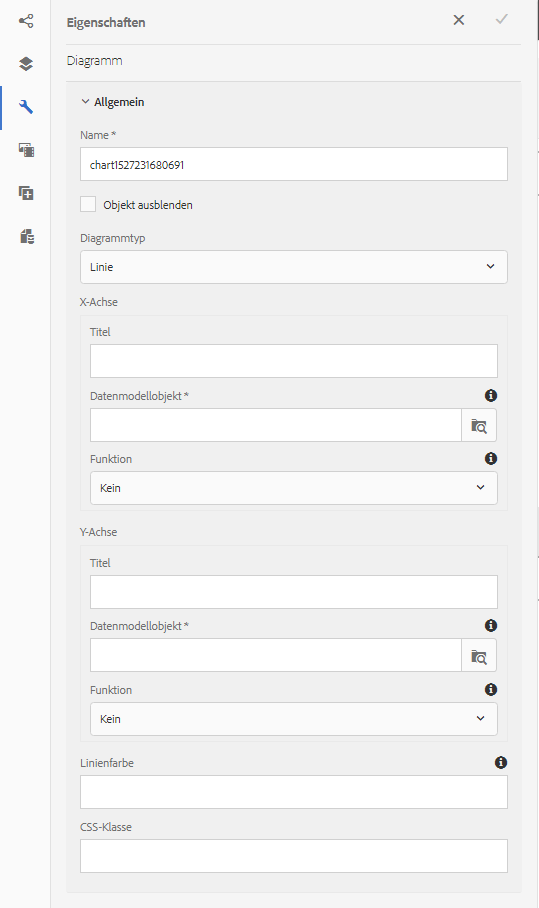

# Verwenden von Diagrammen mit interaktiver Kommunikation {#using-charts-in-interactive-communications}

Mithilfe von Diagrammen in einer interaktiven Kommunikation können Sie große Informationsmengen zu einem einfach zu analysierenden und zu verstehenden visuellen Format zusammenfassen

Ein Diagramm ist eine visuelle Darstellung von Daten. Es verdichtet große Mengen an Informationen in ein leicht verständliches visuelles Format, sodass die Empfänger der interaktiven Kommunikation komplexe Daten besser visualisieren, interpretieren und analysieren können.

Beim Erstellen einer interaktiven Kommunikation können Sie Diagramme hinzufügen, um zweidimensionale Daten vom Formulardatenmodell der Vorlage für die interaktive Kommunikation visuell darzustellen. Mit der Diagrammkomponente können Sie folgende Arten von Diagrammen hinzufügen und konfigurieren:

* Kreisdiagramm
* Spalte
* Donut
* Balken (Nur Webkanal)
* Linie
* Linie und Punkt
* Punkt
* Bereich

## Add and configure chart in an Interactive Communication {#add-and-configure-chart-in-an-interactive-communication}

Führen Sie die folgenden Schritte aus, um ein Diagramm zu einer interaktiven Kommunikation hinzuzufügen:

1. Ziehen Sie die Diagrammkomponente von den Komponenten in der AEM-Seitenleiste in einen der folgenden Druck- oder Webkanäle einer interaktiven Kommunikation:

   * Kanal drucken: Zielgruppe und Bildfeld
   * Webkanal: Teilfenster und Zielbereich

   Die abgelegte Diagrammkomponente erstellt einen Platzhalter für ein Diagramm.

1. Tap the chart component in the Interactive Communication editor and from the Component toolbar select **[!UICONTROL Configure (]** ).

   Die Eigenschaften-Seitenleiste wird mit den Grundeigenschaften des Diagramms im Fokus angezeigt.

   
   **Abbildung:** *Grundlegende Eigenschaften eines Linientypdiagramms in gedrucktem Kanal*

   
   **Abbildung:** *Grundlegende Eigenschaften eines Linientypdiagramms in Web Kanal*

1. Konfigurieren Sie die grundlegenden Eigenschaften des Diagramms für Druckkanal und Webkanal. Neben den allgemeinen Eigenschaften gibt es Eigenschaften, die für den Druck- und Webkanal und den Diagrammtyp spezifisch sind.

   * **[!UICONTROL Name]**: Name des Diagrammobjekts. Der Name des Diagramms, das Sie hier angeben, wird nicht in der Diagrammausgabe angezeigt, wird jedoch in Regeln verwendet, um auf das Diagramm zu verweisen.
   * **[!UICONTROL Diagrammtyp]**: Geben Sie den Diagrammtyp an: Kreis-, Spalten-, Ring, Linien-, Linien- und Punkt-, Punkt- oder Flächendiagramm.
   * **[!UICONTROL Objekt ausblenden]**: Wählen Sie diese Option, um das Diagramm in der endgültigen Ausgabe auszublenden.
   * Geben Sie Folgendes für die **[!UICONTROL X-Achse]** und **[!UICONTROL Y-Achse]** an:

      * **[!UICONTROL Titel]**: Geben Sie die Titel für die X- und Y-Achse an, die in der interaktiven Kommunikation angezeigt werden sollen.
      * **[!UICONTROL Datenmodellobjekt*]**: Klicken Sie auf „Durchsuchen“ und wählen Sie die Datenmodellobjekte für die X- und Y-Achse des Diagramms aus dem Formulardatenmodell, das beim Erstellen der interaktiven Kommunikation angegeben wurden. Wählen Sie zwei Sammlungs-/Array-Typ-Eigenschaften desselben übergeordneten Datenmodellobjekts, die in Bezug zueinander bedeutungsvoll sind, um sie auf der X- und Y-Achse eines Diagramms darzustellen.
      * **[!UICONTROL Funktion]**: Um die Werte auf der Achse mit statistischen Funktionen zu berechnen, wählen Sie Funktion für die X/Y-Achse. For more information about functions, see [Use functions in chart](#usefunction) and [Example 2: Application of sum and mean functions in a line chart](#applicationsumfrequency).

   >[!NOTE]
   >
   >Für den Druckkanal auf der X-Achse muss das Datenmodellobjekt, das Sie binden, den Typ Zahl, Zeichenfolge oder Datum haben. Auf der Y-Achse sollte das Datenmodellobjekt, das Sie binden, vom Typ „Zahl“ sein. Es wird empfohlen, dass Sie die rechte Legende im Druckkanal verwenden.

   Weitere Informationen zu Diagrammeigenschaften finden Sie unter [Grundlegende Eigenschaften in Diagrammen](#basicpropertiescharts).

1. (Nur Druckkanal) Legen Sie in den Agenteneinstellungen fest, ob der Agent dieses Diagramm verwenden muss. If i **[!UICONTROL t Is Mandatory For the Agent To Use This Chart]** option is not selected, the agent can tap the eye icon for the chart in the Content tab of Agent UI to show/hide the chart.

   

1. Tippen Sie in der Seitenleiste Eigenschaften auf .

   Erstellen Sie eine Vorschau, um das Erscheinungsbild und die Daten des Diagramms anzuzeigen. Kehren Sie zurück, um die Eigenschaften des Diagramms bei Bedarf neu zu konfigurieren.

1. Kehren Sie zu anderen Änderungen in der interaktiven Kommunikation zurück.

## Beispiel 1: Diagrammausgabe in Druck und Web {#chartoutputprintweb}

Auf der Registerkarte „Grundeinstellungen“ definieren Sie die Art des Diagramms, die Quellformulardatenmodelleigenschaften, die Daten enthalten, die Beschriftungen, die auf der X-Achse und Y-Achse des Diagramms dargestellt werden können, und optional auch die statistische Funktion, um die Werte für die grafische Darstellung auf dem Diagramm zu berechnen.

Im Folgenden werden die Mindestanforderungen für grundlegenden Eigenschaften mit Hilfe einer Kreditkartenabrechnung, die mit einer interaktiven Kommunikation erstellt wurde, detailliert erläutert. Wenn Sie ein Diagramm generieren möchten, um die Höhe der verschiedenen Ausgaben in der Abrechnung darzustellen. Sie können verschiedene Diagrammarten für Druck- und Webausgabe der interaktiven Kommunikation verwenden.

Um dies zu erreichen, müssen Sie Folgendes angeben:

* **[!UICONTROL Diagrammtyp]** - in diesem Beispiel Spalte für den Druckkanal und Kreis für den Webkanal
* **[!UICONTROL Datenmodellobjekte]** als Quelle für die X- und Y-Achse des Diagramms - in diesem Beispiel Transaktionsbetrag für X-Achse und Ausgabenname für die Y-Achse
* **[!UICONTROL Titel]** für die X- und Y-Achse (nur für das Spaltendiagramm im Druckkanal in diesem Beispiel) - in diesem Beispiel Betrag ($) für die X-Achse und Ausgabe für die Y-Achse.
* **[!UICONTROL Beschriftungsrichtung]** (in diesem Beispiel nur für das Spaltentypdiagramm im Kanal &quot;print&quot;) - in diesem Beispiel `Tilt Left`

* **[!UICONTROL QuickInfo]** , die beim Mauszeiger über eine Ausgabe angezeigt wird (nur Web-Kanal) - in diesem Beispiel `${x}: $ ${y}`wird die [Ausgabenbezeichnung angezeigt: $ Amount] (Beispiel: Themenparkbesuch: $ 315)

**Abbildung:** *Spaltendiagramm in der Druckausgabe einer interaktiven Kommunikation*

**A.** Y-Achse - Aus der Eigenschaft des Formulardatenmodells und der Eigenschaft Titel abgerufener Betrag auf Betrag ($) **B.** Beschriftungsrichtung der X-Achse auf &quot;Neigung links **C.** X&quot;-Achse eingestellt - Ausgabenbeschreibung, die von der Eigenschaft des Formulardatenmodells und der Eigenschaft &quot;Titel&quot;auf &quot;Kosten&quot;abgerufen wird

**Abbildung:** *Ringdiagramm in der Webausgabe einer interaktiven Kommunikation*

**A.** Die Eigenschaft &quot;Innerer Radius&quot;des Donuts ist auf **B eingestellt.** Die Eigenschaft &quot;Legende anzeigen&quot;ist ausgewählt und die Eigenschaft &quot;Legende Position&quot;auf &quot;Rechts **C.** QuickInfo zeigt die Details des Elements beim Bewegen der Maus über - QuickInfo ist auf ${x} eingestellt: ${y}

## Beispiel 2: Anwendung von Summen- und Häufigkeitsfunktionen in einem Liniendiagramm {#applicationsumfrequency}

Durch Anwenden von Funktionen in einem Diagramm können Sie Daten darstellen, die nicht direkt vom Formulardatenmodell bereitgestellt werden. In diesem Beispiel verwenden wir ein Beispiel für einen Kreditkartenauszug, um zu verstehen, wie Summen- und Häufigkeitsfunktionen auf das Diagramm angewendet werden können.

&quot;Bed and Breakfast&quot;**Abbildung:** *Liniendiagramm ohne Funktion mit drei &quot;Bed and Breakfast&quot;-Transaktionen*

### Summenfunktion {#sum-function}

Sie können die Summenfunktion anwenden, um Werte mehrerer Instanzen derselben Dateneigenschaft zusammenzufassen, und sie nur einmal anzeigen. Im folgenden Diagramm wird die Summenfunktion beispielsweise auf die Y-Achse angewendet, um die Summe der drei „Bed and Breakfast“-Transaktionen ($ 99,45, $ 78 und $ 12) zu addieren und nur eine Transaktion ($ 189,45) anzuzeigen.

Die Summenfunktion kann Diagramme nützlicher machen, wenn Sie die Summe für viele Instanzen derselben Dateneigenschaft sortieren und anzeigen möchten.


### Häufigkeitsfunktion {#frequency-function}

Gibt die Anzahl der Werte auf der X- oder Y-Achse für einen bestimmten Wert auf der anderen Achse an. Bei Anwendung der Häufigkeitsfunktion auf der Y-Achse (Amount/TransAmount) zeigt das Diagramm an, dass drei „Bed &amp; Breakfast“-Transaktionen und ein Rest der Transaktionsarten dreimal aufgetreten sind.


## Basic properties in charts {#basicpropertiescharts}

Auf der Registerkarte „Standard“ können Sie die folgenden Eigenschaften konfigurieren:

**Name** Ein Bezeichner für das Diagrammelement. Der Name ist im Diagramm nicht sichtbar, jedoch nützlich, wenn von anderen Komponenten, Skripts und SOM-Ausdrücken auf das Element verwiesen wird.

**Titel (nur Kanal drucken)** Gibt den Titel des Diagramms an.

**Diagrammtyp** Gibt den Diagrammtyp an, den Sie erstellen möchten. Die verfügbaren Optionen sind Torten-, Spalten-, Ring-, Linien-, Linien- und Punktdiagramme, Punkt- und Bereichsdiagramme und Balkendiagramme (Webkanal). Weitere Informationen finden Sie unter Beispiel 1: Diagrammausgabe in Druck und Web

**X-Achse > Titel** Gibt den Titel für die X-Achse an.

**X-Achse > Datenmodellobjekt und -amp;ast;** Geben Sie den Namen des auf der X-Achse abzubildenden Collection-Elements des Formulardatenmodells an.

**X-Achse > Funktion** Gibt die statistische/benutzerdefinierte Funktion an, die zur Berechnung der Werte auf der X-Achse verwendet werden soll. Weitere Informationen zu Funktionen finden Sie unter Funktionen in Diagramm und Beispiel 2: Anwendung der Mittel- und Summenfunktionen in einem Liniendiagramm.

**X-Achse > Richtung** der Beschriftung im Diagramm im Kanal. Wenn Sie die Richtung der Beschriftung als &quot;Benutzerdefinierte Drehung&quot;wählen, wird das Feld &quot;Benutzerdefinierter Drehwinkel (Grad)&quot;angezeigt. Im Feld „Benutzerdefinierter Drehwinkel (Grad)“ können Sie den Drehwinkel in Schritten von 15 Grad wählen.

**Y-Achse > Titel** Gibt den Titel für die Y-Achse an.

**Y-Achse > Datenmodellobjekt und -amp;ast;** Gibt das auf der y-Achse abzuzeichnende Collection-Element des Formulardatenmodells an. Im Kanal &quot;Drucken&quot;sollte das Datenmodellobjekt für die Y-Achse vom Typ Number sein.

**Y-Achse > Funktion** Gibt die statistische/benutzerdefinierte Funktion an, die zur Berechnung der Werte auf der y-Achse verwendet werden soll. Weitere Informationen zu Funktionen finden Sie unter Funktionen in Diagramm und Beispiel 2: Anwendung der Mittel- und Summenfunktionen in einem Liniendiagramm.

**Legende** anzeigen Zeigt eine Legende für das Kreisdiagramm oder Ringdiagramm an, wenn diese aktiviert ist.

**Legendenposition** Gibt die Position der Legende in Bezug auf das Diagramm an. Die verfügbaren Optionen sind rechts, links, oben und unten.

**Höhe (nur Kanal drucken)** Höhe des Diagramms in Pixel.

**Breite (nur Kanal drucken)** Breite des Diagramms in Pixel.

>[!NOTE]
>
>Sie können die Breite des Diagramms im Webkanal mithilfe der Stil-Ebene oder durch Anwenden eines Designs steuern.

**QuickInfo (nur Web-Kanal)** Gibt das Format an, in dem die QuickInfo auf einem Datenpunkt im Diagramm im Web-Kanal angezeigt wird. Der Standardwert ist \${x}(\${y}). Je nach Diagrammtyp werden die Variablen \${x} und \${y} dynamisch durch die entsprechenden Werte auf der X- und Y-Achse ersetzt und in der QuickInfo angezeigt, wenn Sie mit der Maus auf einen Punkt, eine Leiste oder ein Segment im Diagramm zeigen.

Wenn Sie QuickInfos deaktivieren möchten, lassen Sie das Feld „Quickinfo“ leer. Diese Option ist nicht auf Linien- und Bereichsdiagramme anwendbar. For example, see [Example 1: Chart output in print and web](#chartoutputprintweb).

**CSS-Klasse (nur Web-Kanal)** Geben Sie im CSS-Klassenfeld den Namen einer CSS-Klasse an, um benutzerdefinierte Stile auf das Diagramm anzuwenden.

**Obligatorischer Seitenumbruch vor (nur Kanal drucken)** Wählen Sie diese Option, um vor dem Diagramm einen obligatorischen Seitenumbruch hinzuzufügen und das Diagramm auf eine neue Seite zu setzen.

**Obligatorischer Seitenumbruch nach (nur Kanal drucken)** Wählen Sie diese Option aus, um nach dem Diagramm einen obligatorischen Seitenumbruch hinzuzufügen und den Inhalt nach dem Diagramm auf eine neue Seite zu setzen.

**Einzug (nur Kanal drucken)** Geben Sie den Einzug des Diagramms von links an.

**Diagrammspezifische Konfigurationen** Zusätzlich zu den gängigen Konfigurationen stehen die folgenden Diagrammkonfigurationen zur Verfügung:

* **Innerer Radius**: Für Ringdiagramme verfügbar, um den Radius (in Pixeln) für den inneren Kreis des Diagramms anzugeben.
* **Linienfarbe**: Verfügbar für Linien-, Linien- und Punkt- sowie Bereichsdiagramme, um den hexadezimalen Farbwert für die Linie im Diagramm anzugeben.
* **Punktfarbe**: verfügbar für Punkt- und Linien- und Punktdiagramme, um den hexadezimalen Farbwert für die Punkte im Diagramm anzugeben.

* **Bereichsfarbe**: verfügbar für Flächendiagramme, um den hexadezimalen Farbwert für den Bereich unter der Linie im Diagramm anzugeben.

## Funktionen im Diagramm verwenden {#usefunction}

Sie können das Diagramm so konfigurieren, dass Sie mit statistischen Funktionen Werte aus Quelldaten zur grafischen Darstellung im Diagramm berechnen können. Durch Anwenden von Funktionen in einem Diagramm können Sie Daten darstellen, die nicht direkt vom Formulardatenmodell bereitgestellt werden.

Die Diagrammkomponente verfügt bereits über einige integrierte Funktionen, allerdings können Sie auch eigene Funktionen erstellen und für die Verwendung in der Diagrammkonfiguration freigeben.


>[!NOTE]
>
>Sie können Funktionen verwenden, um Werte für die X- bzw. Y-Achse in einem Diagramm zu berechnen.

### Standardfunktionen {#default-functions}

Die folgenden Funktionen sind standardmäßig in der Diagrammkomponente verfügbar:

**Mittelwert (Durchschnitt)** Gibt den Durchschnitt der Werte auf der X- oder Y-Achse für einen bestimmten Wert auf der anderen Achse zurück.

**Summe** Gibt die Summe aller Werte auf der X- oder Y-Achse für einen bestimmten Wert auf der anderen Achse zurück.

**Maximum** Gibt das Maximum der Werte auf der X- oder Y-Achse für einen bestimmten Wert auf der anderen Achse zurück.

**Frequenz** Gibt die Anzahl der Werte auf der X- oder Y-Achse für einen bestimmten Wert auf der anderen Achse zurück.

**Bereich** Gibt die Differenz zwischen dem Maximum und Minimum der Werte auf der X- oder Y-Achse für einen bestimmten Wert auf der anderen Achse zurück.

**Median** Gibt den Wert zurück, der auf der X- oder Y-Achse höhere und niedrigere Werte auf der anderen Achse halbiert.

**Minimum** Gibt das Minimum der Werte auf der X- oder Y-Achse für einen bestimmten Wert auf der anderen Achse zurück.

**Mode** Gibt den Wert mit den meisten Vorkommen auf der X- oder Y-Achse für einen bestimmten Wert auf der anderen Achse zurück

### Custom functions in web channel {#custom-functions-in-web-channel}

Neben der Verwendung der Standardfunktionen in Diagrammen können Sie benutzerdefinierte Funktionen in JavaScript™ schreiben und in der Liste der Funktionen in der Diagrammkomponente freigeben.

Eine Funktion akzeptiert ein Array oder Werte und einen Kategorienamen als Eingabe und gibt einen Wert zurück. Beispiel:

```
Multiply(valueArray, category) {
 var val = 1;
 _.each(valueArray, function(value) {
 val = val * value;
 });
 return val;
}
```

Wenn Sie eine benutzerdefinierte Funktion geschrieben haben, können Sie die folgenden Schritte ausführen, um sie für die Verwendung in der Diagrammkonfiguration freizugeben:

1. Fügen Sie die benutzerdefinierte Funktion in der Client-Bibliothek hinzu, die mit der entsprechenden interaktiven Kommunikation verknüpft ist. For more information, see [Configuring the Submit action](/help/forms/using/configuring-submit-actions.md) and [Using Client-Side Libraries](/help/sites-developing/clientlibs.md).

1. To display the custom function in Function drop-down, in CRXDe Lite, create an `nt:unstructured` node in the apps folder with the following properties:

   * Add property `guideComponentType` with value as `fd/af/reducer`. (mandatory)
   * Add property `value` to a fully qualified name of the custom JavaScript™ function. (obligatorisch) und setzen Sie den Wert auf den Namen der benutzerdefinierten Funktion, z. B. Multiplizieren, fest.
   * Add property `jcr:description` with the value you want to display as the name of the custom function that appears in the Function drop-down. Beispiel:**Multiplizieren**. 
   * Add property `qtip` with value that will be short description of the custom function. Es wird als QuickInfo angezeigt, wenn der Mauszeiger über den Funktionsnamen in der Dropdown-Liste **Funktion** bewegt wird.

1. Klicken Sie auf **Alle speichern**, um die Konfiguration zu speichern.

Die Funktion steht nun zur Verwendung im Diagramm zur Verfügung.