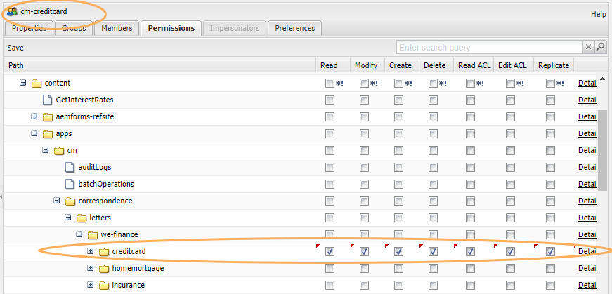

# NICHT auf Rollen basierende Benutzeroberfläche in Correspondence Management veröffentlichen {#do-not-publish-role-based-user-interface-in-correspondence-management}

In AEM kann der Administrator rollenbasierten Zugriff für verschiedene Benutzergruppen bereitstellen und verschiedene Aktionen für verschiedene Ressourcen durchführen. Beispielsweise kann die Funktion zum Erstellen oder Bearbeiten von Datenwörterbüchern nur Benutzern in einer bestimmten Benutzergruppe zur Verfügung stehen, während andere Benutzer nur die Datenwörterbücher anzeigen und verwenden können.

In der AEM-Benutzeroberfläche werden die Optionen angezeigt, z. B. zum Erstellen oder Bearbeiten eines Asset-Typs, basierend auf der Zugriffsebene eines Benutzers. Wenn ein Benutzer beispielsweise nicht über die Berechtigungen zum Erstellen eines Datenwörterbuchs verfügt, wird die Option zum Erstellen eines Datenwörterbuchs nicht in der Benutzeroberfläche angezeigt.

Obwohl CRX Ihnen ermöglicht, die Zugriffsberechtigungen für Benutzer- und Gruppenkonten zu konfigurieren, geht es in diesem Artikel um rollenbasierte oder gruppenbasierte Zugriffsberechtigungen.

Weitere Informationen zu Gruppen, Berechtigungen, Zugriffssteuerungslisten und zum Verwalten von Benutzern und Gruppen finden Sie unter [Benutzerverwaltung und Sicherheit](/help/sites-administering/security.md).

## Verwalten von Berechtigungen {#managing-permissions}

1. Stellen Sie sicher, dass der Benutzer, für den Sie die Berechtigungen verwalten möchten, zur entsprechenden Benutzergruppe hinzugefügt wird.

   Beispielsweise wird der Benutzer John Doe den Gruppen `agents` und `cm-creditcard` hinzugefügt. Weitere Informationen finden Sie unter Hinzufügen von Benutzern oder Gruppen zu einer Gruppe. Weitere Informationen finden Sie unter [Verwalten von Benutzern und Benutzergruppen](/help/communities/users.md).

   

1. Erstellen Sie die Ordner, die für das Zulassen der gewünschten Berechtigungen geeignet sind.

   Wenn beispielsweise ein Unternehmen über Hypotheken-, Kreditkarten- und Versicherungssparten verfügt, kann es Ordner mit den Namen `HomeMortgage`, `CreditCard,`und `Insurance` erstellen, um die relevanten Assets zu behalten und Agenten nur für ihre Abteilungen relevanten Assets Zugriff zu gewähren.

1. Um auf die AEM WCM-Sicherheit zuzugreifen, führen Sie einen der folgenden Schritte aus:

   1. Klicken Sie im Begrüßungsbildschirm oder in verschiedenen anderen Bereichen in AEM auf das Sicherheitssymbol:

   1. Navigieren Sie direkt zu `https://[server]:[port]/useradmin`. Achten Sie darauf, sich als Administrator bei AEM anzumelden.

      
   In der linken Struktur sehen Sie alle aktuell im System vorhandenen Benutzer und Gruppen. Sie können die anzuzeigenden Spalten auswählen, den Inhalt der Spalten sortieren und sogar die Reihenfolge ändern, in der die Spalten angezeigt werden, indem Sie die Spaltenüberschrift an eine neue Position ziehen.

   Über die Registerkarten können Sie auf verschiedene Konfigurationen zugreifen:

1. Doppeltippen Sie in der linken Strukturliste auf den Namen der entsprechenden Gruppe und wählen Sie dann die Registerkarte Berechtigungen aus.

   Um den Namen der Gruppe zu finden, können Sie den Namen der Gruppe in das bereitgestellte Leerzeichen eingeben.

1. Navigieren Sie auf der Registerkarte Berechtigungen zu dem Pfad, dem Sie Berechtigungen hinzufügen möchten. Die Ordner &quot;Correspondence Management&quot;befinden sich im Ordner `content/apps/cm/` .

   Aktivieren Sie das Kontrollkästchen in der Spalte Mitglied für die Mitglieder, die Berechtigungen für diesen Pfad erhalten sollen. Deaktivieren Sie das Kontrollkästchen für die Mitglieder, denen Berechtigungen entzogen werden sollen. In der von Ihnen geänderten Zelle wird ein rotes Dreieck angezeigt.

   

   >[!NOTE]
   >
   >Die in einem Ordner angegebenen Berechtigungen ersetzen die in den Unterordnern angegebenen Berechtigungen.

1. Tippen Sie auf Speichern.
1. Schritttext
1. Schritttext
1. Schritttext

