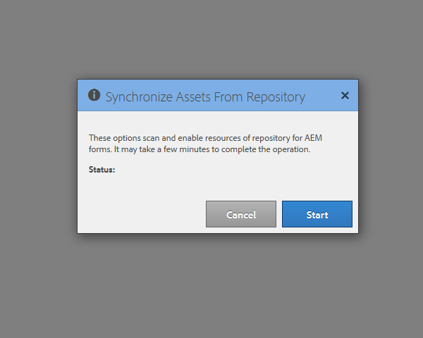

# Konfigurieren des Synchronisierungs-Scheduler {#configuring-the-synchronization-scheduler}

Standardmäßig wird der Synchronisierungs-Scheduler alle 3 Minuten ausgeführt, um alle geänderten und aktualisierten Elemente im Repository über LiveCycle Workbench 11 zu synchronisieren. Anwendungen, die Formulare und Ressourcen enthalten, sind in der AEM Forms-Benutzeroberfläche sichtbar, sobald der Synchronisierungsprozess abgeschlossen ist.

## Ändern des Intervalls für den Synchronisierungs-Scheduler {#change-interval-of-the-synchronization-scheduler}

Führen Sie die folgenden Schritte durch, um das Intervall für den Synchronisierungs-Scheduler zu ändern:

1. Melden Sie sich bei AEM Configuration Manager an. Die URL von Configuration Manager ist `https://[Server]:[Port]/lc/system/console/configMgr`

1. Suchen Sie das Bundle **FormsManagerConfiguration** und öffnen Sie es.

1. Geben Sie für die Option **Häufigkeit für Synchronisierungs-Scheduler** einen neuen Wert an.

   Die Einheit für die Frequenz ist Minuten. Um den Scheduler beispielsweise so zu konfigurieren, dass er alle 60 Minuten ausgeführt wird, geben Sie „60“ ein.

## Synchronisieren von Elementen {#synchronizing-assets}

Sie können die Option **Assets aus Repository synchronisieren** verwenden, um die Elemente manuell zu synchronisieren. Führen Sie die folgenden Schritte durch, um die Elemente manuell zu synchronisieren:

1. Melden Sie sich bei AEM Forms an. Die Standardeinstellung ist `https://[Server]:[Port]/lc/aem/forms/`.

   

   **Abbildung:** *AEM Forms-Benutzeroberfläche*

1. Klicken Sie in der Symbolleiste auf das Symbol . Wenn im zuletzt konfigurierten Pfad keine Elemente vorhanden sind, wird das nachfolgende Dialogfeld angezeigt. Klicken Sie auf **Start**, um die Synchronisierung zu starten.

   

   **Abbildung: Dialogfeld &quot;** *Synchronisierung&quot;*

## Fehlerbehebung von Snchronisierungsfehler {#troubleshooting-synchronization-error}

Sie können neue Anwendungen im Workflow Designer (LiveCycle Workbench) erstellen. 

Wenn die neu erstellte Anwendung und ein Ordner unter &quot;/content/dam/formsanddocuments&quot;denselben Namen haben, wird der Fehler &quot;*Ein Asset mit demselben Namen wie diese Anwendung bereits auf der Stammebene vorhanden.*&quot; wird protokolliert.

Benennen Sie zum Beheben des Konflikts die Anwendung um und synchronisieren Sie die Elemente manuell.

**Abbildung:Dialogfeld &quot;** *Konflikte bei der Synchronisierung von Elementen&quot;*

