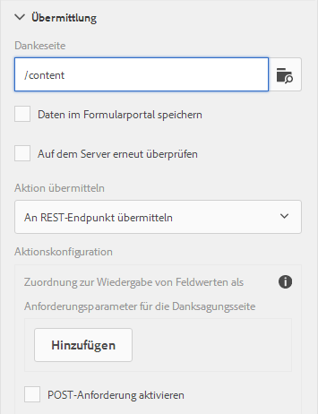

# Konfigurieren einer Umleitungsseite {#configuring-redirect-page}

Formularersteller können für jedes Formular eine Seite konfigurieren, zu der die Formularbenutzer nach dem Absenden eines Formulars umgeleitet werden.

1. Wählen Sie im Bearbeitungsmodus eine Komponente aus, klicken Sie dann auf  > **Container für ein adaptives Formular** und anschließend auf .

1. Klicken Sie in der Seitenleiste auf **Übermittlung**.

1. Geben Sie die URL der Umleitungsseite unter der Danksagung im Bereich „Senden“ an.
1. Optional können Sie unter „Übermittlungsaktion“ für die Aktion „An REST-Endpunkt übermitteln“ den Parameter konfigurieren, der zur Umleitungsseite weitergeleitet wird.

**Abbildung:** *Konfiguration der Umleitungsseite*

Formularersteller können folgende Parameter verwenden, die zur Dankeseite weitergeleitet werden. Für alle verfügbaren Übermittlungsaktionen: `status` und `owner` -Parameter übergeben werden. Neben diesen beiden Parametern werden für die folgenden Übermittlungsaktionen einige weitere Parameter weitergeleitet:

* **Aktion zum Speichern von Inhalten** (veraltet) : `contentPath`—der Pfad des Knotens im Repository, in dem die gesendeten Daten gespeichert werden, weitergegeben wird.

* **PDF-Aktion speichern** (veraltet) : `contentPath`- der übermittelten Daten und des Pfads zum Knoten, der die PDF-Datei im Repository speichert, wird übergeben.

* **An Formular-Workflow übermitteln**: Ausgabeparameter, die aus dem Formular-Workflow zurückgegeben wurden, werden weitergeleitet.

* **An REST-Endpunkt übermitteln**: Parameter, die für die Zuordnung feldinterner Werte zu Parametern hinzugefügt wurden, werden weitergeleitet. Die Parameter `status` und `owner` werden bei dieser Übermittlungsaktion nicht weitergeleitet. Weitere Informationen finden Sie unter [Konfigurieren der Übermittlungsaktion „An REST-Endpunkt übermitteln“](/help/forms/using/configuring-submit-actions.md). 
