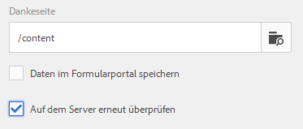

# Konfigurieren der Sendeaktion {#configuring-the-submit-action}

>[!CAUTION]
>
>AEM 6.4 hat das Ende der erweiterten Unterstützung erreicht und diese Dokumentation wird nicht mehr aktualisiert. Weitere Informationen finden Sie in unserer [technische Unterstützung](https://helpx.adobe.com/de/support/programs/eol-matrix.html). Unterstützte Versionen suchen [here](https://experienceleague.adobe.com/docs/?lang=de).

## Einführung in die Übermittlungsaktionen {#introduction-to-submit-actions}

Eine Sendeaktion wird ausgelöst, wenn ein Benutzer in einem adaptiven Formular auf die Schaltfläche Senden klickt. Sie können die Sendeaktion für das adaptive Formular konfigurieren. Adaptive Formulare umfassen auch einige Übermittlungsaktionen für den sofortigen Einsatz. Sie können die standardmäßigen Sendeaktionen kopieren und erweitern, um eine eigene Sendeaktion zu erstellen. Basierend auf Ihre Anforderungen können Sie eine eigene Übermittlungsaktion schreiben und registrieren, um Daten im gesendeten Formular zu verarbeiten.

Wenn ein Formular vorausgefüllt oder übermittelt wird, werden die gesendeten Daten durch AEM zur Datenmassage in Zwischenformate weitergeleitet. Daten werden nicht in einer AEM-Instanz gespeichert, es sei denn, das adaptive Formular verwendet Acrobat Sign, überprüft, Formularportalentwürfe, -übermittlungen oder AEM Workflows.

Sie können eine Sendeaktion in der Seitenleiste im Bereich **[!UICONTROL Senden]** des „Container für adaptive Formulare“ konfigurieren.

**Abbildung:** *Konfigurieren der Sendeaktion*

Die standardmäßigen Sendeaktionen, die für adaptive Formulare verfügbar sind, sind:

* An REST-Endpunkt übermitteln
* E-Mail senden
* PDF per E-Mail senden
* Aufrufen eines Formular-Workflows
* Senden mit Formulardatenmodell
* Übermittlungsaktion für Forms Portal
* AEM-Workflow aufrufen

>[!NOTE]
>
>Die Übermittlungsaktion „PDF mittels E-Mail senden“ steht nur in adaptiven Formularen zur Verfügung, die als Formularmodell XFA-Vorlagen verwenden.

>[!NOTE]
>
>Stellen Sie sicher, dass der Ordner „[AEM-Installationsverzeichnis]\crx-quickstart\temp\datamanager\ASM“ vorhanden ist. vorhanden. Das Verzeichnis wird benötigt, um Anhänge vorübergehend zu speichern. Wenn das Verzeichnis nicht vorhanden ist, erstellen Sie es.

>[!CAUTION]
>
>Wenn Sie eine Formularvorlage, ein Formulardatenmodell oder ein schemabasiertes adaptives Formular mit XML- oder JSON-Daten [vorbefüllen](/help/forms/using/prepopulate-adaptive-form-fields.md), die einem Schema (XML-Schema, JSON-Schema, Formularvorlage oder Formulardatenmodell) entsprechen, d.h. die Daten enthalten keine &lt;afData>-, &lt;afBoundData>- und &lt;/afUnboundData>-Tags, dann gehen die Daten von nicht gebundenen Feldern (nicht gebundene Felder sind adaptive Formularfelder ohne die Eigenschaft [bindref](/help/forms/using/prepopulate-adaptive-form-fields.md)) des adaptiven Formulars verloren.

Sie können eine benutzerdefinierte Sendeaktion für adaptive Formulare schreiben, um Ihren Anwendungsfall zu erfüllen. Weitere Informationen finden Sie unter[ Schreiben von benutzerdefinierten Übermittlungsaktionen für ein adaptives Formular](/help/forms/using/custom-submit-action-form.md).

## An REST-Endpunkt übermitteln {#submit-to-rest-endpoint}

Die **[!UICONTROL An REST-Endpunkt übermitteln]** Die Option submit übergibt die im Formular ausgefüllten Daten im Rahmen der HTTP-GET-Anfrage an eine konfigurierte Bestätigungsseite. Sie können den Namen der Felder hinzufügen, die angefordert werden sollen. Das Format der Anfrage lautet:

`{fieldName}={request parameter name}`

Wie in der folgenden Abbildung dargestellt, werden `param1` und `param2` als Parameter mit Werten, die aus den Feldern **[!UICONTROL textbox]** und **[!UICONTROL numericbox]** kopiert wurden, für die nächste Aktion weitergeleitet.

Sie können auch **[!UICONTROL POST-Anforderungen aktivieren]** und eine URL eingeben, um die Anforderung zu veröffentlichen. Um Daten an den AEM-Server, auf dem sich das Formular befindet, zu senden, verwenden Sie einen relativen Pfad entsprechend dem Stammpfad des AEM-Servers. Beispiel: /content/forms/af/SampleForm.html. Wenn Sie Daten an irgendeinen anderen Server senden, verwenden Sie den absoluten Pfad.

Konfigurieren der Übermittlungsaktion „An REST-Endpunkt übermitteln“

>[!NOTE]
Alle Felder müssen über verschiedene Elementnamen verfügen, um als Parameter in der REST-URL weitergeleitet zu werden, auch dann, wenn die Felder in verschiedenen Bereichen platziert sind.

### Veröffentlichen Sie gesendete Daten an eine Ressource oder einen externen REST-Endpunkt  {#post-submitted-data-to-a-resource-or-external-rest-end-point-nbsp}

Verwenden Sie die Aktion **[!UICONTROL An REST-Endpunkt übermitteln]**, um die übertragenen Daten an eine Rest-URL zu veröffentlichen. Die URL kann sich auf einem internen (dem Server, auf dem das Formular gerendert wird) oder auf einem externen Server befinden.

Um Daten auf einem internen Server zu veröffentlichen, geben Sie den Pfad der Ressource an. Die Daten werden an den Pfad der Ressource gesendet. Beispiel: /content/restEndPoint. Für solche Post-Anfragen werden die Authentifizierungsinformationen der Sendeanforderung verwendet.

Geben Sie eine URL an, um Daten an einen externen Server zu posten. Das Format der URL ist https://host:port/path_to_rest_end_point. Stellen Sie sicher, dass Sie den Pfad zum Handhaben der POST-Anforderung anonym konfigurieren.

Im obigen Beispiel hat der Benutzer Informationen in die `textbox` eingegeben, die mithilfe von Parameter `param1` erfasst werden. Die Syntax zur Veröffentlichung erfasster Daten mithilfe von `param1` lautet:

`String data=request.getParameter("param1");`

Paramenter, die Sie zum Veröffentlichen von XML-Daten und -Anhängen verwenden, sind `dataXml` und `attachments`.

Beispielsweise können Sie diese beiden Parameter in Ihrem Skript verwenden, um Daten an einen REST-Endpunkt zu analysieren. Verwenden Sie die folgende Syntax, um Daten zu speichern und zu analysieren:

`String data=request.getParameter("dataXml");`\
`String att=request.getParameter("attachments");`

In diesem Beispiel speichert `data` die XML-Daten, und `att` speichert Anlagendaten.

## E-Mail senden {#send-email}

Bei der Übermittlungsaktion **[!UICONTROL E-Mail senden]** wird nach erfolgreicher Übermittlung des Formulars eine E-Mail an einen oder mehrere Empfänger gesendet. Die generierte E-Mail kann Formulardaten in einem vordefinierten Format enthalten.

>[!NOTE]
Alle Formularfelder müssen unterschiedliche Elementnamen haben, auch wenn sie in verschiedenen Bereichen platziert werden), um Formulardaten in eine E-Mail aufnehmen zu können.

## PDF per E-Mail senden {#send-pdf-via-email}

Bei der Übermittlungsaktion **[!UICONTROL PDF mittels E-Mail senden]** wird bei erfolgreicher Übermittlung des Formulars an einen oder mehrere Empfänger eine mit einer PDF-Datei gesendet, die Formulardaten enthält.

**Hinweis:** *Diese Übermittlungsaktion ist für XFA-basierte adaptive Formulare und XSD-basierte adaptive Formulare verfügbar, die über die Vorlage &quot;Datensatzdokument&quot;verfügen.*

## Aufrufen eines Arbeitsablaufs für Formulare {#invoke-a-forms-workflow}

Die **[!UICONTROL An Forms-Workflow übermitteln]** Die Sendeoption sendet eine Daten-XML und Dateianlagen (falls vorhanden) an einen vorhandenen Adobe LiveCycle- oder AEM Forms on JEE-Prozess.

Informationen zum Konfigurieren der Sendeaktion &quot;An Formular-Workflow übermitteln&quot;finden Sie unter [Senden und Verarbeiten Ihrer Formulardaten mithilfe von Formular-Workflows](/help/forms/using/submit-form-data-livecycle-process.md).

## Senden mit Formulardatenmodell {#submit-using-form-data-model}

Die Übermittlungsaktion **[!UICONTROL Senden mit Formulardatenmodell]** schreibt gesendete Daten eines adaptiven Formulars für das angegebene Datenmodellobjekt in einem Formulardatenmodell in seine Datenquelle. Beim Konfigurieren der Sendeaktion können Sie ein Datenmodellobjekt auswählen, dessen gesendete Daten Sie in seine Datenquelle zurückschreiben möchten.

Darüber hinaus können Sie eine Formularanlage mit einem Formulardatenmodell und einem Datensatzdokument (DoR) an die Datenquelle senden.

Weitere Informationen zum Formulardatenmodell finden Sie unter [Datenintegration für AEM Forms](/help/forms/using/data-integration.md).

## Übermittlungsaktion für Forms Portal {#forms-portal-submit-action}

Die **[!UICONTROL Übermittlungsaktion für Forms Portal]** ermöglicht die Bereitstellung von Formulardaten über ein AEM Forms-Portal.

Weitere Informationen zur Übermittlungsaktion für Forms Portal finden Sie unter [Komponente &quot;Drafts and Submissions&quot;](/help/forms/using/draft-submission-component.md).

## AEM-Workflow aufrufen {#invoke-an-aem-workflow}

Die **[!UICONTROL Aufrufen eines AEM-Workflows]** Übermittlungsaktion ordnet ein adaptives Formular einem AEM Workflow zu. Wenn ein Formular gesendet wird, beginnt der zugehörige Workflow automatisch auf dem Verarbeitungsknoten. Außerdem werden Datendateien, Anhänge und gegebenenfalls Datensatzdokumente an der Payload-Position des Workflows platziert.

Vor der Verwendung von **[!UICONTROL Aufrufen eines AEM-Workflows]** Sendeaktion, [Konfigurieren der AEM DS-Einstellungen](/help/forms/using/configuring-the-processing-server-url-.md). Weitere Informationen zum Erstellen eines AEM-Workflow finden Sie unter [Formularorientierte Workflows auf OSGi](/help/forms/using/aem-forms-workflow.md).

## Server-seitige Überprüfung im adaptiven Formular {#server-side-revalidation-in-adaptive-form}

In der Regel platzieren Entwickler in jedem Online-Datenerfassungssystem einige JavaScript-Validierungen auf Client-Seite, um einige Geschäftsregeln durchzusetzen. Moderne Browser bieten Endbenutzern jedoch Möglichkeiten, diese Validierungen zu umgehen und Übermittlungen mithilfe verschiedener Techniken wie beispielsweise die Web Browser DevTools-Konsole manuell durchzuführen. Solche Techniken gelten auch für adaptive Formulare. Ein Formularentwickler kann verschiedene Validierungslogiken erstellen, aber technisch können Endbenutzer diese Validierungslogiken umgehen und ungültige Daten an den Server senden. Ungültige Daten verstoßen gegen die Geschäftsregeln, die ein Formularautor durchgesetzt hat.

Die serverseitige Überprüfungsfunktion bietet die Möglichkeit, auch die Validierungen auszuführen, die ein Autor für adaptive Formulare beim Entwerfen eines adaptiven Formulars auf dem Server bereitgestellt hat. Sie verhindert jede mögliche Beeinträchtigung von Datenübertragungen und Verstöße gegen Geschäftsregeln, die hinsichtlich Formularvalidierungen auftreten können.

### Was soll auf dem Server validiert werden? {#what-to-validate-on-server-br}

Alle vordefinierten Feldvalidierungen eines adaptiven Formulars, die erneut auf dem Server ausgeführt werden, sind:

* Erforderlich
* Validierung-Picture-Klausel
* Überprüfungsausdruck

### Aktivieren von Server-seitiger Validierung {#enabling-server-side-validation-br}

Verwenden Sie das Kontrollkästchen **Auf dem Server erneut überprüfen** im Container für adaptive Formulare in der Seitenleiste, um die Server-seitige Validierung für das aktuelle Formular zu aktivieren oder zu deaktivieren.

**Abbildung:** *Aktivieren der serverseitigen Validierung*

Wenn der Endbenutzer diese Überprüfungen umgeht und die Formulare sendet, führt der Server die Überprüfung erneut durch. Wenn die Validierung Server-seitig fehlschlägt, wird die Übermittlung abgebrochen. Dem Endbenutzer wird das ursprüngliche Formular erneut angezeigt. Die erfassten Daten und die gesendeten Daten werden dem Benutzer als Fehler angezeigt.

### Unterstützende benutzerdefinierte Funktionen in Validierungsausdrücken {#supporting-custom-functions-in-validation-expressions-br}

Manchmal im Fall von **komplexe Validierungsregeln**, befindet sich das exakte Überprüfungsskript in benutzerdefinierten Funktionen und der Autor ruft diese benutzerdefinierten Funktionen vom Feldvalidierungsausdruck auf. Um diese benutzerdefinierte Funktionsbibliothek bei Server-seitigen Validierungen bekannt und verfügbar zu machen, kann der Formularautor den Namen der AEM-Client-Bibliothek auf der Registerkarte **[!UICONTROL Allgemein]** des Dialogfelds „Container für adaptive Formulare bearbeiten“, wie nachfolgend dargestellt konfigurieren.

**Abbildung:** *Unterstützende benutzerdefinierte Funktionen in Überprüfungsausdrücken*

Der Autor kann die benutzerdefinierte JavaScript-Bibliothek pro adaptivem Formular konfigurieren. Behalten Sie in der Bibliothek nur die wiederverwendbaren Funktionen bei, die von den Drittanbieter-Bibliotheken jquery und underscore.js abhängen.

## Verhalten bei fehlerhaften Übermittlungsaktionen {#error-handling-on-submit-action}

Als Teil AEM Richtlinien zur Sicherheit und zum Härten konfigurieren Sie benutzerdefinierte Fehlerseiten wie 404.jsp und 500.jsp. Diese Handler werden aufgerufen, wenn beim Senden eines Formulars 404 oder 500 Fehler auftreten. Die Handler werden auch aufgerufen, wenn diese Fehler-Codes auf einem Veröffentlichungsknoten ausgelöst werden.

Weitere Informationen finden Sie unter [Anpassen der vom Fehler-Handler angezeigten Seiten](/help/sites-developing/customizing-errorhandler-pages.md).
