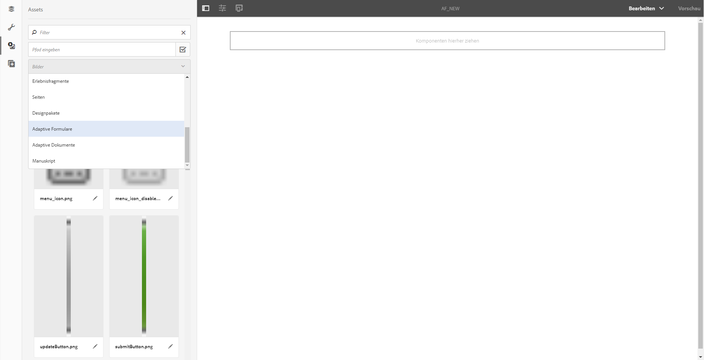

# Erstellen eines adaptiven Formulars mit einem Satz adaptiver Formulare {#create-an-adaptive-form-using-a-set-of-adaptive-forms}

>[!CAUTION]
>
>AEM 6.4 hat das Ende der erweiterten Unterstützung erreicht und diese Dokumentation wird nicht mehr aktualisiert. Weitere Informationen finden Sie in unserer [technische Unterstützung](https://helpx.adobe.com/de/support/programs/eol-matrix.html). Unterstützte Versionen suchen [here](https://experienceleague.adobe.com/docs/?lang=de).

## Übersicht {#overview}

In einem Workflow, z. B. einer Anwendung zum Öffnen eines Bankkontos, füllen Ihre Benutzer mehrere Formulare aus. Anstatt sie aufzufordern, einen Formularsatz auszufüllen, können Sie die Formulare stapeln und ein großes Formular (übergeordnetes Formular) erstellen. Wenn Sie ein adaptives Formular zum größeren Formular hinzufügen, wird es als Bedienfeld (untergeordnetes Formular) hinzugefügt. Sie fügen einen Satz untergeordneter Formulare hinzu, um ein übergeordnetes Formular zu erstellen. Sie können Bedienfelder je nach Benutzereingabe ein- oder ausblenden. Schaltflächen des übergeordneten Formulars, z. B. Senden und Zurücksetzen, überschreiben die Schaltflächen des untergeordneten Formulars. Um ein adaptives Formular zum übergeordneten Formular hinzuzufügen, können Sie das adaptive Formular per Drag-and-Drop aus dem Asset-Browser ziehen (wie adaptive Formularfragmente).

Die verfügbaren Funktionen lauten:

* Unabhängige Inhaltserstellung
* Anzeigen/Ausblenden geeigneter Formulare
* Lazy Loading (langsames Laden)

Funktionen wie unabhängiges Authoring und verzögertes Laden bieten Leistungsverbesserungen gegenüber der Verwendung einzelner Komponenten zum Erstellen des übergeordneten Formulars.

>[!NOTE]
>
>Sie können XFA-basierte adaptive Formulare/Fragmente nicht als untergeordnete oder übergeordnete Formulare verwenden.

## Hinter den Kulissen {#behind-the-scenes}

Sie können XSD-basierte adaptive Formulare und Fragmente im übergeordneten Formular hinzufügen. Die Struktur des übergeordneten Formulars ist identisch mit [jedes adaptive Formular](/help/forms/using/prepopulate-adaptive-form-fields.md). Wenn Sie ein adaptives Formular als untergeordnetes Formular hinzufügen, wird es in Form eines Bedienfelds im übergeordneten Formular hinzugefügt. Daten eines gebundenen untergeordneten Formulars werden unter dem `data`Stamm des `afBoundData` Abschnitts des XML-Schemas des übergeordneten Formulars gespeichert.

Ihre Kunden füllen beispielsweise ein Antragsformular aus. Die ersten beiden Felder des Formulars sind Name und Identität. Die XML lautet:

```xml
<afData>
    <afUnboundData>
        <data />
    </afUnboundData>
    <afBoundData>
        <data xmlns:xfa="https://www.xfa.org/schema/xfa-data/1.0/">
            <applicantName>Sarah Rose</applicantName>
            <applicantId>1234</applicantId>
        </data>
    </afBoundData>
</afData>
```

Fügen Sie ein weiteres Formular in die Anwendung ein, mit dem Ihre Kunden ihre Büroadresse ausfüllen können. Der Schemastamm des Formulars des untergeordneten Elements ist `officeAddress`. Übernehmen `bindref` `/application/officeAddress` oder `/officeAddress`. Wenn `bindref` nicht angegeben wird, wird das Formular des untergeordneten Elements als Unterstruktur von `officeAddress` hinzugefügt. So sehen Sie die „XML“ im unten stehenden Formular:

```xml
<afData>
    <afUnboundData>
        <data />
    </afUnboundData>
    <afBoundData>
        <data xmlns:xfa="https://www.xfa.org/schema/xfa-data/1.0/">
            <applicantName>Sarah Rose</applicantName>
            <applicantId>1234</applicantId>
            <officeAddress>
                <addressLine>1, Geometrixx City</addressLine>
                <zip>11111</zip>
            </officeAddress>
        </data>
    </afBoundData>
</afData>
```

Wenn Sie ein anderes Formular einfügen, über das Ihre Kunden eine Hausadresse angeben können, wenden Sie `bindref` `/application/houseAddress or /houseAddress.` an. Das XML sieht wie folgt aus:

```xml
<afData>
    <afUnboundData>
        <data />
    </afUnboundData>
    <afBoundData>
        <data xmlns:xfa="https://www.xfa.org/schema/xfa-data/1.0/">
            <applicantName>Sarah Rose</applicantName>
            <applicantId>1234</applicantId>
            <officeAddress>
                <addressLine>1, Geometrixx City</addressLine>
                <zip>11111</zip>
            </officeAddress>
            <houseAddress>
                <addressLine>2, Geometrixx City</addressLine>
                <zip>11111</zip>
            </houseAddress>
        </data>
    </afBoundData>
</afData>
```

Wenn Sie denselben Unterstammnamen wie den Schemastamm beibehalten möchten (in diesem Beispiel `Address`), verwenden Sie indizierte Bindrefs.

Sie können zum Beispiel Bindrefs wie `/application/address[1]` oder `/address[1]` und `/application/address[2]` oder `/address[2]` anwenden. Das XML des Formulars lautet:

```xml
<afData>
    <afUnboundData>
        <data />
    </afUnboundData>
    <afBoundData>
        <data xmlns:xfa="https://www.xfa.org/schema/xfa-data/1.0/">
            <applicantName>Sarah Rose</applicantName>
            <applicantId>1234</applicantId>
            <address>
                <addressLine>1, Geometrixx City</addressLine>
                <zip>11111</zip>
            </address>
            <address>
                <addressLine>2, Geometrixx City</addressLine>
                <zip>11111</zip>
            </address>
        </data>
    </afBoundData>
</afData>
```

Sie können die Standardunterstruktur des adaptiven Formulars/Fragments mithilfe der Eigenschaft `bindRef` ändern. Mit der Eigenschaft `bindRef` können Sie den Pfad, der auf einen Ordner in der Ordnerstruktur des XML-Schemas zeigt, angeben.

Wenn das untergeordnete Formular ungebunden ist, werden seine Daten unter dem `data` Stamm des `afUnboundData` Abschnitts des XML-Schemas des übergeordneten Formulars gespeichert.

Sie können ein adaptives Formular mehrmals als untergeordnetes Formular hinzufügen. Stellen Sie sicher, dass das `bindRef` ordnungsgemäß geändert wird, sodass jede verwendete Instanz des adaptiven Formulars auf einen anderen untergeordneten Stamm des Datenstamms zeigt.

>[!NOTE]
>
>Wenn verschiedene Formulare/Fragmente demselben Unterstamm zugeordnet sind, werden die Daten überschrieben.

## Hinzufügen eines adaptiven Formulars als untergeordnetes Formular mithilfe des Asset-Browsers {#adding-an-adaptive-form-as-a-child-form-using-asset-browser}

Führen Sie die folgenden Schritte aus, um ein adaptives Formular mithilfe des Asset-Browsers als untergeordnetes Formular hinzuzufügen.

1. Öffnen Sie das übergeordnete Formular im Bearbeitungsmodus.
1. Klicken Sie in der Seitenleiste auf **Assets** . Wählen Sie **Adaptives Formular** aus der Dropdown-Liste.
   [](assets/asset-1.png)

1. Ziehen Sie das adaptive Formular, das Sie als untergeordnetes Formular hinzufügen möchten.
   [ ](assets/drag-drop-1.png)Das adaptive Formular, das Sie ablegen, wird als untergeordnetes Formular hinzugefügt.
