# Korrespondenz erstellen {#create-correspondence}

>[!CAUTION]
>
>AEM 6.4 hat das Ende der erweiterten Unterstützung erreicht und diese Dokumentation wird nicht mehr aktualisiert. Weitere Informationen finden Sie in unserer [technische Unterstützung](https://helpx.adobe.com/de/support/programs/eol-matrix.html). Unterstützte Versionen suchen [here](https://experienceleague.adobe.com/docs/?lang=de).

## Korrespondenz erstellen in der Benutzeroberfläche &quot;Korrespondenz erstellen&quot; {#create-correspondence-in-the-create-correspondence-user-interface}

Nachdem [in Correspondence Management eine Briefvorlage erstellt wurde](/help/forms/using/create-letter.md), kann der Endbenutzer/Agent/Schadensregulierer den Brief in der Benutzeroberfläche „Korrespondenz erstellen“ öffnen und durch Eingabe von Daten, Einrichten von Inhalten und Verwalten von Anlagen eine Korrespondenz erstellen. Schließlich kann der Schadensregulierer oder Agent den Inhalt im Vorschaumodus verwalten und den Brief senden.

### Vorschau einer Korrespondenz {#preview-a-correspondence}

Wählen Sie den Brief für die Vorschau wie folgt aus:

1. Tippen Sie auf der Seite „Briefe“ auf **Auswählen**.
1. Wählen Sie den entsprechenden Brief aus, indem Sie darauf tippen.

   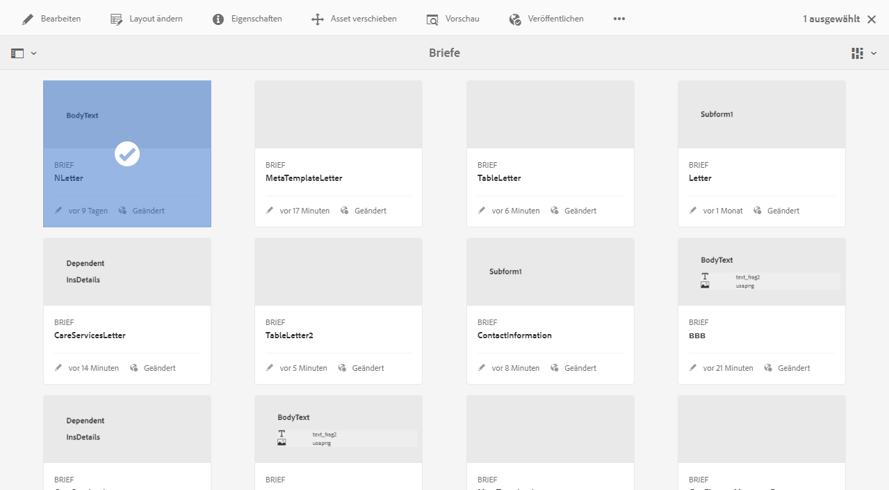

   Brief auswählen

1. Wählen Sie für einen auf einem Datenwörterbuch basierenden Brief **Vorschau** > **Vorschau**. Oder wählen Sie für einen Brief, der nicht auf einem Datenwörterbuch basiert, **Vorschau**. Sie können auch den Mauszeiger über einen Brief bewegen (ohne ihn auszuwählen) und auf das Symbol Briefvorschau tippen, um eine Vorschau anzuzeigen.

   >[!NOTE]
   >
   >Wenn dem Brief kein Datenwörterbuch zugeordnet ist, wird die Briefvorschau geöffnet. Wenn der Brief jedoch auf einem Datenwörterbuch basiert, zeigt Correspondence Management im Menü „Vorschau“ die Optionen „Vorschau“ und „Benutzerdefiniert“ an, zwischen denen Sie wählen können. Sie können auch Testdaten mit einem Datenwörterbuch verknüpfen. Wenn [Testdaten mit dem Datenwörterbuch verbunden sind](/help/forms/using/data-dictionary.md#p-working-with-test-data-p), wird bei Auswahl der Option „Vorschau“ die normale Vorschau, ausgefüllt mit den Testdaten, angezeigt.

1. Damit Sie eine Korrespondenz während der Vorschau rendern können, sollten Sie entweder ein Administrator oder Teil einer der folgenden Gruppen sein:

   * forms-users (zur Vorschau auf der Autoreninstanz)
   * cm-agent-users (für Rendering auf Veröffentlichungsinstanz)

   Wenn Sie nicht über die erforderlichen Berechtigungen verfügen, bitten Sie den Administrator um den entsprechenden Zugriff. Weitere Informationen zum Erstellen und Hinzufügen von Benutzern zu Gruppen finden Sie unter [Hinzufügen von Benutzern oder Gruppen zu einer Gruppe](/help/sites-administering/security.md). Wenn Sie versuchen, ohne die entsprechende Berechtigung eine Korrespondenz zu rendern, wird die Fehlerseite 404 angezeigt.

1. Wenn Sie **Vorschau** > **Benutzerdefiniert** wählen, wird ein Dialogfeld geöffnet. Wählen Sie in diesem Dialogfeld eine dem Datenwörterbuch entsprechende Dateidatei für die Vorschau des Briefs und dann **Vorschau**. Eine Datendatei wird basierend auf einem Datenwörterbuch für einen bestimmten Brief erstellt: Weitere Informationen zur Datendatei finden Sie unter [Datenwörterbuch](/help/forms/using/data-dictionary.md#p-working-with-test-data-p).

   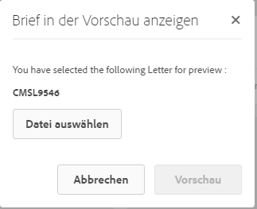

1. Die HTML-Vorschau des Briefs (Vorschau für Formulare auf Mobilgeräten) wird geöffnet, wobei die Registerkarte „Daten“ standardmäßig aktiv ist.

   Weitere Informationen zu Formularen auf Mobilgeräten und den hierfür unterstützen Funktionen finden Sie unter[ Funktionsunterschiede zwischen Mobile Forms und PDF-Formularen](https://helpx.adobe.com/de/livecycle/help/mobile-forms/feature-differentiation-mobile-forms-pdf.html).

   Es gibt drei Registerkarten: Daten, Inhalt und Anlagen. Wenn keine Datenelemente (Platzhaltervariablen und Layout-Felder) vorhanden sind, wird der Brief direkt in der Inhaltsansicht geöffnet. Die Registerkarte &quot;Anlagen&quot;ist nur verfügbar, wenn Anlagen vorhanden sind oder der Bibliothekszugriff aktiviert ist.

   >[!NOTE]
   >
   >Weitere Informationen zum Umschalten der Briefvorschau zwischen HTML- und PDF-Darstellungsmodus finden Sie unter [Ändern des Darstellungsmodus des Briefs](#changerenditionmode). Weitere Informationen zur PDF-Unterstützung in Correspondence Management und AEM finden Sie unter [Auslauf der Unterstützung für das NPAPI-Browser-Plug-in und seine Auswirkungen](https://helpx.adobe.com/de/aem-forms/kb/discontinuation-of-npapi-plugins-impact-on-aem-forms.html) und [PDF-Formulare in HTML5-Formulare](https://helpx.adobe.com/aem-forms/kb/pdf-forms-to-html5-forms.html).

### Daten eingeben {#enterdata}

Füllen Sie auf der Registerkarte Daten die verfügbaren Layout-Felder und Platzhalter aus.

1. Geben Sie die Daten- und Inhaltsvariablen nach Bedarf in die Felder ein. Füllen Sie alle erforderlichen Felder (mit einem Sternchen (*) gekennzeichnet) aus, um die Schaltfläche **Senden** zu aktivieren.

   Tippen Sie auf einen Datenfeldwert in der HTML-Briefvorschau, um das entsprechende Datenfeld in der Registerkarte „Daten“ zu markieren.

   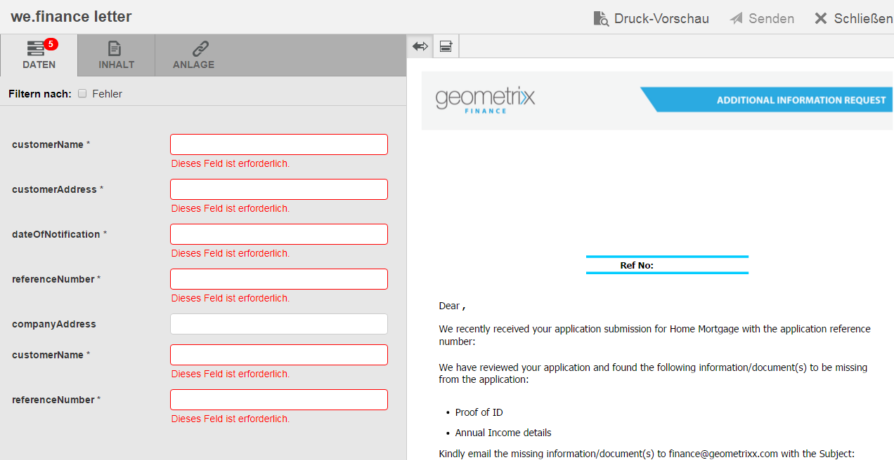 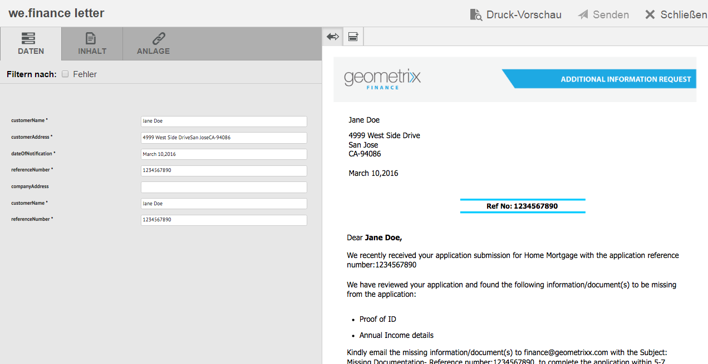

### Inhalt verwalten {#managecontent}

Verwalten Sie auf der Registerkarte &quot;Inhalt&quot;den Inhalt wie Dokumentfragmente und Inhaltsvariablen im Brief.

1. Wählen Sie **Inhalt**. Correspondence Management zeigt die Registerkarte „Inhalt“ des Briefes an.

   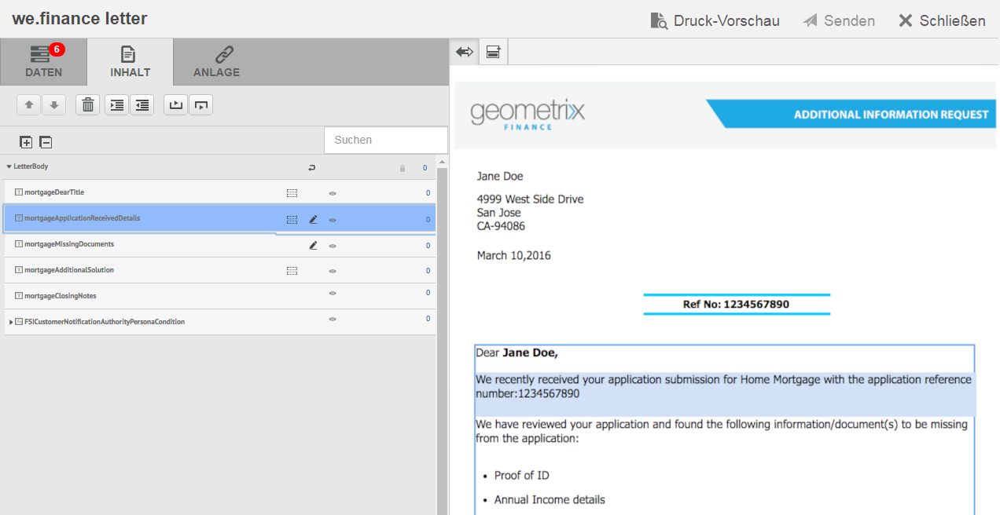

1. Bearbeiten Sie die Inhaltsmodule nach Bedarf auf der Registerkarte Inhalt . Um den Fokus auf das relevante Inhaltsmodul in der Inhaltshierarchie zu lenken, können Sie entweder auf die entsprechende Zeile oder den entsprechenden Absatz in der Briefvorschau tippen oder direkt auf das Inhaltsmodul in der Inhaltshierarchie tippen.

   Beispielsweise wird in der unten gezeigten Abbildung die Zeile &quot;Wir haben geprüft...&quot;ausgewählt und das relevante Inhaltsmodul auf der Registerkarte &quot;Inhalt&quot;ausgewählt.

   

   Auf der Registerkarte „Inhalt“ oder „Daten“ können Sie durch Tippen auf „Ausgewählte Module hervorheben“ () oben links in der HTML-Briefvorschau die Funktionalität deaktivieren oder aktivieren, zum Inhalts-/Datenmodul zu wechseln, wenn der entsprechende Text, Absatz oder das Datenfeld in der Briefvorschau ausgewählt wird.

   Weitere Informationen zu Aktionen, die für verschiedene Module in der Benutzeroberfläche „Korrespondenz erstellen“ verfügbar sind, finden Sie unter [In der Benutzeroberfläche „Korrespondenz erstellen“ verfügbare Vorgehensweisen und Informationen](create-letter.md).

1. Verwenden Sie das Feld Suchen , um nach Inhaltsmodulen zu suchen. Geben Sie den vollständigen oder teilweisen Namen oder Titel des Inhaltsmoduls ein, um in der Korrespondenz danach zu suchen.
1. Tippen Sie auf das Symbol „Anzeigen“ () vor einer Liste, einem Text, einer Bedingung oder einem Zielbereich, um diese(n) in einem Brief zu zeigen oder auszublenden.
1. Um ein Inline- oder editierbares Textmodul zu bearbeiten, tippen Sie auf das entsprechende Symbol zum **Bearbeiten** () oder doppelklicken Sie auf das entsprechende Textmodul in der Briefvorschau.

   Das System zeigt einen Texteditor zum Bearbeiten und Formatieren des Textes an.

   Die Standard-Rechtschreibprüfung in Ihrem Browser überprüft die Rechtschreibung im Texteditor. Um die Rechtschreibprüfung und Grammatikprüfung zu verwalten, können Sie die Rechtschreibprüfungseinstellungen Ihres Browsers bearbeiten oder Browser-Plugins/-Addons installieren, um Rechtschreibung und Grammatik zu überprüfen.

   Sie können die verschiedenen Tastaturbefehle im Texteditor verwenden, um Text zu verwalten, zu bearbeiten und zu formatieren. Weitere Informationen zu den Tastaturbefehlen für den [Texteditor](/help/forms/using/keyboard-shortcuts.md#correspondence-management) finden Sie unter „Correspondence Management-Tastaturbefehle“.

   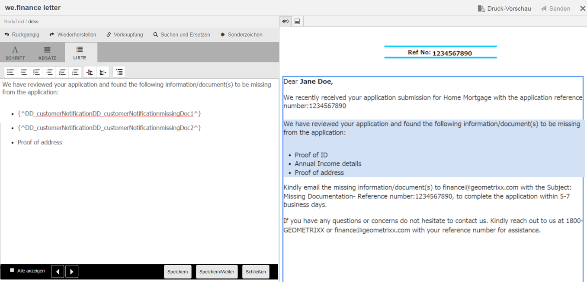

   Sie können einen oder mehrere Absätze von Text wiederverwenden, die in einer anderen Anwendung des Dokuments vorhanden sind. Sie können Text direkt kopieren und einfügen, z. B. aus Microsoft Word, HTML-Seiten oder einer anderen Anwendung.

   Sie können einen oder mehrere Textabsätze in ein bearbeitbares Textmodul kopieren und einfügen. Sie können beispielsweise ein MS Word-Dokument mit einer Liste mit Aufzählungszeichen für zulässige Aufenthaltsnachweise wie folgt haben:

   

   Sie können den Text direkt aus dem MS Word-Dokument in ein bearbeitbares Textmodul kopieren. Die Formatierung wie Liste mit Aufzählungszeichen, Schriftart und Textfarbe wird im Textmodul beibehalten.

   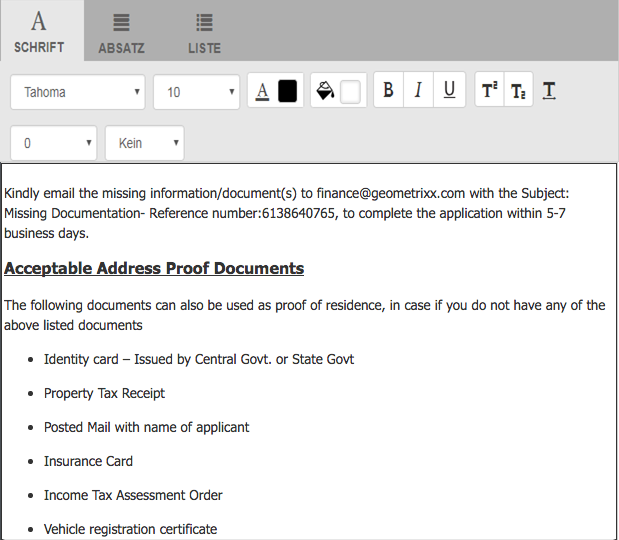

   >[!NOTE]
   >
   >Die Formatierung des eingefügten Textes hat jedoch einige [Einschränkungen](https://helpx.adobe.com/de/aem-forms/kb/cm-copy-paste-text-limitations.html).

   Sie können den Text und die Zahlen in Ihrem Brief mit der Tabulatortaste einrücken. Beispielsweise können Sie die Tabulatortaste verwenden, um mehrere Textspalten in einer Liste in einem tabellarischen Format auszurichten.

   

   Beispielsweise können Sie die Tabulatortaste verwenden, um mehrere Textspalten in einer Liste in einem tabellarischen Format auszurichten.

   >[!NOTE]
   >
   >Weitere Informationen zum Einrichten von Tabulatorabständen für Ihre Textmodule und Briefe finden Sie unter [Weitere Informationen zur Verwendung von Tabulatorabständen zum Anordnen von Text](https://helpx.adobe.com/de/aem-forms/kb/aem-forms-releases.html).

1. Fügen Sie bei Bedarf Sonderzeichen in die Korrespondenz ein. Beispielsweise können Sie über die Sonderzeichenpalette die folgenden Zeichen einfügen:

   * Währungssymbole wie €,￥ und £
   * Mathematische Symbole wie ∑, √, ∂ und ^
   * Satzzeichen wie „ und “

   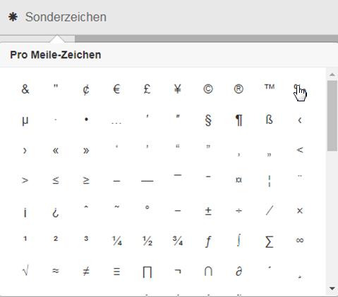

   Correspondence Management enthält integrierte Unterstützung für 210 Sonderzeichen. Der Administrator kann [Unterstützung für mehr/benutzerdefinierte Sonderzeichen durch Anpassung hinzufügen](/help/forms/using/custom-special-characters.md).

1. Um Teile eines Textes in einem bearbeitbaren Inline-Modul hervorzuheben, wählen Sie den Text aus und tippen Sie auf „Hervorhebungsfarbe“.

   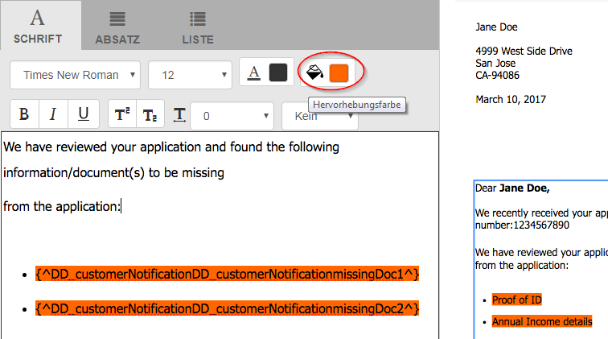

   Sie können entweder direkt auf eine Grundfarbe tippen **[A]** in der Palette &quot;Grundfarben&quot;angezeigt werden, oder tippen Sie auf **Auswählen** nach Verwendung des Reglers **[B]** , um die gewünschte Farbschattierung auszuwählen.

   Optional können Sie auch auf der Registerkarte Erweitert die gewünschte Farbe, Helligkeit und Sättigung auswählen **[C]** , um die genaue Farbe zu erstellen, und tippen Sie dann auf Auswählen **[D]** , um die Farbe anzuwenden und den Text hervorzuheben.

   

1. Nehmen Sie die benötigten Änderungen an Inhalt und Format vor und tippen Sie auf **Speichern**. Durch Tippen auf  wechseln Sie zwischen den bearbeitbaren Textmodulen, durch Tippen auf **Speichern und weiter** speichern Sie die Änderungen und wechseln zum nächsten bearbeitbaren Textmodul.
1. Das System zeigt auch die nicht ausgefüllten Variablen für jeden der Zweige an. Wenn keine nicht ausgefüllten Variablen vorhanden sind, werden nicht ausgefüllte Variablen als 0 angezeigt. Wenn eine nicht ausgefüllte Variable vorhanden ist, können Sie auf einen Zweig tippen, um ihn zu erweitern und die nicht ausgefüllte Variable zu finden. Verwenden Sie die Symbolleiste „Inhalt“, um Inhalte zu löschen, den Einzug eines Inhalts zu vergrößern oder zu verringern und Seitenumbrüche vor oder nach einem Inhalt einzufügen.

   Sie können Seitenumbrüche sowohl vor als auch nach den Datenmodulen einfügen, selbst wenn sie Teil von Listen und Bedingungen sind.

1. Tippen Sie auf „Inhaltsvariable öffnen/schließen“ (), um die Inhaltsvariablen zu öffnen und sie entsprechend zu füllen.
1. Nachdem Sie die nicht ausgefüllte Variable korrekt ausgefüllt haben, wird die Anzahl der nicht ausgefüllten Variablen auf „0“ eingestellt.

   In der Benutzeroberfläche „Korrespondenz erstellen“ wird die Anzahl nicht ausgefüllter Variablen auf jeder Ebene der Hierarchie der Module angezeigt, die mindestens eine Variable enthalten. Wenn ein Modul nicht ausgefüllte Variablen enthält, wird die Anzahl auf Variablen-, Modul-, Zielbereichs- und Briefvorlagenebene angezeigt.

   Die Anzahl der nicht ausgefüllten Variablen umfasst:

   * Nur ungeschützte Datenwörterbücher- und Platzhaltervariablen. Die Variablenanzahl umfasst keine Layout- oder geschützten Datenwörterbuchvariablen.
   * Obligatorische Felder.
   * Layout-Felder, wenn sie obligatorisch und an den Benutzer gebunden sind.
   * Nur eindeutige Variableninstanzen. Wenn ein Modul, ein Zielbereich oder eine Briefvorlage zwei oder mehr Instanzen derselben Variablen enthält, wird die Anzahl als 1 (1) angezeigt. Für jede Instanz wird die Anzahl jedoch als 1 angezeigt.

   Die Anzahl der nicht ausgefüllten Variablen umfasst keine deaktivierten Module. Wenn ein Modul in einer Briefvorlage, aber nicht im Brief enthalten ist, wird die Anzahl der nicht ausgefüllten Variablen in diesem Modul nicht angezeigt.

   Für den Zielbereich, das Modul und die Variable wird die Anzahl rechts neben jedem Objekt in der Briefvorlage angezeigt. Für die gesamte Vorlage wird die Anzahl jedoch in der Statusleiste von „Korrespondenz erstellen“ angezeigt.

   Die Module in einer Briefvorlage zeigen die Anzahl nicht ausgefüllter Variable an wie folgt:

   * **Text**: Zeigt die Anzahl der eindeutigen nicht ausgefüllten Platzhaltervariablen und Datenwörterbuchelemente an, die im Textmodul enthalten sind.
   * **Bedingung**: Zeigt die Anzahl der eindeutigen nicht ausgefüllten Bedingungsvariablen an, die in der Bedingung enthalten sind, und der Variablen, die in den resultierenden Modulen enthalten sind.
   * **Liste**: Zeigt die Anzahl aller eindeutigen nicht ausgefüllten Variablen an, die in den Modulen enthalten sind, die der Liste zugewiesen wurden.
   * **Zielbereich**: Gibt die Anzahl aller eindeutigen nicht ausgefüllten Variablen an, die in den Modulen enthalten sind, die dem Zielbereich zugewiesen wurden.

   Beachten Sie Folgendes zu Variablen mit Standardwerten:

   * Ein boolesches Variablenfeld verwendet standardmäßig *false*. Die Variable wird jedoch als nicht ausgefüllt erfasst. Dies bedeutet, dass die Variablenanzahl alle booleschen Variablenfelder mit dem Wert *false* umfasst.
   * Ein numerisches Variablenfeld wird standardmäßig auf *0 (null)*. Die Variable wird jedoch als nicht ausgefüllt erfasst. Dies bedeutet, dass die Variablenanzahl alle numerischen Variablenfelder mit dem Wert *0 (Null)* umfasst.

#### Auf der Registerkarte &quot;Inhalt von Korrespondenz erstellen&quot;verfügbare Aktionen und Informationen {#actions-and-info-available-in-the-create-correspondence-content-tab}

**Zielbereich**

* Leere Linie einfügen: Fügt eine neue leere Linie ein.
* Inline-Text einfügen: Fügt neues Textmodul ein.
* Reihenfolge sperren (Info): Gibt an, dass die Reihenfolge der Inhalte nicht geändert werden kann.
* Nicht ausgefüllte Werte (Info): Gibt die Anzahl der nicht ausgefüllten Variablen im Zielbereich an.

**Modul**

* Auswahl (Augensymbol): Schließt Modul aus dem Brief ein bzw. schließt ihn aus.
* Aufzählungszeichen überspringen (gilt für Listenmodule und ihre untergeordneten Module): Überspringt Aufzählungszeichen in einem bestimmten Modul.
* Seitenumbruch vor (gilt für untergeordnete Module des Zielbereichs): Fügt Seitenumbruch vor dem -Modul ein.
* Seitenumbruch nach (anwendbar für untergeordnete Module des Zielbereichs): Fügt nach dem Modul einen Seitenumbruch ein.
* Nicht ausgefüllte Werte (Info): Gibt die Anzahl der nicht ausgefüllten Variablen im Zielbereich an.
* Bearbeiten (nur Textmodule): Öffnen Sie den Rich-Text-Editor zum Bearbeiten des Textmoduls.
* Datenbereich (Text- und Bedingungsmodule): Öffnen Sie alle Variablen des Moduls.

**Listenmodul**

* Leere Linie einfügen: Fügt eine neue leere Linie ein.
* Inhaltsbibliothek: Öffnet die Inhaltsbibliothek, um der Liste Module hinzuzufügen.
* Liste einrichten (nur verschachtelte Liste):
* Reihenfolge sperren (Info): Gibt an, dass die Reihenfolge der Listenelemente nicht geändert werden kann.

### Anlagen verwalten {#manage-attachments}

1. Wählen Sie **Anlagen**. Correspondence Management zeigt die verfügbaren Anhänge an, wie sie beim Erstellen der Briefvorlage eingerichtet wurden.
1. Sie können festlegen, dass keine Anlage zusammen mit dem Brief gesendet werden soll, indem Sie auf das Ansichtssymbol tippen. Sie können dann auf das Kreuz im Anhang tippen, um ihn aus dem Brief zu löschen. Für die beim Erstellen einer Briefvorlage als obligatorisch angegebenen Anlagen sind die Symbole &quot;Ansicht&quot;und &quot;Löschen&quot;deaktiviert.
1. Tippen Sie auf das Symbol „Bibliothekszugriff“ (), um auf die Inhaltsbibliothek zuzugreifen und DAM-Assets als Anhänge einzufügen.

   >[!NOTE]
   >
   >Das Symbol „Bibliothekszugriff“ ist nur verfügbar, wenn der Bibliothekszugriff beim Verfassen des Briefes aktiviert wurde.

1. Wenn die Reihenfolge der Anlagen beim Erstellen der Korrespondenz nicht gesperrt war, können Sie die Reihenfolge der Anlagen neu anordnen, indem Sie eine Anlage auswählen und auf die Pfeile nach unten oder nach oben tippen.

   Weitere Informationen finden Sie unter [Anlagenübermittlung](#attachmentdelivery).

### Inhalt in der Vorschau verwalten und Brief senden {#manage-content-in-preview-and-submit-the-letter}

Sie können Layout- und inhaltsbezogene Änderungen vornehmen, um sicherzustellen, dass der Brief Ihren Vorstellungen entspricht und an die verschiedenen Nachbearbeitungsprozesse gesendet wird.

1. Um den gesamten bearbeitbaren Inhalt des Brief zu markieren, tippen Sie auf **Bearbeitbare Bereiche markieren**.

   Die bearbeitbaren Inhalte des Briefs werden mit grauem Hintergrund markiert.

   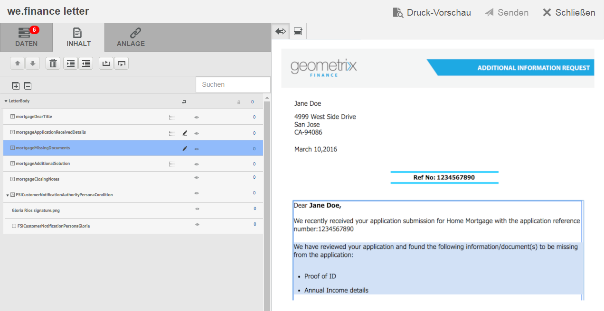

1. Bearbeiten Sie die Inhaltsmodule nach Bedarf auf der Registerkarte Inhalt . Um den Fokus auf das relevante Inhaltsmodul in der Inhaltshierarchie zu lenken, können Sie entweder auf die entsprechende Zeile oder den entsprechenden Absatz in der Briefvorschau tippen oder direkt auf das Inhaltsmodul in der Inhaltshierarchie tippen.

   Beispielsweise die Zeile &quot;Um uns Zugriff zu gewähren...&quot; in der unten stehenden Grafik ausgewählt ist und das entsprechende Inhaltsmodul auf der Registerkarte Inhalt ausgewählt ist.

   Durch Tippen auf „Ausgewählte Module im Inhalt hervorheben“ () können Sie eine Funktion aktivieren oder deaktivieren, die bewirkt, dass beim Tippen auf den relevanten Text oder Absatz bzw. das Datenfeld in der Briefvorschau das dazugehörige Inhaltsmodul auf der Registerkarte „Inhalt“ markiert wird.

   Weitere Informationen zu Aktionen, die für verschiedene Module in der Benutzeroberfläche „Korrespondenz erstellen“ verfügbar sind, finden Sie unter [In der Benutzeroberfläche „Korrespondenz erstellen“ verfügbare Vorgehensweisen und Informationen](create-letter.md).

1. Um dem Brief einen Seitenumbruch hinzuzufügen, tippen Sie auf die Stelle, an der Sie den Seitenumbruch einfügen möchten, und wählen Sie „Seitenumbruch vor“ oder „Seitenumbruch nach“ ().

   Ein Platzhalter für einen expliziten Seitenumbruch wird in den Brief eingefügt. Informationen dazu, wie sich ein expliziter Seitenumbruch auf den Brief auswirkt, finden Sie in der reduzierten PDF-Vorschau.

   >[!NOTE]
   >
   >Da Formulare auf Mobilgeräten Seitenumbrüche nicht unterstützen, werden Kopf- und Fußzeilen nur einmal angezeigt. Sie können jedoch explizit festlegen, dass Kopf- und Fußzeilen im Layout (pro Seite) in der Mobile Forms-Vorschau angezeigt werden. Außerdem werden leere Seiten im Brief, falls vorhanden, nicht in der Mobile Forms-Vorschau angezeigt.

   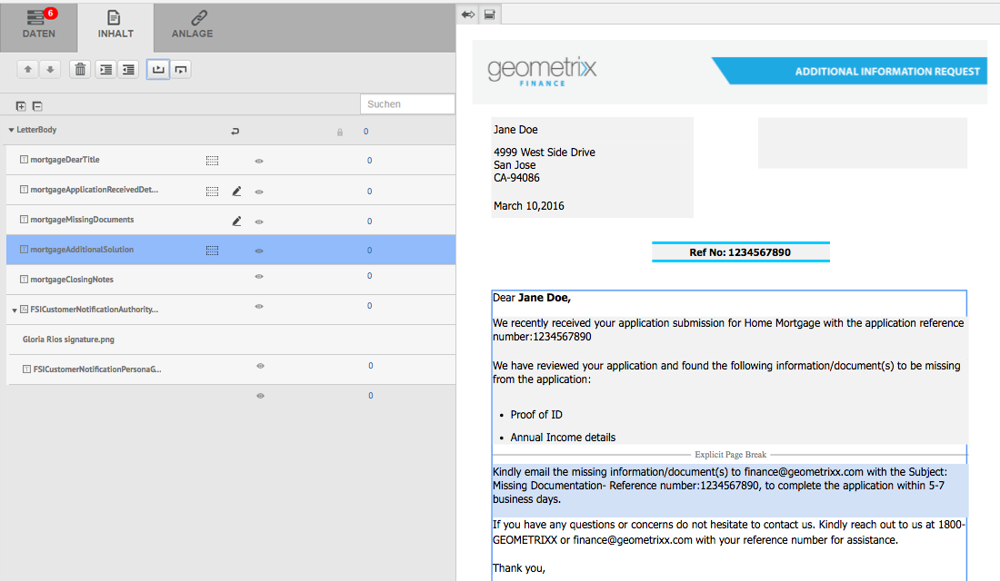

1. Um den Brief als Entwurf zu speichern, an dem Sie später weiter arbeiten können, tippen Sie auf Als Entwurf speichern . Um diese Option verwenden zu können, muss Ihr Brief [veröffentlicht](/help/forms/using/publishing-unpublishing-forms.md#publishanasset). Weitere Informationen finden Sie unter Entwurfsinstanz unter [Speichern von Entwürfen und Senden von Briefinstanzen](#savingdrafts).

   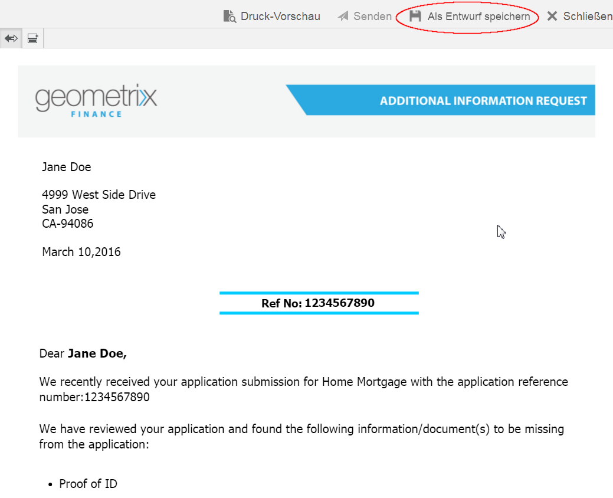

   Das Dialogfeld Entwurfsbriefname wird mit der Briefinstanz-ID angezeigt. Sie können optional diese ID bearbeiten. Notieren Sie sich die Brief-ID und tippen Sie dann auf **Fertig**. Sie können diese ID später für [den Briefentwurf neu laden](submit-letter-topostprocess.md#reloaddraft).

1. Um den Brief als reduzierte PDF-Datei mit Layout und Seitenumbrüchen exakt so anzuzeigen, wie er gesendet werden wird, tippen Sie auf „Vorschau“ ().

   Der Brief erscheint als reduzierte PDF. Die reduzierte PDF ist die genaue Darstellung des Briefs, wie er mit den richtigen Schriftarten, Umbrüchen und dem Layout des Briefs gesendet wird.

   >[!NOTE]
   >
   >Wenn Sie Mozilla Firefox und den Wiedergabetyp HTML verwenden, stellen Sie sicher, dass Sie das native Browser-Plug-in und nicht das Acrobat-Plug-in verwenden, um den Brief als reduzierte PDF in der Vorschau anzuzeigen. Um das native Browser-Plug-in auszuwählen, gehen Sie zu den Einstellungen von Mozilla Firefox und wählen Sie für die PDF des Inhaltstyps Vorschau in Firefox.

1. Wenn die reduzierte PDF-Vorschau Ihren Vorstellungen entspricht, tippen Sie auf **Senden**, um den Brief zu senden. Wenn Sie Änderungen am Brief vornehmen möchten, tippen Sie stattdessen auf **Vorschau beenden**, um zur Vorschau des Briefs in der Benutzeroberfläche „Korrespondenz erstellen“ zurückzukehren und dort die Änderungen vorzunehmen. Wenn Sie auf „Senden“ tippen, wird die Instanz „Brief senden“ erstellt, falls die Konfiguration „Briefinstanz verwalten“ in der Instanz „Veröffentlichen“ aktiviert ist.

   Weitere Informationen finden Sie unter Entwurfsinstanz unter Speichern von Entwürfen und Senden von Briefinstanzen.

   Sie können den Brief auch als Entwurf speichern, um später Änderungen am Brief vorzunehmen.

   Nachdem Sie die erforderlichen Änderungen vorgenommen haben, können Sie den Brief entweder über die HTML5-Vorschau senden oder erneut auf Vorschau tippen, um die reduzierte PDF-Ausgabe zu überprüfen.

   Weitere Informationen zu den Unterschieden zwischen HTML5-Formularen und PDF-Formularen finden Sie unter [Funktionsunterschiede zwischen HTML5-Formularen und PDF-Formularen](/help/forms/using/feature-differentiation-html5-forms-pdf-forms.md).

## Speichern von Entwürfen und Senden von Briefinstanzen {#savingdrafts}

Wenn ein Brief in der Benutzeroberfläche „Korrespondenz erstellen“ gerendert wird, können Sie den Brief so speichern, wie er angezeigt wird.

Es gibt zwei Arten von Briefinstanzen, die gespeichert werden können: Entwurfsinstanz und Sendeinstanz.

* **Entwurfsinstanz**: Die Entwurfsinstanz erfasst den aktuellen Status des Briefs, den Sie in der Vorschau anzeigen. Um eine Entwurfsinstanz zu speichern, stellen Sie zunächst sicher, dass der Brief und alle Assets, auf die der Brief verweist, den Status Veröffentlicht aufweisen. Weitere Informationen zum Veröffentlichen eines Briefs finden Sie unter[ Veröffentlichen von Assets](/help/forms/using/publishing-unpublishing-forms.md#publishanasset). Sie müssen einen Brief veröffentlichen, bevor Sie ihn als Entwurf speichern können, da Sie beim Veröffentlichen eines Briefs eine Version des Briefs, der abhängigen Assets und Daten erstellen. Die veröffentlichte Version eines Briefs kann nicht von Ihnen oder einem anderen Benutzer bearbeitet werden und kann später ohne unerwartete Abweichungen von der veröffentlichten Version wiederhergestellt werden. Sie können zu einem späteren Zeitpunkt zu dieser Instanz zurückkehren und dort fortfahren, wo Sie die Instanz verlassen haben.

* **Sendeinstanz**: Übermittlungsinstanzen erfassen den Status des Briefs beim Senden. Die Sendeinstanz speichert den PDF-Status der Briefinstanz, nachdem sie zusammen mit den vom Benutzer in der Benutzeroberfläche „Korrespondenz erstellen“ eingegebenen Daten nachbearbeitet wurde.

Solche Instanzen können nur gespeichert werden, wenn der Brief in der Veröffentlichungsinstanz angezeigt wird. Standardmäßig ist das Speichern von Instanzen deaktiviert. Um das Speichern von Briefinstanzen zu aktivieren, führen Sie die folgenden Schritte aus.

1. Öffnen Sie in AEM die Adobe Experience Manager Web Console-Konfiguration für Ihren Server mit der folgenden URL: https://&lt;server>:&lt;port>/&lt;contextpath>/system/console/configMgr
1. Suchen Sie nach **[!UICONTROL Correspondence Management-Konfigurationen]** und klicken Sie darauf.
1. Überprüfen Sie die Konfiguration **[!UICONTROL Briefinstanzen im Veröffentlichungsmodus verwalten]** und klicken Sie dann auf **[!UICONTROL Speichern]**.

Wenn das Speichern von Briefinstanzen aktiviert ist, können Sie auswählen, wo die Briefinstanzen gespeichert werden sollen. Es gibt zwei Optionen zum Speichern der Briefinstanzen: Lokales Speichern oder Remote Speichern.

### Lokales Speichern {#local-save}

Briefinstanzen werden in der Veröffentlichungsinstanz gespeichert und in der Autorinstanz rückwärtsrepliziert.

### Remote Speichern {#remote-save}

Diese Option ist für Personen vorgesehen, die bezüglich des Speicherns von Daten in Veröffentlichungsinstanzen haben, die sich normalerweise außerhalb der Firewall des Unternehmens befinden. Wenn das Remote-Speichern aktiviert ist, werden die Briefinstanzen nicht in der Veröffentlichungsinstanz gespeichert, sondern remote in dem Verarbeitungsautor gespeichert, der über die LiveCycle Client SDK-Konfigurationen angegeben wurde.

#### Remote Speichern aktivieren {#enable-remote-save}

1. Öffnen Sie in AEM die Adobe Experience Manager Web Console-Konfiguration für Ihren Server mit der folgenden URL: `https://<server>:<port>/<contextpath>/system/console/configMgr`
1. Suchen Sie nach **[!UICONTROL Correspondence Management-Konfigurationen]** und klicken Sie darauf.
1. Suchen Sie die Konfiguration **[!UICONTROL Remote Speichern]**, überprüfen Sie sie und klicken Sie auf **[!UICONTROL Speichern]**.

#### Angeben der Einstellungen für Prozessautor {#specify-processing-author-settings}

1. Öffnen Sie in AEM die Adobe Experience Manager Web Console-Konfiguration für Ihren Server mit der folgenden URL: `https://<server>:<port>/<contextpath>/system/console/configMgr`

   

1. Suchen Sie auf dieser Seite Adobe LiveCycle Client SDK-Konfiguration und erweitern Sie sie durch Klicken auf.

1. Geben Sie in im Feld für die Verarbeitung der Server-URL den Namen Ihres LiveCycle-Servers sowie die Anmeldeinformationen ein und klicken Sie dann auf **Speichern**.

   

1. Legen Sie bei Bedarf den Benutzernamen und das Kennwort fest, mit dem Sie auf den Server zugreifen möchten.

#### Anlagenübermittlung {#attachmentdelivery}

* Die Briefanlagen sind verfügbare Nachbearbeitungen in der PDF-Datei, die nach der Briefsendung erstellt wird.
* Wenn der Brief mit serverseitigen APIs als interaktive oder nicht interaktive PDF gerendert wird, enthält der gerenderte PDF Anlagen als PDF-Anhänge.
* Wenn ein mit einer Briefvorlage verknüpfter Nachbearbeitungsprozess im Rahmen der Vorgänge &quot;Senden&quot;oder &quot;Korrespondenz abschließen&quot;mithilfe der Benutzeroberfläche &quot;Korrespondenz erstellen&quot;geladen wird, werden Anlagen als Liste übergeben&lt;com.adobe.idp.document> in AttachmentDocs -Parameter.
* Vordefinierte Übermittlungsmechanismen wie E-Mail und Drucken übermitteln Anhänge zusammen mit der PDF der generierten Korrespondenz.

## Darstellungsmodi der Briefvorschau: Vorschau für Mobile Forms und PDF {#rendition-modes-of-letter-preview-mobile-forms-preview-and-pdf-preview}

AEM Forms Correspondence Management zeigt einen Brief als HTML in der Benutzeroberfläche &quot;Korrespondenz erstellen&quot;an. Correspondence Management unterstützt jedoch weiterhin die Wiederherstellung der PDF-Vorschau anstelle der HTML-Vorschau. Weitere Informationen zum Wechseln zwischen HTML- und PDF-Modus für die Vorschau finden Sie unter [Ändern des Darstellungsmodus des Briefs](#changerenditionmode).

Die folgenden Vorteile und Funktionen stehen jeweils bei der HTML- und PDF-Vorschau zur Verfügung.

**Vorteile der mobilen Formulare/HTML-Vorschau**

* **Tippen Sie auf einen Datenfeldwert, um das entsprechende Datenfeld hervorzuheben.**: In der Benutzeroberfläche &quot;Korrespondenz erstellen&quot;können Sie auf einen Datenfeldwert im Brief tippen, um das entsprechende Datenfeld auf der Registerkarte &quot;Daten&quot;zu markieren. Weitere Informationen finden Sie unter [Daten eingeben](#enterdata).

* **Browserunterstützung**: Browser nehmen allmählich die Unterstützung für NPAPI zurück, was sich auf die PDF-Vorschau von Briefen auswirkt. Die Vorschau von Briefen in HTML/Mobile Forms ist davon nicht betroffen.
* **Markieren bearbeitbarer Inhalte in einem Brief**: In der Benutzeroberfläche &quot;Korrespondenz erstellen&quot;können Sie auf Bearbeitbare Inhalte markieren tippen, um den gesamten bearbeitbaren Inhalt in Grau zu markieren. Weitere Informationen finden Sie unter [Inhalt verwalten](#managecontent).

**Vorteile der PDF-Vorschau**

* **Seitenumbruch**: In der PDF-Vorschau eine Vorschau können Sie genau erkennen, wie die Seitenumbrüche im Brief sich auf dessen Ausgabe auswirken.
* **Abschließende Vorschau**: In der PDF-Vorschau können die genaue Formatierung und das Erscheinungsbild des Briefs für die Ausgabe angezeigt werden.

Weitere Informationen zur Skriptunterstützung in PDF-Formularen finden Sie unter [Skriptunterstützung](https://help.adobe.com/de_DE/livecycle/11.0/ScriptingSupport/index.html).

Weitere Informationen zur Skriptunterstützung in HTML5-Formularen finden Sie unter [Skriptunterstützung für HTML5-Formulare](/help/forms/using/scripting-support.md).

### Ändern des Ausgabedarstellungsmodus des Briefs {#changerenditionmode}

Standardmäßig verwendet die Benutzeroberfläche &quot;Korrespondenz erstellen&quot;das HTML oder mobile Formulare, um die Briefvorschau zu rendern. Die Mobile Forms-Vorschau kann in beliebigen Browsern problemlos gerendert werden, da sie das native Plugin des Browsers verwendet und daher keine zusätzlichen Plugins benötigt werden. Sie können zum Briefvorschaumodus PDF wechseln. Allerdings können aufgrund von Browserbeschränkungen Probleme bei verschiedenen Funktionen der interaktiven PDF-Vorschau des Briefs auftreten.

Weitere Informationen zur Browserkompatibilität bei der Briefvorschau finden Sie unter [Auslauf der Unterstützung für das NPAPI-Browser-Plugin und Auswirkungen](https://helpx.adobe.com/de/aem-forms/kb/discontinuation-of-npapi-plugins-impact-on-aem-forms.html).

Um den Vorschaumodus des Briefs zu ändern, führen Sie die folgenden Schritte aus:

1. Navigieren Sie zu `https://[system]:[port]/system/console/configMgr` und melden Sie sich nötigenfalls als Administrator an.
1. Navigieren Sie zu **[!UICONTROL Correspondence Management-Konfigurationen]** > **[!UICONTROL Wiedergabe-Typ]** und wählen Sie **HTML-Wiedergabe** (Standard) oder **PDF-Wiedergabe**.
1. Klicken Sie auf **[!UICONTROL Speichern]**.
