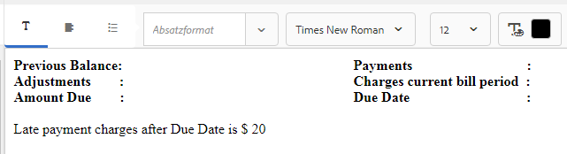

# Tutorial: Erstellen Sie Dokumentfragmente {#tutorial-create-document-fragments}

Erstellen Sie Dokumentfragmente für die interaktive Kommunikation

Dieses Tutorial ist ein Schritt in der Reihe [Erstellen Ihrer ersten interaktiven Kommunikation](/help/forms/using/create-your-first-interactive-communication.md). Es wird empfohlen, der Serie in chronologischer Reihenfolge zu folgen, um den vollständigen Anwendungsfall zu verstehen, auszuführen und zu demonstrieren.

Dokumentfragmente sind wiederverwendbare Komponenten einer Korrespondenz, die zum Erstellen einer interaktiven Kommunikation verwendet werden. Es gibt Dokumentfragmente der folgenden Typen:

* Text - Ein Text-Asset ist ein Inhaltselement, das aus einem oder mehreren Textabsätzen besteht. Ein Absatz kann statisch oder dynamisch sein.
* Liste - Liste ist eine Gruppe von Dokumentfragmenten, einschließlich Text, Listen, Bedingungen und Bildern.
* Bedingung - Mit Bedingungen können Sie festlegen, welche Inhalte in die interaktive Kommunikation basierend auf den vom Formulardatenmodell empfangenen Daten aufgenommen werden.

Dieses Tutorial führt Sie durch die Schritte zum Erstellen mehrerer Textdokumentfragmente basierend auf der Anatomie, die im Abschnitt [Interaktive Kommunikation planen](/help/forms/using/planning-interactive-communications.md) bereitgestellt wird. Am Ende dieser Schulung können Sie Folgendes:

* Erstellen Sie Dokumentfragmente
* Variablen erstellen
* Regeln erstellen und anwenden

Im Folgenden finden Sie eine Liste der Dokumentfragmente, die in diesem Lernprogramm erstellt werden:

* [Rechnungsdetails](/help/forms/using/create-document-fragments.md#step-create-bill-details-text-document-fragment)
* [Kundendetails](/help/forms/using/create-document-fragments.md#step-create-customer-details-text-document-fragment)
* [Rechnungszusammenfassung](/help/forms/using/create-document-fragments.md#step-create-bill-summary-text-document-fragment)
* [Zusammenfassung der Gebühren](/help/forms/using/create-document-fragments.md#step-create-summary-of-charges-text-document-fragment)

Jedes Dokumentfragment enthält Felder mit statischem Text, Daten, die vom Formulardatenmodell empfangen wurden, und Daten, die über die Agentenbenutzeroberfläche eingegeben wurden. Alle diese Felder wurden im Abschnitt [Interaktive Kommunikation planen](/help/forms/using/planning-interactive-communications.md) dargestellt.

Beim Erstellen von Dokumentfragmenten in diesem Tutorial werden Variablen für Felder erstellt, die Daten über die Agentenbenutzeroberfläche empfangen.

Verwenden Sie **FDM_Create_First_IC**, wie im Abschnitt [Formulardatenmodell](create-form-data-model-tutorial.md) erstellen beschrieben, als Formulardatenmodell zum Erstellen von Dokumentfragmenten in diesem Tutorial.

## Schritt 1: Erstellen Sie ein Textdokumentfragment für Rechnungsdetails {#step-create-bill-details-text-document-fragment}

Das Dokumentfragment „Rechnungsdetails“ enthält die folgenden Felder:

| Feld | Datenquelle |
|---|---|
| Rechnungsnr. | Agent-Benutzeroberfläche |
| Rechnungszeitraum | Agent-Benutzeroberfläche |
| Rechnungsdatum | Agent-Benutzeroberfläche |
| Ihr Plan | Formulardatenmodell |

Führen Sie die folgenden Schritte aus, um Variablen für Felder mit Agentenbenutzeroberfläche als Datenquelle zu erstellen, statischen Text zu erstellen und Formulardatenmodellelemente im Dokumentfragment zu verwenden:

1. Wählen Sie **[!UICONTROL Formulare]** > **[!UICONTROL Dokumentfragmente]**.

1. Wählen Sie **Erstellen** > **Text**.
1. Geben Sie die folgenden Daten an:

   1. Geben Sie **bill_details_first_ic** als Name im Feld **Titel** ein. Der Titel wird im Feld **Name** automatisch ausgefüllt.
   1. Wählen Sie **Formulardatenmodell** im Abschnitt **Datenmodell** aus.
   1. Wählen Sie **FDM_Create_First_IC** als Formulardatenmodell und tippen Sie auf **Auswählen**.
   1. Tippen Sie auf **Weiter**.

1. Wählen Sie die Registerkarte **Variablen** im linken Fensterbereich und tippen Sie auf **Erstellen**.
1. Im Abschnitt **Variable erstellen**:

   1. Geben Sie als Name der Variablen **Invoicenumber** ein.
   1. Wählen Sie als Typ **String**.
   1. Tippen Sie auf **Erstellen**.

   

   Wiederholen Sie die Schritte 4 und 5, um die folgenden Variablen zu erstellen:

   * Rechnungszeitraum: String-Typ
   * Rechnungsdatum: Datumstyp

   

1. Erstellen Sie statischen Text für die folgenden Felder mit dem rechten Fensterbereich:

   * Rechnungsnr.
   * Rechnungszeitraum
   * Rechnungsdatum
   * Ihr Plan

   

1. Setzen Sie den Cursor neben dem Feld **Rechnungsnr.** und doppelklicken Sie auf die Variable **InvoiceNumber** auf der Registerkarte **Variablen** im linken Fensterbereich.
1. Setzen Sie den Cursor neben dem Feld **Rechnungszeitraum** und doppelklicken Sie auf die Variable **Billperiod** .
1. Setzen Sie den Cursor neben dem Feld **Rechnungsdatum** und doppelklicken Sie auf die Variable **Rechnungsdatum** .
1. Wählen Sie die Registerkarte **Datenmodellobjekte** im linken Fensterbereich.
1. Setzen Sie den Cursor neben dem Feld **Ihr Plan** und doppelklicken Sie auf die Eigenschaft **customer** > **customerplan** .

   

1. Klicken Sie auf **Speichern**, um das Textdokumentfragment „Rechnungsdetails“ zu erstellen.

## Schritt 2: Erstellen Sie ein Textdokumentfragment für Kundendetails {#step-create-customer-details-text-document-fragment}

Das Dokumentfragment „Kundendetails“ enthält die folgenden Felder:

| Feld | Datenquelle |
|---|---|
| Name des Kunden | Formulardatenmodell |
| Adresse | Formulardatenmodell |
| Ort der Lieferung | Agent-Benutzeroberfläche |
| Status-Code | Agent-Benutzeroberfläche |
| Mobilfunknummer | Formulardatenmodell |
| Alternative Kontaktnummer | Formulardatenmodell |
| Verhältnis-Nummer | Formulardatenmodell |
| Anzahl von Verbindungen | Agent-Benutzeroberfläche |

Führen Sie die folgenden Schritte aus, um Variablen für Felder mit Agentenbenutzeroberfläche als Datenquelle zu erstellen, statischen Text zu erstellen und Formulardatenmodellelemente im Dokumentfragment zu verwenden:

1. Wählen Sie **[!UICONTROL Formulare]** > **[!UICONTROL Dokumentfragmente]**.
1. Wählen Sie **Erstellen** > **Text**.
1. Geben Sie die folgenden Daten an:

   1. Geben Sie **customer_details_first_ic** als Namen in das Feld **Titel** ein. Der Titel wird im Feld **Name** automatisch ausgefüllt.
   1. Wählen Sie **Formulardatenmodell** im Abschnitt **Datenmodell** aus.
   1. Wählen Sie **FDM_Create_First_IC** als Formulardatenmodell und tippen Sie auf **Auswählen**.
   1. Tippen Sie auf **Weiter**.

1. Wählen Sie die Registerkarte **Variablen** im linken Fensterbereich und tippen Sie auf **Erstellen**.
1. Im Abschnitt **Variable erstellen**:

   1. Geben Sie **Placesupply** als Namen der Variablen ein.
   1. Wählen Sie als Typ **String**.
   1. Tippen Sie auf **Erstellen**.

   Wiederholen Sie die Schritte 4 und 5, um die folgenden Variablen zu erstellen:

   * Statuscode: Zahlentyp
   * Anzahl von Verbindungen: Nummerntyp

1. Wählen Sie die Registerkarte **Datenmodellobjekte** aus, platzieren Sie den Cursor im rechten Bereich und doppelklicken Sie auf die Eigenschaft **customer** > **name** .
1. Drücken Sie die Eingabetaste , um den Cursor zur nächsten Zeile zu bewegen, und doppelklicken Sie auf die Eigenschaft **customer** > **address** .
1. Erstellen Sie statischen Text für die folgenden Felder mit dem rechten Fensterbereich:

   * Mobilfunknummer
   * Alternative Kontaktnummer
   * Ort der Lieferung
   * Verhältnis-Nummer
   * Status-Code
   * Anzahl von Verbindungen

   

1. Setzen Sie den Cursor neben dem Feld **Mobiltelefonnummer** und doppelklicken Sie auf die Eigenschaft **customer** > **mobilenum** .
1. Setzen Sie den Cursor neben dem Feld **Alternative Kontaktnummer** und doppelklicken Sie auf die Eigenschaft **customer** > **alternatemobilenumber** .
1. Setzen Sie den Cursor neben dem Feld **Relationship Number** und doppelklicken Sie auf die Eigenschaft **customer** > **relation** .
1. Wählen Sie den Tab **Variablen** aus, platzieren Sie den Cursor neben dem Feld **Ort des Angebots** und doppelklicken Sie auf die Variable **Placesupply** .
1. Setzen Sie den Cursor neben dem Feld **State Code** und doppelklicken Sie auf die Variable **Statecode** .
1. Setzen Sie den Cursor neben dem Feld **Anzahl der Verbindungen** und doppelklicken Sie auf die Variable **Numberconnections** .

   

1. Klicken Sie auf **Speichern** , um das Textdokumentfragment &quot;Kundendetails&quot;zu erstellen.

## Schritt 3: Erstellen Sie ein Textdokumentfragment für Rechnungszusammenfassung {#step-create-bill-summary-text-document-fragment}

Das Dokumentfragment &quot;Rechnungszusammenfassung&quot;enthält die folgenden Felder:

| Feld | Datenquelle |
|---|---|
| Vorheriger Saldo | Agent-Benutzeroberfläche |
| Zahlungen | Agent-Benutzeroberfläche |
| Anpassungen | Agent-Benutzeroberfläche |
| Gebühren des aktuellen Rechnungszeitraums | Formulardatenmodell |
| Fälliger Betrag | Agent-Benutzeroberfläche |
| Fälligkeitsdatum | Agent-Benutzeroberfläche |

Führen Sie die folgenden Schritte aus, um Variablen für Felder mit Agentenbenutzeroberfläche als Datenquelle zu erstellen, statischen Text zu erstellen und Formulardatenmodellelemente im Dokumentfragment zu verwenden:

1. Wählen Sie **[!UICONTROL Formulare]** > **[!UICONTROL Dokumentfragmente]**.
1. Wählen Sie **Erstellen** > **Text**.
1. Geben Sie die folgenden Daten an:

   1. Geben Sie **bill_summary_first_ic** als Namen in das Feld **Titel** ein. Der Titel wird im Feld **Name** automatisch ausgefüllt.
   1. Wählen Sie **Formulardatenmodell** im Abschnitt **Datenmodell** aus.
   1. Wählen Sie **FDM_Create_First_IC** als Formulardatenmodell und tippen Sie auf **Auswählen**.
   1. Tippen Sie auf **Weiter**.

1. Wählen Sie die Registerkarte **Variablen** im linken Fensterbereich und tippen Sie auf **Erstellen**.
1. Im Abschnitt **Variable erstellen**:

   1. Geben Sie **Previousbalance** als Namen der Variablen ein.
   1. Wählen Sie **Number** als Typ aus.
   1. Tippen Sie auf **Erstellen**.

   Wiederholen Sie die Schritte 4 und 5, um die folgenden Variablen zu erstellen:

   * Zahlungen: Zahlentyp
   * Anpassungen: Zahlentyp
   * Fälliger Betrag: Zahlentyp
   * Fälligkeitsdatum: Datumstyp

1. Erstellen Sie statischen Text für die folgenden Felder mit dem rechten Fensterbereich:

   * Vorheriger Saldo
   * Zahlungen
   * Anpassungen
   * Gebühren des aktuellen Rechnungszeitraums
   * Fälliger Betrag
   * Fälligkeitsdatum
   * Gebühren für verspätete Zahlungen nach Fälligkeitsdatum betragen 20 USD

   

1. Setzen Sie den Cursor neben dem Feld **Vorheriger Saldo** und doppelklicken Sie auf die Variable **Previousbalance** .
1. Setzen Sie den Cursor neben dem Feld **Zahlungen** und doppelklicken Sie auf die Variable **Zahlungen** .
1. Setzen Sie den Cursor neben dem Feld **Adjustments** und doppelklicken Sie auf die Variable **Adjustments** .
1. Setzen Sie den Cursor neben dem Feld **Fälliger Betrag** und doppelklicken Sie auf die Variable **Amountdue** .
1. Setzen Sie den Cursor neben dem Feld **Fälligkeitsdatum** und doppelklicken Sie auf die Variable **Duedate** .
1. Wählen Sie die Registerkarte **Datenmodellobjekte** aus, platzieren Sie den Cursor im rechten Bereich neben dem Feld **Gebühren für den aktuellen Rechnungszeitraum** und doppelklicken Sie auf die Eigenschaft **bills** > **usagecharges** .

   

1. Klicken Sie auf **Speichern** , um das Textdokumentfragment &quot;Kundendetails&quot;zu erstellen.

## Schritt 4: Erstellen Sie ein Textdokumentfragment für „Zusammenfassung der Kosten“{#step-create-summary-of-charges-text-document-fragment}

Das Dokumentfragment &quot;Zusammenfassung der Gebühren&quot;enthält die folgenden Felder:

| Feld | Datenquelle |
|---|---|
| Anrufgebühren | Formulardatenmodell |
| Gebühren für Telefonkonferenz | Formulardatenmodell |
| SMS-Gebühren | Formulardatenmodell |
| Mobile Internetgebühren | Formulardatenmodell |
| Nationale Roaming-Gebühren | Formulardatenmodell |
| Internationale Roaming-Gebühren | Formulardatenmodell |
| Mehrwert - Service-Gebühren | Formulardatenmodell |
| Gesamgebühren | Formulardatenmodell |
| GESAMT ZAHLBAR | Formulardatenmodell |

Führen Sie die folgenden Schritte aus, um statischen Text zu erstellen und Formulardatenmodellelemente im Dokumentfragment zu verwenden:

1. Wählen Sie **[!UICONTROL Formulare]** > **[!UICONTROL Dokumentfragmente]**.
1. Wählen Sie **Erstellen** > **Text**.
1. Geben Sie die folgenden Daten an:

   1. Geben Sie **summary_charges_first_ic** als Namen in das Feld **Titel** ein. Der Titel wird im Feld Name automatisch ausgefüllt.
   1. Wählen Sie **Formulardatenmodell** im Abschnitt **Datenmodell** aus.
   1. Wählen Sie **FDM_Create_First_IC** als Formulardatenmodell und tippen Sie auf **Auswählen**.
   1. Tippen Sie auf **Weiter**.

1. Erstellen Sie statischen Text für die folgenden Felder mit dem rechten Fensterbereich:

   * Anrufgebühren
   * Gebühren für Telefonkonferenz
   * SMS-Gebühren
   * Mobile Internetgebühren
   * Nationale Roaming-Gebühren
   * Internationale Roaming-Gebühren
   * Mehrwert - Service-Gebühren
   * Gesamgebühren
   * GESAMT ZAHLBAR

   

1. Wählen Sie die Registerkarte **Datenmodellobjekte**.
1. Setzen Sie den Cursor neben dem Feld **Aufrufgebühren** und doppelklicken Sie auf die Eigenschaft **Rechnungen** > **callcharges** .
1. Setzen Sie den Cursor neben dem Feld **Gebühren für Konferenzaufrufe** und doppelklicken Sie auf die Eigenschaft **Rechnungen** > **concallcharges** .
1. Setzen Sie den Cursor neben dem Feld **SMS-Gebühren** und doppelklicken Sie auf die Eigenschaft **bills** > **smscharges** .
1. Setzen Sie den Cursor neben dem Feld **Mobile Internet Charges** und doppelklicken Sie auf die Eigenschaft **bills** > **internetcharges** .
1. Setzen Sie den Cursor neben dem Feld **Nationale Roaming-Gebühren** und doppelklicken Sie auf die Eigenschaft **bills** > **roamingnational** .
1. Setzen Sie den Cursor neben dem Feld **Internationale Roaming-Gebühren** und doppelklicken Sie auf die Eigenschaft **bills** > **roamingintnl** .
1. Setzen Sie den Cursor neben dem Feld **Mehrwert - Service-Gebühren** und doppelklicken Sie auf die Eigenschaft **Rechnungen** > **vas** .
1. Setzen Sie den Cursor neben dem Feld **Gesamtkosten** und doppelklicken Sie auf die Eigenschaft **Rechnungen** > **usagecharges** .
1. Setzen Sie den Cursor neben dem Feld **TOTAL PAYABLE** und doppelklicken Sie auf die Eigenschaft **bills** > **usagecharges** .

   

1. Wählen Sie den Text in der Zeile **Mehrwert - Service-Gebühren** aus und tippen Sie auf **Regel erstellen** , um eine Bedingung zu erstellen, anhand derer die Zeile in der interaktiven Kommunikation angezeigt wird:
1. Im Popup-Fenster **Regel erstellen**:

   1. Wählen Sie **Datenmodelle und Variablen** und dann **Rechnungen** > **callcharges**.
   1. Wählen Sie **ist weniger als** als Betreiber.
   1. Wählen Sie **Anzahl** und geben Sie den Wert als **60** ein.

   Basierend auf dieser Bedingung wird die Zeile „Mehrwert - Service-Gebühren“ nur angezeigt, wenn der Wert für das Feld „Anrufkosten“ unter 60 liegt.

   

1. Klicken Sie auf **Speichern** , um das Textdokumentfragment &quot;Zusammenfassung der Gebühren&quot;zu erstellen.
