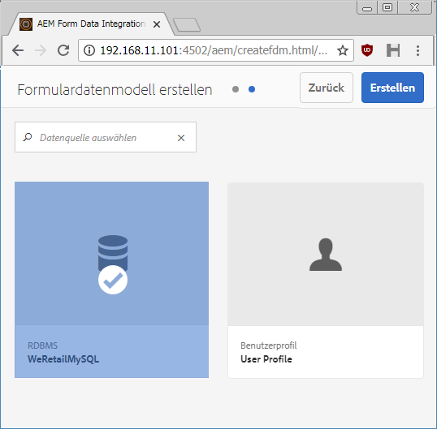
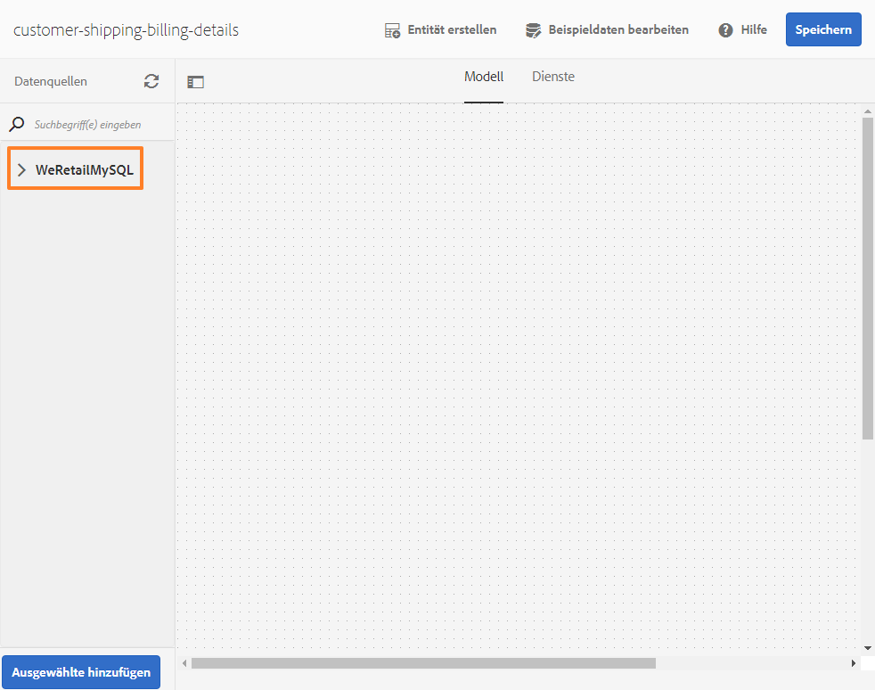
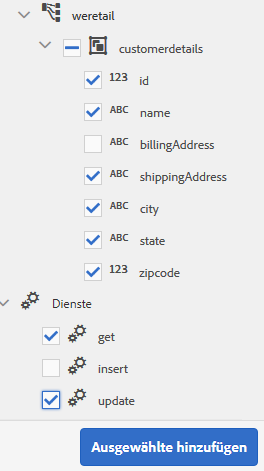
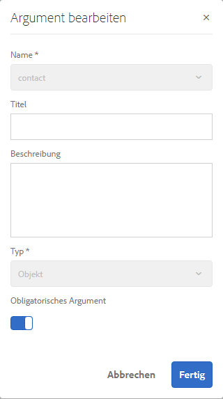
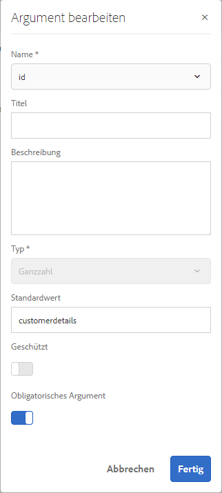
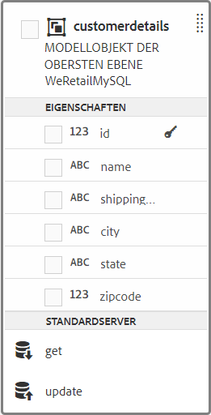
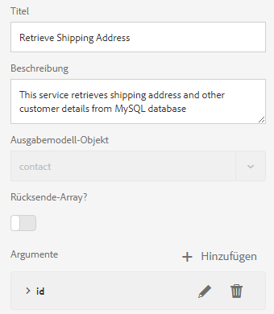
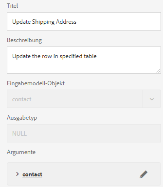
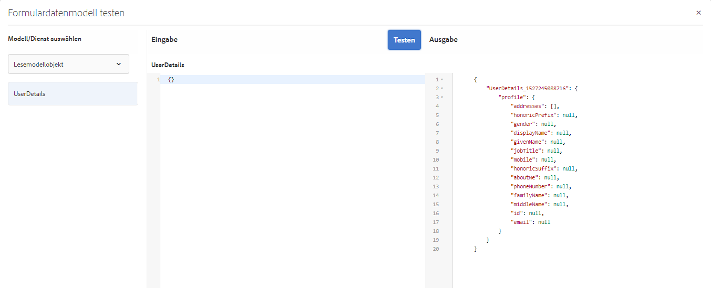
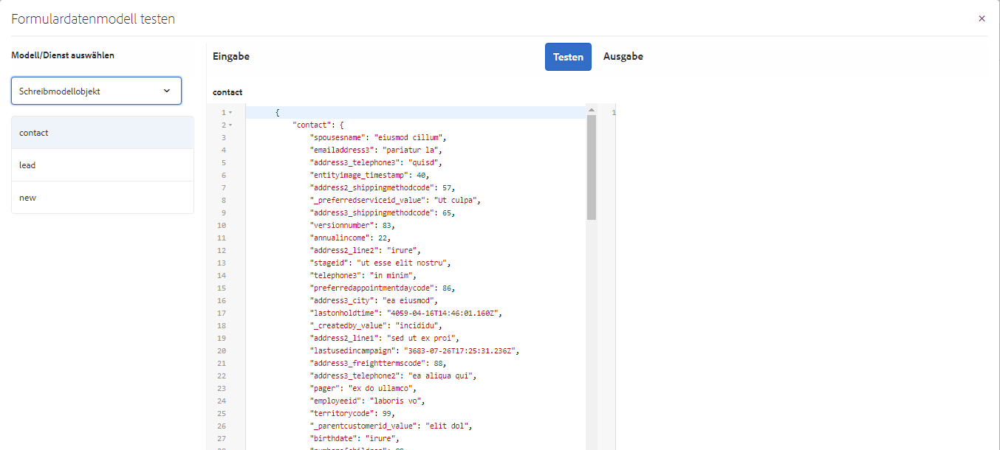

# Schulung: Formulardatenmodell erstellen  {#tutorial-create-form-data-model}

>[!CAUTION]
>
>AEM 6.4 hat das Ende der erweiterten Unterstützung erreicht und diese Dokumentation wird nicht mehr aktualisiert. Weitere Informationen finden Sie in unserer [technische Unterstützung](https://helpx.adobe.com/de/support/programs/eol-matrix.html). Unterstützte Versionen suchen [here](https://experienceleague.adobe.com/docs/?lang=de).

Dieses Tutorial ist ein Schritt im [Erstellen Ihres ersten adaptiven Formulars](/help/forms/using/create-your-first-adaptive-form.md) Reihe. Es wird empfohlen, der Reihe in chronologischer Reihenfolge zu folgen, um den vollständigen Anwendungsfall des Tutorials zu verstehen, auszuführen und zu demonstrieren.

## Über das Tutorial {#about-the-tutorial}

Mit dem AEM Forms-Datenintegrationsmodul können Sie ein Formulardatenmodell aus verschiedenen Backend-Datenquellen wie AEM-Benutzerprofil, RESTful-Webservices, SOAP-basierten Web-Services, OData-Services und relationalen Datenbanken erstellen. Sie können Datenmodellobjekte und Dienste in einem Formulardatenmodell konfigurieren und es mit einem adaptiven Formular verknüpfen. Adaptive Formularfelder sind an Datenmodellobjekteigenschaften gebunden. Mit den Diensten können Sie das adaptive Formular vorab ausfüllen und die gesendeten Formulardaten zurück in das Datenmodellobjekt schreiben.

Weitere Informationen zum Formulardatenmodell und zur Formulardatenintegration finden Sie unter [Datenintegration für AEM Forms](/help/forms/using/data-integration.md).

Dieses Tutorial führt Sie durch die Schritte zum Vorbereiten, Erstellen, Konfigurieren und Verknüpfen eines Formulardatenmodells mit einem adaptiven Formular. Am Ende dieses Tutorials können Sie Folgendes:

* [Konfigurieren der MySQL-Datenbank als Datenquelle](#config-database)
* [Erstellen eines Formulardatenmodells mit der MySQL-Datenbank](#create-fdm)
* [Konfigurieren eines Formulardatenmodells](#config-fdm)
* [Testen eines Formulardatenmodells](#test-fdm)

Das Formulardatenmodell sieht etwa wie folgt aus:

**A.** Konfigurierte Datenquellen **B.** Datenquellenschemata **C.** Verfügbare Services **D.** Datenmodellobjekte **E.** Konfigurierte Services

## Voraussetzungen {#prerequisites}

Bevor Sie beginnen, stellen Sie Folgendes sicher:

* MySQL-Datenbank mit Beispieldaten, wie im Abschnitt Voraussetzungen unter [Erstellen des ersten adaptiven Formulars](/help/forms/using/create-your-first-adaptive-form.md)
* OSGi-Bündel für MySQL JDBC-Treiber wie unter [Bündeln der JDBC-Datenbanktreiber](/help/sites-developing/jdbc.md#bundling-the-jdbc-database-driver) erläutert
* Adaptives Formular, wie in der ersten Schulung [Erstellen eines adaptives Formulars](/help/forms/using/create-adaptive-form.md) erläutert

## Schritt 1: MySQL-Datenbank als Datenquelle konfigurieren {#config-database}

Sie können verschiedene Arten von Datenquellen konfigurieren, um ein Formulardatenmodell zu erstellen. Für dieses Tutorial konfigurieren wir die MySQL-Datenbank, die Sie konfiguriert und mit Beispieldaten gefüllt haben. Informationen zu anderen unterstützten Datenquellen und deren Konfiguration finden Sie unter [AEM Forms-Datenintegration](/help/forms/using/data-integration.md).

Gehen Sie wie folgt vor, um Ihre MySQL-Datenbank zu konfigurieren:

1. Installieren Sie den JDBC-Treiber für die MySQL-Datenbank als OSGi-Bundle:

   1. Melden Sie sich bei der AEM Forms-Autoreninstanz als Administrator an und wechseln Sie zu den AEM-Webkonsolen-Paketen. Die Standard-URL lautet [http://localhost:4502/system/console/bundles](http://localhost:4502/system/console/bundles).

   1. Tippen Sie auf **Installieren/Aktualisieren**. Ein Dialogfeld **Pakete hochladen/installieren** wird angezeigt.

   1. Tippen Sie auf **Datei auswählen**, um das OSBi-Paket für den MySQL-JDBC-Treiber auszuwählen. Wählen Sie **Bundle starten** und **Pakete aktualisieren**, und tippen Sie auf **Installieren oder aktualisieren**. Stellen Sie sicher, dass der JDBC-Treiber der Oracle Corporation für MySQL aktiv ist. Der Treiber wird installiert.

1. Konfigurieren der MySQL-Datenbank als Datenquelle:

   1. Rufen Sie AEM Webkonsole auf unter [http://localhost:4502/system/console/configMgr](http://localhost:4502/system/console/configMgr).
   1. Suchen Sie die Konfiguration **Apache Sling Connection Pooled DataSource**. Tippen Sie, um die Konfiguration im Bearbeitungsmodus zu öffnen.
   1. Geben Sie im Konfigurationsdialogfeld die folgenden Details an:

      * **Datenquellenname:** Sie können einen beliebigen Namen angeben. beispielsweise **WeRetailMySQL**.
      * **Name der DataSource-Diensteigenschaft**: Geben Sie den Namen der Diensteigenschaft an, die den DataSource-Namen enthält. Sie wird bei der Registrierung der Datenquelleninstanz als OSGi-Dienst angegeben. Beispiel: **datasource.name**.
      * **JDBC-Treiberklasse**: Geben Sie den Java-Klassennamen des JDBC-Treibers an. Geben Sie für die MySQL-Datenbank **com.mysql.jdbc.Driver** an.
      * **JDBC-Verbindungs-URI**: Geben Sie die Verbindungs-URL der Datenbank an. Für MySQL-Datenbanken, die auf Port 3306 und Schema-E-Mail ausgeführt werden, lautet die URL: `jdbc:mysql://[server]:3306/weretail?autoReconnect=true&useUnicode=true&characterEncoding=utf-8`
      * **Benutzername:** Benutzername der Datenbank. Es ist erforderlich, den JDBC-Treiber zu aktivieren, um eine Verbindung mit der Datenbank herzustellen.
      * **Kennwort:** Kennwort für die Datenbank. Es ist erforderlich, den JDBC-Treiber zu aktivieren, um eine Verbindung mit der Datenbank herzustellen.
      * **Test on Borrow**: Aktivieren Sie die Option **Test on Borrow**.
      * **Test on Return:** Aktivieren Sie die Option **Test on Return.**
      * **Validierungsabfrage:** Geben Sie eine SQL SELECT-Abfrage an, um Verbindungen aus dem Pool zu überprüfen. Die Abfrage muss mindestens eine Zeile zurückgeben. Beispiel: **select &amp;ast; von Kundendetails**.
      * **Transaktions-Isolierung**: Setzen Sie den Wert auf **READ_COMMITTED**.

      Belassen Sie die anderen Eigenschaften auf den [Standardwerten](https://tomcat.apache.org/tomcat-7.0-doc/jdbc-pool.html) und tippen Sie auf **Speichern**.
   Eine Konfiguration ähnlich der folgenden wird erstellt.

   

## Schritt 2: Erstellen eines Formulardatenmodells {#create-fdm}

AEM Forms bietet eine intuitive Benutzeroberfläche für [Formulardatenmodell erstellen](data-integration.md) aus konfigurierten Datenquellen. Sie können mehrere Datenquellen in einem Formulardatenmodell verwenden. Für unser Anwendungsbeispiel verwenden wir die konfigurierte MySQL-Datenquelle.

Gehen Sie folgendermaßen vor, um ein Formulardatenmodell zu erstellen:

1. Navigieren Sie in AEM Autoreninstanz zu **Forms** >  **Datenintegration** s.
1. Tippen Sie auf **Erstellen** > **Formulardatenmodell**.
1. Geben Sie im Dialogfeld „Formulardatenmodell erstellen“ einen **Namen** für das Formulardatenmodell ein. Zum Beispiel **customer-shipping-billing-details**. Tippen Sie auf **Weiter**.
1. Im Bildschirm „Datenquelle auswählen“ werden alle konfigurierten Datenquellen angezeigt. Wählen Sie **WeRetailMySQL** als Datenquelle und tippen Sie auf **Erstellen**.

   

Das Formulardatenmodell **customer-shipping-billing-details** wird erstellt.

## Schritt 3: Formulardatenmodell konfigurieren {#config-fdm}

Das Konfigurieren des Formulardatenmodells umfasst Folgendes:

* Hinzufügen von Datenmodellobjekten und Diensten
* Konfigurieren von Lese- und Schreibdiensten für Datenmodellobjekte

Gehen Sie wie folgt vor, um das Formulardatenmodell zu konfigurieren:

1. Navigieren Sie in der AEM-Autoreninstanz zu **Formulare > Datenintegrationen**. Die Standard-URL lautet [http://localhost:4502/aem/forms.html/content/dam/formsanddocuments-fdm](http://localhost:4502/aem/forms.html/content/dam/formsanddocuments-fdm).
1. Das Formulardatenmodell **customer-shipping-billing-details**, dass Sie zuvor erstellt haben, ist hier aufgeführt. Öffnen Sie es im Bearbeitungsmodus.

   Die ausgewählte Datenquelle **WeRetailMySQL** wird im Formulardatenmodell konfiguriert.

   

1. Erweitern Sie den WeRailMySQL-Datenquellenbaum. Wählen Sie die folgenden Datenmodellobjekte und -services aus dem Schema **weretail** > **customerdetails** aus, um das Datenmodell zu bilden:

   * **Datenmodellobjekte**:

      * id
      * name
      * shippingAddress
      * Ort
      * state
      * Postleitzahl
   * **Dienste:**

      * get
      * Aktualisieren

   Tippen **Auswahl hinzufügen** , um ausgewählte Datenmodellobjekte und Dienste zum Formulardatenmodell hinzuzufügen.

   

   >[!NOTE]
   >
   >Die Standard-Services zum Abrufen, Aktualisieren und Einfügen von JDBC-Datenquellen werden standardmäßig mit dem Formulardatenmodell bereitgestellt.

1. Konfigurieren Sie Lese- und Schreibdienste für das Datenmodellobjekt.

   1. Wählen Sie die **customerdetails** Datenmodellobjekt und tippen Sie auf **Eigenschaften bearbeiten**.
   1. Wählen Sie aus dem Dropdown-Menü „Lesedienst“ **get.** Das Argument **id**, das der Primärschlüssel im Datenmodellobjekt des „customerdetails“ ist, wird automatisch hinzugefügt. Tippen Sie auf  und konfigurieren Sie das Argument wie folgt.

      

   1. Wählen Sie auf ähnliche Weise **update** als Schreibdienst. Die **customerdetails** -Objekt wird automatisch als Argument hinzugefügt. Das -Argument wird wie folgt konfiguriert.

      

      Fügen Sie das Argument **id** hinzu und konfigurieren Sie es wie folgt.

      

   1. Tippen Sie auf **Fertig**, um die Eigenschaften des Datenmodellobjekts zu speichern. Tippen Sie auf **Speichern**, um das Formulardatenmodell zu speichern.

      Die Dienste **get** und **update** werden als Standarddienste für das Datenmodellobjekt hinzugefügt.

      

1. Wechseln Sie zur Registerkarte **Dienste** und konfigurieren Sie die Dienste **get** und **update**.

   1. Wählen Sie den Service **get** und tippen Sie auf **Eigenschaften bearbeiten**. Das Dialogfeld „Eigenschaften“ wird geöffnet.
   1. Geben Sie im Dialogfeld „Eigenschaften bearbeiten“ Folgendes an:

      * **Titel**: Geben Sie den Titel des Dienstes an. Beispiel: Versandadresse abrufen.
      * **Beschreibung**: Geben Sie eine Beschreibung an, die eine detaillierte Funktionsweise des Dienstes enthält. Beispiel:

         Dieser Dienst ruft Lieferadresse und andere Kundendetails aus der MySQL-Datenbank ab

      * **Ausgabemodellobjekt**: Wählen Sie ein Schema mit Kundendaten. Beispiel:

         customerdetail schema
      * **Array zurückgeben**: Deaktivieren Sie die **Array zurückgeben** -Option.
      * **Argumente**: Argument auswählen namens **ID**.

      Tippen Sie auf **Fertig**. Der Dienst zum Abrufen von Kundendaten aus der MySQL-Datenbank ist konfiguriert.

      

   1. Wählen Sie den Service **update** und tippen Sie auf **Eigenschaften bearbeiten**. Das Dialogfeld „Eigenschaften“ wird geöffnet.

   1. Geben Sie im Dialogfeld „Eigenschaften bearbeiten“ Folgendes an:

      * **Titel**: Geben Sie den Titel des Dienstes an. Beispiel: Versandadresse aktualisieren.

      * **Beschreibung**: Geben Sie eine Beschreibung an, die eine detaillierte Funktionsweise des Dienstes enthält. Beispiel:

         Dieser Service aktualisiert die Lieferadresse und die zugehörigen Felder in der MySQL-Datenbank

      * **Eingabemodellobjekt**: Wählen Sie ein Schema mit Kundendaten. Beispiel:

         customerdetail schema

      * **Ausgabetyp**: Wählen Sie **BOOLEAN**.
      * **Argumente**: Wählen Sie das Argument mit dem Namen **ID** und **customerdetails**.

      Tippen Sie auf **Fertig**. Die **update** -Dienst zum Aktualisieren von Kundendetails in der MySQL-Datenbank konfiguriert ist.

      

Das Datenmodellobjekt und die Dienste im Formulardatenmodell werden konfiguriert. Sie können jetzt das Formulardatenmodell testen.

## Schritt 4: Testen des Formulardatenmodells {#test-fdm}

Sie können das Datenmodellobjekt und die Services testen, um zu überprüfen, ob das Formulardatenmodell ordnungsgemäß konfiguriert ist.

Führen Sie folgende Schritte aus, um den Test durchzuführen:

1. Navigieren Sie zu **Modell** auswählen, wählen Sie die **customerdetails** Datenmodellobjekt und tippen Sie auf **Testmodell-Objekt**.
1. Wählen Sie im Fenster **Modell/Dienst testen** **Modellobjekt lesen** aus der Dropdown-Liste **Modell/Dienst auswählen** auswählen.
1. Im **customerdetails** -Abschnitt einen Wert für **id** -Argument, das in der konfigurierten MySQL-Datenbank vorhanden ist, und tippen Sie auf **Test**.

   Die Kundendetails, die der angegebenen ID zugeordnet sind, werden abgerufen und im Abschnitt **Ausgabe** angezeigt, wie unten gezeigt.

   

1. Auf ähnliche Weise können Sie das Schreibmodellobjekt und die Dienste testen.

   Im folgenden Beispiel aktualisiert der Aktualisierungsdienst erfolgreich die Adressdetails für die ID 7102715 in der Datenbank.

   

   Wenn Sie nun den Lesemodelldienst für die ID 7107215 erneut testen, werden die aktualisierten Kundendetails abgerufen und angezeigt (siehe unten).

   
