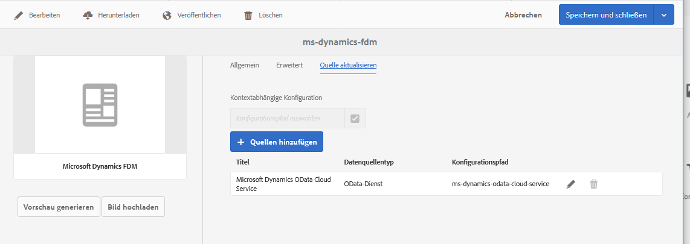

# Formulardatenmodell erstellen {#create-form-data-model}

Erfahren Sie, wie Sie Formulardatenmodelle mit oder ohne konfigurierten Datenquellen erstellen.

Die AEM Forms-Datenintegration bietet eine intuitive Benutzeroberfläche zum Erstellen von und Arbeiten mit Formulardatenmodellen. Ein Formulardatenmodell stützt sich auf Datenquellen für den Austausch von Daten; Sie können jedoch ein Formulardatenmodell mit oder ohne Datenquelle erstellen. Je nachdem, ob Sie Datenquellen konfiguriert haben, gibt es zwei Möglichkeiten, ein Formulardatenmodell zu erstellen:

* **Verwenden vorkonfigurierter Datenquellen**: Wenn Sie Datenquellen wie unter Datenquellen [konfigurieren](/help/forms/using/configure-data-sources.md)beschrieben konfiguriert haben, können Sie diese beim Erstellen eines Formulardatenmodells auswählen. Es stellt alle Datenmodellobjekte, Eigenschaften und Dienste aus den ausgewählten Datenquellen zur Verwendung im Formulardatenmodell zur Verfügung.

* **Ohne Datenquellen**: Wenn Sie für Ihr Formulardatenmodell keine Datenquellen konfiguriert haben, können Sie es auch ohne Datenquellen erstellen. Sie können das Formulardatenmodell verwenden, um adaptive Formulare und interaktive Kommunikation zu erstellen und sie anhand von Beispieldaten zu testen. Wenn Datenquellen verfügbar sind, können Sie das Formulardatenmodell mit Datenquellen verknüpfen, die automatisch in den zugehörigen adaptiven Formularen und interaktiven Kommunikationen reflektiert werden.

>[!NOTE]
>
>You must be a member of both **fdm-author** and **forms-user** groups to be able to create and work with form data model. Wenden Sie sich an Ihren AEM-Administrator, um Mitglied der Gruppe zu werden.

## Formulardatenmodell erstellen {#data-sources}

Ensure that you have configured the data sources you intend to use in the form data model as described in [Configure data sources](/help/forms/using/configure-data-sources.md). Führen Sie die folgenden Schritte aus, um ein Formulardatenmodell basierend auf konfigurierten Datenquellen zu erstellen:

1. Navigieren Sie in der AEM-Autoreninstanz zu **[!UICONTROL Formulare > Datenintegration]**.
1. Tippen Sie auf **[!UICONTROL Erstellen > Formulardatenmodell]**.
1. Im Dialogfeld „Formulardatenmodell erstellen“:

   * Geben Sie einen Namen für das Formulardatenmodul ein.
   * (**Optional**) Geben Sie Titel, Beschreibung und Tags für das Formulardatenmodell an.
   * (**Optional und nur anwendbar, wenn Datenquellen konfiguriert sind**) Tippen Sie auf das Häkchen-Symbol neben dem Feld **[!UICONTROL Datenquellenkonfiguration]** und wählen Sie den Konfigurationsknoten, in dem sich die Cloud-Dienste für die Datenquellen befinden, die Sie verwenden möchten. Das beschränkt die Liste der Datenquellen, die auf der nächsten Seite zur Auswahl stehen, auf diejenigen, die im ausgewählten Konfigurationsknoten verfügbar sind. JDBC-Datenbank- und AEM-Benutzerprofildatenquellen werden jedoch standardmäßig aufgelistet. Wenn Sie keinen Konfigurationsknoten auswählen, werden Datenquellen von allen Konfigurationsknoten aufgelistet.

   Tippen Sie auf **[!UICONTROL Weiter]**.

1. (**Nur anwendbar, wenn Datenquellen konfiguriert sind**) Der Bildschirm **[!UICONTROL Datenquelle auswählen]** listet verfügbare Datenquellen auf, falls vorhanden. Wählen Sie Datenquellen aus, die Sie im Formulardatenmodell verwenden möchten.
1. Tap **[!UICONTROL Create]** and on the confirmation dialog, tap **[!UICONTROL Open]** to open the form data model editor.

Lassen Sie uns die verschiedenen Komponenten der Benutzeroberfläche des Formulardatenmodelleditors überprüfen.

**A. Data Sources** Liste Datenquellen in einem Formulardatenmodell. Erweitern Sie eine Datenquelle, um deren Datenmodellobjekte und -dienste Ansicht.

**B. Datenquellendefinitionen** aktualisieren Ruft alle Änderungen an den Datenquellendefinitionen aus konfigurierten Datenquellen ab und aktualisiert sie auf der Registerkarte &quot;Datenquellen&quot;des Formulardatenmodelleditors.

**C. Bereich Modellinhalt** , in dem hinzugefügte Datenmodellobjekte angezeigt werden.

**D. Dienste** im Inhaltsbereich, in dem zusätzliche Datenquellen-Vorgänge oder -Dienste angezeigt werden.

**E. Werkzeugleistenwerkzeuge** , um mit dem Formulardatenmodell zu arbeiten. Die Symbolleiste zeigt mehr Optionen, abhängig vom ausgewählten Objekt im Formulardatenmodell.

**F. Hinzufügen Ausgewählte** Datenmodellobjekte und -dienste werden dem Formulardatenmodell.

For more information about form data model editor and how you can work with it to edit and configure form data model, see [Work with form data model](/help/forms/using/work-with-form-data-model.md).

## Datenquellen aktualisieren {#update}

Führen Sie die folgenden Schritte aus, um Datenquellen zu einem vorhandenen Formulardatenmodell hinzuzufügen oder zu aktualisieren.

1. Go to **[!UICONTROL Forms > Data Integrations]**, select the form data model in which you want to add or update data sources, and tap **[!UICONTROL Properties]**.
1. Wechseln Sie in den Eigenschaften des Formulardatenmodells zur Registerkarte **[!UICONTROL Quelle aktualisieren]**.

   Auf der Registerkarte „Quelle aktualisieren“:

   * Tippen Sie auf das Symbol „Durchsuchen“ im Feld **[!UICONTROL Kontextsensitive Konfiguration]** und wählen Sie einen Konfigurationsknoten aus, in dem sich die Cloud-Konfiguration für die hinzuzufügende Datenquelle befindet. Wenn Sie keinen Knoten auswählen, werden Cloud-Konfigurationen, die sich nur im Knoten `global` befinden, aufgelistet, wenn Sie auf **[!UICONTROL Quellen hinzufügen]** tippen.
   * Um eine neue Datenquelle hinzuzufügen, tippen Sie auf **[!UICONTROL Quellen hinzufügen]** und wählen Sie die Datenquellen aus, die dem Formulardatenmodell hinzugefügt werden sollen. Alle in `global` konfigurierten Datenquellen und ggf. der ausgewählte Konfigurationsknoten werden angezeigt.
   * Um eine vorhandene Datenquelle durch eine andere Datenquelle desselben Typs zu ersetzen, tippen Sie auf das Symbol **[!UICONTROL Bearbeiten]** für die Datenquelle und wählen Sie diese aus der Liste der verfügbaren Datenquellen aus.
   * To delete an existing data source, tap the **[!UICONTROL Delete]** icon for the data source. Das Symbol „Löschen“ ist deaktiviert, wenn ein Datenmodellobjekt in der Datenquelle im Formulardatenmodell hinzugefügt wird.

   

1. Tippen Sie auf **[!UICONTROL Speichern und schließen]**, um die Aktualisierungen zu speichern.

>[!NOTE]
>
>Nachdem Sie neue Datenquellen hinzugefügt oder vorhandene Datenquellen in einem Formulardatenmodell aktualisiert haben, müssen Sie die Bindungsreferenzen gegebenenfalls in adaptiven Formularen und interaktiven Kommunikationen aktualisieren, die das aktualisierte Formulardatenmodell verwenden.

## Nächste Schritte {#next-steps}

Sie haben jetzt ein Formulardatenmodell mit hinzugefügten Datenquellen. Als Nächstes können Sie das Formulardatenmodell bearbeiten, um Datenmodellobjekte und -dienste hinzuzufügen und zu konfigurieren, Verknüpfungen zwischen Datenmodellobjekten hinzuzufügen, Eigenschaften zu bearbeiten, benutzerdefinierte Datenmodellobjekte und -eigenschaften hinzuzufügen, Beispieldaten zu generieren und so weiter.

For more information, see [Work with form data model](/help/forms/using/work-with-form-data-model.md).
