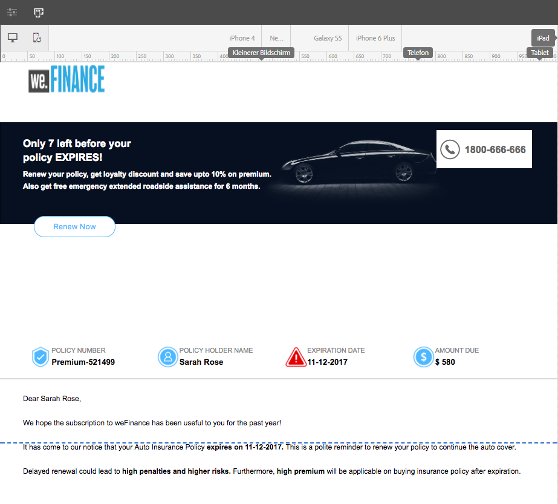
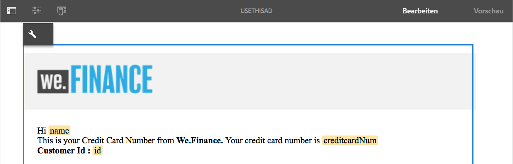
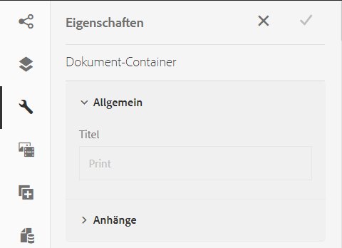
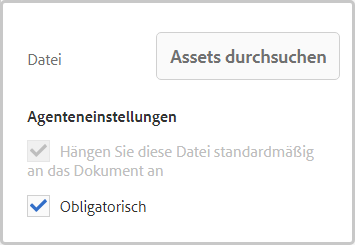
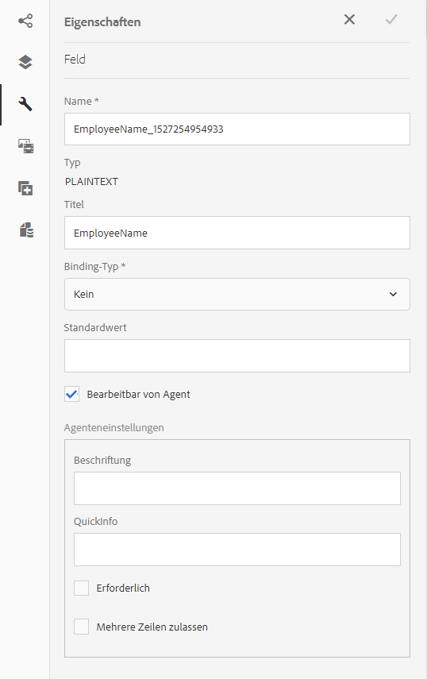
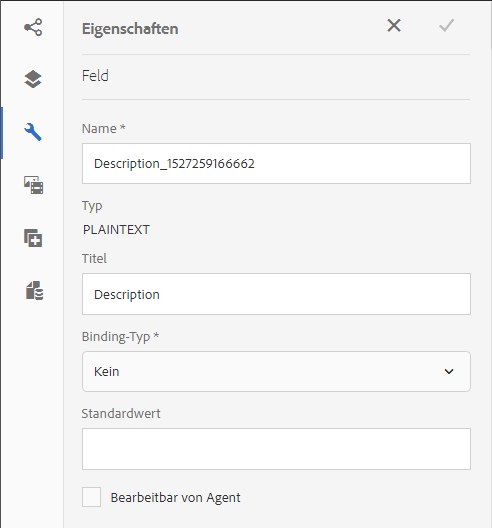
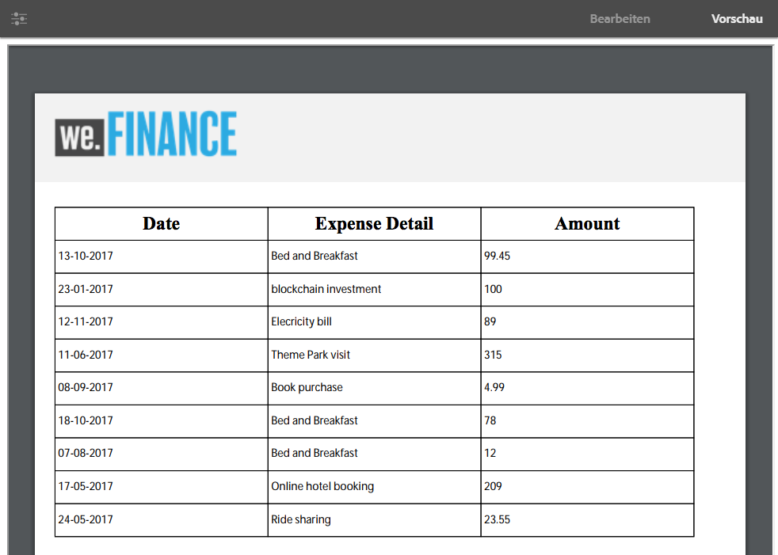
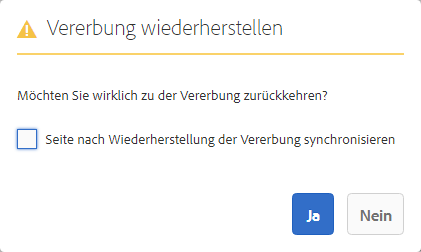
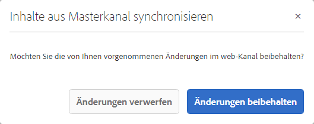

# Erstellen einer interaktiven Kommunikation  {#create-an-interactive-communication}

Erstellen Sie eine interaktive Kommunikation mit dem Editor für interaktive Kommunikation. Verwenden Sie die Drag-and-Drop-Funktionalität, um die interaktive Kommunikation zu erstellen und eine Vorschau der Druck- und Webausgaben für verschiedene Gerätetypen anzuzeigen.

## Überblick {#overview}

Mit der interaktiven Kommunikation lässt sich die Generierung, Zusammenstellung und Verteilung sicherer, personalisierter und interaktiver Schriftstücke zentralisieren und verwalten. Wenn Sie den Druck als Master-Kanal für das Web verwenden, können Sie die Aufwandsduplikation beim Erstellen der Webausgabe der interaktiven Kommunikation minimieren.

### Voraussetzungen {#prerequisites}

Die folgenden Voraussetzungen sind Voraussetzung für die Erstellung einer interaktiven Kommunikation:

* Richten Sie ein [Formulardatenmodell](/help/forms/using/data-integration.md) ein, das Testdaten oder eine tatsächliche Datenquelle enthält, z. B. eine Instanz von Microsoft® Dynamics.
* Vergewissern Sie sich, dass die [Dokument-Fragmente](/help/forms/using/document-fragments.md) vorhanden sind.
* Stellen Sie sicher, dass Sie über [Vorlagen für Druck- und Web-Kanal](/help/forms/using/web-channel-print-channel.md) verfügen.
* Stellen Sie sicher, dass Sie das erforderliche [Design](/help/forms/using/themes.md) für den Webkanal haben.

## Erstellen einer interaktiven Kommunikation {#createic}

1. Melden Sie sich bei Ihrer AEM-Autoreninstanz an und navigieren Sie zu **[!UICONTROL Adobe Experience Manager]** > **[!UICONTROL Formulare]** > **[!UICONTROL Formulare und Dokumente]**.
1. Tippen Sie auf **[!UICONTROL Erstellen]** und wählen Sie **[!UICONTROL Interaktive Kommunikation]**. Die Seite &quot;Interaktive Kommunikation erstellen&quot;wird angezeigt.

   

1. Geben Sie die folgenden Informationen ein. :

   * **[!UICONTROL Titel]**: Geben Sie den Titel der interaktiven Kommunikation ein.
   * **[!UICONTROL Name*]**: Der Name der interaktiven Kommunikation wird aus dem eingegebenen Titel abgeleitet. Bearbeiten Sie ihn gegebenenfalls.
   * **[!UICONTROL Beschreibung]**: Geben Sie eine Beschreibung der interaktiven Kommunikation ein.
   * **[!UICONTROL Formulardatenmodell*]**: Durchsuchen und wählen Sie das Formulardatenmodell aus. Weitere Informationen zum Formulardatenmodell finden Sie unter [AEM Forms Data Integration](/help/forms/using/data-integration.md).
   * **[!UICONTROL Prefill-Dienst]**: Wählen Sie den Dienst zum Vorausfüllen aus, um die Daten abzurufen, und füllen Sie die interaktive Kommunikation im Voraus aus.
   * **[!UICONTROL Nachbearbeitungstyp]**: Sie können AEM oder Forms-Arbeitsablauf auswählen, der beim Senden der interaktiven Kommunikation ausgelöst werden soll. Wählen Sie den Typ des auszulösenden Workflows aus.
   * **[!UICONTROL Nachbearbeitung]**: Wählen Sie den Namen des Workflows aus, der ausgelöst werden soll. Wenn Sie AEM Workflow auswählen, geben Sie Anlagenpfad, Layoutpfad, PDF-Pfad, Druckdatenpfad und Webdatenpfad an.
   * **[!UICONTROL Tags]**: Wählen Sie die Tags aus, die auf die interaktive Kommunikation angewendet werden sollen. Sie können auch einen neuen/benutzerdefinierten Tag-Namen eingeben und die Eingabetaste drücken, um ihn zu erstellen.
   * **[!UICONTROL Autor]**: Der Name des Autors wird automatisch aus dem Benutzernamen des angemeldeten Benutzers übernommen.
   * **[!UICONTROL Veröffentlichungsdatum:]** Geben Sie das Datum ein, an dem die interaktive Kommunikation veröffentlicht werden soll.
   * **[!UICONTROL Veröffentlichungsdatum]** rückgängig machen: Geben Sie das Datum ein, ab dem die Veröffentlichung der interaktiven Kommunikation rückgängig gemacht werden soll.

1. Tippen Sie auf **[!UICONTROL Weiter]**. Der Bildschirm zur Angabe von Druck- und Webkanal-Details wird angezeigt.
1. Geben Sie Folgendes ein:

   * **[!UICONTROL Drucken]**: Wählen Sie diese Option, um den Druckkanal der interaktiven Kommunikation zu generieren.
   * **[!UICONTROL Druckvorlage*:]** Durchsuchen Sie eine XDP als Druckvorlage und wählen Sie sie aus.
   * **[!UICONTROL Verwenden Sie &quot;Als Übergeordnet für Web-Kanal drucken&quot;:]** Wählen Sie diese Option, um den Web-Kanal synchron mit dem Print-Kanal zu erstellen. Die Verwendung des Druckkanals als Master für den Webkanal stellt sicher, dass der Inhalt und die Datenbindung des Webkanals aus dem Druckkanal abgeleitet werden und dass die im Druckkanal vorgenommenen Änderungen im Webkanal widergespiegelt werden können, wenn Sie auf „Synchronisieren“ tippen. Die Autoren dürfen jedoch ggf. die Vererbung für bestimmte Komponenten im Webkanal aufheben. Weitere Informationen finden Sie unter [Synchronisieren des Webkanals mit dem Druckkanal](/help/forms/using/create-interactive-communication.md#synchronize).
   * **[!UICONTROL Web:]** Wählen Sie diese Option, um den Web-Kanal oder die interaktive Ausgabe der interaktiven Kommunikation zu generieren.
   * **[!UICONTROL Webvorlage für interaktive Kommunikation*:]** Durchsuchen Sie die Webvorlage und wählen Sie sie aus.
   * **[!UICONTROL Design]** und Design  **[!UICONTROL auswählen*]**: Navigieren Sie zu dem Thema und wählen Sie es aus, um den Web-Kanal der interaktiven Kommunikation zu gestalten. Weitere Informationen finden Sie unter [Designs in AEM Forms](/help/forms/using/themes.md).

   Weitere Informationen zu Print Kanal und Web Kanal finden Sie unter [Kanal drucken und Web Kanal](/help/forms/using/web-channel-print-channel.md).

1. Tippen Sie auf **[!UICONTROL Erstellen]**. Die interaktive Kommunikation wird erstellt und ein Warndialog wird angezeigt. Tippen Sie auf **[!UICONTROL Bearbeiten]**, um den Inhalt der interaktiven Kommunikation wie unter [Hinzufügen Inhalt mithilfe der Benutzeroberfläche zum Erstellen der interaktiven Kommunikation](#step2) beschrieben zu erstellen. Alternativ können Sie auf **[!UICONTROL Fertig]** tippen und die interaktive Kommunikation später bearbeiten.

## Fügen Sie der interaktiven Kommunikation Inhalte hinzu {#step2}

Nachdem Sie eine interaktive Kommunikation erstellt haben, können Sie die Authoring-Oberfläche für interaktive Kommunikation verwenden, um deren Inhalte zu erstellen.

Weitere Informationen zur Authoring-Oberfläche für interaktive Kommunikation finden Sie unter [Einführung in das Authoring interaktiver Kommunikation](/help/forms/using/introduction-interactive-communication-authoring.md).

1. Die Authoring-Oberfläche für interaktive Kommunikation wird gestartet, wenn Sie auf Bearbeiten tippen, wie unter [Interaktive Kommunikation erstellen](#createic) beschrieben. Alternativ dazu können Sie auf AEM zu einem vorhandenen Asset für interaktive Kommunikation navigieren, es auswählen und auf **[!UICONTROL Bearbeiten]** tippen, um die Authoring-Oberfläche für interaktive Kommunikation zu starten.

   Standardmäßig wird der Kanal &quot;Drucken&quot;der interaktiven Kommunikation angezeigt, es sei denn, die interaktive Kommunikation ist nur für Web-Kanal verfügbar. Im Kanal &quot;Drucken&quot;der interaktiven Kommunikation werden Zielgruppen angezeigt, die in der ausgewählten XDP-/Print-Kanal-Vorlage verfügbar sind. In diesen Zielbereichen und Feldern können Sie Komponenten oder Assets hinzufügen.

1. Wählen Sie bei aktiviertem Kanal &quot;Drucken&quot;die Registerkarte **[!UICONTROL Komponenten]**. Folgende Komponenten sind im Druckkanal verfügbar:

   | **Komponente** | **Funktion** |
   |---|---|
   | Diagramm | Fügt ein Diagramm hinzu, das Sie in der interaktiven Kommunikation für die visuelle Darstellung zweidimensionaler Daten verwenden können, die aus einer Formulardatenmodellsammlung abgerufen werden. Weitere Informationen finden Sie unter [Verwenden von Diagrammen in der interaktiven Kommunikation](/help/forms/using/chart-component-interactive-communications.md). |
   | Dokumentfragment | Ermöglicht es Ihnen, einer interaktiven Kommunikation eine wiederverwendbare Komponente wie Text, Liste oder Bedingung hinzuzufügen. Die hinzugefügte Komponente könnte entweder auf einem Formulardatenmodell basieren oder nicht. |
   | Bild | Ermöglicht es Ihnen, ein Bild einzufügen. |

   Ziehen Sie die Komponenten per Drag &amp; Drop in Ihre interaktive Kommunikation und konfigurieren Sie sie nach Bedarf.

1. Wenn der Druckkanal ausgewählt ist, wechseln Sie zur Registerkarte **[!UICONTROL Assets]** und wenden Sie den Filter an, um nur die Assets anzuzeigen, die Sie sehen möchten.

   Mithilfe des Assets-Browsers können Sie Assets auch direkt in Bereiche der interaktiven Zielgruppe ziehen und dort ablegen.

   

1. Ziehen Sie die Dokumentfragmente per Drag-and-Drop in die interaktive Kommunikation. Im Folgenden sind die Arten von Dokumentfragmenten aufgeführt, die Sie im Druckkanal der interaktiven Kommunikation verwenden können.

<table> 
 <tbody> 
  <tr> 
   <td><strong>Dokumentfragmenttyp</strong></td> 
   <td><strong>Beispielzweck</strong></td> 
  </tr> 
  <tr> 
   <td><a href="/help/forms/using/texts-interactive-communications.md" target="_blank">Text</a></td> 
   <td>Text zum Hinzufügen der Adresse, der E-Mail-Adresse des Empfängers und des Nachrichtentexts des Briefs </td> 
  </tr> 
  <tr> 
   <td><a href="/help/forms/using/conditions-interactive-communications.md" target="_blank">Bedingung</a></td> 
   <td>Bedingung, um basierend auf dem Typ der Richtlinie das entsprechende Header-Bild zur Kommunikation hinzuzufügen: Standard oder Premium.   </td> 
  </tr> 
  <tr> 
   <td>Liste</td> 
   <td>Dokument-Fragmentgruppen, einschließlich Text, Bedingungen, andere Listen und Bilder.   </td> 
  </tr> 
 </tbody> 
</table>

Weitere Informationen zu Dokumentfragmenten finden Sie unter [Dokumentfragmente](/help/forms/using/document-fragments.md).

1. Um die Bindung von Variablen einzurichten, tippen Sie auf eine Variable und wählen Sie  (Konfigurieren). Anschließend richten Sie die Bindungseigenschaften im Bedienfeld &quot;Eigenschaften&quot;in der Seitenleiste ein.

   * **[!UICONTROL Keine:]** Agent füllt hier den Wert für die Variable aus.
   * **[!UICONTROL Textfragment]**: Wenn ausgewählt, können Sie ein Textdokumentfragment durchsuchen und auswählen, dessen Inhalt in dem Feld gerendert wird. Nur die Textdokumentfragmente können an Variablen gebunden werden, die keine Variablen enthalten.
   * **[!UICONTROL Datenmodellobjekt]**: Wählen Sie eine Formulardatenmodell-Eigenschaft aus, deren Wert in das Feld gefüllt wird.

   Sie können auch das relevante Textdokumentfragment konfigurieren. Das Eigenschaftenfenster zeigt die Liste der Variablen im Textdokumentfragment an. Sie können auf  (Bearbeiten) neben einem Variablennamen tippen, um die Einstellungen dieser Variablen zur Bearbeitung anzuzeigen.

1. Um eine Tabelle hinzuzufügen, verwenden Sie bei ausgewähltem Druckkanal auf der Registerkarte **[!UICONTROL Assets]** den Filter, um nur die Layout-Fragmente anzuzeigen. Ziehen Sie das gewünschte Layoutfragment per Drag-and-Drop in die interaktive Kommunikation. Ein Layout-Fragment basiert auf einer XDP und kann verwendet werden, um grafische Layouts oder statische und dynamische Tabellen in der interaktiven Kommunikation zu erstellen, die mit dynamischen Daten gefüllt werden.

   Beispiel: Eine Layout-Tabelle zur Anzeige von Bruttoprämie, Treuerabatt % und Notfall-Pannenhilfe für alte und neue Richtlinien.

   Weitere Informationen zu Layout-Fragmenten finden Sie unter [Dokumentfragmente](/help/forms/using/document-fragments.md).

1. Verwenden Sie bei ausgewähltem Druckkanal auf der Registerkarte **[!UICONTROL Assets]** den Filter, um Bilder anzuzeigen. Ziehen Sie die erforderlichen Bilder per Drag &amp; Drop in die interaktive Kommunikation, z. B. für das Logo &quot;Firma&quot;.

   Verwalten Sie außerdem Folgendes in der interaktiven Kommunikation:

   * [Hinzufügen und Konfigurieren von Diagrammen](/help/forms/using/chart-component-interactive-communications.md)
   * [Synchronisieren des Webkanals mit dem Druckkanal](/help/forms/using/create-interactive-communication.md#synchronize)

      * Autom. Synchronisierung
      * Vererbung abbrechen
      * Vererbung erneut aktivieren
      * Synchronisieren
   * [Anlagen und Bibliothekszugriff](/help/forms/using/create-interactive-communication.md#attachmentslibrary)
   * [XDP-/Layout-Feldeigenschaften](/help/forms/using/create-interactive-communication.md#xdplayoutfieldproperties)
   * [Fügen Sie Regeln zu Komponenten hinzu](/help/forms/using/create-interactive-communication.md#rules)

1. Wechseln Sie zu **[!UICONTROL Web Kanal]**. Der Web-Kanal wird im Editor für interaktive Kommunikation angezeigt. Wenn Sie zum ersten Mal vom Print-Kanal zum Web-Kanal wechseln, erfolgt die automatische Synchronisierung. Weitere Informationen finden Sie unter [Synchronisieren des Web-Kanals vom print-Kanal](/help/forms/using/create-interactive-communication.md#synchronize).

   Da wir in diesem Beispiel Druck als Master für das Web verwenden, werden die Platzhalter, der Inhalt und die Datenbindung des Druckkanals mit dem Webkanal synchronisiert. Sie können jedoch bestimmte Inhalte im Webkanal nach Bedarf ändern und anpassen.

   

1. Um weitere Komponenten im Webkanal hinzuzufügen, tippen Sie bei dem ausgewählten Webkanal auf **[!UICONTROL Komponenten]**. Ziehen Sie die Komponenten nach Bedarf per Drag &amp; Drop in den Web-Kanal Ihrer interaktiven Kommunikation und konfigurieren Sie sie.

   | Komponenten  | Funktion |
   |---|---|
   | Diagramm | Fügt ein Diagramm hinzu, das Sie in der interaktiven Kommunikation für die visuelle Darstellung zweidimensionaler Daten verwenden können, die aus einer Formulardatenmodellsammlung abgerufen werden. Weitere Informationen finden Sie unter [Verwenden der Diagrammkomponente](/help/forms/using/chart-component-interactive-communications.md). |
   | Dokumentfragment | Ermöglicht das Hinzufügen einer wiederverwendbaren Komponente, eines Textes, einer Liste oder einer Bedingung zu einer interaktiven Kommunikation. Die wiederverwendbare Komponente, die Sie einer interaktiven Kommunikation hinzufügen, kann entweder auf Formulardatenmodellen oder ohne Formulardatenmodell basieren. |
   | Bild | Ermöglicht es Ihnen, ein Bild einzufügen. |
   | Fenster | Die Bereichskomponente ist ein Platzhalter zum Gruppieren anderer Komponenten und steuert, wie eine Gruppe von Komponenten in einer interaktiven Kommunikation angeordnet wird. Mit einer Bereichskomponente können Sie auch eine Gruppe von Komponenten für den Endbenutzer wiederholbar machen, z. B. mehrere Einträge zum Ausfüllen von Bildungsnachweisen. |
   | Tabelle | Fügt eine Tabelle hinzu, mit der Sie Daten in Zeilen und Spalten organisieren können. |
   | Zielbereich | Fügt einen Zielbereich in einen Webkanal ein, um die webkanalspezifischen Komponenten zu organisieren. Zielbereich ist ein einfacher Container, in dem Sie webkanalspezifische Komponenten gruppieren können. |
   | Text | Fügt dem Webkanal einer interaktiven Kommunikation Rich Text hinzu. Text kann auch Formulardatenmodellobjekte verwenden, um den Inhalt dynamisch zu gestalten. |

1. Fügen Sie nach Bedarf Assets in Ihren Webkanal ein.

   Sie können Ihre interaktive Kommunikation [Vorschau ](#previewic) bearbeiten, um zu sehen, wie die Druck- und Webausgabe der interaktiven Kommunikation aussieht, und nach Bedarf weitere Änderungen vorzunehmen.

## Interaktive Kommunikation in der Vorschau anzeigen {#previewic}

Mit der Option **[!UICONTROL Vorschau]** können Sie das Erscheinungsbild der interaktiven Kommunikation bewerten. Der Web-Kanal der interaktiven Kommunikation bietet außerdem eine Option, um die Interaktive Kommunikation für verschiedene Geräte zu emulieren. Beispiel: iPhone, iPad und Desktop. Sie können die Optionen **[!UICONTROL Vorschau]** und **[!UICONTROL Emulator]**  gemeinsam verwenden, um die Webausgabe für Geräte unterschiedlicher Bildschirmgrößen Vorschau. Die Musterdaten in der Vorschau werden vom angegebenen Formulardatenmodell ausgefüllt.

1. Wählen Sie den (Druck- oder Web-)Kanal aus, um eine Vorschau anzuzeigen und auf die Vorschau zu tippen. Die interaktive Kommunikation wird angezeigt.

   >[!NOTE]
   >
   >Die Vorschau wird mit den Beispieldaten des Formulardatenmodells befüllt. Weitere Informationen zum Anzeigen einer Vorschau der interaktiven Kommunikation mit anderen Daten oder zum Verwenden des Vorfülldienstes finden Sie unter [Formulardatenmodell](/help/forms/using/using-form-data-model.md) und [Mit Formulardatenmodell arbeiten](/help/forms/using/work-with-form-data-model.md).

1. Verwenden Sie für den Web-Kanal , um die Darstellung der interaktiven Kommunikation auf verschiedenen Geräten zu Ansicht.

   

Darüber hinaus können Sie die interaktive Kommunikation mithilfe der Agent-Benutzeroberfläche](/help/forms/using/prepare-send-interactive-communication.md) vorbereiten und senden.[

## Konfigurieren von Eigenschaften in der interaktiven Kommunikation  {#configuring-properties-in-interactive-communication}

### Anlagen und Bibliothekszugriff {#attachmentslibrary}

Im Druckkanal können Sie die Anhänge und den Bibliothekszugriff so konfigurieren, dass der Agent Anlagen in der Benutzeroberfläche für Agenten für die interaktive Kommunikation verwalten kann:

1. Markieren Sie im Druckkanal den Dokumentcontainer und tippen Sie auf **[!UICONTROL Eigenschaften]**.

   

   Der Bereich „Eigenschaften“ wird in der Seitenleiste angezeigt.

   

1. Erweitern Sie **[!UICONTROL Anlagen]** und geben Sie folgende Eigenschaften an:

   * **[!UICONTROL Bibliothekszugriff zulassen]**: Wählen Sie diese Option, um den Bibliothekszugriff für den Agenten in der Benutzeroberfläche für Agenten zu aktivieren. Wenn diese Option aktiviert ist, kann der Agent während der Vorbereitung der interaktiven Kommunikation Dateien aus der Bibliothek hinzufügen.
   * **[!UICONTROL Neuanordnung von Anlagen zulassen]**: Wählen Sie diese Option, damit der Agent die Anlagen mit der interaktiven Kommunikation neu ordnen kann.
   * **[!UICONTROL Maximale Anzahl der zulässigen Anlagen]**: Geben Sie die maximale Anzahl der Anhänge an, die mit der interaktiven Kommunikation zulässig sind.
   * **[!UICONTROL Anzuhängende]** Dateien: Tippen Sie auf  **** Hinzufügen, wählen Sie die anzuhängenden Dateien aus und geben Sie Folgendes an:

      * **[!UICONTROL Diese Datei standardmäßig an das Dokument anhängen]**: Sie können diese Option ändern, wenn nur der Anhang nicht zwingend ist.
      * **[!UICONTROL Obligatorisch:]** Der Agent kann den Anhang nicht in der Benutzeroberfläche für Agenten entfernen.

   

1. Tippen Sie auf **[!UICONTROL Fertig]**.

### XDP-/Layout-Feldeigenschaften {#xdplayoutfieldproperties}

1. Halten Sie beim Bearbeiten des Kanals &quot;Drucken&quot;einer interaktiven Kommunikation den Mauszeiger über ein in der Vorlage &quot;Kanal drucken&quot;erstelltes Feld und wählen Sie  (Konfigurieren).

   Das Dialogfeld „Eigenschaften“ wird in der Seitenleiste angezeigt.

   

1. Geben Sie Folgendes an:

   * **[!UICONTROL Name]**: JCR Knotenname.
   * **[!UICONTROL Titel]**: Geben Sie einen Titel ein, der für den Agenten in der Benutzeroberfläche für Agenten und in der Struktur des Dokumentcontainers sichtbar ist.
   * **[!UICONTROL Bindungstyp]**: Wählen Sie einen der folgenden Bindungstypen für das Feld aus.

      * Keine: Agent füllt den Wert für die Eigenschaft aus.
      * Textfragment: Wenn ausgewählt, können Sie ein Textdokumentfragment durchsuchen und auswählen, dessen Inhalt in dem Feld gerendert wird.
      * Datenmodellobjekt: Wählen Sie eine Formulardatenmodell-Eigenschaft aus, deren Wert in das Feld gefüllt wird.
   * **[!UICONTROL Standardwerte]**: Der Standardwert stellt sicher, dass das Feld nicht leer ist, wenn vom angegebenen Datenmodellobjekt oder Textfragment kein Wert bereitgestellt wird. Wenn der Datenbindungstyp „Keine“ ist, wird der Standardwert im Feld vorbefüllt.
   * **[!UICONTROL Bearbeitbar nach Agent]**: Wählen Sie diese Option aus, damit der Agent den Wert in dem Feld in der Benutzeroberfläche für Agenten bearbeiten kann. Diese Einstellung ist nicht anwendbar, wenn der Bindungstyp „Textfragment“ ist.
   * **[!UICONTROL Beschriftung:]** Geben Sie eine Textzeichenfolge ein, die in dem Feld in der Benutzeroberfläche für Agenten angezeigt wird. Diese Einstellung ist nicht anwendbar, wenn der Bindungstyp „Textfragment“ ist.
   * **[!UICONTROL QuickInfo]**: Geben Sie eine Textzeichenfolge ein, die beim Bewegen der Maus über den Agent in der Agent-Benutzeroberfläche sichtbar ist. Diese Einstellung ist nicht anwendbar, wenn der Bindungstyp „Textfragment“ ist.
   * **[!UICONTROL Erforderlich:]** Wählen Sie diese Option, um das Feld zu einem Pflichtfeld für den Agenten zu machen. Diese Einstellung ist nicht anwendbar, wenn der Bindungstyp „Textfragment“ ist.
   * **[!UICONTROL Mehrere Zeilen zulassen]**: Wählen Sie dieses Feld aus, um mehrere Textzeilen als Eingabe in das Feld zuzulassen. Diese Einstellung ist nicht anwendbar, wenn der Bindungstyp „Textfragment“ ist.

1. Tippen Sie auf .

## Regeln auf interaktive Kommunikationskomponenten anwenden {#rules}

Um Komponenten oder Inhalte in der interaktiven Kommunikation zu konditionalisieren, tippen Sie auf die Komponente/das Inhaltselement und wählen Sie  (Regel erstellen), um den Regeleditor zu starten.

Weitere Informationen finden Sie unter:

* [Regeleditor](/help/forms/using/rule-editor.md)
* [Einführung in das Authoring interaktiver Kommunikation](/help/forms/using/introduction-interactive-communication-authoring.md)

## Tabellen verwenden {#tables}

### Dynamische Tabellen in interaktiver Kommunikation {#dynamic-tables-in-interactive-communication}

Sie können dynamische Tabellen in der interaktiven Kommunikation mithilfe von Layout-Fragmenten hinzufügen. In den folgenden Schritten wird anhand eines Beispiels einer Kreditkartenabrechnung die Verwendung eines Layout-Fragments zum Erstellen einer dynamischen Tabelle in einer interaktiven Kommunikation veranschaulicht.

1. Stellen Sie sicher, dass das erforderliche Layout-Fragment zum Erstellen der Tabelle in AEM verfügbar ist.
1. Ziehen Sie im Kanal &quot;Drucken&quot;Ihrer interaktiven Kommunikation ein Layout-Fragment (mit einer mehrspaltigen Tabelle) aus dem Asset-Browser in einen Zielgruppe-Bereich.

   

   Eine Tabelle wird im Layout-Bereich der interaktiven Kommunikation angezeigt.

   

1. Geben Sie die Datenbindung für jede Zelle der Tabelle an. Um eine wiederholbare Zeile zu erstellen, fügen Sie die Eigenschaften des Formulardatenmodells in die Zeile ein, die zu einer allgemeinen Sammlungseigenschaft gehört.

   1. Tippen Sie auf eine Zelle in der Tabelle und wählen Sie  (Konfigurieren).

      Das Dialogfeld „Eigenschaften“ wird in der Seitenleiste angezeigt.

      

   1. Konfigurieren Sie die Eigenschaften:

      * **[!UICONTROL Name]**: JCR Knotenname.
      * **[!UICONTROL Titel]**: Geben Sie einen Titel ein, der im Editor für interaktive Kommunikation angezeigt werden soll.
      * **[!UICONTROL Bindungstyp]**&amp;ast;: Wählen Sie einen der folgenden Bindungstypen für das Feld aus.

         * **[!UICONTROL Kein]**
         * **[!UICONTROL Datenmodellobjekt]**: Wählen Sie eine Formulardatenmodell-Eigenschaft aus, deren Wert in das Feld gefüllt wird.
      * **[!UICONTROL Datenmodellobjekt]**: Die Formulardatenmodelleigenschaft, deren Wert im Feld gefüllt wird.
      * **[!UICONTROL Standardwert]**: Der Standardwert stellt sicher, dass das Feld nicht leer ist, wenn kein Wert vom angegebenen Datenmodellobjekt bereitgestellt wird. Der Standardwert wird im Feld vorausgefüllt.
      * **[!UICONTROL Bearbeitbar nach Agent]**: Wählen Sie diese Option aus, damit der Agent den Wert in dem Feld in der Benutzeroberfläche für Agenten bearbeiten kann.
   1. Tippen Sie auf .

1. Vorschau der interaktiven Kommunikation, um die mit den Daten wiedergegebene Tabelle anzuzeigen.

   

### Nur Webkanal-Tabellen {#web-channel-only-tables}

Sie können in einer interaktiven Kommunikation eine nur für Web-Kanal dynamische Tabelle mit einer Datenmodelleigenschaft der Typerfassung erstellen. Eine solche Tabelle stellt die untergeordneten Eigenschaften einer Sammlungseigenschaft dar. Sie können nur die Formatierungseigenschaften der verschiedenen Zellen in der Tabelle bearbeiten.

1. Wechseln Sie zum Web-Kanal und wählen Sie dann die Anzeige des Datenquellen-Browsers.
1. Ziehen Sie ein Sammlungseigenschaft in ein Teilformular.

   Eine Tabelle wird im Teilformular erstellt.

1. Zeigen Sie die Tabelle in der Webvorschau der interaktiven Kommunikation in der Vorschau an.

## Synchronisierung des Webkanals mit dem Druckkanal.{#synchronize}

Die Verwendung von Druck als Master für den Webkanal stellt sicher, dass der Inhalt und die Datenbindung des Webkanals aus dem Druckkanal abgeleitet werden und dass die im Druckkanal vorgenommenen Änderungen im Webkanal widergespiegelt werden können, wenn Sie auf „Synchronisieren“ tippen.

Die Autoren dürfen jedoch ggf. die Vererbung für Komponenten im Webkanal aufheben.

[Zum Vergrößern klicken](assets/printweb_2-3.png)

### Autom. Synchronisierung {#auto-sync}

Wenn Sie Druckkanal als Master für den Webkanal verwenden und Sie zum Webkanal vom Druckkanal wechseln, findet eine automatische Synchronisierung statt. Die automatische Synchronisierung bringt die Platzhalter, den Inhalt und die Datenbindung vom Druckkanal in den Webkanal. Je nach Komplexität und Inhalt Ihrer interaktiven Kommunikation kann die automatische Synchronisierung etwas Zeit in Anspruch nehmen.

>[!NOTE]
>
>Durch das Synchronisieren der Kanäle werden nur die Dokumentfragmente, Bilder, Bedingungen, Listen und Layout-Fragmente vom Druckkanal zum Webkanal synchronisiert. Die Unterformulare oder übergeordneten Knoten dieser Elemente werden nicht synchronisiert.

### Vererbung abbrechen {#cancel-inheritance}

Im Webkanal sind die Komponenten in den Zielbereichen eingebettet.

Bewegen Sie den Mauszeiger über den entsprechenden Bereich der Zielgruppe im Web-Kanal und wählen Sie  (Vererbung abbrechen). Tippen Sie anschließend im Dialogfeld &quot;Vererbung abbrechen&quot;auf **[!UICONTROL Ja]**.

Die Vererbung der Komponenten im Komponentenbereich wird abgebrochen und Sie können sie jetzt nach Bedarf bearbeiten.

### Vererbung erneut aktivieren {#re-enable-inheritance}

Wenn Sie im Webkanal die Vererbung einer Komponente abgebrochen haben, können Sie sie erneut aktivieren. Um die Vererbung erneut zu aktivieren, halten Sie den Mauszeiger über die Begrenzung des entsprechenden Komponentenbereichs, der die Zielgruppe enthält, und tippen Sie auf .

Das Dialogfeld „Vererbung zurücksetzen“ wird angezeigt.

Wählen Sie bei Bedarf **[!UICONTROL Synchronisieren der Seite nach dem Zurücksetzen der Vererbung]**. Wählen Sie diese Option, um die gesamte interaktive Kommunikation zu synchronisieren. Wenn Sie diese Option nicht auswählen, wird beim erneuten Installieren der Vererbung nur der entsprechende Bereich der Zielgruppe synchronisiert.

Tippen Sie auf **[!UICONTROL Ja]**.

### Synchronisieren {#synchronize-1}

Wenn Sie Druck als Master für Webkanal verwenden und Änderungen am Druckkanal vornehmen, können Sie auf „Synchronisieren“ tippen, um die neu vorgenommenen Änderungen an den Webkanal zu übertragen.

1. Um den Webkanal mit dem Druckkanal zu synchronisieren, tippen Sie auf **[!UICONTROL Synchronisieren]**.

   Das Dialogfeld &quot;Inhalt aus Übergeordnet Kanal synchronisieren&quot;wird angezeigt.

   

1. Tippen Sie auf eine der folgenden Optionen:

   * **[!UICONTROL Änderungen verwerfen]**: Verwirft alle Änderungen, die am Webkanal vorgenommen wurden.
   * **[!UICONTROL Änderungen beibehalten]**: Synchronisiert den Inhalt nur für die Zielbereiche, in denen die Vererbung nicht abgebrochen wird.

