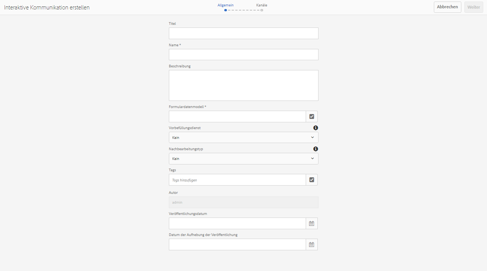

# Erstellen einer interaktiven Kommunikation  {#create-an-interactive-communication}

Erstellen Sie eine interaktive Kommunikation mit dem Editor für interaktive Kommunikation. Verwenden Sie die Drag-and-Drop-Funktionalität, um die interaktive Kommunikation zu erstellen und eine Vorschau der Druck- und Webausgaben für verschiedene Gerätetypen anzuzeigen.

## Übersicht {#overview}

Mit der interaktiven Kommunikation lässt sich die Generierung, Zusammenstellung und Verteilung sicherer, personalisierter und interaktiver Schriftstücke zentralisieren und verwalten. Wenn Sie den Druck als Master-Kanal für das Web verwenden, können Sie die Aufwandsduplikation beim Erstellen der Webausgabe der interaktiven Kommunikation minimieren.

### Voraussetzungen {#prerequisites}

Die folgenden Voraussetzungen sind Voraussetzung für die Erstellung einer interaktiven Kommunikation:

* Richten Sie ein [Formulardatenmodell](/help/forms/using/data-integration.md) ein, das Testdaten oder eine tatsächliche Datenquelle enthält, z. B. eine Instanz von Microsoft® Dynamics.
* Vergewissern Sie sich, dass Sie die [Dokumentfragmente](/help/forms/using/document-fragments.md) haben. 
* Stellen Sie sicher, dass Sie [Vorlagen für Druck- und Web-Kanal](/help/forms/using/web-channel-print-channel.md) haben.
* Stellen Sie sicher, dass Sie das erforderliche [Design](/help/forms/using/themes.md) für den Webkanal haben.

## Erstellen einer interaktiven Kommunikation {#createic}

1. Melden Sie sich bei Ihrer AEM-Autoreninstanz an und navigieren Sie zu **[!UICONTROL Adobe Experience Manager]** > **[!UICONTROL Formulare]** > **[!UICONTROL Formulare und Dokumente]**.
1. Tippen Sie auf **[!UICONTROL Erstellen]** und wählen Sie **[!UICONTROL Interaktive Kommunikation]**. Die Seite „Interaktive Kommunikation erstellen“ wird angezeigt. 

   

1. Geben Sie folgende Informationen ein. :

   * **[!UICONTROL Titel]**: Geben Sie den Titel der interaktiven Kommunikation ein.
   * **[!UICONTROL Name*]**: Der Name der interaktiven Kommunikation wird aus dem eingegebenen Titel abgeleitet. Bearbeiten Sie ihn gegebenenfalls.
   * **[!UICONTROL Beschreibung]**: Geben Sie eine Beschreibung der interaktiven Kommunikation ein.
   * **[!UICONTROL Formulardatenmodell*]**: Durchsuchen und wählen Sie das Formulardatenmodell aus. Weitere Informationen zum Formulardatenmodell finden Sie unter [AEM Forms-Datenintegration](/help/forms/using/data-integration.md). 
   * **[!UICONTROL Vorbefüllungs-Service]**: Wählen Sie den Vorbefüllungs-Service, um die Daten abzurufen und die interaktive Kommunikation vorzufüllen.
   * **[!UICONTROL Nachbearbeitungstyp]**: Wählen Sie den AEM- oder Forms-Workflow aus, der ausgelöst werden soll, wenn die interaktive Kommunikation veröffentlicht wird. Wählen Sie den Typ des auszulösenden Workflows aus.
   * **[!UICONTROL Nachbearbeitung]**: Wählen Sie den Namen des Workflows aus, der ausgelöst werden soll. Wenn Sie den AEM-Workflow auswählen, geben Sie den jeweiligen Pfad für die Anhänge, das Layout, die PDF-Datei, die Druckdaten und die Web-Daten an.
   * **[!UICONTROL Tags]**: Wählen Sie die Tags aus, die auf die interaktive Kommunikation angewendet werden sollen. Sie können auch einen neuen/benutzerdefinierten Tag-Namen eingeben und die Eingabetaste drücken, um ihn zu erstellen.
   * **[!UICONTROL Autor]**: Der Name des Autors wird automatisch aus dem Benutzernamen des angemeldeten Benutzers übernommen.
   * **[!UICONTROL Veröffentlichungsdatum:]** Geben Sie das Datum ein, an dem die interaktive Kommunikation veröffentlicht werden soll.
   * **[!UICONTROL Datum der Aufhebung der Veröffentlichung]**: Geben Sie das Datum ein, an dem die Veröffentlichung der interaktiven Kommunikation aufgehoben werden soll.

1. Tippen Sie auf **[!UICONTROL Weiter]**. Der Bildschirm zur Angabe von Druck- und Webkanal-Details wird angezeigt.
1. Geben Sie Folgendes ein:

   * **[!UICONTROL Drucken]**: Wählen Sie diese Option, um den Druckkanal der interaktiven Kommunikation zu generieren.
   * **[!UICONTROL Druckvorlage*:]** Suchen Sie nach einer XDP als Druckvorlage und wählen Sie sie aus.
   * **[!UICONTROL Verwenden Sie für Webkanal &quot;Druck wie Übergeordnet&quot;:]** Wählen Sie diese Option, um den Webkanal synchron mit dem Druckkanal zu erstellen. Die Verwendung des Druckkanals als Master für den Webkanal stellt sicher, dass der Inhalt und die Datenbindung des Webkanals aus dem Druckkanal abgeleitet werden und dass die im Druckkanal vorgenommenen Änderungen im Webkanal widergespiegelt werden können, wenn Sie auf „Synchronisieren“ tippen. Die Autoren dürfen jedoch ggf. die Vererbung für bestimmte Komponenten im Webkanal aufheben. Weitere Informationen finden Sie unter [Synchronisieren des Webkanals mit dem Druckkanal](/help/forms/using/create-interactive-communication.md#synchronize).
   * **[!UICONTROL Web:]** Wählen Sie diese Option, um den Webkanal oder die responsive Ausgabe der interaktiven Kommunikation zu generieren.
   * **[!UICONTROL Webvorlage für interaktive Kommunikation*:]** Durchsuchen Sie die Webvorlage und wählen Sie sie aus.
   * **[!UICONTROL Design]** und **[!UICONTROL Design auswählen*]**: Suchen Sie das Design und wählen Sie es aus, um den Webkanal der interaktiven Kommunikation zu gestalten. Weitere Informationen finden Sie unter [Designs in AEM Forms](/help/forms/using/themes.md).
   Weitere Informationen zu Druckkanal und Webkanal finden Sie unter [Druckkanal und Webkanal](/help/forms/using/web-channel-print-channel.md).

1. Tippen Sie auf **[!UICONTROL Erstellen]**. Die interaktive Kommunikation wird erstellt und eine Warnmeldung erscheint. Tippen Sie auf **[!UICONTROL Bearbeiten]**, um mit dem Erstellen der Inhalte der interaktiven Kommunikation zu beginnen, wie in [Hinzufügen von Inhalten mit der Benutzeroberfläche zum Erstellen der interaktiven Kommunikation](#step2) beschrieben. Alternativ können Sie auf **[!UICONTROL Fertig]** tippen und später die interaktive Kommunikation bearbeiten.

## Fügen Sie der interaktiven Kommunikation Inhalte hinzu {#step2}

Nachdem Sie eine interaktive Kommunikation erstellt haben, können Sie die Authoring-Oberfläche zum Erstellen der interaktiven Kommunikation verwenden, um ihre Inhalte zu erstellen.

Weitere Informationen zur Authoring-Oberfläche zum Erstellen der interaktiven Kommunikation finden Sie unter [Einführung in die Bearbeitung der interaktiven Kommunikation](/help/forms/using/introduction-interactive-communication-authoring.md).

1. Die Authoring-Oberfläche zum Erstellen der interaktiven Kommunikation wird gestartet, wenn Sie auf „Bearbeiten“ tippen, wie in [Erstellen einer interaktiven Kommunikation](#createic) beschrieben. Alternativ können Sie zu einem vorhandenen Asset der interaktiven Kommunikation auf AEM gehen, es auswählen und auf **[!UICONTROL Bearbeiten]** tippen, um die Authoring-Oberfläche zum Erstellen der interaktiven Kommunikation zu starten.

   Standardmäßig wird der Druckkanal der interaktiven Kommunikation angezeigt, es sei denn, die interaktive Kommunikation ist nur für Webkanal. Der Druckkanal der interaktiven Kommunikation zeigt Zielbereiche an, die in der ausgewählten XDP/Druckkanalvorlage verfügbar sind. In diesen Zielbereichen und Feldern können Sie Komponenten oder Assets hinzufügen.

1. Wählen Sie bei ausgewähltem Druckkanal die Registerkarte **[!UICONTROL Komponenten]**. Folgende Komponenten sind im Druckkanal verfügbar:

   | **Komponente** | **Funktion** |
   |---|---|
   | Diagramm | Fügt ein Diagramm hinzu, das Sie in interaktiver Kommunikation zur visuellen Darstellung von zweidimensionalen Daten verwenden können, die aus einer Formulardatenmodellsammlung abgerufen werden. Weitere Informationen finden Sie unter [Verwenden von Diagrammen mit interaktiver Kommunikation](/help/forms/using/chart-component-interactive-communications.md). |
   | Dokumentfragment | Ermöglicht das Hinzufügen einer wiederverwendbaren Komponente, wie z. B. eines Textes, einer Liste oder einer Bedingung, zu einer interaktiven Kommunikation. Die hinzugefügte Komponente könnte entweder auf einem Formulardatenmodell basieren oder nicht. |
   | Bild | Ermöglicht es Ihnen, ein Bild einzufügen. |

   Ziehen Sie die Komponenten per Drag-and-Drop in Ihre interaktive Kommunikation und konfigurieren Sie sie nach Bedarf.

1. Wenn der Druckkanal ausgewählt ist, wechseln Sie zur Registerkarte **[!UICONTROL Assets]** und wenden Sie den Filter an, um nur die Assets anzuzeigen, die Sie sehen möchten.

   Mit dem Assets-Browser können Sie Assets auch direkt per Drag-and-Drop in die Zielbereiche der interaktiven Kommunikation ziehen.

   

1. Ziehen Sie die Dokumentfragmente per Drag-and-Drop in die interaktive Kommunikation. Im Folgenden sind die Arten von Dokumentfragmenten aufgeführt, die Sie im Druckkanal der interaktiven Kommunikation verwenden können.

<table> 
 <tbody> 
  <tr> 
   <td><strong>Dokumentfragmenttyp</strong></td> 
   <td><strong>Beispielzweck</strong></td> 
  </tr> 
  <tr> 
   <td><a href="/help/forms/using/texts-interactive-communications.md" target="_blank">Text</a></td> 
   <td>Text zum Hinzufügen der Adresse, der E-Mail-Adresse des Empfängers und des Nachrichtentexts des Briefs </td> 
  </tr> 
  <tr> 
   <td><a href="/help/forms/using/conditions-interactive-communications.md" target="_blank">Bedingung</a></td> 
   <td>Bedingung, um der Kommunikation basierend auf dem Typ der Richtlinie das entsprechende Kopfzeilenbild hinzuzufügen: Standard oder Premium.   </td> 
  </tr> 
  <tr> 
   <td>Liste</td> 
   <td>Gruppe von Dokumentfragmenten, einschließlich Text, Bedingungen, anderen Listen und Bildern.   </td> 
  </tr> 
 </tbody> 
</table>

Weitere Informationen zu Dokumentfragmenten finden Sie unter [Dokumentfragmente](/help/forms/using/document-fragments.md).

1. Wenn Sie die Bindung von Variablen einrichten möchten, tippen Sie auf eine Variable, wählen Sie das Symbol  (Konfigurieren) und legen Sie im Bedienfeld „Eigenschaften“ in der Seitenleiste die Bindungseigenschaften fest.

   * **[!UICONTROL Keine:]** Agent füllt hier den Wert für die Variable aus.
   * **[!UICONTROL Textfragment]**: Wenn ausgewählt, können Sie ein Textdokumentfragment durchsuchen und auswählen, dessen Inhalt in dem Feld gerendert wird. Nur die Textdokumentfragmente können an Variablen gebunden werden, die keine Variablen enthalten.
   * **[!UICONTROL Datenmodellobjekt]**: Wählen Sie eine Formulardatenmodell-Eigenschaft aus, deren Wert in das Feld gefüllt wird.
   Sie können auch das relevante Textdokumentfragment konfigurieren. Das Eigenschaftenfenster zeigt die Liste der Variablen im Textdokumentfragment an. Sie können auf  (Bearbeiten) neben einem Variablennamen, um die Einstellungen dieser Variablen zur Bearbeitung anzuzeigen.

1. Um eine Tabelle hinzuzufügen, verwenden Sie bei ausgewähltem Druckkanal auf der Registerkarte **[!UICONTROL Assets]** den Filter, um nur die Layout-Fragmente anzuzeigen. Ziehen Sie das gewünschte Layoutfragment per Drag-and-Drop in die interaktive Kommunikation. Ein Layout-Fragment basiert auf einem XDP und kann verwendet werden, um in der interaktiven Kommunikation grafische Layouts oder statische und dynamische Tabellen zu erstellen, die mit dynamischen Daten gefüllt werden.

   Beispiel: Eine Layout-Tabelle zur Anzeige von Bruttoprämie, Treuerabatt % und Notfall-Pannenhilfe für alte und neue Richtlinien.

   Weitere Informationen zu Layout-Fragmenten finden Sie unter [Dokumentfragmente](/help/forms/using/document-fragments.md).

1. Verwenden Sie bei ausgewähltem Druckkanal auf der Registerkarte **[!UICONTROL Assets]** den Filter, um Bilder anzuzeigen. Ziehen Sie die erforderlichen Bilder per Drag-and-Drop auf die interaktive Kommunikation, z. B. für ein Firmenlogo. 

   Verwalten Sie außerdem Folgendes in der interaktiven Kommunikation:

   * [Hinzufügen und Konfigurieren von Diagrammen](/help/forms/using/chart-component-interactive-communications.md)
   * [Synchronisieren des Webkanals mit dem Druckkanal](/help/forms/using/create-interactive-communication.md#synchronize)

      * Autom. Synchronisierung
      * Vererbung abbrechen
      * Vererbung erneut aktivieren
      * Synchronisieren
   * [Anlagen und Bibliothekszugriff](/help/forms/using/create-interactive-communication.md#attachmentslibrary)
   * [XDP-/Layout-Feldeigenschaften](/help/forms/using/create-interactive-communication.md#xdplayoutfieldproperties)
   * [Fügen Sie Regeln zu Komponenten hinzu](/help/forms/using/create-interactive-communication.md#rules)

1. Wechseln Sie zu **[!UICONTROL Webkanal]**. Der Webkanal wird im Editor für interaktive Kommunikation angezeigt. Wenn Sie zum ersten Mal vom Druckkanal zum Webkanal wechseln, findet die automatische Synchronisierung statt. Weitere Informationen finden Sie unter [Synchronisieren des Webkanals mit dem Druckkanal](/help/forms/using/create-interactive-communication.md#synchronize).

   Da wir in diesem Beispiel Druck als Master für das Web verwenden, werden die Platzhalter, der Inhalt und die Datenbindung des Druckkanals mit dem Webkanal synchronisiert. Sie können jedoch bestimmte Inhalte im Webkanal nach Bedarf ändern und anpassen.

   

1. Um weitere Komponenten im Webkanal hinzuzufügen, tippen Sie bei dem ausgewählten Webkanal auf **[!UICONTROL Komponenten]**. Ziehen Sie Komponenten nach Bedarf per Drag-and-Drop in den Webkanal Ihrer interaktiven Kommunikation und fahren Sie mit der Konfiguration fort.

   | Komponenten | Funktion |
   |---|---|
   | Diagramm | Fügt ein Diagramm hinzu, das Sie in der interaktiver Kommunikation zur visuellen Darstellung von zweidimensionalen Daten verwenden können, die aus einer Formulardatenmodellsammlung abgerufen werden. Weitere Informationen finden Sie unter [Verwenden der Diagrammkomponente](/help/forms/using/chart-component-interactive-communications.md). |
   | Dokumentfragment | Ermöglicht das Hinzufügen einer wiederverwendbaren Komponente, eines Textes, einer Liste oder einer Bedingung zu einer interaktiven Kommunikation. Die wiederverwendbare Komponente, die Sie einer interaktiven Kommunikation hinzufügen, kann entweder formulardatenmodellbasiert sein oder ohne ein Formulardatenmodell sein. |
   | Bild | Ermöglicht es Ihnen, ein Bild einzufügen. |
   | Bereich | Die Bereichskomponente ist ein Platzhalter zum Gruppieren anderer Komponenten und steuert, wie eine Gruppe von Komponenten in einer interaktiven Kommunikation angeordnet wird. Mit einer Bereichskomponente können Sie auch eine Gruppe von Komponenten für den Endbenutzer wiederholbar machen, z. B. mehrere Einträge zum Ausfüllen von Bildungsnachweisen. |
   | Tabelle | Fügt eine Tabelle hinzu, mit der Sie Daten in Zeilen und Spalten organisieren können. |
   | Zielbereich | Fügt einen Zielbereich in einen Webkanal ein, um die webkanalspezifischen Komponenten zu organisieren. Zielbereich ist ein einfacher Container, in dem Sie webkanalspezifische Komponenten gruppieren können. |
   | Text | Fügt dem Webkanal einer interaktiven Kommunikation Rich Text hinzu. Text kann auch Formulardatenmodellobjekte verwenden, um den Inhalt dynamisch zu gestalten. |

1. Fügen Sie nach Bedarf Assets in Ihren Webkanal ein.

   Sie können [Ihre interaktive Kommunikation in der Vorschau anzeigen](#previewic), um zu sehen, wie die Druck- und Webausgaben der interaktiven Kommunikation aussehen, und Sie können gegebenenfalls weitere Änderungen vornehmen.

## Interaktive Kommunikation in der Vorschau anzeigen {#previewic}

Sie können die **[!UICONTROL Vorschau]** -Option zum Auswerten der Darstellung der interaktiven Kommunikation. Der Webkanal der interaktiven Kommunikation bietet auch eine Option zum Emulieren des Erlebnisses einer interaktiven Kommunikation für verschiedene Geräte. Beispiel: iPhone, iPad und Desktop. Sie können **[!UICONTROL Vorschau]** und **[!UICONTROL Emulator]**--Optionen in Kombination verwenden, um die Webausgaben für Geräte mit unterschiedlichen Bildschirmgrößen in der Vorschau anzuzeigen. Die Beispieldaten in der Vorschau werden aus dem angegebenen Formulardatenmodell befüllt. 

1. Wählen Sie den (Druck- oder Web-)Kanal aus, um eine Vorschau anzuzeigen und auf die Vorschau zu tippen. Die interaktive Kommunikation wird angezeigt.

   >[!NOTE]
   >
   >Die Vorschau wird mit den Beispieldaten des Formulardatenmodells befüllt. Weitere Informationen zur Vorschau der interaktiven Kommunikation mit anderen Daten oder zur Verwendung des Vorbefüllungs-Services finden Sie unter [Verwenden eines Formular-Datenmodells](/help/forms/using/using-form-data-model.md) und [Arbeiten mit dem Formular-Datenmodell](/help/forms/using/work-with-form-data-model.md).

1. Für den Webkanal verwenden Sie , um sich anzusehen, wie die interaktive Kommunikation auf verschiedenen Geräten aussieht.

   

Weiterhin können Sie die [Interaktive Kommunikation mithilfe der Benutzeroberfläche für Agenten vorbereiten und senden](/help/forms/using/prepare-send-interactive-communication.md).

## Konfigurieren von Eigenschaften in der interaktiven Kommunikation  {#configuring-properties-in-interactive-communication}

### Anlagen und Bibliothekszugriff {#attachmentslibrary}

Im Druckkanal können Sie die Anhänge und den Bibliothekszugriff so konfigurieren, dass der Agent Anlagen in der Benutzeroberfläche für Agenten für die interaktive Kommunikation verwalten kann:

1. Markieren Sie im Druckkanal den Dokumentcontainer und tippen Sie auf **[!UICONTROL Eigenschaften]**.

   

   Der Bereich „Eigenschaften“ wird in der Seitenleiste angezeigt.

   

1. Erweitern Sie **[!UICONTROL Anlagen]** und geben Sie folgende Eigenschaften an:

   * **[!UICONTROL Bibliothekszugriff zulassen]**: Wählen Sie diese Option, um den Bibliothekszugriff für den Agenten in der Benutzeroberfläche für Agenten zu aktivieren. Wenn diese Option aktiviert ist, kann der Agent während der Vorbereitung der interaktiven Kommunikation Dateien aus der Bibliothek hinzufügen.
   * **[!UICONTROL Neuanordnung von Anlagen zulassen]**: Wählen Sie diese Option, damit der Agent die Anlagen mit der interaktiven Kommunikation neu ordnen kann.
   * **[!UICONTROL Maximale Anzahl der zulässigen Anlagen]**: Geben Sie die maximale Anzahl der Anhänge an, die mit der interaktiven Kommunikation zulässig sind.
   * **[!UICONTROL Anzuhängende Dateien]**: Tippen Sie auf **[!UICONTROL Hinzufügen]** und wählen Sie die Dateien aus, die angehängt werden sollen, und geben Sie Folgendes an:

      * **[!UICONTROL Diese Datei standardmäßig an das Dokument anhängen]**: Sie können diese Option ändern, wenn nur der Anhang nicht zwingend ist.
      * **[!UICONTROL Obligatorisch:]** Der Agent kann den Anhang nicht in der Benutzeroberfläche für Agenten entfernen.
   

1. Tippen Sie auf **[!UICONTROL Fertig]**.

### XDP-/Layout-Feldeigenschaften {#xdplayoutfieldproperties}

1. Beim Bearbeiten des Druckkanals einer interaktiven Kommunikation bewegen Sie die Maus über ein Feld, das in der Druckkanalvorlage erstellt wurde, und wählen Sie das Symbol  (Konfigurieren) aus.

   Das Dialogfeld „Eigenschaften“ wird in der Seitenleiste angezeigt.

   

1. Geben Sie Folgendes an:

   * **[!UICONTROL Name]**: JCR Knotenname.
   * **[!UICONTROL Titel]**: Geben Sie einen Titel ein, der für den Agenten in der Benutzeroberfläche für Agenten und in der Struktur des Dokumentcontainers sichtbar ist.
   * **[!UICONTROL Bindungstyp]**: Wählen Sie einen der folgenden Bindungstypen für das Feld aus.

      * Keine: Agent füllt den Wert für die Eigenschaft aus.
      * Textfragment: Wenn ausgewählt, können Sie ein Textdokumentfragment durchsuchen und auswählen, dessen Inhalt in dem Feld gerendert wird.
      * Datenmodellobjekt: Wählen Sie eine Formulardatenmodell-Eigenschaft aus, deren Wert in das Feld gefüllt wird.
   * **[!UICONTROL Standardwerte]**: Der Standardwert stellt sicher, dass das Feld nicht leer ist, wenn vom angegebenen Datenmodellobjekt oder Textfragment kein Wert bereitgestellt wird. Wenn der Datenbindungstyp „Keine“ ist, wird der Standardwert im Feld vorbefüllt.
   * **[!UICONTROL Bearbeitbar nach Agent]**: Wählen Sie diese Option aus, damit der Agent den Wert in dem Feld in der Benutzeroberfläche für Agenten bearbeiten kann. Diese Einstellung ist nicht anwendbar, wenn der Bindungstyp „Textfragment“ ist.
   * **[!UICONTROL Beschriftung:]** Geben Sie eine Textzeichenfolge ein, die in dem Feld in der Benutzeroberfläche für Agenten angezeigt wird. Diese Einstellung ist nicht anwendbar, wenn der Bindungstyp „Textfragment“ ist.
   * **[!UICONTROL QuickInfo]**: Geben Sie eine Textzeichenfolge ein, die sichtbar wird, wenn die Maus über den Agenten in der Benutzeroberfläche für Agenten bewegt wird. Diese Einstellung ist nicht anwendbar, wenn der Bindungstyp „Textfragment“ ist.
   * **[!UICONTROL Erforderlich:]** Wählen Sie diese Option, um das Feld zu einem Pflichtfeld für den Agenten zu machen. Diese Einstellung ist nicht anwendbar, wenn der Bindungstyp „Textfragment“ ist.
   * **[!UICONTROL Mehrere Zeilen zulassen]**: Wählen Sie dieses Feld aus, um mehrere Textzeilen als Eingabe in das Feld zuzulassen. Diese Einstellung ist nicht anwendbar, wenn der Bindungstyp „Textfragment“ ist.

1. Tippen Sie auf das Symbol .

## Regeln auf interaktive Kommunikationskomponenten anwenden {#rules}

Um Komponenten oder Inhalte in der interaktiven Kommunikation zu konditionieren, tippen Sie auf die Komponente/den Inhalt und wählen Sie  (Regel erstellen), um den Regel-Editor zu starten.

Weitere Informationen finden Sie unter:

* [Regeleditor](/help/forms/using/rule-editor.md)
* [Einführung in die Erstellung interaktiver Kommunikationen](/help/forms/using/introduction-interactive-communication-authoring.md)

## Tabellen verwenden {#tables}

### Dynamische Tabellen in interaktiver Kommunikation {#dynamic-tables-in-interactive-communication}

Sie können in einer interaktiven Kommunikation dynamische Tabellen mithilfe von Layout-Fragmenten hinzufügen. In den folgenden Schritten wird anhand eines Beispiels einer Kreditkartenabrechnung die Verwendung eines Layout-Fragments zum Erstellen einer dynamischen Tabelle in einer interaktiven Kommunikation veranschaulicht.

1. Stellen Sie sicher, dass das erforderliche Layout-Fragment zum Erstellen der Tabelle in AEM verfügbar ist.
1. Ziehen Sie im Druckkanal Ihrer interaktiven Kommunikation ein Layout-Fragment (mit einer mehrspaltigen Tabelle) per Drag-und-Drop aus dem Asset-Browser in einen Zielbereich.

   

   Eine Tabelle wird im Layout-Bereich der interaktiven Kommunikation angezeigt.

   

1. Geben Sie die Datenbindung für jede Zelle der Tabelle an. Um eine wiederholbare Zeile zu erstellen, fügen Sie die Eigenschaften eines Formulardatenmodells in die Zeile ein, die zu einer allgemeinen Sammlungseigenschaft gehört.

   1. Tippen Sie auf eine Zelle in der Tabelle und wählen Sie  (Konfigurieren).

      Das Dialogfeld „Eigenschaften“ wird in der Seitenleiste angezeigt.

      

   1. Konfigurieren Sie die Eigenschaften:

      * **[!UICONTROL Name]**: JCR Knotenname.
      * **[!UICONTROL Titel]**: Geben Sie einen Titel ein, der im Editor für interaktive Kommunikation angezeigt werden wird.
      * **[!UICONTROL Bindungstyp]**&amp;ast;: Wählen Sie einen der folgenden Bindungstypen für das Feld aus.

         * **[!UICONTROL Ohne]**
         * **[!UICONTROL Datenmodellobjekt]**: Wählen Sie eine Formulardatenmodell-Eigenschaft aus, deren Wert in das Feld gefüllt wird.
      * **[!UICONTROL Datenmodellobjekt]**: Die Formulardatenmodell-Eigenschaft, mit deren Wert das Feld befüllt wird.
      * **[!UICONTROL Standardwert]**: Der Standardwert stellt sicher, dass das Feld nicht leer ist, wenn vom angegebenen Datenmodellobjekt oder Textfragment kein Wert bereitgestellt wird. Der Standardwert wird vorab in das Feld eingefügt.
      * **[!UICONTROL Bearbeitbar nach Agent]**: Wählen Sie diese Option aus, damit der Agent den Wert in dem Feld in der Benutzeroberfläche für Agenten bearbeiten kann.
   1. Tippen Sie auf das Symbol .

1. Zeigen Sie eine Vorschau der interaktiven Kommunikation an, um die mit den Daten gerenderte Tabelle anzuzeigen.

   

### Nur Webkanal-Tabellen {#web-channel-only-tables}

Sie können eine dynamische Webkanal-Tabelle in einer interaktiven Kommunikation mithilfe einer Datenmodelleigenschaft vom Typ „Sammlung“ erstellen. Eine derartige Tabelle ist eine Darstellung der untergeordneten Eigenschaften einer Sammlungseigenschaft. Sie können nur die Formatierungseigenschaften der verschiedenen Zellen in der Tabelle bearbeiten.

1. Wechseln Sie zum Webkanal und wählen Sie dann den Datenquellen-Browser.
1. Ziehen Sie ein Sammlungseigenschaft in ein Teilformular.

   Eine Tabelle wird im Teilformular erstellt.

1. Zeigen Sie die Tabelle in der Webvorschau der interaktiven Kommunikation in der Vorschau an.

## Synchronisierung des Webkanals mit dem Druckkanal. {#synchronize}

Die Verwendung von Druck als Master für den Webkanal stellt sicher, dass der Inhalt und die Datenbindung des Webkanals aus dem Druckkanal abgeleitet werden und dass die im Druckkanal vorgenommenen Änderungen im Webkanal widergespiegelt werden können, wenn Sie auf „Synchronisieren“ tippen.

Die Autoren dürfen jedoch ggf. die Vererbung für Komponenten im Webkanal aufheben.

[Klicken Sie zum Vergrößern auf](assets/printweb_2-3.png)

### Autom. Synchronisierung {#auto-sync}

Wenn Sie Druckkanal als Master für den Webkanal verwenden und Sie zum Webkanal vom Druckkanal wechseln, findet eine automatische Synchronisierung statt. Die automatische Synchronisierung bringt die Platzhalter, den Inhalt und die Datenbindung vom Druckkanal in den Webkanal. Abhängig von der Komplexität und dem Inhalt Ihrer interaktiven Kommunikation kann die automatische Synchronisation etwas Zeit in Anspruch nehmen.

>[!NOTE]
>
>Durch das Synchronisieren der Kanäle werden nur die Dokumentfragmente, Bilder, Bedingungen, Listen und Layout-Fragmente vom Druckkanal zum Webkanal synchronisiert. Die Unterformulare oder übergeordneten Knoten dieser Elemente werden nicht synchronisiert.

### Vererbung abbrechen {#cancel-inheritance}

Im Webkanal sind die Komponenten in den Zielbereichen eingebettet.

Bewegen Sie den Mauszeiger über den entsprechenden Zielbereich im Webkanal und wählen Sie  (Vererbung abbrechen), tippen Sie dann im Dialogfeld Vererbung abbrechen auf **[!UICONTROL Ja]**.

Die Vererbung der Komponenten im Zielbereich wird abgebrochen und jetzt können Sie sie nach Bedarf bearbeiten.

### Vererbung erneut aktivieren {#re-enable-inheritance}

Wenn Sie im Webkanal die Vererbung einer Komponente abgebrochen haben, können Sie sie erneut aktivieren. Um die Vererbung wieder zu aktivieren, bewegen Sie die Maus über die Grenze des relevanten Zielbereichs, der die Komponente enthält, und tippen Sie auf .

Das Dialogfeld „Vererbung zurücksetzen“ wird angezeigt.

Wählen Sie bei Bedarf **[!UICONTROL Synchronisieren der Seite nach dem Zurücksetzen der Vererbung]**. Wählen Sie diese Option, um die gesamte interaktive Kommunikation zu synchronisieren. Wenn Sie diese Option nicht auswählen, wird beim Wiederherstellen der Vererbung nur der relevante Zielbereich synchronisiert.

Tippen Sie auf **[!UICONTROL Ja]**.

### Synchronisieren {#synchronize-1}

Wenn Sie Druck als Master für Webkanal verwenden und Änderungen am Druckkanal vornehmen, können Sie auf „Synchronisieren“ tippen, um die neu vorgenommenen Änderungen an den Webkanal zu übertragen.

1. Um den Webkanal mit dem Druckkanal zu synchronisieren, tippen Sie auf **[!UICONTROL Synchronisieren]**.

   Das Dialogfeld &quot;Inhalt über Übergeordneten Kanal synchronisieren&quot;wird angezeigt.

   

1. Tippen Sie auf eine der folgenden Optionen:

   * **[!UICONTROL Änderungen verwerfen]**: Verwirft alle Änderungen, die am Webkanal vorgenommen wurden.
   * **[!UICONTROL Änderungen beibehalten]**: Synchronisiert den Inhalt nur für die Zielbereiche, in denen die Vererbung nicht abgebrochen wird.
